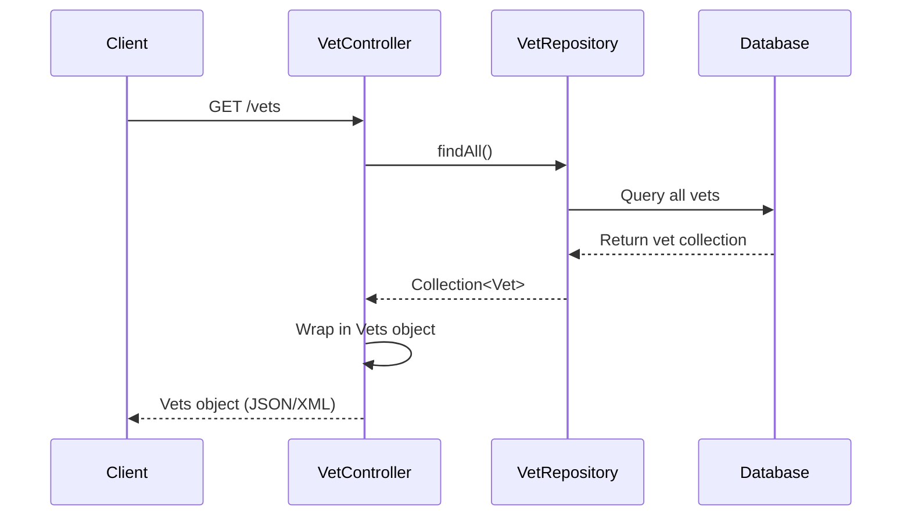
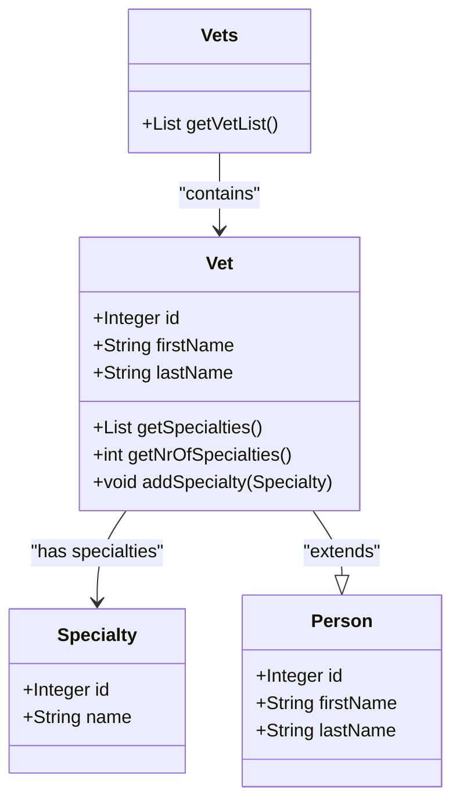

# API Endpoints Reference

<cite>
**Referenced Files in This Document**   
- [VetController.java](file://src/main/java/org/springframework/samples/petclinic/vet/VetController.java)
- [Vet.java](file://src/main/java/org/springframework/samples/petclinic/vet/Vet.java)
- [Specialty.java](file://src/main/java/org/springframework/samples/petclinic/vet/Specialty.java)
- [Vets.java](file://src/main/java/org/springframework/samples/petclinic/vet/Vets.java)
- [VetRepository.java](file://src/main/java/org/springframework/samples/petclinic/vet/VetRepository.java)
- [VetControllerTests.java](file://src/test/java/org/springframework/samples/petclinic/vet/VetControllerTests.java)
</cite>

## Table of Contents
1. [Introduction](#introduction)
2. [/vets Endpoint Specification](#vets-endpoint-specification)
3. [Response Schema Details](#response-schema-details)
4. [Content Negotiation](#content-negotiation)
5. [Error Handling](#error-handling)
6. [Security Considerations](#security-considerations)
7. [Rate Limiting](#rate-limiting)
8. [Client Implementation Guidelines](#client-implementation-guidelines)
9. [Performance Optimization](#performance-optimization)
10. [Versioning Considerations](#versioning-considerations)

## Introduction
This document provides comprehensive API documentation for the `/vets` endpoint in the PetClinic application, a RESTful service that exposes veterinarian data to clients. The endpoint supports content negotiation to return data in either JSON or XML format based on client preferences. The API follows standard REST conventions with a simple GET method to retrieve a collection of veterinarian records, including their associated specialties. This documentation covers the complete interface specification, response structure, content negotiation behavior, and implementation guidance for consumers of this API.

## /vets Endpoint Specification
The `/vets` endpoint provides access to veterinarian data in the PetClinic system through a simple RESTful interface.

**HTTP Method**: GET  
**URL Pattern**: `/vets`  
**Request Parameters**: None  
**Authentication**: Not required  
**Response Formats**: JSON, XML (via content negotiation)  
**Cache Control**: Responses are cached by the server using Spring's `@Cacheable` annotation with the cache name "vets"

The endpoint is implemented in the `VetController` class and returns a `Vets` wrapper object containing a list of `Vet` entities. Unlike the HTML endpoint `/vets.html` which supports pagination with a page parameter, the RESTful `/vets` endpoint returns all veterinarian records in a single response without pagination support.



**Diagram sources**
- [VetController.java](file://src/main/java/org/springframework/samples/petclinic/vet/VetController.java#L68-L77)
- [VetRepository.java](file://src/main/java/org/springframework/samples/petclinic/vet/VetRepository.java#L39-L57)

**Section sources**
- [VetController.java](file://src/main/java/org/springframework/samples/petclinic/vet/VetController.java#L68-L77)

## Response Schema Details
The `/vets` endpoint returns a wrapper object that contains a collection of veterinarian records. The response structure is designed to support both JSON and XML serialization through appropriate annotations.

### Vets Wrapper Object
The top-level response is a `Vets` object that contains a list of `Vet` entities.

| Property | Type | Description |
|---------|------|-------------|
| vetList | Array[Vet] | Collection of veterinarian objects |

### Vet Object
Each veterinarian is represented by a `Vet` object that extends the base `Person` class and includes specialty information.

| Property | Type | Description |
|---------|------|-------------|
| id | Integer | Unique identifier for the veterinarian |
| firstName | String | First name of the veterinarian |
| lastName | String | Last name of the veterinarian |
| specialties | Array[Specialty] | Collection of specialties associated with the veterinarian, sorted alphabetically by name |

### Specialty Object
Specialty information is represented by a simple object containing specialty details.

| Property | Type | Description |
|---------|------|-------------|
| id | Integer | Unique identifier for the specialty |
| name | String | Name of the specialty (e.g., "radiology", "dentistry") |

The `Vet` class uses `@XmlElement` annotations to control XML serialization, ensuring that the `specialties` collection is properly exposed in XML responses. The specialties are automatically sorted alphabetically by name when retrieved through the `getSpecialties()` method.



**Diagram sources**
- [Vets.java](file://src/main/java/org/springframework/samples/petclinic/vet/Vets.java#L29-L42)
- [Vet.java](file://src/main/java/org/springframework/samples/petclinic/vet/Vet.java#L42-L73)
- [Specialty.java](file://src/main/java/org/springframework/samples/petclinic/vet/Specialty.java#L27-L31)

**Section sources**
- [Vets.java](file://src/main/java/org/springframework/samples/petclinic/vet/Vets.java#L29-L42)
- [Vet.java](file://src/main/java/org/springframework/samples/petclinic/vet/Vet.java#L42-L73)
- [Specialty.java](file://src/main/java/org/springframework/samples/petclinic/vet/Specialty.java#L27-L31)

## Content Negotiation
The `/vets` endpoint supports content negotiation through the HTTP Accept header, allowing clients to request responses in either JSON or XML format.

### Accept Header Behavior
The endpoint automatically determines the response format based on the client's Accept header:

- `Accept: application/json` - Returns JSON response
- `Accept: application/xml` or `text/xml` - Returns XML response  
- No Accept header or `Accept: */*` - Returns JSON response (default)

The content negotiation is handled automatically by Spring MVC's message conversion infrastructure. The `@ResponseBody` annotation on the controller method triggers Spring's `HttpMessageConverter` mechanism, which selects the appropriate converter based on the client's requested media type.

### Example Requests
```http
GET /vets HTTP/1.1
Host: localhost:8080
Accept: application/json
```

```http
GET /vets HTTP/1.1
Host: localhost:8080
Accept: application/xml
```

### Example JSON Response
```json
{
  "vetList": [
    {
      "id": 1,
      "firstName": "James",
      "lastName": "Carter",
      "specialties": []
    },
    {
      "id": 2,
      "firstName": "Helen",
      "lastName": "Leary",
      "specialties": [
        {
          "id": 1,
          "name": "radiology"
        }
      ]
    }
  ]
}
```

### Example XML Response
```xml
<vets>
  <vetList>
    <id>1</id>
    <firstName>James</firstName>
    <lastName>Carter</lastName>
    <specialties/>
  </vetList>
  <vetList>
    <id>2</id>
    <firstName>Helen</firstName>
    <lastName>Leary</lastName>
    <specialties>
      <id>1</id>
      <name>radiology</name>
    </specialties>
  </vetList>
</vets>
```

The `Vets` class is annotated with `@XmlRootElement` to enable proper XML serialization, while the `@XmlElement` annotations on the getter methods ensure that the properties are exposed in both JSON and XML representations.

**Section sources**
- [VetController.java](file://src/main/java/org/springframework/samples/petclinic/vet/VetController.java#L68-L77)
- [Vets.java](file://src/main/java/org/springframework/samples/petclinic/vet/Vets.java#L29-L42)
- [VetControllerTests.java](file://src/test/java/org/springframework/samples/petclinic/vet/VetControllerTests.java#L85-L95)

## Error Handling
The `/vets` endpoint implements standard error handling for RESTful APIs. While the current implementation is robust due to the simplicity of the operation, potential error scenarios are handled appropriately.

### HTTP Status Codes
| Status Code | Scenario | Description |
|------------|---------|-------------|
| 200 OK | Successful request | Returns the complete list of veterinarians |
| 500 Internal Server Error | Data access failure | Occurs if there is a database connectivity issue or repository failure |

### Error Response Format
In the event of a server error, Spring MVC will return an appropriate HTTP 500 status code with a default error response body that includes error details such as timestamp, status, error message, and path. The exact format depends on the server configuration but typically follows Spring Boot's default error attributes.

The endpoint does not validate request parameters (as there are none) and does not return client error codes (4xx) under normal circumstances. The `VetRepository.findAll()` method may throw `DataAccessException` in case of database errors, which is translated to an HTTP 500 response by Spring's exception handling mechanism.

**Section sources**
- [VetController.java](file://src/main/java/org/springframework/samples/petclinic/vet/VetController.java#L68-L77)
- [VetRepository.java](file://src/main/java/org/springframework/samples/petclinic/vet/VetRepository.java#L39-L57)

## Security Considerations
The current implementation of the `/vets` endpoint does not include any security mechanisms.

### Current State
- No authentication required to access the endpoint
- No authorization checks performed
- Data is publicly accessible to any client that can reach the server
- No input validation needed (no request parameters)

### Recommendations for Production
For production deployment, consider implementing the following security measures:
- Add authentication (e.g., JWT, OAuth2) to control access to the API
- Implement role-based authorization to restrict access to authorized users
- Enable HTTPS to encrypt data in transit
- Add rate limiting to prevent abuse
- Implement proper error handling that doesn't expose sensitive system information

The endpoint exposes publicly available information about veterinarians, which may be acceptable in a public directory scenario. However, if the application expands to include sensitive data, appropriate security controls should be implemented.

**Section sources**
- [VetController.java](file://src/main/java/org/springframework/samples/petclinic/vet/VetController.java#L68-L77)

## Rate Limiting
The `/vets` endpoint does not implement rate limiting in the current version.

### Current Behavior
- No rate limiting is applied to the endpoint
- Clients can make unlimited requests without throttling
- Server-side caching reduces database load but does not limit request frequency

### Caching Implementation
While not rate limiting per se, the endpoint benefits from server-side caching through the `@Cacheable("vets")` annotation on the `VetRepository.findAll()` method. This means:
- The first request triggers a database query
- Subsequent requests within the cache TTL are served from cache
- Reduces database load and improves response times
- Cache name is "vets" with default cache manager configuration

For high-traffic scenarios, consider implementing rate limiting at the API gateway or web server level to prevent denial-of-service conditions.

**Section sources**
- [VetRepository.java](file://src/main/java/org/springframework/samples/petclinic/vet/VetRepository.java#L39-L57)

## Client Implementation Guidelines
This section provides guidance for consuming the `/vets` API from various client environments.

### JavaScript Implementation
```javascript
// Using Fetch API
async function getVets() {
  try {
    const response = await fetch('/vets', {
      headers: {
        'Accept': 'application/json'
      }
    });
    
    if (!response.ok) {
      throw new Error(`HTTP error! status: ${response.status}`);
    }
    
    const data = await response.json();
    return data.vetList;
  } catch (error) {
    console.error('Error fetching vets:', error);
    throw error;
  }
}

// Usage
getVets().then(vets => {
  console.log('Veterinarians:', vets);
}).catch(error => {
  console.error('Failed to load vets:', error);
});
```

### Key Implementation Notes
1. **Error Handling**: Always check the response status before parsing
2. **Content Type**: Explicitly set Accept header to ensure consistent response format
3. **Caching Awareness**: Be aware that responses may be cached server-side
4. **Data Structure**: Access veterinarian data through the `vetList` property of the response
5. **Specialty Handling**: Veterinarians may have zero or more specialties in the response

Clients should handle the possibility of empty specialties arrays and validate data before use in UI components.

**Section sources**
- [VetController.java](file://src/main/java/org/springframework/samples/petclinic/vet/VetController.java#L68-L77)
- [Vets.java](file://src/main/java/org/springframework/samples/petclinic/vet/Vets.java#L29-L42)

## Performance Optimization
The `/vets` endpoint includes several performance optimizations and offers additional opportunities for improvement.

### Current Optimizations
- **Server-side Caching**: The `@Cacheable("vets")` annotation caches the repository results, reducing database queries for subsequent requests
- **Eager Loading**: The `@ManyToMany(fetch = FetchType.EAGER)` annotation on the specialties relationship ensures that specialty data is loaded in a single query
- **Efficient Serialization**: The wrapper `Vets` object simplifies JSON/XML mapping and reduces serialization overhead

### Recommendations for Improvement
1. **Client-side Caching**: Implement caching in client applications with appropriate TTL
2. **Conditional Requests**: Add support for ETag/If-None-Match headers to enable 304 Not Modified responses
3. **Pagination**: For large datasets, implement pagination to reduce payload size
4. **Compression**: Enable GZIP compression for responses to reduce bandwidth usage
5. **CDN Caching**: For public APIs, consider using a CDN to cache responses at the edge

The current implementation loads all veterinarians in a single response, which is efficient for small datasets but may become a performance bottleneck as the number of veterinarians grows.

**Section sources**
- [VetRepository.java](file://src/main/java/org/springframework/samples/petclinic/vet/VetRepository.java#L39-L57)
- [Vet.java](file://src/main/java/org/springframework/samples/petclinic/vet/Vet.java#L42-L73)

## Versioning Considerations
The current `/vets` endpoint does not implement API versioning, but considerations for future evolution are important.

### Current State
- No versioning in the endpoint URL (`/vets`)
- No version headers or parameters
- Backward compatibility must be maintained for existing clients

### Future Versioning Strategies
1. **URL Versioning**: `/api/v1/vets` or `/v1/vets`
2. **Header Versioning**: `Accept: application/vnd.petclinic.v1+json`
3. **Parameter Versioning**: `/vets?version=1`

### Backward Compatibility Guidelines
When evolving the API:
- Add new fields rather than modifying existing ones
- Avoid removing fields used by existing clients
- Maintain existing response formats when possible
- Use deprecation headers for fields that will be removed
- Provide clear migration paths for breaking changes

The use of the wrapper `Vets` object provides some flexibility for future enhancements, as additional metadata could be added to the wrapper without affecting the core veterinarian data structure.

**Section sources**
- [VetController.java](file://src/main/java/org/springframework/samples/petclinic/vet/VetController.java#L68-L77)
- [Vets.java](file://src/main/java/org/springframework/samples/petclinic/vet/Vets.java#L29-L42)