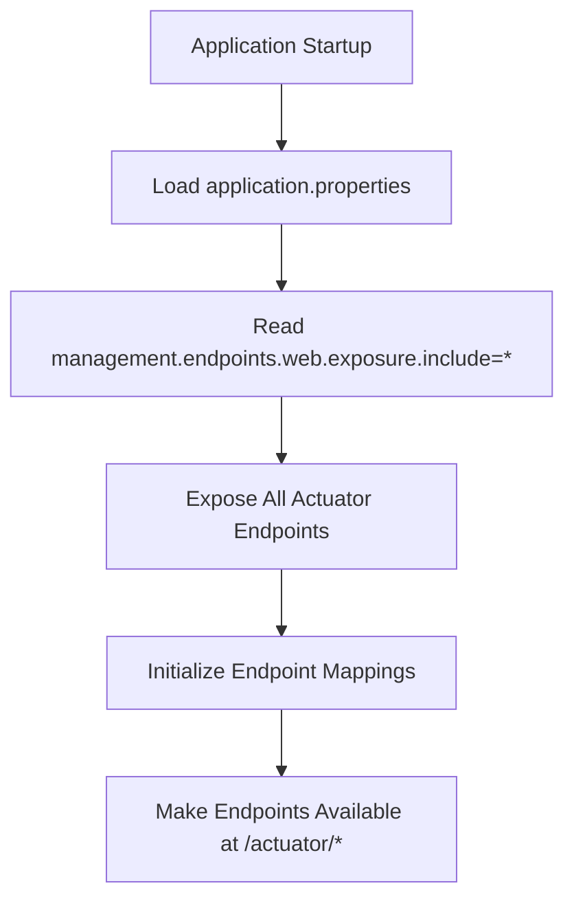
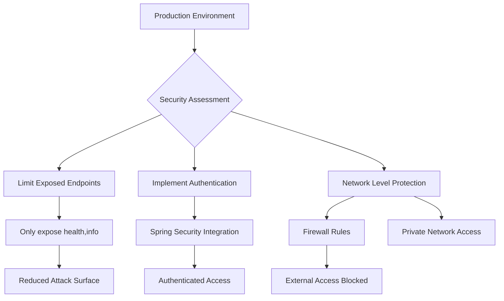
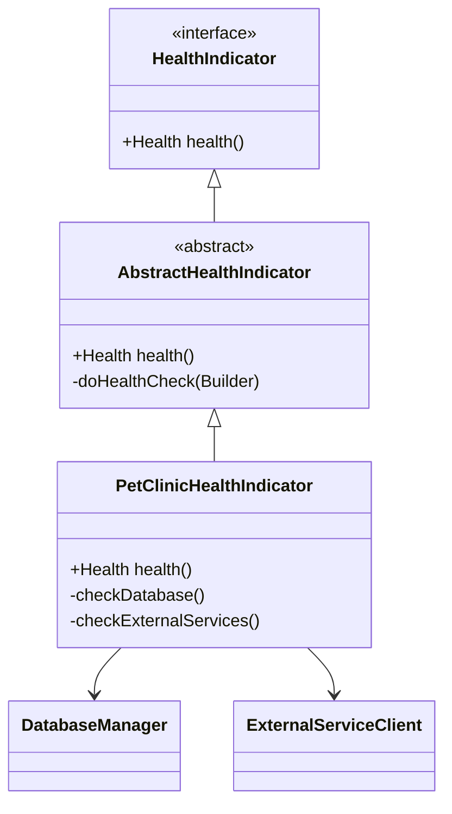

<cite>
**Referenced Files in This Document**   
- [application.properties](file://src/main/resources/application.properties)
- [pom.xml](file://pom.xml)
- [PetClinicApplication.java](file://src/main/java/org/springframework/samples/petclinic/PetClinicApplication.java)
</cite>

# Actuator Endpoints Configuration

## Table of Contents
1. [Introduction](#introduction)
2. [Configuration Overview](#configuration-overview)
3. [Key Actuator Endpoints](#key-actuator-endpoints)
4. [Security Implications](#security-implications)
5. [Customization Options](#customization-options)
6. [Monitoring Integration](#monitoring-integration)
7. [Troubleshooting Guide](#troubleshooting-guide)
8. [Performance Monitoring](#performance-monitoring)
9. [Conclusion](#conclusion)

## Introduction

Spring Boot Actuator provides production-ready features to help monitor and manage applications. In the PetClinic application, Actuator endpoints are configured to expose comprehensive monitoring capabilities that allow developers and operations teams to gain insights into the application's health, configuration, and performance metrics. This documentation details the configuration, usage, and best practices for working with Actuator endpoints in the PetClinic context.

The Actuator functionality is enabled through the `spring-boot-starter-actuator` dependency, which provides a set of built-in endpoints that can be accessed via HTTP or JMX. These endpoints offer valuable information about the application's internal state, making them essential tools for troubleshooting, performance analysis, and operational monitoring in both development and production environments.

**Section sources**
- [pom.xml](file://pom.xml#L42-L45)

## Configuration Overview

The PetClinic application configures Actuator endpoints through the `application.properties` file, where the key configuration property `management.endpoints.web.exposure.include=*` is set. This configuration exposes all available Actuator endpoints over HTTP, making them accessible for monitoring and management purposes.

The `*` wildcard in the exposure configuration indicates that all endpoints should be exposed without explicit enumeration. This approach simplifies configuration during development and testing phases, allowing comprehensive access to monitoring data. However, this broad exposure has significant security implications that must be carefully considered in production environments.

The Actuator starter dependency is included in the project's `pom.xml` file, which brings in all necessary components for endpoint functionality. The configuration also supports build information display through the Spring Boot Maven plugin, which generates build-related metadata that can be accessed via the appropriate Actuator endpoints.



**Diagram sources**
- [application.properties](file://src/main/resources/application.properties#L20-L21)
- [pom.xml](file://pom.xml#L42-L45)

**Section sources**
- [application.properties](file://src/main/resources/application.properties#L20-L21)
- [pom.xml](file://pom.xml#L42-L45)

## Key Actuator Endpoints

### Health Endpoint (/actuator/health)

The `/actuator/health` endpoint provides comprehensive information about the application's health status. This endpoint aggregates health indicators from various components within the application, including database connectivity, disk space, and other critical system resources. The health status is typically represented as UP, DOWN, OUT_OF_SERVICE, or UNKNOWN, providing a quick overview of the application's operational state.

In the PetClinic application, the health endpoint would monitor the database connection status, as the application relies heavily on data persistence for managing pet clinic information. The response includes detailed health information about individual components, allowing operators to quickly identify the source of any issues affecting the application's overall health.

### Info Endpoint (/actuator/info)

The `/actuator/info` endpoint exposes arbitrary application information, such as build details, environment properties, and custom application metadata. In PetClinic, this endpoint can provide valuable information about the application version, build timestamp, and other relevant details that help identify the specific deployment instance. This information is particularly useful for troubleshooting and ensuring that the correct version of the application is running in different environments.

### Environment Endpoint (/actuator/env)

The `/actuator/env` endpoint provides access to the application's environment properties, including configuration values from various sources such as property files, environment variables, and command-line arguments. This endpoint allows operators to inspect the complete configuration state of the application, which is invaluable for debugging configuration issues and understanding how different configuration sources interact and potentially override each other.

```mermaid
graph TB
subgraph "Actuator Endpoints"
H[/actuator/health] --> |Status| S[Health Status: UP/DOWN]
I[/actuator/info] --> |Build Info| B[Version, Timestamp]
E[/actuator/env] --> |Configuration| C[Property Sources]
end
subgraph "Response Structure"
S --> D1[Detailed Component Health]
B --> D2[Git Commit, Build Time]
C --> D3[Property Hierarchy]
end
```

**Diagram sources**
- [application.properties](file://src/main/resources/application.properties#L20-L21)

**Section sources**
- [application.properties](file://src/main/resources/application.properties#L20-L21)

## Security Implications

Exposing all Actuator endpoints using `management.endpoints.web.exposure.include=*` presents significant security risks, particularly in production environments. The endpoints provide extensive information about the application's internal state, configuration, and potentially sensitive system details that could be exploited by malicious actors.

The `/actuator/env` endpoint, for example, could reveal sensitive configuration values such as database credentials or API keys if they are included in the application's configuration. Similarly, the `/actuator/beans` endpoint (when exposed) could provide detailed information about the application's internal structure and dependencies, potentially aiding in targeted attacks.

For production deployments, it is strongly recommended to selectively expose only the necessary endpoints and implement proper authentication and authorization mechanisms. This can be achieved by specifying only essential endpoints in the exposure configuration, such as `management.endpoints.web.exposure.include=health,info`, and integrating with Spring Security to protect the exposed endpoints with appropriate authentication schemes.



**Diagram sources**
- [application.properties](file://src/main/resources/application.properties#L20-L21)

**Section sources**
- [application.properties](file://src/main/resources/application.properties#L20-L21)

## Customization Options

### Customizing Endpoint Paths

Actuator endpoints can be customized to use different base paths or individual endpoint paths. This can be useful for organizational requirements or to avoid conflicts with existing application routes. The base path for all Actuator endpoints can be changed using the `management.endpoints.web.base-path` property, allowing endpoints to be accessed under a different URL prefix than the default `/actuator`.

### Enabling Shutdown Endpoint

The shutdown endpoint can be enabled to allow graceful application termination through an HTTP POST request. This endpoint is disabled by default for security reasons and must be explicitly enabled by setting `management.endpoint.shutdown.enabled=true`. When enabled, it provides a convenient way to stop the application remotely, which can be useful in automated deployment and scaling scenarios.

### Extending with Custom Health Indicators

Custom health indicators can be implemented by creating beans that implement the `HealthIndicator` interface. These custom indicators can monitor application-specific health aspects, such as external service connectivity, business logic constraints, or domain-specific requirements. In the PetClinic application, a custom health indicator could monitor the availability of external services used for appointment reminders or payment processing.



**Diagram sources**
- [PetClinicApplication.java](file://src/main/java/org/springframework/samples/petclinic/PetClinicApplication.java)

**Section sources**
- [application.properties](file://src/main/resources/application.properties#L20-L21)

## Monitoring Integration

Actuator endpoints can be integrated with various monitoring tools and log aggregation systems to provide comprehensive observability. The structured JSON responses from Actuator endpoints can be consumed by monitoring platforms such as Prometheus, Grafana, or commercial APM solutions to create dashboards and alerting rules.

For log aggregation, the `/actuator/logfile` endpoint (when configured) can provide access to the application's log file, allowing centralized log collection systems to retrieve log data directly from the application. Additionally, the metrics exposed through Actuator can be integrated with time-series databases to track application performance over time and identify trends or anomalies.

The integration with monitoring tools enables proactive issue detection, performance optimization, and capacity planning. By combining Actuator data with application logs and infrastructure metrics, operations teams can gain a holistic view of the application's health and performance characteristics.

**Section sources**
- [application.properties](file://src/main/resources/application.properties#L20-L21)

## Troubleshooting Guide

### Endpoint 404 Errors

When encountering 404 errors for Actuator endpoints, verify that the `spring-boot-starter-actuator` dependency is properly included in the build configuration. Additionally, check that the endpoint is not disabled through configuration properties and that the correct URL path is being used (typically `/actuator/{endpoint-id}`).

### Unauthorized Access

Unauthorized access errors typically indicate that security configuration is preventing access to the endpoints. Verify the security configuration and ensure that appropriate authentication credentials are being provided. In development environments, temporary access can be granted by adjusting security settings, but production environments should maintain proper authentication controls.

### JSON Parsing Errors

JSON parsing errors when consuming Actuator endpoint responses may indicate network corruption, proxy interference, or client-side parsing issues. Verify the HTTP response headers to confirm the content type is `application/json` and check for any network intermediaries that might be modifying the response. Using standard JSON parsing libraries and validating the response structure can help mitigate these issues.

**Section sources**
- [application.properties](file://src/main/resources/application.properties#L20-L21)

## Performance Monitoring

Actuator provides extensive performance monitoring capabilities through various endpoints and metrics collection. The `/actuator/metrics` endpoint exposes a wide range of application metrics, including JVM memory usage, thread counts, HTTP request rates, and custom business metrics.

These metrics can be used to identify performance bottlenecks, track resource utilization over time, and establish baseline performance characteristics for the application. By monitoring metrics such as response times, error rates, and system resource usage, operations teams can proactively identify and address performance issues before they impact end users.

The metrics collection can be extended with custom metrics that track application-specific performance indicators, such as the time taken to process specific business operations or the success rate of external service calls. This comprehensive monitoring capability makes Actuator an essential tool for maintaining application performance and reliability.

**Section sources**
- [application.properties](file://src/main/resources/application.properties#L20-L21)

## Conclusion

The Spring Boot Actuator configuration in the PetClinic application provides powerful monitoring and management capabilities through the `management.endpoints.web.exposure.include=*` setting. While this configuration offers comprehensive visibility during development and testing, it requires careful consideration for production deployments due to security implications.

Best practices recommend selectively exposing only essential endpoints in production environments and implementing proper authentication mechanisms. The Actuator endpoints provide valuable insights into application health, configuration, and performance, making them indispensable tools for maintaining application reliability and performance.

By leveraging the customization options, integrating with monitoring tools, and following security best practices, teams can effectively use Actuator to enhance the observability and maintainability of the PetClinic application across different environments.