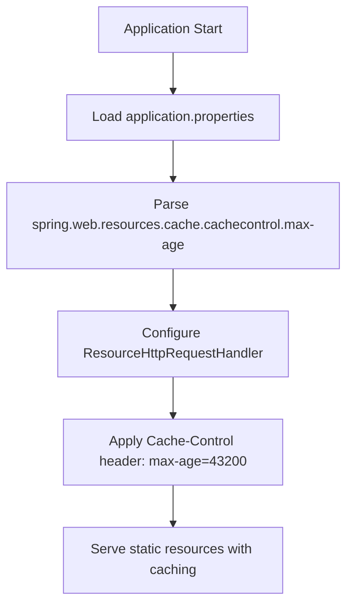
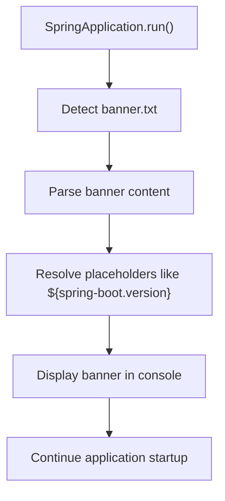
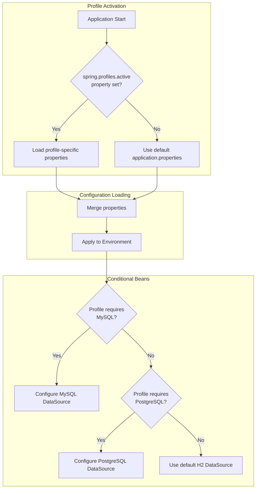

# Custom Properties and Extensions

<cite>
**Referenced Files in This Document**   
- [application.properties](file://src/main/resources/application.properties)
- [banner.txt](file://src/main/resources/banner.txt)
- [CacheConfiguration.java](file://src/main/java/org/springframework/samples/petclinic/system/CacheConfiguration.java)
- [PetClinicApplication.java](file://src/main/java/org/springframework/samples/petclinic/PetClinicApplication.java)
</cite>

## Table of Contents
1. [Introduction](#introduction)
2. [Configuration Properties Binding](#configuration-properties-binding)
3. [Static Resource Caching Configuration](#static-resource-caching-configuration)
4. [Application Banner Customization](#application-banner-customization)
5. [Conditional Configuration Strategies](#conditional-configuration-strategies)
6. [Configuration Best Practices](#configuration-best-practices)
7. [Property Validation and Error Handling](#property-validation-and-error-handling)
8. [Performance Considerations](#performance-considerations)
9. [Conclusion](#conclusion)

## Introduction
This document provides comprehensive guidance on extending Spring Boot applications with custom configuration properties and extensions. It covers the implementation of type-safe configuration, resource optimization, banner customization, conditional configuration, and best practices for managing application settings. The analysis is based on the Spring PetClinic sample application, which demonstrates standard Spring Boot configuration patterns and extension mechanisms.

## Configuration Properties Binding
The Spring PetClinic application demonstrates standard property binding through configuration files rather than custom `@ConfigurationProperties` classes. Configuration values are defined in property files and automatically bound to the Spring environment. The application uses profile-specific configuration files such as `application-mysql.properties` and `application-postgres.properties` to manage database settings across different environments.

Type-safe configuration in Spring Boot typically involves creating component classes annotated with `@ConfigurationProperties` and binding them to property prefixes. These classes provide structured access to configuration values with type conversion and validation capabilities. While the PetClinic sample doesn't implement custom configuration properties classes, it follows Spring Boot's convention of organizing related properties under logical groupings.

**Section sources**
- [application.properties](file://src/main/resources/application.properties#L1-L25)

## Static Resource Caching Configuration
The application configures static resource caching through the standard Spring Boot property `spring.web.resources.cache.cachecontrol.max-age`. This property sets the maximum time that static resources should be cached by clients and intermediate caches. In the PetClinic application, this is set to 12 hours (`12h`), optimizing performance by reducing repeated requests for static assets like CSS files.

This configuration leverages Spring Boot's auto-configuration for web resources, where the framework automatically applies the cache control settings to static resources served from configured resource locations. The property is defined in the main `application.properties` file, making it available across all profiles unless specifically overridden.

**Diagram sources**
- [application.properties](file://src/main/resources/application.properties#L24)

**Section sources**
- [application.properties](file://src/main/resources/application.properties#L24)

## Application Banner Customization
The PetClinic application includes a custom ASCII art banner defined in `banner.txt`. This banner is automatically detected and displayed by Spring Boot during application startup. The banner includes dynamic placeholders such as `${spring-boot.version}` which are resolved at runtime to show the current Spring Boot version.

Spring Boot's banner mechanism allows for extensive customization through various configuration options. The banner can be controlled via properties such as `spring.main.banner-mode` (which can be set to 'console', 'log', or 'off') to determine where the banner is displayed. The text-based banner in PetClinic enhances the developer experience by providing visual feedback during startup while maintaining brand identity.

**Diagram sources**
- [banner.txt](file://src/main/resources/banner.txt#L1-L15)

**Section sources**
- [banner.txt](file://src/main/resources/banner.txt#L1-L16)
- [PetClinicApplication.java](file://src/main/java/org/springframework/samples/petclinic/PetClinicApplication.java#L1-L37)

## Conditional Configuration Strategies
The application implements conditional configuration through Spring profiles and classpath-based auto-configuration. Database configuration is managed through profile-specific property files (`application-mysql.properties`, `application-postgres.properties`), allowing different database setups to be activated based on the active profile.

The `CacheConfiguration` class demonstrates conditional behavior through the `@EnableCaching` annotation, which activates Spring's caching infrastructure when the necessary dependencies are present on the classpath. This follows Spring Boot's principle of auto-configuration, where features are enabled based on the application's dependency graph and configuration properties.

Profile activation is typically done via command-line arguments (e.g., `-Dspring.profiles.active=postgres`) or environment variables, allowing different configurations to be applied in development, testing, and production environments without code changes.

**Diagram sources**
- [application.properties](file://src/main/resources/application.properties#L1-L5)
- [application-mysql.properties](file://src/main/resources/application-mysql.properties)
- [application-postgres.properties](file://src/main/resources/application-postgres.properties)
- [CacheConfiguration.java](file://src/main/java/org/springframework/samples/petclinic/system/CacheConfiguration.java#L1-L53)

**Section sources**
- [application.properties](file://src/main/resources/application.properties#L1-L5)
- [CacheConfiguration.java](file://src/main/java/org/springframework/samples/petclinic/system/CacheConfiguration.java#L1-L53)

## Configuration Best Practices
The PetClinic application exemplifies several configuration best practices. Properties are organized by concern (database, web, JPA, internationalization, actuator, logging) with clear separation between general settings and environment-specific configurations. Sensitive information is not stored in version control, following security best practices.

Property naming follows Spring Boot conventions with lowercase dotted notation, making configurations predictable and discoverable. The use of property placeholders (e.g., `${database}`) enables dynamic configuration resolution, reducing duplication and improving maintainability. Externalized configuration allows the same application artifact to be deployed across different environments with appropriate property files.

For production applications, additional best practices include using configuration servers (like Spring Cloud Config), encrypting sensitive properties, and validating configuration integrity at startup.

## Property Validation and Error Handling
While the sample application doesn't explicitly demonstrate property validation, Spring Boot provides robust mechanisms for validating configuration properties. When using `@ConfigurationProperties` classes, JSR-303 validation annotations (like `@NotNull`, `@Min`, `@Pattern`) can be applied to fields, with validation errors preventing application startup.

The framework handles malformed configurations by providing clear error messages during the binding process. Property resolution follows a well-defined order (command line arguments, environment variables, application properties, default values), with later sources overriding earlier ones. This hierarchical approach ensures predictable behavior while allowing flexibility in configuration management.

For custom configuration classes, validation can be enabled by adding `@Validated` to the configuration class and including validation constraints on properties. This proactive approach catches configuration errors early in the application lifecycle.

## Performance Considerations
Configuration property binding has minimal performance impact as values are resolved and cached during application startup. The Spring environment caches resolved property values, ensuring that subsequent lookups are efficient. Static resource caching configuration, as demonstrated by the `max-age` setting, significantly improves runtime performance by reducing HTTP requests for unchanged resources.

Caching configurations like those in `CacheConfiguration` impact both startup time and runtime performance. The JCache configuration enables statistics collection, which has a small overhead but provides valuable insights for performance tuning. Conditional configuration based on profiles or classpath presence adds negligible overhead, as these decisions are made once during application context initialization.

Best practices for performance include minimizing the number of property source locations, avoiding complex property resolution chains, and using typed configuration classes to eliminate string-based property lookups at runtime.

## Conclusion
The Spring PetClinic application provides a solid foundation for understanding configuration and extension mechanisms in Spring Boot. While it primarily uses built-in configuration properties rather than custom `@ConfigurationProperties` classes, it demonstrates essential patterns for managing application settings, resource optimization, and conditional behavior. By following these patterns and extending them with type-safe configuration classes, validation, and externalized configuration management, developers can create flexible, maintainable, and performant Spring Boot applications.