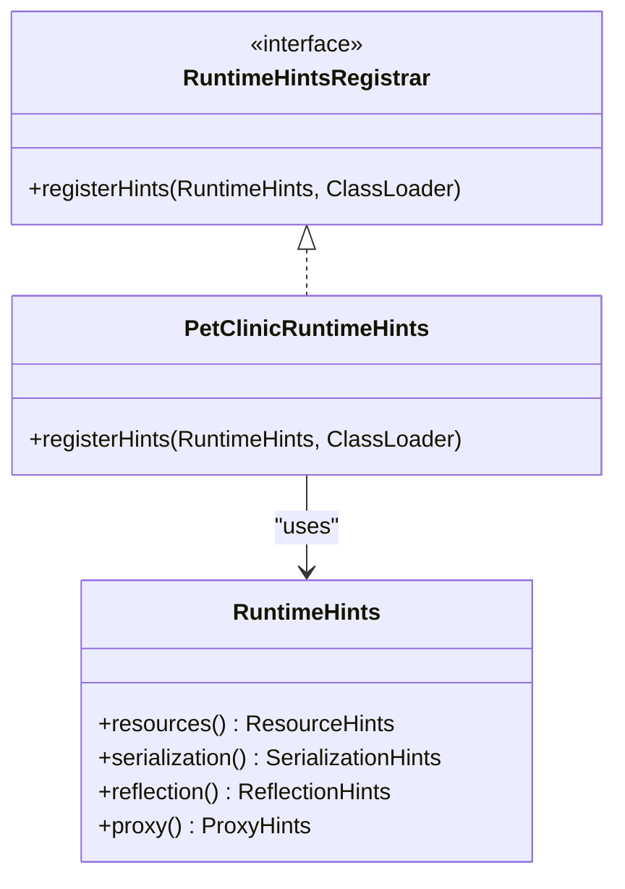
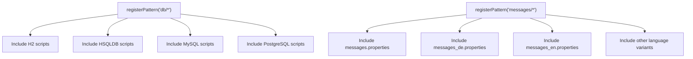
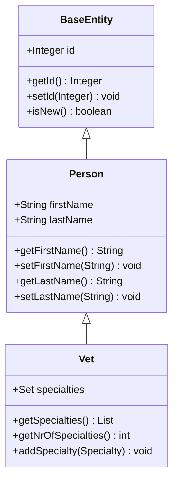

# Runtime Hints for GraalVM

<cite>
**Referenced Files in This Document**   
- [PetClinicRuntimeHints.java](file://src/main/java/org/springframework/samples/petclinic/PetClinicRuntimeHints.java)
- [BaseEntity.java](file://src/main/java/org/springframework/samples/petclinic/model/BaseEntity.java)
- [Person.java](file://src/main/java/org/springframework/samples/petclinic/model/Person.java)
- [Vet.java](file://src/main/java/org/springframework/samples/petclinic/vet/Vet.java)
- [application.properties](file://src/main/resources/application.properties)
- [pom.xml](file://pom.xml)
- [build.gradle](file://build.gradle)
</cite>

## Table of Contents
1. [Introduction](#introduction)
2. [RuntimeHintsRegistrar Interface](#runtimehintsregistrar-interface)
3. [Resource Registration](#resource-registration)
4. [Serialization Type Registration](#serialization-type-registration)
5. [Core Model Classes](#core-model-classes)
6. [Build Configuration](#build-configuration)
7. [Common Native Image Issues](#common-native-image-issues)
8. [Performance and Trade-offs](#performance-and-trade-offs)
9. [Extending Runtime Hints](#extending-runtime-hints)
10. [Conclusion](#conclusion)

## Introduction

The PetClinic application demonstrates the use of Spring Native and GraalVM for compiling Spring Boot applications to native images. This documentation focuses on the `PetClinicRuntimeHints` class, which plays a critical role in enabling successful native compilation by registering necessary runtime hints. These hints inform the native image builder about resources, reflection requirements, and serialization needs that cannot be determined through static analysis alone.

**Section sources**
- [PetClinicRuntimeHints.java](file://src/main/java/org/springframework/samples/petclinic/PetClinicRuntimeHints.java)

## RuntimeHintsRegistrar Interface

The `RuntimeHintsRegistrar` interface is a core component of Spring Native's ahead-of-time (AOT) processing system. It allows developers to programmatically register runtime hints that guide the GraalVM native image builder in preserving necessary application elements during the compilation process.

When implementing this interface, the `registerHints` method is called during the build phase to register various types of hints. This approach provides fine-grained control over what aspects of the application need to be preserved for runtime execution, which is essential because GraalVM's static analysis cannot always detect all dynamic behaviors present in Spring applications.

**Diagram sources**
- [PetClinicRuntimeHints.java](file://src/main/java/org/springframework/samples/petclinic/PetClinicRuntimeHints.java)

**Section sources**
- [PetClinicRuntimeHints.java](file://src/main/java/org/springframework/samples/petclinic/PetClinicRuntimeHints.java)

## Resource Registration

The `PetClinicRuntimeHints` class registers several resource patterns that must be accessible at runtime in the native image. Resource registration is crucial because GraalVM's native image builder only includes resources that are explicitly referenced or registered.

The application registers three key resource patterns:
- `db/*`: Includes all database scripts across different database implementations (H2, MySQL, PostgreSQL, etc.)
- `messages/*`: Includes all internationalization message properties files
- `mysql-default-conf`: Includes MySQL-specific configuration resources

The registration of `db/*` ensures that database schema and data initialization scripts are available regardless of the selected database backend. This pattern-based approach is more maintainable than registering individual files, as new database scripts can be added without modifying the runtime hints.

**Diagram sources**
- [PetClinicRuntimeHints.java](file://src/main/java/org/springframework/samples/petclinic/PetClinicRuntimeHints.java)
- [application.properties](file://src/main/resources/application.properties)

**Section sources**
- [PetClinicRuntimeHints.java](file://src/main/java/org/springframework/samples/petclinic/PetClinicRuntimeHints.java)
- [src/main/resources/db](file://src/main/resources/db)
- [src/main/resources/messages](file://src/main/resources/messages)

## Serialization Type Registration

The application registers three core model classes for serialization: `BaseEntity`, `Person`, and `Vet`. Serialization hints are essential for native images because they ensure that classes used in serialization/deserialization processes are properly instantiated and accessible.

When objects are serialized (e.g., in HTTP responses, caching, or message passing), the native image must be able to instantiate these types at runtime. Without explicit registration, GraalVM's aggressive tree-shaking might remove the necessary constructors and methods, leading to runtime failures.

The selection of these specific classes reflects their central role in the application's data model:
- `BaseEntity` serves as the foundation for all persistent entities
- `Person` represents the base class for individuals in the system
- `Vet` represents a specialized type of person with additional properties

**Diagram sources**
- [BaseEntity.java](file://src/main/java/org/springframework/samples/petclinic/model/BaseEntity.java)
- [Person.java](file://src/main/java/org/springframework/samples/petclinic/model/Person.java)
- [Vet.java](file://src/main/java/org/springframework/samples/petclinic/vet/Vet.java)

**Section sources**
- [PetClinicRuntimeHints.java](file://src/main/java/org/springframework/samples/petclinic/PetClinicRuntimeHints.java)
- [BaseEntity.java](file://src/main/java/org/springframework/samples/petclinic/model/BaseEntity.java)
- [Person.java](file://src/main/java/org/springframework/samples/petclinic/model/Person.java)
- [Vet.java](file://src/main/java/org/springframework/samples/petclinic/vet/Vet.java)

## Core Model Classes

The registered classes form a hierarchical inheritance structure that represents the core domain model of the PetClinic application. `BaseEntity` provides the fundamental identifier and persistence capabilities, `Person` extends this with personal information, and `Vet` further specializes the person concept with veterinary-specific attributes.

This inheritance hierarchy demonstrates why all three classes need to be registered for serialization. Even though `Vet` is the most specific type, serialization operations may involve any level of the hierarchy, and each class contributes essential properties that must be preserved.

The `Vet` class in particular illustrates the complexity of serialization requirements, as it contains a collection of `Specialty` objects through a many-to-many relationship. While `Specialty` itself isn't explicitly registered in the runtime hints, its inclusion is likely inferred through the relationship with `Vet` and other application components.

**Section sources**
- [BaseEntity.java](file://src/main/java/org/springframework/samples/petclinic/model/BaseEntity.java)
- [Person.java](file://src/main/java/org/springframework/samples/petclinic/model/Person.java)
- [Vet.java](file://src/main/java/org/springframework/samples/petclinic/vet/Vet.java)

## Build Configuration

The application supports both Maven and Gradle build systems for native image compilation, as evidenced by the presence of both `pom.xml` and `build.gradle` files. The build configuration includes the necessary plugins for GraalVM native image generation.

The Maven configuration includes the `org.graalvm.buildtools.native-maven-plugin`, while the Gradle configuration applies the `org.graalvm.buildtools.native` plugin. These plugins integrate GraalVM's native image tooling into the standard build lifecycle, allowing developers to generate native executables with commands like `mvn native:compile` or `./gradlew nativeCompile`.

The build files also specify Java 17 as the source compatibility level, which aligns with the requirements for modern Spring Native applications and GraalVM support.

**Section sources**
- [pom.xml](file://pom.xml)
- [build.gradle](file://build.gradle)

## Common Native Image Issues

Native image compilation can fail due to several common issues related to missing runtime hints:

1. **Missing resources**: When resource patterns are not properly registered, the application fails to locate configuration files, database scripts, or message bundles at runtime.

2. **Reflection access failures**: Spring Framework heavily relies on reflection for dependency injection, AOP, and data binding. Without proper reflection hints, methods and fields may not be accessible.

3. **Serialization errors**: Classes not registered for serialization cannot be properly instantiated during deserialization, leading to `ClassNotFoundException` or instantiation errors.

4. **Proxy generation issues**: Spring creates runtime proxies for transaction management and other AOP features, which require specific hints to function in native images.

The comment in `PetClinicRuntimeHints.java` referencing GitHub issue #32654 suggests that resource pattern registration for database scripts has been a known challenge in Spring Boot applications, highlighting the importance of proper configuration.

**Section sources**
- [PetClinicRuntimeHints.java](file://src/main/java/org/springframework/samples/petclinic/PetClinicRuntimeHints.java)
- [pom.xml](file://pom.xml)
- [build.gradle](file://build.gradle)

## Performance and Trade-offs

Native compilation with GraalVM offers significant performance benefits:
- **Faster startup times**: Native images can start in milliseconds rather than seconds
- **Lower memory footprint**: Typically 25-50% reduction compared to JVM-based execution
- **Reduced disk space**: Single executable file instead of JAR with dependencies
- **Improved throughput**: Optimized code execution without JIT warmup period

However, these benefits come with trade-offs:
- **Longer build times**: Native compilation can take several minutes
- **Increased complexity**: Requires careful configuration of runtime hints
- **Limited dynamic features**: Some Java features like dynamic class loading are restricted
- **Platform specificity**: Native images are compiled for specific operating systems and architectures

The `PetClinicRuntimeHints` class exemplifies the configuration effort required to balance these trade-offs, ensuring that essential dynamic behaviors are preserved while still achieving the performance benefits of native compilation.

## Extending Runtime Hints

To extend runtime hints for custom components or third-party integrations, developers can follow the same pattern established in `PetClinicRuntimeHints`:

1. Create a new class that implements `RuntimeHintsRegistrar`
2. Override the `registerHints` method to register necessary resources, types, and reflection targets
3. Register the hints registrar in the application configuration

For third-party libraries, it's often necessary to consult the library's documentation for any specific runtime hints requirements. Some libraries provide their own `RuntimeHintsRegistrar` implementations that can be automatically discovered and applied.

Custom components that use reflection, resource loading, or serialization should have their requirements explicitly registered to ensure compatibility with native images.

## Conclusion

The `PetClinicRuntimeHints` class plays a vital role in enabling successful native compilation of the Spring PetClinic application. By registering essential resources and serialization types, it addresses the limitations of GraalVM's static analysis and ensures that critical application components remain accessible at runtime.

Proper configuration of runtime hints is essential for any Spring application targeting native compilation. The patterns demonstrated in this implementation—registering resource patterns for database scripts and message bundles, and explicitly registering core model classes for serialization—provide a template for addressing common native image requirements.

As native compilation becomes more prevalent in cloud-native applications, understanding and properly implementing runtime hints will be increasingly important for developers seeking to leverage the performance benefits of GraalVM while maintaining application functionality.