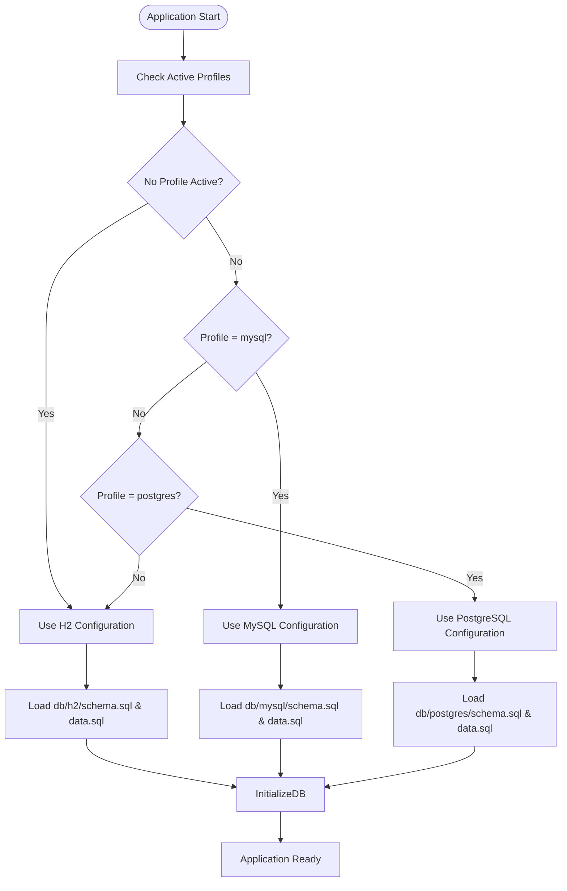
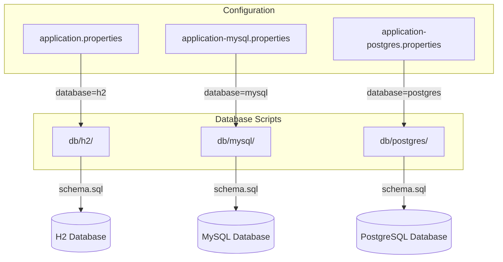

# Spring Profiles Configuration

<cite>
**Referenced Files in This Document**   
- [application.properties](file://src/main/resources/application.properties)
- [application-mysql.properties](file://src/main/resources/application-mysql.properties)
- [application-postgres.properties](file://src/main/resources/application-postgres.properties)
- [PetClinicApplication.java](file://src/main/java/org/springframework/samples/petclinic/PetClinicApplication.java)
- [petclinic_db_setup_mysql.txt](file://src/main/resources/db/mysql/petclinic_db_setup_mysql.txt)
- [petclinic_db_setup_postgres.txt](file://src/main/resources/db/postgres/petclinic_db_setup_postgres.txt)
- [README.md](file://README.md)
</cite>

## Table of Contents
1. [Introduction](#introduction)
2. [Profile Configuration Overview](#profile-configuration-overview)
3. [Property Hierarchy and Resolution](#property-hierarchy-and-resolution)
4. [Profile Activation Methods](#profile-activation-methods)
5. [Dynamic Resource Loading with Placeholders](#dynamic-resource-loading-with-placeholders)
6. [Creating New Profiles](#creating-new-profiles)
7. [Common Issues and Troubleshooting](#common-issues-and-troubleshooting)
8. [Performance Considerations](#performance-considerations)
9. [Conclusion](#conclusion)

## Introduction

Spring Profiles provide a mechanism to manage environment-specific configuration in the PetClinic application. The application leverages Spring Boot's profile support to switch between different database configurations, primarily between the default H2 in-memory database and persistent MySQL or PostgreSQL databases. This documentation details how profile-based configuration works, how properties are resolved, and best practices for managing environment-specific settings.

**Section sources**
- [README.md](file://README.md#L49-L78)
- [PetClinicApplication.java](file://src/main/java/org/springframework/samples/petclinic/PetClinicApplication.java#L28-L36)

## Profile Configuration Overview

The PetClinic application uses three primary configuration files for database management:
- `application.properties`: Contains default configuration with H2 database settings
- `application-mysql.properties`: Overrides default settings for MySQL database
- `application-postgres.properties`: Overrides default settings for PostgreSQL database

The base configuration in `application.properties` sets the default database to H2 and uses placeholders for dynamic resource loading:

```properties
database=h2
spring.sql.init.schema-locations=classpath*:db/${database}/schema.sql
spring.sql.init.data-locations=classpath*:db/${database}/data.sql
```

When the `mysql` or `postgres` profile is activated, the respective profile-specific properties file is loaded, overriding the `database` property and database connection settings. The MySQL profile configuration includes:

```properties
database=mysql
spring.datasource.url=${MYSQL_URL:jdbc:mysql://localhost/petclinic}
spring.datasource.username=${MYSQL_USER:petclinic}
spring.datasource.password=${MYSQL_PASS:petclinic}
spring.sql.init.mode=always
```

Similarly, the PostgreSQL profile configuration sets:

```properties
database=postgres
spring.datasource.url=${POSTGRES_URL:jdbc:postgresql://localhost/petclinic}
spring.datasource.username=${POSTGRES_USER:petclinic}
spring.datasource.password=${POSTGRES_PASS:petclinic}
spring.sql.init.mode=always
```

This approach allows the application to maintain a consistent configuration structure while adapting to different database environments.

**Section sources**
- [application.properties](file://src/main/resources/application.properties#L1-L25)
- [application-mysql.properties](file://src/main/resources/application-mysql.properties#L1-L8)
- [application-postgres.properties](file://src/main/resources/application-postgres.properties#L1-L7)

## Property Hierarchy and Resolution

Spring Boot follows a specific order for property resolution, with profile-specific properties taking precedence over default properties. The resolution order in PetClinic is:

1. Command line arguments
2. JVM system properties
3. OS environment variables
4. Profile-specific properties files (`application-{profile}.properties`)
5. Default properties file (`application.properties`)

When a profile is activated, Spring Boot automatically loads the corresponding `application-{profile}.properties` file, which can override any properties defined in the default configuration. The placeholder `${database}` in the SQL initialization properties is resolved based on which profile is active:

- Default (no profile): `database=h2` → loads from `db/h2/` directory
- `mysql` profile: `database=mysql` → loads from `db/mysql/` directory  
- `postgres` profile: `database=postgres` → loads from `db/postgres/` directory

The application also uses fallback values for datasource properties through the `${property:default}` syntax, ensuring that the application can start even if external environment variables are not set.



**Diagram sources**
- [application.properties](file://src/main/resources/application.properties#L1-L25)
- [application-mysql.properties](file://src/main/resources/application-mysql.properties#L1-L8)
- [application-postgres.properties](file://src/main/resources/application-postgres.properties#L1-L7)

**Section sources**
- [application.properties](file://src/main/resources/application.properties#L1-L25)
- [application-mysql.properties](file://src/main/resources/application-mysql.properties#L1-L8)
- [application-postgres.properties](file://src/main/resources/application-postgres.properties#L1-L7)

## Profile Activation Methods

There are several ways to activate Spring Profiles in the PetClinic application:

### Command Line Activation
Profiles can be activated using JVM system properties when starting the application:

```bash
java -jar petclinic.jar --spring.profiles.active=mysql
```

Or using the Spring Boot Maven plugin:
```bash
./mvnw spring-boot:run -Dspring-boot.run.profiles=mysql
```

### Environment Variable Activation
Set the `SPRING_PROFILES_ACTIVE` environment variable:
```bash
export SPRING_PROFILES_ACTIVE=mysql
./mvnw spring-boot:run
```

### IDE Configuration
In development environments like IntelliJ IDEA or Eclipse, profiles can be set in the run configuration:
- Add `--spring.profiles.active=mysql` to program arguments
- Or set `spring.profiles.active=mysql` as a VM option

### Docker and Container Orchestration
When using Docker Compose, the profile can be specified in the service configuration:
```bash
docker compose up mysql
```

The `docker-compose.yml` file includes services named after the Spring profiles, allowing profile activation through container orchestration.

**Section sources**
- [README.md](file://README.md#L49-L78)
- [petclinic_db_setup_mysql.txt](file://src/main/resources/db/mysql/petclinic_db_setup_mysql.txt#L30-L35)
- [petclinic_db_setup_postgres.txt](file://src/main/resources/db/postgres/petclinic_db_setup_postgres.txt#L13-L18)

## Dynamic Resource Loading with Placeholders

The PetClinic application uses the `${database}` placeholder in the `spring.sql.init.schema-locations` and `spring.sql.init.data-locations` properties to enable dynamic resource loading. This placeholder is resolved at runtime based on the active profile, allowing the application to load database initialization scripts from the appropriate directory:

```properties
spring.sql.init.schema-locations=classpath*:db/${database}/schema.sql
spring.sql.init.data-locations=classpath*:db/${database}/data.sql
```

The directory structure under `src/main/resources/db/` mirrors this pattern:
- `db/h2/`: Contains H2-specific schema and data scripts
- `db/mysql/`: Contains MySQL-specific schema and data scripts  
- `db/postgres/`: Contains PostgreSQL-specific schema and data scripts

Each database type has tailored SQL scripts that account for database-specific syntax and features:
- H2 scripts use `GENERATED BY DEFAULT AS IDENTITY`
- MySQL scripts use `INT(4) UNSIGNED NOT NULL AUTO_INCREMENT`
- PostgreSQL scripts use `INT GENERATED BY DEFAULT AS IDENTITY`

This approach ensures that the correct database schema and initial data are loaded for each environment, while maintaining a clean separation of concerns.



**Diagram sources**
- [application.properties](file://src/main/resources/application.properties#L1-L25)
- [src/main/resources/db](file://src/main/resources/db)

**Section sources**
- [application.properties](file://src/main/resources/application.properties#L1-L25)
- [src/main/resources/db/h2/schema.sql](file://src/main/resources/db/h2/schema.sql#L1-L65)
- [src/main/resources/db/mysql/schema.sql](file://src/main/resources/db/mysql/schema.sql#L1-L56)
- [src/main/resources/db/postgres/schema.sql](file://src/main/resources/db/postgres/schema.sql#L1-L53)

## Creating New Profiles

To create new profiles for additional environments (e.g., dev, staging, prod), follow these steps:

1. Create a new properties file named `application-{profile}.properties` in `src/main/resources/`
2. Override only the properties that differ from the default configuration
3. Use profile-specific placeholders and resource locations as needed

For example, to create a `staging` profile:
```properties
# application-staging.properties
database=mysql
spring.datasource.url=jdbc:mysql://staging-db:3306/petclinic
spring.datasource.username=staging_user
spring.datasource.password=${STAGING_DB_PASSWORD}
logging.level.org.springframework=DEBUG
management.endpoints.web.exposure.include=health,info
```

Additional environment-specific resources can be organized in dedicated directories, similar to the database script organization. The profile activation mechanism remains consistent across all environments, allowing for seamless deployment across different stages of the development lifecycle.

**Section sources**
- [application-mysql.properties](file://src/main/resources/application-mysql.properties#L1-L8)
- [application-postgres.properties](file://src/main/resources/application-postgres.properties#L1-L7)

## Common Issues and Troubleshooting

### Profile Activation Failures
- Ensure the profile name matches exactly (case-sensitive)
- Verify that the corresponding `application-{profile}.properties` file exists
- Check for typos in the activation command or environment variable

### Missing Property Sources
- Confirm that properties files are in the correct location (`src/main/resources/`)
- Ensure that the Spring Boot application class is properly annotated with `@SpringBootApplication`
- Verify that the classpath includes the resources directory

### Incorrect File Loading Order
- Profile-specific properties should override default properties
- If overrides are not working, check for syntax errors in property names
- Ensure that the active profile is correctly set before application context initialization

### Database Connection Issues
- Verify that the database server is running and accessible
- Check that environment variables (MYSQL_URL, POSTGRES_URL, etc.) are correctly set
- Ensure that the database user has appropriate permissions

The application's test classes (`PostgresIntegrationTests`, `MySqlIntegrationTests`) include diagnostic logging that can help identify configuration issues by printing all resolved properties during application startup.

**Section sources**
- [README.md](file://README.md#L80-L101)
- [PostgresIntegrationTests.java](file://src/test/java/org/springframework/samples/petclinic/PostgresIntegrationTests.java#L101-L149)

## Performance Considerations

While Spring's property resolution mechanism is efficient, there are several performance considerations:

### Property Source Parsing
- Each active profile adds additional property sources to the environment
- Minimize the number of properties in profile-specific files to only those that differ from defaults
- Avoid redundant property definitions across profiles

### Initialization Time Impact
- Database initialization scripts are executed on startup when `spring.sql.init.mode=always`
- For large datasets, consider using `mode=embedded` for H2 and pre-initialized databases for MySQL/PostgreSQL
- The placeholder resolution mechanism adds minimal overhead but should be used judiciously

### Best Practices
- Use environment variables for sensitive data rather than hardcoding in properties files
- Leverage Spring Boot's caching mechanisms for frequently accessed configuration
- Monitor application startup time when adding new profiles or complex property hierarchies

The current implementation balances flexibility and performance by using a simple profile system with targeted overrides, minimizing the performance impact while maintaining configuration flexibility.

**Section sources**
- [application.properties](file://src/main/resources/application.properties#L1-L25)
- [application-mysql.properties](file://src/main/resources/application-mysql.properties#L1-L8)
- [application-postgres.properties](file://src/main/resources/application-postgres.properties#L1-L7)

## Conclusion

The Spring Profiles configuration in PetClinic provides a robust mechanism for managing environment-specific settings, particularly for database configuration. By leveraging profile-specific properties files and dynamic resource loading with placeholders, the application can seamlessly switch between H2, MySQL, and PostgreSQL databases. The property hierarchy ensures that profile-specific settings take precedence while maintaining a clean separation of concerns. Various activation methods support different deployment scenarios, from local development to production environments. When creating new profiles, following the established pattern ensures consistency and maintainability. Understanding common issues and performance considerations helps optimize the configuration for different use cases.