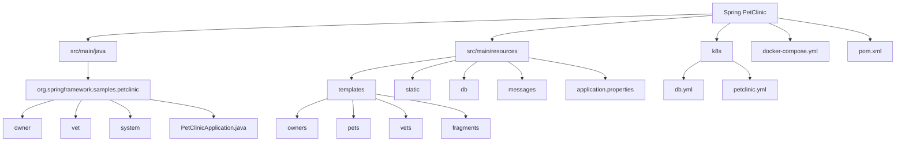
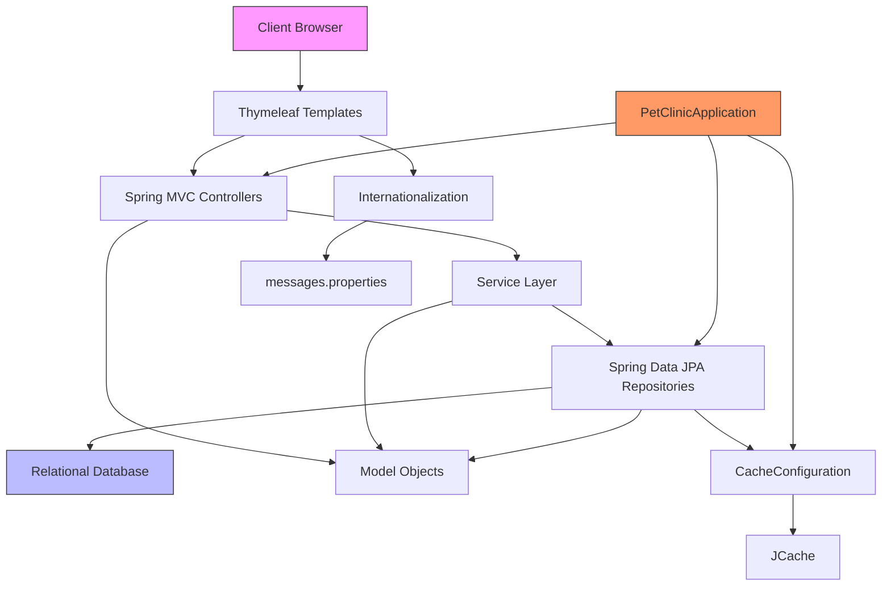
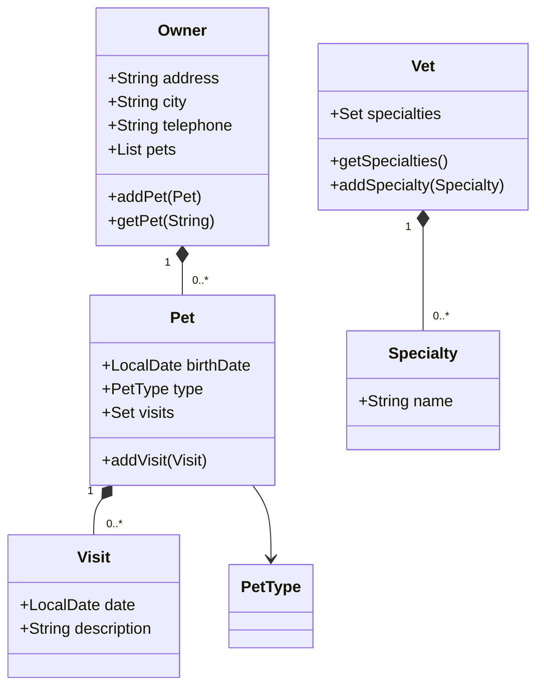
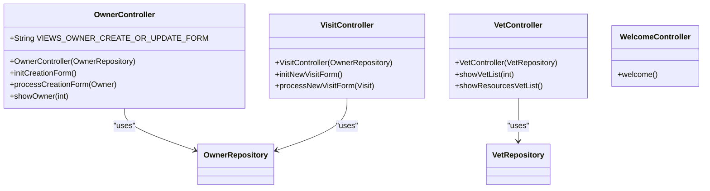
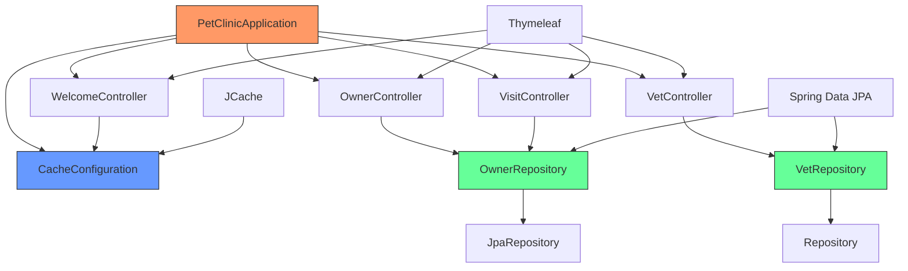
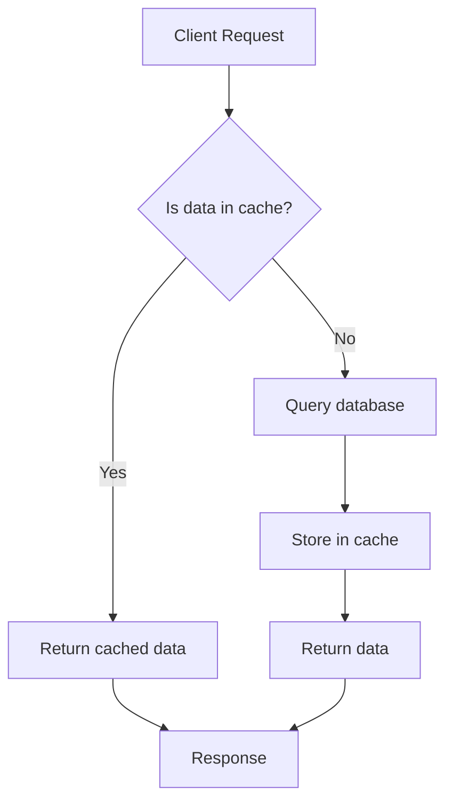
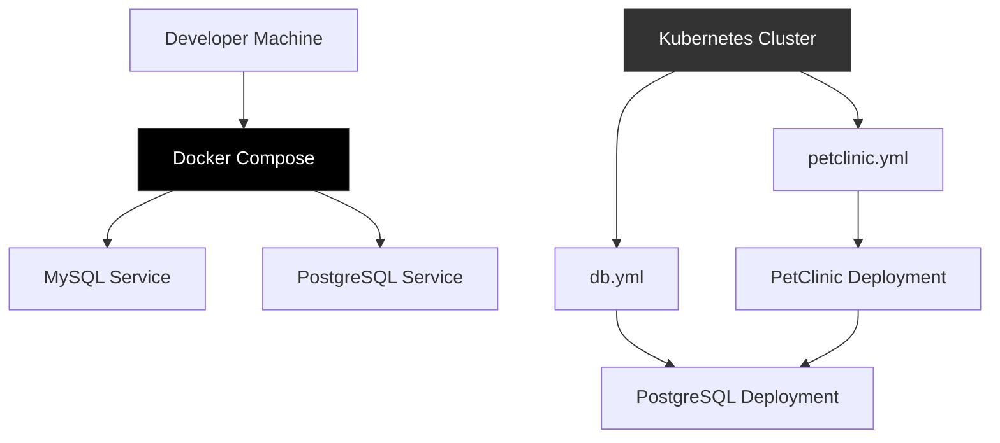

# Architecture Overview

<cite>
**Referenced Files in This Document**   
- [PetClinicApplication.java](file://src/main/java/org/springframework/samples/petclinic/PetClinicApplication.java)
- [OwnerController.java](file://src/main/java/org/springframework/samples/petclinic/owner/OwnerController.java)
- [VetController.java](file://src/main/java/org/springframework/samples/petclinic/vet/VetController.java)
- [VisitController.java](file://src/main/java/org/springframework/samples/petclinic/owner/VisitController.java)
- [WelcomeController.java](file://src/main/java/org/springframework/samples/petclinic/system/WelcomeController.java)
- [OwnerRepository.java](file://src/main/java/org/springframework/samples/petclinic/owner/OwnerRepository.java)
- [VetRepository.java](file://src/main/java/org/springframework/samples/petclinic/vet/VetRepository.java)
- [Owner.java](file://src/main/java/org/springframework/samples/petclinic/owner/Owner.java)
- [Pet.java](file://src/main/java/org/springframework/samples/petclinic/owner/Pet.java)
- [Visit.java](file://src/main/java/org/springframework/samples/petclinic/owner/Visit.java)
- [Vet.java](file://src/main/java/org/springframework/samples/petclinic/vet/Vet.java)
- [Specialty.java](file://src/main/java/org/springframework/samples/petclinic/vet/Specialty.java)
- [CacheConfiguration.java](file://src/main/java/org/springframework/samples/petclinic/system/CacheConfiguration.java)
- [application.properties](file://src/main/resources/application.properties)
- [messages.properties](file://src/main/resources/messages/messages.properties)
- [docker-compose.yml](file://docker-compose.yml)
- [db.yml](file://k8s/db.yml)
- [petclinic.yml](file://k8s/petclinic.yml)
</cite>

## Table of Contents
1. [Introduction](#introduction)
2. [Project Structure](#project-structure)
3. [Core Components](#core-components)
4. [Architecture Overview](#architecture-overview)
5. [Detailed Component Analysis](#detailed-component-analysis)
6. [Dependency Analysis](#dependency-analysis)
7. [Performance Considerations](#performance-considerations)
8. [Troubleshooting Guide](#troubleshooting-guide)
9. [Conclusion](#conclusion)

## Introduction
The Spring PetClinic application is a canonical Spring Boot sample application that demonstrates best practices in enterprise Java development. This document provides a comprehensive architectural overview of the application, focusing on its Model-View-Controller (MVC) pattern implementation, layered architecture, and key design patterns. The application serves as a reference implementation for Spring technologies including Spring MVC, Spring Data JPA, and Spring Boot, with a clear separation of concerns between presentation, business, and data access layers.

**Section sources**
- [README.md](file://README.md#L0-L163)

## Project Structure

**Diagram sources**
- [src/main/java/org/springframework/samples/petclinic](file://src/main/java/org/springframework/samples/petclinic)
- [src/main/resources](file://src/main/resources)
- [k8s](file://k8s)

**Section sources**
- [project_structure](file://project_structure)

## Core Components

The Spring PetClinic application is structured around three primary domains: owners, pets, and veterinarians (vets). Each domain contains corresponding model entities, repositories for data access, and controllers for handling HTTP requests. The application follows a clean layered architecture with distinct separation between presentation, business, and data access concerns. Key components include the main application class, domain models with JPA annotations, Spring MVC controllers, and Spring Data JPA repositories that implement the Repository pattern.

**Section sources**
- [PetClinicApplication.java](file://src/main/java/org/springframework/samples/petclinic/PetClinicApplication.java)
- [Owner.java](file://src/main/java/org/springframework/samples/petclinic/owner/Owner.java)
- [Pet.java](file://src/main/java/org/springframework/samples/petclinic/owner/Pet.java)
- [Visit.java](file://src/main/java/org/springframework/samples/petclinic/owner/Visit.java)
- [Vet.java](file://src/main/java/org/springframework/samples/petclinic/vet/Vet.java)
- [Specialty.java](file://src/main/java/org/springframework/samples/petclinic/vet/Specialty.java)

## Architecture Overview

**Diagram sources**
- [PetClinicApplication.java](file://src/main/java/org/springframework/samples/petclinic/PetClinicApplication.java)
- [OwnerController.java](file://src/main/java/org/springframework/samples/petclinic/owner/OwnerController.java)
- [VetController.java](file://src/main/java/org/springframework/samples/petclinic/vet/VetController.java)
- [OwnerRepository.java](file://src/main/java/org/springframework/samples/petclinic/owner/OwnerRepository.java)
- [VetRepository.java](file://src/main/java/org/springframework/samples/petclinic/vet/VetRepository.java)
- [CacheConfiguration.java](file://src/main/java/org/springframework/samples/petclinic/system/CacheConfiguration.java)

## Detailed Component Analysis

### MVC Pattern Implementation

The application strictly follows the Model-View-Controller (MVC) pattern with clear separation between components:

#### Model Components

**Diagram sources**
- [Owner.java](file://src/main/java/org/springframework/samples/petclinic/owner/Owner.java#L45-L174)
- [Pet.java](file://src/main/java/org/springframework/samples/petclinic/owner/Pet.java#L43-L84)
- [Visit.java](file://src/main/java/org/springframework/samples/petclinic/owner/Visit.java#L33-L67)
- [Vet.java](file://src/main/java/org/springframework/samples/petclinic/vet/Vet.java#L42-L73)
- [Specialty.java](file://src/main/java/org/springframework/samples/petclinic/vet/Specialty.java#L27-L31)

#### Controller Components

**Diagram sources**
- [OwnerController.java](file://src/main/java/org/springframework/samples/petclinic/owner/OwnerController.java#L45-L172)
- [VetController.java](file://src/main/java/org/springframework/samples/petclinic/vet/VetController.java#L34-L77)
- [VisitController.java](file://src/main/java/org/springframework/samples/petclinic/owner/VisitController.java#L40-L99)
- [WelcomeController.java](file://src/main/java/org/springframework/samples/petclinic/system/WelcomeController.java#L21-L29)
- [OwnerRepository.java](file://src/main/java/org/springframework/samples/petclinic/owner/OwnerRepository.java#L38-L76)
- [VetRepository.java](file://src/main/java/org/springframework/samples/petclinic/vet/VetRepository.java#L37-L57)

### Layered Architecture

The application implements a clear layered architecture with the following components:

#### Presentation Layer
The presentation layer consists of Spring MVC controllers that handle HTTP requests and responses. Controllers are annotated with `@Controller` and use `@GetMapping` and `@PostMapping` annotations to map URLs to handler methods. The layer uses Thymeleaf templates for server-side rendering of HTML content, with templates organized by feature area (owners, pets, vets) in the resources/templates directory.

#### Business Logic Layer
While not explicitly defined as separate service classes, the business logic is implied in the controller methods and repository interactions. The application demonstrates transaction management through Spring Data JPA's `@Transactional` annotation on repository methods, ensuring data consistency during operations.

#### Data Access Layer
The data access layer is implemented using Spring Data JPA repositories that follow the Repository pattern. Repositories extend `JpaRepository` or `Repository` interfaces and provide type-safe data access methods. The layer uses JPA annotations for object-relational mapping, with entities mapped to database tables through `@Entity` and `@Table` annotations.

**Section sources**
- [OwnerController.java](file://src/main/java/org/springframework/samples/petclinic/owner/OwnerController.java)
- [VetController.java](file://src/main/java/org/springframework/samples/petclinic/vet/VetController.java)
- [OwnerRepository.java](file://src/main/java/org/springframework/samples/petclinic/owner/OwnerRepository.java)
- [VetRepository.java](file://src/main/java/org/springframework/samples/petclinic/vet/VetRepository.java)
- [Owner.java](file://src/main/java/org/springframework/samples/petclinic/owner/Owner.java)
- [Pet.java](file://src/main/java/org/springframework/samples/petclinic/owner/Pet.java)

## Dependency Analysis

**Diagram sources**
- [PetClinicApplication.java](file://src/main/java/org/springframework/samples/petclinic/PetClinicApplication.java)
- [OwnerController.java](file://src/main/java/org/springframework/samples/petclinic/owner/OwnerController.java)
- [VetController.java](file://src/main/java/org/springframework/samples/petclinic/vet/VetController.java)
- [VisitController.java](file://src/main/java/org/springframework/samples/petclinic/owner/VisitController.java)
- [WelcomeController.java](file://src/main/java/org/springframework/samples/petclinic/system/WelcomeController.java)
- [OwnerRepository.java](file://src/main/java/org/springframework/samples/petclinic/owner/OwnerRepository.java)
- [VetRepository.java](file://src/main/java/org/springframework/samples/petclinic/vet/VetRepository.java)
- [CacheConfiguration.java](file://src/main/java/org/springframework/samples/petclinic/system/CacheConfiguration.java)

**Section sources**
- [pom.xml](file://pom.xml)
- [PetClinicApplication.java](file://src/main/java/org/springframework/samples/petclinic/PetClinicApplication.java)

## Performance Considerations

### Caching Configuration
The application implements caching using Spring's caching abstraction with JCache as the underlying provider. The `CacheConfiguration` class creates a cache named "vets" that stores veterinarian data, reducing database load for frequently accessed information. Cache statistics are enabled for monitoring via JMX, allowing administrators to track cache hit rates and performance metrics.

**Diagram sources**
- [CacheConfiguration.java](file://src/main/java/org/springframework/samples/petclinic/system/CacheConfiguration.java#L21-L53)
- [VetRepository.java](file://src/main/java/org/springframework/samples/petclinic/vet/VetRepository.java#L37-L57)

### Internationalization
The application supports internationalization through message properties files located in the resources/messages directory. Multiple language variants are provided (English, German, Spanish, etc.), with the base `messages.properties` file containing default text. The Spring framework automatically selects the appropriate message bundle based on the client's locale, enabling multilingual support without code changes.

**Section sources**
- [messages.properties](file://src/main/resources/messages/messages.properties)
- [application.properties](file://src/main/resources/application.properties#L13-L14)

### Error Handling
The application includes a generic error.html template that handles exceptions and displays user-friendly error messages. Input validation is implemented using Bean Validation annotations (e.g., @NotBlank, @Pattern) on model entities, with error messages defined in the messages.properties file. The controllers use BindingResult to capture validation errors and redirect users back to forms with appropriate error feedback.

**Section sources**
- [error.html](file://src/main/resources/templates/error.html)
- [messages.properties](file://src/main/resources/messages/messages.properties)
- [Owner.java](file://src/main/java/org/springframework/samples/petclinic/owner/Owner.java)

## Troubleshooting Guide

### Database Configuration Issues
The application supports multiple database configurations through Spring profiles (H2, MySQL, PostgreSQL). When switching databases, ensure the appropriate profile is activated using the `spring.profiles.active` property. For persistent databases, verify that the database server is running and accessible, and that the connection parameters in the application properties match the database configuration.

**Section sources**
- [application.properties](file://src/main/resources/application.properties#L1-L8)
- [README.md](file://README.md#L60-L85)

### Containerization and Deployment
The application can be containerized using Spring Boot's build-image feature or deployed using Docker Compose and Kubernetes configurations provided in the repository. The docker-compose.yml file defines services for MySQL and PostgreSQL databases, while the k8s directory contains Kubernetes manifests for deploying the application and database in a cluster environment.

**Diagram sources**
- [docker-compose.yml](file://docker-compose.yml)
- [k8s/db.yml](file://k8s/db.yml)
- [k8s/petclinic.yml](file://k8s/petclinic.yml)

**Section sources**
- [docker-compose.yml](file://docker-compose.yml)
- [k8s](file://k8s)

## Conclusion
The Spring PetClinic application demonstrates a well-structured, production-ready architecture using modern Spring technologies. Its implementation of the MVC pattern, layered architecture, and key design patterns like Repository and Dependency Injection provides a solid foundation for enterprise Java applications. The application's support for multiple databases, internationalization, caching, and containerization makes it suitable for deployment in various environments, from development to production. The clear separation of concerns and adherence to Spring best practices make it an excellent reference implementation for developers learning Spring ecosystem technologies.