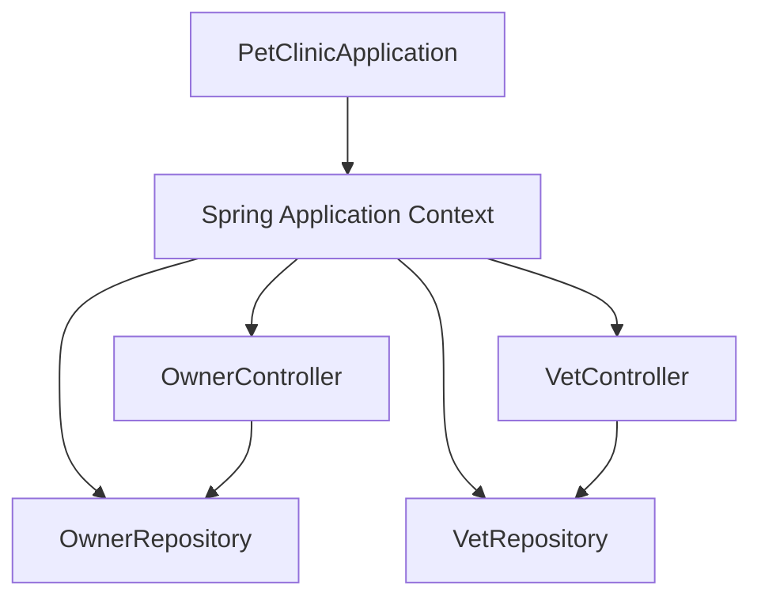
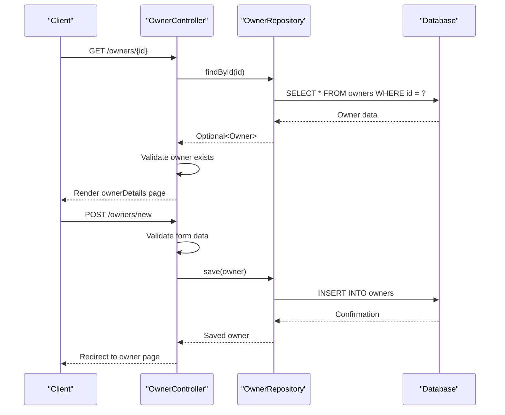
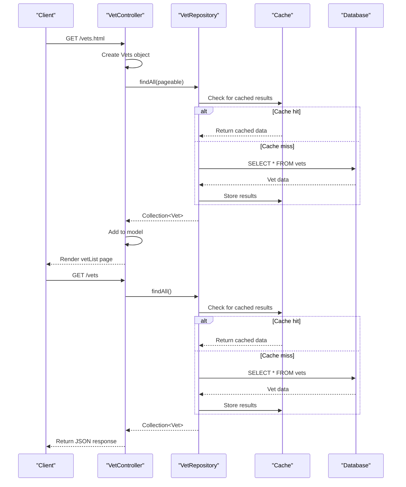

# Component Interactions

<cite>
**Referenced Files in This Document**   
- [PetClinicApplication.java](file://src/main/java/org/springframework/samples/petclinic/PetClinicApplication.java)
- [OwnerController.java](file://src/main/java/org/springframework/samples/petclinic/owner/OwnerController.java)
- [OwnerRepository.java](file://src/main/java/org/springframework/samples/petclinic/owner/OwnerRepository.java)
- [VetController.java](file://src/main/java/org/springframework/samples/petclinic/vet/VetController.java)
- [VetRepository.java](file://src/main/java/org/springframework/samples/petclinic/vet/VetRepository.java)
- [Owner.java](file://src/main/java/org/springframework/samples/petclinic/owner/Owner.java)
- [Vet.java](file://src/main/java/org/springframework/samples/petclinic/vet/Vet.java)
- [CacheConfiguration.java](file://src/main/java/org/springframework/samples/petclinic/system/CacheConfiguration.java)
</cite>

## Table of Contents
1. [Introduction](#introduction)
2. [Component Lifecycle and Dependency Resolution](#component-lifecycle-and-dependency-resolution)
3. [Owner Data Management Flow](#owner-data-management-flow)
4. [Veterinarian Data Retrieval with Caching](#veterinarian-data-retrieval-with-caching)
5. [Error Propagation and Transaction Management](#error-propagation-and-transaction-management)
6. [Loose Coupling Through Interfaces](#loose-coupling-through-interfaces)
7. [Conclusion](#conclusion)

## Introduction
This document details the component interaction model in the Spring PetClinic application, focusing on how the main entry point, controllers, and repositories collaborate to handle requests and manage data. The analysis covers the request flow from HTTP endpoints to service execution and data access, with specific attention to how OwnerController interacts with OwnerRepository for owner data persistence and how VetController leverages caching through VetRepository for veterinarian data retrieval. The document also examines Spring's component lifecycle management, dependency resolution, error handling, transaction management, and the use of interfaces to maintain loose coupling between components.

## Component Lifecycle and Dependency Resolution

The Spring PetClinic application follows the standard Spring Boot application lifecycle, with PetClinicApplication serving as the main entry point. The @SpringBootApplication annotation enables component scanning, auto-configuration, and property management, allowing Spring to automatically detect and configure beans throughout the application.

Dependency injection is implemented through constructor injection, ensuring that components receive their dependencies at creation time. This approach promotes immutability and makes dependencies explicit. The OwnerController receives an OwnerRepository instance through its constructor, establishing a direct dependency relationship. Similarly, VetController receives a VetRepository instance, creating a clean separation of concerns where controllers handle HTTP requests while repositories manage data access.

Spring's ApplicationContext manages the lifecycle of all components, creating singleton instances of controllers and repositories when the application starts. The dependency injection container resolves dependencies by matching constructor parameters with available beans in the context. This automated dependency resolution eliminates the need for manual object creation and wiring, reducing coupling and improving testability.

**Diagram sources**
- [PetClinicApplication.java](file://src/main/java/org/springframework/samples/petclinic/PetClinicApplication.java#L28-L36)
- [OwnerController.java](file://src/main/java/org/springframework/samples/petclinic/owner/OwnerController.java#L52-L54)
- [VetController.java](file://src/main/java/org/springframework/samples/petclinic/vet/VetController.java#L39-L41)

**Section sources**
- [PetClinicApplication.java](file://src/main/java/org/springframework/samples/petclinic/PetClinicApplication.java#L28-L36)
- [OwnerController.java](file://src/main/java/org/springframework/samples/petclinic/owner/OwnerController.java#L52-L54)
- [VetController.java](file://src/main/java/org/springframework/samples/petclinic/vet/VetController.java#L39-L41)

## Owner Data Management Flow

The OwnerController manages owner data through interactions with OwnerRepository, implementing a complete CRUD (Create, Read, Update, Delete) workflow for owner entities. The request flow begins with HTTP endpoints mapped to controller methods, which then delegate data operations to the repository layer.

When creating a new owner, the process starts with a GET request to /owners/new, which displays the creation form. Upon form submission via POST to /owners/new, the processCreationForm method validates the input data and uses OwnerRepository's save method to persist the owner to the database. For retrieving owners, the processFindForm method uses pagination to efficiently load owner data based on last name, calling OwnerRepository's findByLastNameStartingWith method with appropriate pagination parameters.

The showOwner method demonstrates a direct lookup pattern, using OwnerRepository's findById method to retrieve a specific owner by ID. This method returns an Optional<Owner>, properly handling the case where an owner with the specified ID does not exist by throwing an IllegalArgumentException with a descriptive message. The update workflow follows a similar pattern, with the processUpdateOwnerForm method validating input and using the repository's save method to update existing owner data.

**Diagram sources**
- [OwnerController.java](file://src/main/java/org/springframework/samples/petclinic/owner/OwnerController.java#L45-L172)
- [OwnerRepository.java](file://src/main/java/org/springframework/samples/petclinic/owner/OwnerRepository.java#L38-L76)

**Section sources**
- [OwnerController.java](file://src/main/java/org/springframework/samples/petclinic/owner/OwnerController.java#L45-L172)
- [OwnerRepository.java](file://src/main/java/org/springframework/samples/petclinic/owner/OwnerRepository.java#L38-L76)

## Veterinarian Data Retrieval with Caching

The VetController retrieves veterinarian data through VetRepository with built-in caching to improve performance. The caching mechanism is implemented using Spring's @Cacheable annotation, which automatically stores the results of method calls in a cache and returns cached results for subsequent identical requests.

The showVetList method handles requests to /vets.html, retrieving veterinarian data with pagination support. It calls the findPaginated method, which in turn invokes VetRepository's findAll(Pageable) method. The @Cacheable("vets") annotation on this method ensures that the results are cached, reducing database load for repeated requests. The showResourcesVetList method handles API requests to /vets, returning a Vets object containing all veterinarians in JSON format, also leveraging the same caching mechanism.

The CacheConfiguration class defines the cache setup, creating a cache named "vets" with statistics enabled. This configuration ensures that veterinarian data is efficiently cached while providing monitoring capabilities through JMX. The caching strategy significantly improves response times for veterinarian data retrieval, especially for frequently accessed endpoints, while maintaining data consistency through proper cache invalidation (though not explicitly shown in the current implementation).

**Diagram sources**
- [VetController.java](file://src/main/java/org/springframework/samples/petclinic/vet/VetController.java#L34-L77)
- [VetRepository.java](file://src/main/java/org/springframework/samples/petclinic/vet/VetRepository.java#L37-L57)
- [CacheConfiguration.java](file://src/main/java/org/springframework/samples/petclinic/system/CacheConfiguration.java#L1-L53)

**Section sources**
- [VetController.java](file://src/main/java/org/springframework/samples/petclinic/vet/VetController.java#L34-L77)
- [VetRepository.java](file://src/main/java/org/springframework/samples/petclinic/vet/VetRepository.java#L37-L57)
- [CacheConfiguration.java](file://src/main/java/org/springframework/samples/petclinic/system/CacheConfiguration.java#L1-L53)

## Error Propagation and Transaction Management

The Spring PetClinic application implements robust error handling and transaction management to ensure data integrity and provide meaningful feedback to users. Error propagation follows a layered approach, with validation occurring at multiple levels and exceptions being properly handled and transformed for client consumption.

In the OwnerController, input validation is performed using Jakarta Bean Validation annotations (@NotBlank, @Pattern) on the Owner entity, with additional validation in the controller methods. When validation fails, binding errors are captured in the BindingResult and appropriate error messages are added as flash attributes, redirecting the user back to the form with error information. For business logic errors, such as attempting to update an owner with a mismatched ID, the controller adds specific error messages and handles the redirection appropriately.

Transaction management is implemented at the repository level using Spring's @Transactional annotation. The VetRepository methods are annotated with @Transactional(readOnly = true), ensuring that database operations are executed within a transaction context. This guarantees that read operations are consistent and isolated, preventing dirty reads and other concurrency issues. Although not explicitly shown in the OwnerRepository, Spring Data JPA repositories typically inherit transactional behavior from their base classes, ensuring that save operations are properly transactional.

The application also handles data access exceptions through the DataAccessException hierarchy, with VetRepository methods declaring throws DataAccessException. This allows higher-level components to handle data access failures uniformly, whether they result from connectivity issues, constraint violations, or other database-related problems.

**Section sources**
- [OwnerController.java](file://src/main/java/org/springframework/samples/petclinic/owner/OwnerController.java#L45-L172)
- [VetRepository.java](file://src/main/java/org/springframework/samples/petclinic/vet/VetRepository.java#L37-L57)

## Loose Coupling Through Interfaces

The Spring PetClinic application demonstrates excellent loose coupling through the use of interfaces and dependency inversion. Components depend on abstractions rather than concrete implementations, allowing for greater flexibility, testability, and maintainability.

The OwnerRepository and VetRepository interfaces define the contract for data access operations, extending Spring Data JPA's JpaRepository and Repository interfaces respectively. This interface-based design allows the repositories to be easily mocked in unit tests, with controllers depending only on the repository interfaces rather than their implementations. The actual implementation is provided by Spring Data JPA at runtime through proxy generation, following the repository pattern.

Controllers depend on repository interfaces through constructor injection, making the dependencies explicit and allowing for easy substitution. This design enables the application to switch between different data storage implementations without modifying the controller code, as long as they adhere to the repository interface contract. The use of standard Spring annotations (@Controller, @Repository) further enhances loose coupling by allowing Spring to manage the components without requiring direct references between them.

The application also follows the principle of programming to interfaces in its domain model, with Owner extending Person and Vet extending Person, establishing a clear inheritance hierarchy while maintaining loose coupling between related entities. This object-oriented design promotes code reuse and makes the relationships between domain objects explicit and maintainable.

**Section sources**
- [OwnerRepository.java](file://src/main/java/org/springframework/samples/petclinic/owner/OwnerRepository.java#L38-L76)
- [VetRepository.java](file://src/main/java/org/springframework/samples/petclinic/vet/VetRepository.java#L37-L57)
- [OwnerController.java](file://src/main/java/org/springframework/samples/petclinic/owner/OwnerController.java#L52-L54)
- [VetController.java](file://src/main/java/org/springframework/samples/petclinic/vet/VetController.java#L39-L41)

## Conclusion
The Spring PetClinic application exemplifies effective component interaction patterns in a Spring Boot application. The clear separation of concerns between controllers and repositories, combined with Spring's dependency injection and component lifecycle management, creates a maintainable and testable architecture. The request flow from HTTP endpoints to data access is well-defined and follows consistent patterns across different entities.

Key strengths include the use of constructor injection for dependency management, proper error handling with meaningful user feedback, and performance optimization through caching. The application's reliance on interfaces promotes loose coupling and makes components easily testable through mocking. Transaction management ensures data integrity, while the layered architecture provides clear boundaries between concerns.

The implementation could be further improved by adding more comprehensive exception handling at the controller level and implementing cache invalidation strategies for the veterinarian data. However, as a sample application, it effectively demonstrates best practices in Spring application design and component interaction.