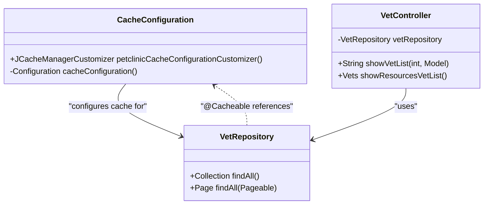
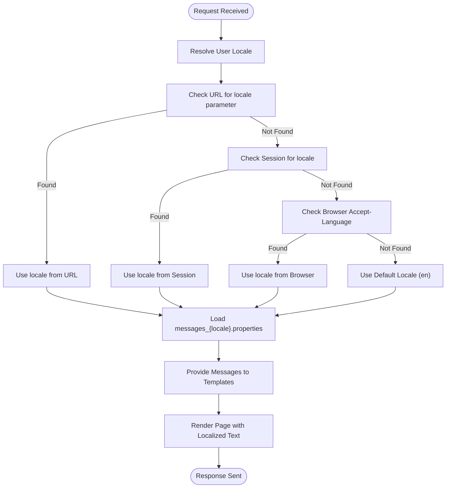
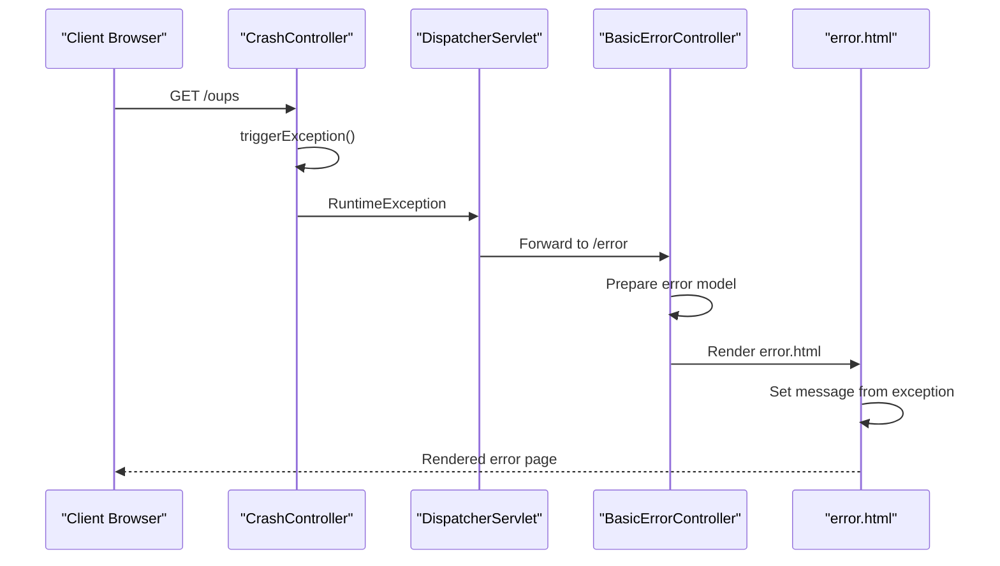

# Cross-Cutting Concerns

<cite>
**Referenced Files in This Document**   
- [CacheConfiguration.java](file://src/main/java/org/springframework/samples/petclinic/system/CacheConfiguration.java)
- [VetRepository.java](file://src/main/java/org/springframework/samples/petclinic/vet/VetRepository.java)
- [VetController.java](file://src/main/java/org/springframework/samples/petclinic/vet/VetController.java)
- [error.html](file://src/main/resources/templates/error.html)
- [CrashController.java](file://src/main/java/org/springframework/samples/petclinic/system/CrashController.java)
- [messages.properties](file://src/main/resources/messages/messages.properties)
- [messages_de.properties](file://src/main/resources/messages/messages_de.properties)
- [application.properties](file://src/main/resources/application.properties)
</cite>

## Table of Contents
1. [Introduction](#introduction)
2. [Caching Implementation](#caching-implementation)
3. [Internationalization Strategy](#internationalization-strategy)
4. [Error Handling Mechanism](#error-handling-mechanism)
5. [Separation of Concerns](#separation-of-concerns)
6. [Best Practices and Monitoring](#best-practices-and-monitoring)
7. [Conclusion](#conclusion)

## Introduction
This document provides comprehensive architectural documentation for the cross-cutting concerns implemented in the Spring PetClinic application. The analysis focuses on three critical aspects: caching for performance optimization, internationalization for multi-language support, and error handling for robust application resilience. These concerns are implemented using Spring Framework features that allow them to be applied across the application without polluting business logic with infrastructure code. The documentation examines how these concerns are configured and applied, with specific examples from the codebase.

## Caching Implementation

The Spring PetClinic application implements caching through JCache (JSR-107) with Spring's caching abstraction, specifically targeting veterinarian data to improve performance. The caching mechanism is configured in the `CacheConfiguration` class, which creates a cache named "vets" using JCacheManagerCustomizer. This configuration enables statistics collection for monitoring cache performance through JMX.

The caching is applied at the repository layer through the `@Cacheable` annotation on the `VetRepository` interface methods. Both the `findAll()` and `findAll(Pageable)` methods are annotated with `@Cacheable("vets")`, ensuring that the results of these queries are cached and subsequent calls return data from the cache rather than hitting the database. This implementation follows the principle of caching at the data access layer, which provides maximum benefit by preventing redundant database queries.

**Diagram sources**
- [CacheConfiguration.java](file://src/main/java/org/springframework/samples/petclinic/system/CacheConfiguration.java#L30-L52)
- [VetRepository.java](file://src/main/java/org/springframework/samples/petclinic/vet/VetRepository.java#L43-L55)

**Section sources**
- [CacheConfiguration.java](file://src/main/java/org/springframework/samples/petclinic/system/CacheConfiguration.java#L30-L52)
- [VetRepository.java](file://src/main/java/org/springframework/samples/petclinic/vet/VetRepository.java#L43-L55)

## Internationalization Strategy

The application implements internationalization through Spring's message resource bundle mechanism, supporting multiple languages including English, German, Spanish, Persian, Korean, Portuguese, Russian, and Turkish. The configuration is specified in `application.properties` with the property `spring.messages.basename=messages/messages`, which tells Spring to look for message files in the `messages` directory with the base name "messages".

The application uses a series of properties files following the naming convention `messages_{language}.properties`, where each file contains localized versions of the same keys. For example, the key "welcome" has different translations in each language file: "Welcome" in English, "Willkommen" in German, and so on. This approach allows the application to automatically select the appropriate language based on the user's locale.

The internationalization system works by resolving the user's locale through Spring's locale resolution mechanism, which can be configured to use various strategies such as URL parameters, session attributes, or browser settings. Once the locale is determined, Spring automatically loads the corresponding message bundle and provides the translated text to the application components, particularly the Thymeleaf templates which use the messages for UI text.

**Diagram sources**
- [application.properties](file://src/main/resources/application.properties#L20)
- [messages.properties](file://src/main/resources/messages/messages.properties#L1-L8)
- [messages_de.properties](file://src/main/resources/messages/messages_de.properties#L1-L9)

**Section sources**
- [application.properties](file://src/main/resources/application.properties#L20)
- [messages.properties](file://src/main/resources/messages/messages.properties#L1-L8)
- [messages_de.properties](file://src/main/resources/messages/messages_de.properties#L1-L9)

## Error Handling Mechanism

The Spring PetClinic application implements a comprehensive error handling mechanism through a combination of a custom error page template and exception management in controllers. The primary error handling component is the `error.html` template located in the resources directory, which serves as the global error page for the application.

When an unhandled exception occurs, Spring Boot's error handling mechanism automatically redirects to this error page, passing the exception details through the model. The template displays a user-friendly message along with the actual exception message, providing both a good user experience and useful debugging information. The error page uses Thymeleaf's expression language (`th:text="${message}"`) to display the exception message, demonstrating how the error handling integrates with the templating system.

The `CrashController` class provides a specific endpoint `/oups` that deliberately throws a RuntimeException, serving as a test case for the error handling mechanism. This controller demonstrates how exceptions propagate through the Spring MVC framework and are ultimately handled by the global error page. The application's error handling follows the principle of centralized exception management, where most exceptions are handled by the default Spring Boot error handling rather than individual controller-level exception handlers.

**Diagram sources**
- [CrashController.java](file://src/main/java/org/springframework/samples/petclinic/system/CrashController.java#L27-L36)
- [error.html](file://src/main/resources/templates/error.html#L1-L10)

**Section sources**
- [CrashController.java](file://src/main/java/org/springframework/samples/petclinic/system/CrashController.java#L27-L36)
- [error.html](file://src/main/resources/templates/error.html#L1-L10)

## Separation of Concerns

The Spring PetClinic application demonstrates excellent separation of cross-cutting concerns from business logic through the strategic use of Spring Framework features. Each concern is implemented in a dedicated component that can be applied across the application without modifying the core business logic.

Caching is implemented through declarative annotations (`@Cacheable`) and configuration classes, allowing the caching behavior to be defined separately from the data access logic. This approach means that the `VetRepository` interface can focus solely on its primary responsibility of data access, while the caching behavior is added through configuration and annotations.

Internationalization is handled through external message bundles and Spring's message resolution mechanism, keeping language-specific text separate from the application code. Controllers and services work with message keys rather than hardcoded text, and the actual translation is resolved at runtime based on the user's locale. This separation allows new languages to be added simply by creating new properties files without modifying any Java code.

Error handling is centralized through the global error page mechanism, eliminating the need for try-catch blocks and error handling code in individual controllers. The `CrashController` demonstrates how exceptions can be allowed to propagate to the framework-level error handler, keeping the controller code focused on its primary functionality.

This clean separation of concerns makes the application more maintainable, as changes to one concern (such as adding a new language or modifying cache settings) can be made without affecting the implementation of other concerns or the core business logic.

## Best Practices and Monitoring

The implementation of cross-cutting concerns in Spring PetClinic follows several best practices that can be extended to other applications. For caching, the application enables statistics collection through the JCache configuration, which allows monitoring of cache performance metrics such as hit rate, miss rate, and eviction count. These metrics can be exposed through Spring Boot Actuator endpoints for real-time monitoring.

To extend the caching functionality, additional cache regions can be defined for other frequently accessed data, such as owner or pet information. Cache eviction policies and size limits can be configured through the JCache implementation-specific configuration, allowing fine-tuning of cache behavior based on application requirements.

For internationalization, the application can be extended by adding new language properties files following the same naming convention. Message keys should be kept consistent across all language files, and new keys should be added to all existing files to maintain completeness. The locale resolution strategy can be customized by implementing a custom LocaleResolver if more sophisticated locale detection is needed.

The error handling mechanism can be enhanced by implementing specific exception handlers for particular exception types using Spring's `@ExceptionHandler` annotation. This allows for more granular error handling while still maintaining the global fallback to the error page. Additional monitoring can be implemented by logging exceptions and tracking error rates through application metrics.

Effectiveness of these cross-cutting concerns can be monitored through various means: cache statistics through JMX or Actuator endpoints, language usage statistics by tracking locale requests, and error rates by monitoring the frequency of error page visits. These metrics provide valuable insights into application performance and user experience.

## Conclusion

The Spring PetClinic application provides an excellent example of how cross-cutting concerns can be implemented effectively in a Spring application. The caching, internationalization, and error handling mechanisms are implemented in a way that maintains clean separation from business logic, making the application more maintainable and extensible. By using Spring Framework features such as declarative caching, message bundles, and global error handling, the application achieves robust functionality without compromising code clarity. These patterns can serve as a reference for implementing similar concerns in other Spring applications, demonstrating best practices for creating maintainable and scalable enterprise applications.