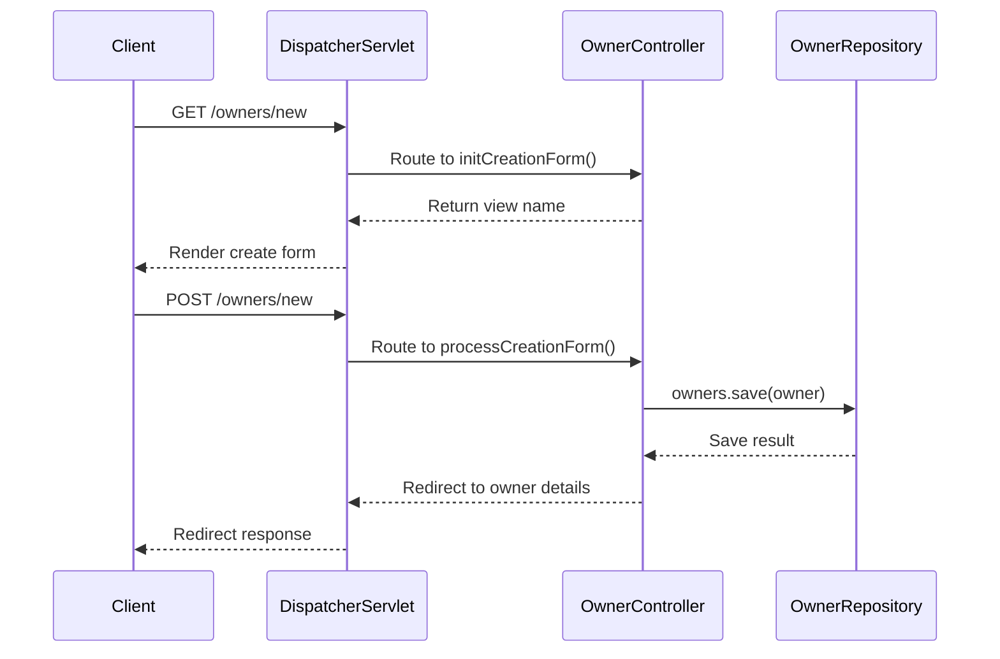

# Design Patterns

<cite>
**Referenced Files in This Document**   
- [OwnerRepository.java](file://src/main/java/org/springframework/samples/petclinic/owner/OwnerRepository.java)
- [VetRepository.java](file://src/main/java/org/springframework/samples/petclinic/vet/VetRepository.java)
- [OwnerController.java](file://src/main/java/org/springframework/samples/petclinic/owner/OwnerController.java)
- [VetController.java](file://src/main/java/org/springframework/samples/petclinic/vet/VetController.java)
- [CacheConfiguration.java](file://src/main/java/org/springframework/samples/petclinic/system/CacheConfiguration.java)
- [PetTypeFormatter.java](file://src/main/java/org/springframework/samples/petclinic/owner/PetTypeFormatter.java)
</cite>

## Table of Contents
1. [Repository Pattern Implementation](#repository-pattern-implementation)
2. [Dependency Injection Pattern](#dependency-injection-pattern)
3. [Caching Pattern](#caching-pattern)
4. [Template Pattern in Spring MVC](#template-pattern-in-spring-mvc)
5. [Pattern Integration and Benefits](#pattern-integration-and-benefits)

## Repository Pattern Implementation

The Spring PetClinic application implements the Repository Pattern through Spring Data JPA interfaces to abstract database access and provide a clean separation between data access logic and business logic. The `OwnerRepository` and `VetRepository` interfaces extend Spring Data JPA repository interfaces, enabling automatic implementation of CRUD operations and query methods.

The `OwnerRepository` interface extends `JpaRepository<Owner, Integer>`, providing standard CRUD operations and pagination support. It defines several query methods including `findByLastNameStartingWith` for searching owners by last name with pagination, `findById` for retrieving an owner by ID with optional handling, and `findPetTypes` for retrieving all pet types ordered by name. These methods use Spring Data JPA's method name convention and custom JPQL queries to automatically generate the appropriate SQL queries.

Similarly, the `VetRepository` interface extends the `Repository<Vet, Integer>` marker interface and defines methods for retrieving veterinarians. It includes `findAll()` methods that return collections of vets with transactional read-only semantics. The repository abstraction allows controllers and services to interact with data without concerning themselves with database connectivity, transaction management, or SQL query construction.

**Section sources**
- [OwnerRepository.java](file://src/main/java/org/springframework/samples/petclinic/owner/OwnerRepository.java#L38-L76)
- [VetRepository.java](file://src/main/java/org/springframework/samples/petclinic/vet/VetRepository.java#L37-L57)

## Dependency Injection Pattern

The Spring PetClinic application extensively uses constructor injection, a form of dependency injection that promotes immutability and ensures required dependencies are provided at object creation. This pattern is implemented across controller classes, making dependencies explicit and improving testability.

The `OwnerController` class demonstrates constructor injection by declaring a private final `OwnerRepository` field and injecting it through the constructor. This approach ensures that the repository dependency cannot be null and cannot be changed after initialization, making the controller's dependencies clear and the object state immutable. The same pattern is applied in `PetController`, `VisitController`, and `VetController`, each injecting their respective repository dependencies.

This implementation of dependency injection enhances code modularity by decoupling components from their dependencies. It also improves testability, as demonstrated in the test classes where mock repositories can be easily injected during testing. For example, in `OwnerControllerTests`, a mock `OwnerRepository` is injected using the `@MockitoBean` annotation, allowing for isolated unit testing of controller logic without requiring a real database connection.

**Section sources**
- [OwnerController.java](file://src/main/java/org/springframework/samples/petclinic/owner/OwnerController.java#L52-L54)
- [PetController.java](file://src/main/java/org/springframework/samples/petclinic/owner/PetController.java#L50-L52)
- [VisitController.java](file://src/main/java/org/springframework/samples/petclinic/owner/VisitController.java#L45-L47)
- [VetController.java](file://src/main/java/org/springframework/samples/petclinic/vet/VetController.java#L39-L41)
- [PetTypeFormatter.java](file://src/main/java/org/springframework/samples/petclinic/owner/PetTypeFormatter.java#L40-L43)

## Caching Pattern

The Spring PetClinic implements the Caching Pattern using Spring's caching abstraction with JCache (JSR-107) to improve application performance by reducing database load for frequently accessed data. The caching mechanism is specifically applied to veterinarian data, which is relatively static and frequently accessed throughout the application.

The `VetRepository` interface uses the `@Cacheable("vets")` annotation on its `findAll()` methods, indicating that the results should be cached in a cache named "vets". This annotation ensures that subsequent calls to retrieve all veterinarians will serve data from the cache rather than querying the database, significantly improving response times for operations that display veterinarian lists.

The cache configuration is defined in the `CacheConfiguration` class, which is annotated with `@Configuration` and `@EnableCaching`. This class provides a `JCacheManagerCustomizer` bean that creates and configures the "vets" cache with statistics enabled. The configuration creates the cache programmatically using the JCache API, setting up the cache with specific properties such as enabling statistics collection, which can be monitored via JMX.

This caching implementation demonstrates a strategic approach to performance optimization, focusing on data that benefits most from caching while maintaining data consistency through proper cache management.

```mermaid
classDiagram
class CacheConfiguration {
+JCacheManagerCustomizer petclinicCacheConfigurationCustomizer()
-Configuration<Object, Object> cacheConfiguration()
}
class VetRepository {
+Collection<Vet> findAll()
+Page<Vet> findAll(Pageable)
}
class VetController {
-VetRepository vetRepository
}
CacheConfiguration --> VetRepository : "configures"
VetRepository --> VetController : "used by"
VetRepository ..> "vets" : @Cacheable
```

**Diagram sources **
- [CacheConfiguration.java](file://src/main/java/org/springframework/samples/petclinic/system/CacheConfiguration.java#L30-L52)
- [VetRepository.java](file://src/main/java/org/springframework/samples/petclinic/vet/VetRepository.java#L37-L57)
- [VetController.java](file://src/main/java/org/springframework/samples/petclinic/vet/VetController.java#L37-L77)

**Section sources**
- [VetRepository.java](file://src/main/java/org/springframework/samples/petclinic/vet/VetRepository.java#L43-L45)
- [VetRepository.java](file://src/main/java/org/springframework/samples/petclinic/vet/VetRepository.java#L53-L55)
- [CacheConfiguration.java](file://src/main/java/org/springframework/samples/petclinic/system/CacheConfiguration.java#L34-L37)

## Template Pattern in Spring MVC

The Spring PetClinic application leverages the Template Pattern through Spring MVC annotations to define a consistent structure for web request handling while allowing flexibility in implementation details. This pattern is evident in the use of `@Controller` and `@RequestMapping` annotations across the application's controller classes.

The `@Controller` annotation serves as a stereotype that marks classes as Spring MVC controllers, participating in the component scanning process and enabling them to handle web requests. This annotation provides a template for how controllers should be structured within the Spring framework, ensuring consistent behavior across all controller implementations.

The `@RequestMapping` annotation and its specialized variants (`@GetMapping`, `@PostMapping`) define URL mapping templates that specify how HTTP requests should be routed to specific handler methods. For example, the `OwnerController` uses `@GetMapping("/owners/new")` to map GET requests to the `initCreationForm` method, while `@PostMapping("/owners/new")` maps POST requests to the `processCreationForm` method. This templating approach creates a predictable URL structure and request handling pattern throughout the application.

Additional templating features include `@ModelAttribute` for binding form data to model objects, `@PathVariable` for extracting values from URL paths, and `@RequestParam` for handling query parameters. These annotations work together to create a comprehensive template for handling web requests, reducing boilerplate code and ensuring consistent data binding and validation across the application.



**Diagram sources **
- [OwnerController.java](file://src/main/java/org/springframework/samples/petclinic/owner/OwnerController.java#L45-L172)
- [OwnerRepository.java](file://src/main/java/org/springframework/samples/petclinic/owner/OwnerRepository.java#L38-L76)

**Section sources**
- [OwnerController.java](file://src/main/java/org/springframework/samples/petclinic/owner/OwnerController.java#L69-L72)
- [OwnerController.java](file://src/main/java/org/springframework/samples/petclinic/owner/OwnerController.java#L74-L84)
- [OwnerController.java](file://src/main/java/org/springframework/samples/petclinic/owner/OwnerController.java#L86-L89)
- [OwnerController.java](file://src/main/java/org/springframework/samples/petclinic/owner/OwnerController.java#L91-L115)

## Pattern Integration and Benefits

The integration of these design patterns in Spring PetClinic creates a cohesive architecture that enhances code modularity, testability, and performance. The Repository Pattern provides a clean abstraction layer for data access, allowing business logic to remain independent of database implementation details. This separation enables easier maintenance and potential database migration without affecting the rest of the application.

The Dependency Injection pattern, implemented through constructor injection, promotes loose coupling between components. This modularity allows for easy replacement of implementations and facilitates unit testing by enabling the injection of mock dependencies. The immutability provided by constructor injection also contributes to thread safety and reduces the potential for null pointer exceptions.

The Caching Pattern significantly improves application performance by reducing database load for frequently accessed static data. By caching veterinarian information, the application can serve this data quickly from memory rather than executing database queries on each request. This optimization is particularly beneficial for read-heavy operations and improves the overall user experience.

Finally, the Template Pattern in Spring MVC establishes a consistent structure for request handling across the application. This consistency reduces cognitive load for developers working on different parts of the application and ensures predictable behavior for common operations like form submission, data retrieval, and error handling.

Together, these patterns create a robust, maintainable, and high-performing application architecture that demonstrates effective use of Spring Framework features to solve common software engineering challenges.

**Section sources**
- [OwnerRepository.java](file://src/main/java/org/springframework/samples/petclinic/owner/OwnerRepository.java#L38-L76)
- [VetRepository.java](file://src/main/java/org/springframework/samples/petclinic/vet/VetRepository.java#L37-L57)
- [OwnerController.java](file://src/main/java/org/springframework/samples/petclinic/owner/OwnerController.java#L45-L172)
- [VetController.java](file://src/main/java/org/springframework/samples/petclinic/vet/VetController.java#L34-L77)
- [CacheConfiguration.java](file://src/main/java/org/springframework/samples/petclinic/system/CacheConfiguration.java#L30-L52)