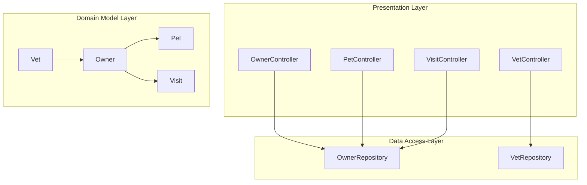
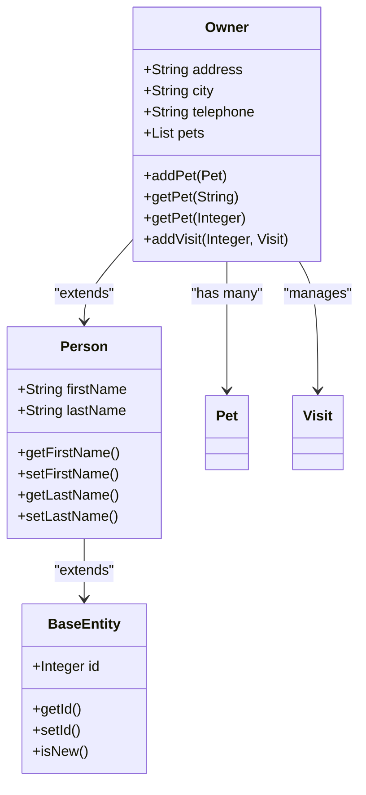
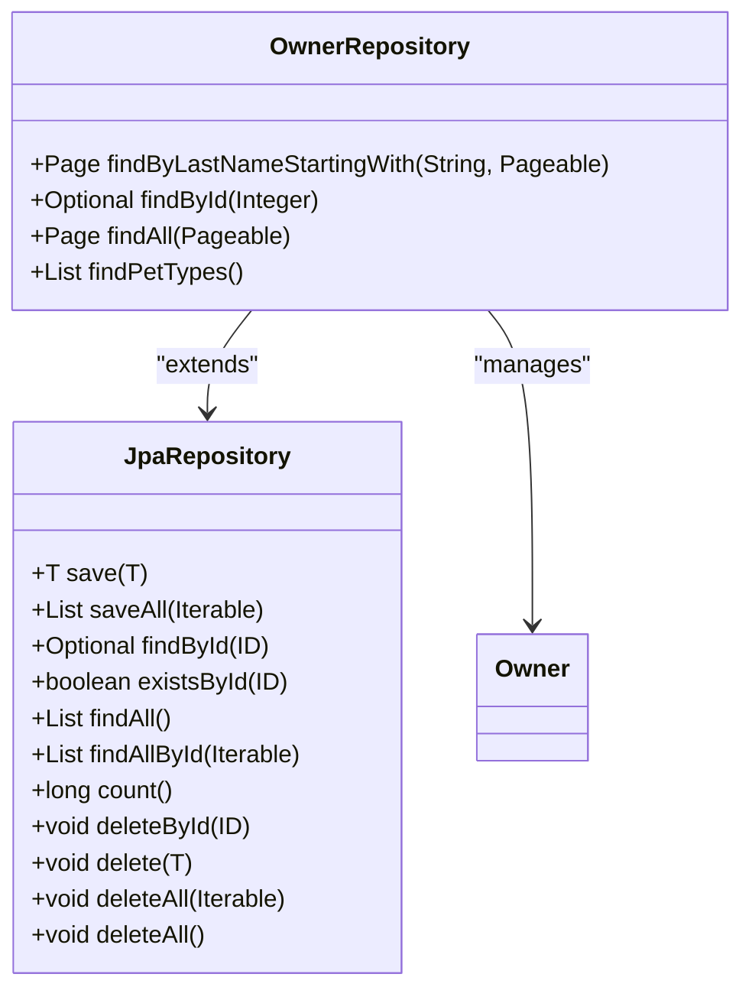
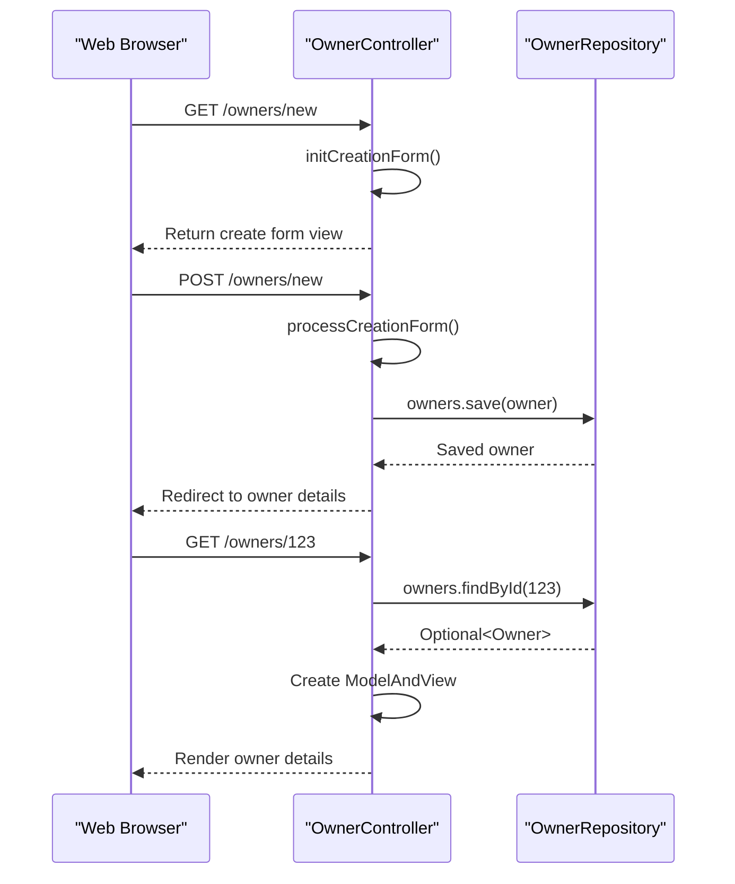
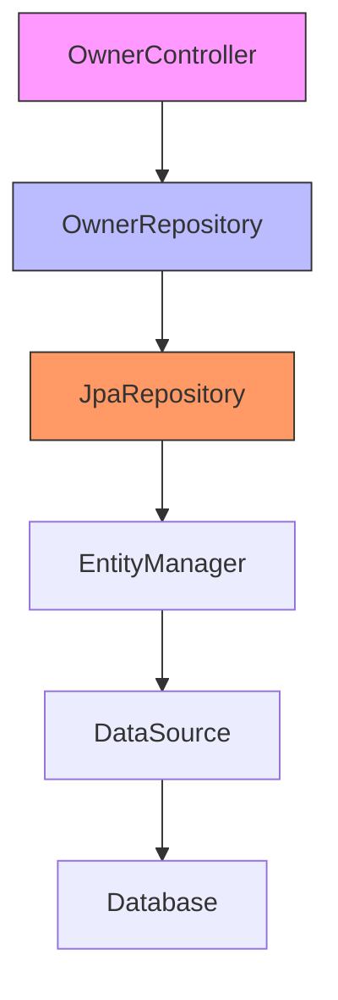
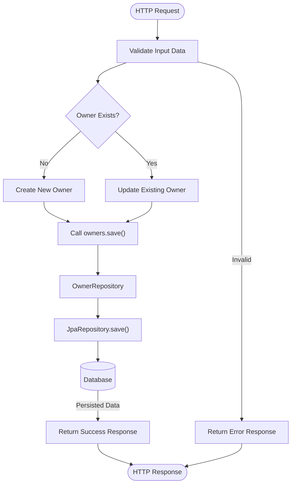

# Layered Architecture

<cite>
**Referenced Files in This Document**   
- [OwnerController.java](file://src/main/java/org/springframework/samples/petclinic/owner/OwnerController.java)
- [OwnerRepository.java](file://src/main/java/org/springframework/samples/petclinic/owner/OwnerRepository.java)
- [Owner.java](file://src/main/java/org/springframework/samples/petclinic/owner/Owner.java)
- [Person.java](file://src/main/java/org/springframework/samples/petclinic/model/Person.java)
- [BaseEntity.java](file://src/main/java/org/springframework/samples/petclinic/model/BaseEntity.java)
- [PetController.java](file://src/main/java/org/springframework/samples/petclinic/owner/PetController.java)
- [VisitController.java](file://src/main/java/org/springframework/samples/petclinic/owner/VisitController.java)
- [VetController.java](file://src/main/java/org/springframework/samples/petclinic/vet/VetController.java)
</cite>

## Table of Contents
1. [Introduction](#introduction)
2. [Layered Architecture Overview](#layered-architecture-overview)
3. [Domain Model Layer](#domain-model-layer)
4. [Data Access Layer](#data-access-layer)
5. [Presentation Layer](#presentation-layer)
6. [Dependency Injection and Component Wiring](#dependency-injection-and-component-wiring)
7. [Service-to-Repository Interaction](#service-to-repository-interaction)
8. [Separation of Concerns and Business Logic Placement](#separation-of-concerns-and-business-logic-placement)
9. [Transaction Management](#transaction-management)
10. [Testability and Maintainability](#testability-and-maintainability)
11. [Conclusion](#conclusion)

## Introduction
The Spring PetClinic application demonstrates a well-structured layered architecture that follows Spring Framework best practices. This document analyzes the separation between presentation, data access, and domain model layers, focusing on the OwnerController and OwnerRepository components. The architecture promotes clean separation of concerns, testability, and maintainability through proper layering and dependency management.

## Layered Architecture Overview

The Spring PetClinic application implements a classic three-tier architecture with clear separation between presentation, business/service, and data access layers. Although the application doesn't have explicit service classes for all entities (relying on controllers to directly call repositories), the architectural boundaries are well-defined.

**Diagram sources**
- [OwnerController.java](file://src/main/java/org/springframework/samples/petclinic/owner/OwnerController.java)
- [OwnerRepository.java](file://src/main/java/org/springframework/samples/petclinic/owner/OwnerRepository.java)
- [Owner.java](file://src/main/java/org/springframework/samples/petclinic/owner/Owner.java)

**Section sources**
- [OwnerController.java](file://src/main/java/org/springframework/samples/petclinic/owner/OwnerController.java)
- [OwnerRepository.java](file://src/main/java/org/springframework/samples/petclinic/owner/OwnerRepository.java)

## Domain Model Layer

The domain model layer consists of entity classes that represent the core business concepts of the application. These classes are annotated with JPA annotations to define their persistence characteristics and relationships.

The `Owner` entity extends `Person`, which in turn extends `BaseEntity`, establishing an inheritance hierarchy that promotes code reuse. The `Owner` class contains business-relevant properties such as address, city, and telephone, along with a collection of associated `Pet` entities.

**Diagram sources**
- [Owner.java](file://src/main/java/org/springframework/samples/petclinic/owner/Owner.java#L38-L175)
- [Person.java](file://src/main/java/org/springframework/samples/petclinic/model/Person.java#L25-L54)
- [BaseEntity.java](file://src/main/java/org/springframework/samples/petclinic/model/BaseEntity.java#L25-L51)

**Section sources**
- [Owner.java](file://src/main/java/org/springframework/samples/petclinic/owner/Owner.java)
- [Person.java](file://src/main/java/org/springframework/samples/petclinic/model/Person.java)
- [BaseEntity.java](file://src/main/java/org/springframework/samples/petclinic/model/BaseEntity.java)

## Data Access Layer

The data access layer is implemented using Spring Data JPA repositories, which provide a high-level abstraction over database operations. The `OwnerRepository` interface extends `JpaRepository<Owner, Integer>`, inheriting a comprehensive set of CRUD operations without requiring explicit implementation.

This approach leverages Spring Data JPA's method name parsing to automatically generate query implementations based on method signatures. Custom query methods like `findByLastNameStartingWith` and `findPetTypes` are defined with appropriate annotations to specify their SQL behavior.

**Diagram sources**
- [OwnerRepository.java](file://src/main/java/org/springframework/samples/petclinic/owner/OwnerRepository.java#L38-L76)
- [JpaRepository.java](file://org/springframework/data/jpa/repository/JpaRepository.java)

**Section sources**
- [OwnerRepository.java](file://src/main/java/org/springframework/samples/petclinic/owner/OwnerRepository.java)

## Presentation Layer

The presentation layer consists of Spring MVC controllers that handle HTTP requests and responses. The `OwnerController` class is annotated with `@Controller`, making it a Spring-managed bean that can handle web requests.

The controller defines various request mapping methods for different HTTP operations (GET, POST) and URL patterns. It uses Spring MVC features like `@ModelAttribute`, `@InitBinder`, and `RedirectAttributes` to manage form data, validation, and redirects.

**Diagram sources**
- [OwnerController.java](file://src/main/java/org/springframework/samples/petclinic/owner/OwnerController.java#L45-L172)
- [OwnerRepository.java](file://src/main/java/org/springframework/samples/petclinic/owner/OwnerRepository.java#L38-L76)

**Section sources**
- [OwnerController.java](file://src/main/java/org/springframework/samples/petclinic/owner/OwnerController.java)

## Dependency Injection and Component Wiring

The Spring PetClinic application uses constructor-based dependency injection to wire components across layers. The `OwnerController` receives an instance of `OwnerRepository` through its constructor, establishing a dependency from the presentation layer to the data access layer.

This approach promotes immutability and makes dependencies explicit, improving code clarity and testability. Spring's component scanning and auto-configuration automatically detect and wire these components at runtime.

**Diagram sources**
- [OwnerController.java](file://src/main/java/org/springframework/samples/petclinic/owner/OwnerController.java#L52-L54)
- [OwnerRepository.java](file://src/main/java/org/springframework/samples/petclinic/owner/OwnerRepository.java#L38-L76)

**Section sources**
- [OwnerController.java](file://src/main/java/org/springframework/samples/petclinic/owner/OwnerController.java)
- [OwnerRepository.java](file://src/main/java/org/springframework/samples/petclinic/owner/OwnerRepository.java)

## Service-to-Repository Interaction

The interaction between the `OwnerController` and `OwnerRepository` demonstrates the flow of data operations through the layered architecture. When creating a new owner, the controller validates the input and delegates to the repository's `save` method, which handles the persistence operation.

For retrieval operations, the controller calls repository methods like `findById` and `findByLastNameStartingWith`, which return `Optional` and `Page` objects respectively, allowing the controller to handle cases where data may not exist or needs to be paginated.

**Diagram sources**
- [OwnerController.java](file://src/main/java/org/springframework/samples/petclinic/owner/OwnerController.java)
- [OwnerRepository.java](file://src/main/java/org/springframework/samples/petclinic/owner/OwnerRepository.java)

**Section sources**
- [OwnerController.java](file://src/main/java/org/springframework/samples/petclinic/owner/OwnerController.java)
- [OwnerRepository.java](file://src/main/java/org/springframework/samples/petclinic/owner/OwnerRepository.java)

## Separation of Concerns and Business Logic Placement

The layered architecture enforces a clear separation of concerns, with each layer having distinct responsibilities. The domain model layer contains entity definitions and basic business rules, the data access layer handles persistence operations, and the presentation layer manages HTTP request/response cycles.

Business logic is primarily located in the domain model classes (like `Owner`) and controllers. For example, the `Owner` class contains methods for managing pets and visits, while the `OwnerController` handles form validation and workflow logic.

This separation allows for easier maintenance and testing, as changes to one layer typically don't affect others. However, the application could benefit from introducing explicit service classes to further separate business logic from presentation concerns.

**Section sources**
- [Owner.java](file://src/main/java/org/springframework/samples/petclinic/owner/Owner.java)
- [OwnerController.java](file://src/main/java/org/springframework/samples/petclinic/owner/OwnerController.java)

## Transaction Management

Transaction management in Spring PetClinic is handled implicitly through Spring Data JPA. When repository methods are called, Spring automatically manages transactions, ensuring data consistency.

The `save` operations in `OwnerController` are transactional by default, meaning that if any part of the persistence operation fails, the entire transaction is rolled back. This prevents partial updates that could leave the database in an inconsistent state.

While the application doesn't explicitly configure transaction boundaries, the default behavior of Spring Data JPA repositories provides adequate transaction management for the current use cases. For more complex scenarios, explicit `@Transactional` annotations could be added to service methods.

**Section sources**
- [OwnerRepository.java](file://src/main/java/org/springframework/samples/petclinic/owner/OwnerRepository.java)
- [OwnerController.java](file://src/main/java/org/springframework/samples/petclinic/owner/OwnerController.java)

## Testability and Maintainability

The layered architecture significantly enhances testability and maintainability. Each layer can be tested independently using appropriate testing strategies:

- Domain model classes can be unit tested for business logic
- Repository interfaces can be tested with integration tests that verify database interactions
- Controllers can be tested with mock repositories to isolate presentation logic

The use of interfaces and dependency injection makes it easy to substitute implementations during testing. For example, a mock `OwnerRepository` can be injected into `OwnerController` for unit testing without requiring a database connection.

This separation also improves maintainability by localizing changes. Modifications to the user interface don't affect data access code, and changes to database schema can be isolated to repository and entity classes.

**Section sources**
- [OwnerController.java](file://src/main/java/org/springframework/samples/petclinic/owner/OwnerController.java)
- [OwnerRepository.java](file://src/main/java/org/springframework/samples/petclinic/owner/OwnerRepository.java)
- [Owner.java](file://src/main/java/org/springframework/samples/petclinic/owner/Owner.java)

## Conclusion

The Spring PetClinic application demonstrates a well-structured layered architecture that effectively separates concerns between presentation, data access, and domain model layers. The use of Spring Data JPA repositories provides a clean abstraction for data operations, while constructor-based dependency injection ensures proper component wiring.

The `OwnerController` and `OwnerRepository` components illustrate how controllers depend on repositories for data operations, with repositories extending `JpaRepository` to inherit CRUD functionality. This design promotes testability, maintainability, and separation of concerns.

While the architecture could be further refined by introducing explicit service classes to separate business logic from presentation concerns, the current structure provides a solid foundation that follows Spring Framework best practices and enables efficient development and testing.