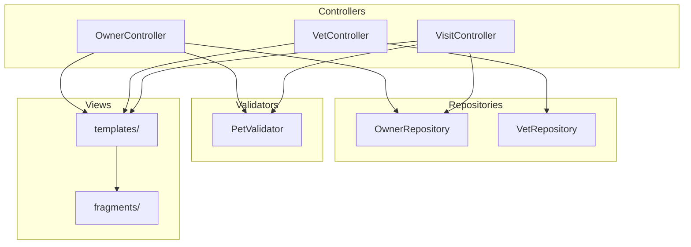
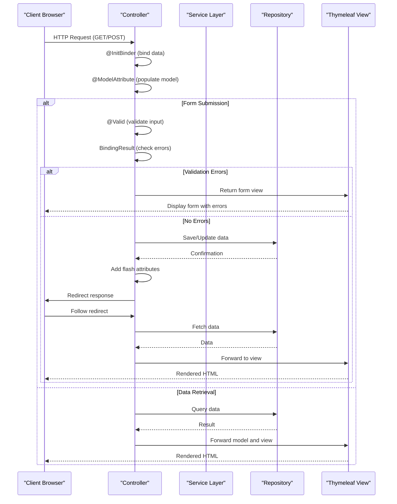
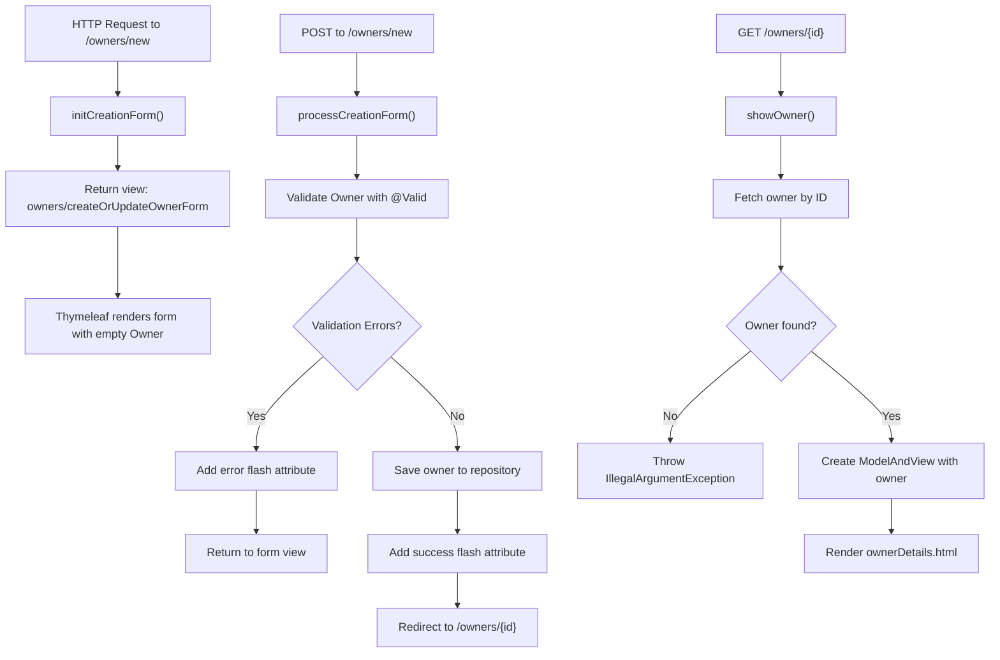
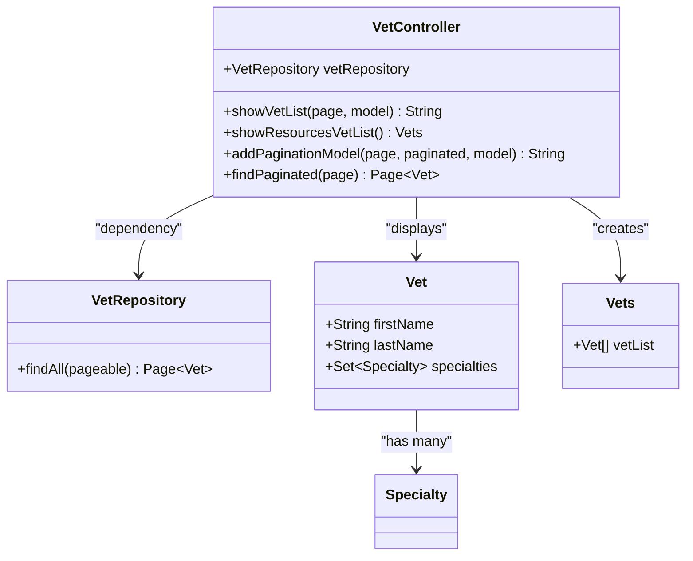
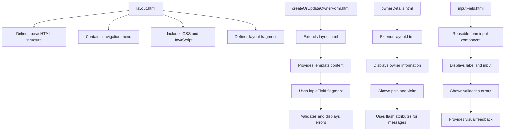
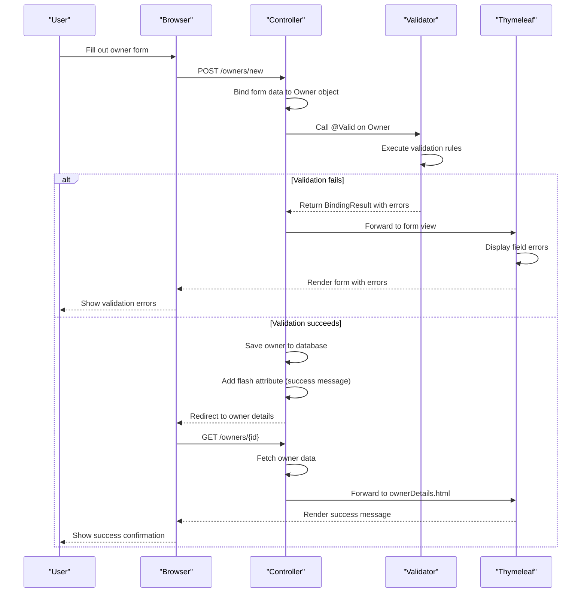

# MVC Architecture

<cite>
**Referenced Files in This Document**   
- [OwnerController.java](file://src/main/java/org/springframework/samples/petclinic/owner/OwnerController.java)
- [VetController.java](file://src/main/java/org/springframework/samples/petclinic/vet/VetController.java)
- [VisitController.java](file://src/main/java/org/springframework/samples/petclinic/owner/VisitController.java)
- [PetValidator.java](file://src/main/java/org/springframework/samples/petclinic/owner/PetValidator.java)
- [OwnerRepository.java](file://src/main/java/org/springframework/samples/petclinic/owner/OwnerRepository.java)
- [VetRepository.java](file://src/main/java/org/springframework/samples/petclinic/vet/VetRepository.java)
- [layout.html](file://src/main/resources/templates/fragments/layout.html)
- [createOrUpdateOwnerForm.html](file://src/main/resources/templates/owners/createOrUpdateOwnerForm.html)
- [ownerDetails.html](file://src/main/resources/templates/owners/ownerDetails.html)
- [vetList.html](file://src/main/resources/templates/vets/vetList.html)
- [inputField.html](file://src/main/resources/templates/fragments/inputField.html)
- [createOrUpdateVisitForm.html](file://src/main/resources/templates/pets/createOrUpdateVisitForm.html)
</cite>

## Table of Contents
1. [Introduction](#introduction)
2. [Project Structure](#project-structure)
3. [Core Components](#core-components)
4. [Architecture Overview](#architecture-overview)
5. [Detailed Component Analysis](#detailed-component-analysis)
6. [Dependency Analysis](#dependency-analysis)
7. [Performance Considerations](#performance-considerations)
8. [Troubleshooting Guide](#troubleshooting-guide)
9. [Conclusion](#conclusion)

## Introduction
This document provides comprehensive architectural documentation for the Model-View-Controller (MVC) implementation in Spring PetClinic. It explains how controllers handle HTTP requests, bind form data, and interact with the model layer. The document details the role of Thymeleaf templates in the view layer, including template inheritance and fragment usage. It covers the complete flow from request mapping to model population and view rendering, with specific examples of form handling, model attribute binding, and redirect patterns.

## Project Structure



**Diagram sources**
- [OwnerController.java](file://src/main/java/org/springframework/samples/petclinic/owner/OwnerController.java)
- [VetController.java](file://src/main/java/org/springframework/samples/petclinic/vet/VetController.java)
- [VisitController.java](file://src/main/java/org/springframework/samples/petclinic/owner/VisitController.java)
- [OwnerRepository.java](file://src/main/java/org/springframework/samples/petclinic/owner/OwnerRepository.java)
- [VetRepository.java](file://src/main/java/org/springframework/samples/petclinic/vet/VetRepository.java)
- [PetValidator.java](file://src/main/java/org/springframework/samples/petclinic/owner/PetValidator.java)
- [layout.html](file://src/main/resources/templates/fragments/layout.html)

**Section sources**
- [OwnerController.java](file://src/main/java/org/springframework/samples/petclinic/owner/OwnerController.java)
- [VetController.java](file://src/main/java/org/springframework/samples/petclinic/vet/VetController.java)
- [VisitController.java](file://src/main/java/org/springframework/samples/petclinic/owner/VisitController.java)

## Core Components

The Spring PetClinic application implements a clean MVC architecture with well-defined separation of concerns. The core components include controller classes that handle HTTP requests, repository interfaces for data access, validator classes for form validation, and Thymeleaf templates for view rendering. Controllers use Spring MVC annotations to map HTTP requests to specific handler methods, bind form data to model objects, and manage the flow between different views.

**Section sources**
- [OwnerController.java](file://src/main/java/org/springframework/samples/petclinic/owner/OwnerController.java)
- [VetController.java](file://src/main/java/org/springframework/samples/petclinic/vet/VetController.java)
- [VisitController.java](file://src/main/java/org/springframework/samples/petclinic/owner/VisitController.java)

## Architecture Overview



**Diagram sources**
- [OwnerController.java](file://src/main/java/org/springframework/samples/petclinic/owner/OwnerController.java)
- [VetController.java](file://src/main/java/org/springframework/samples/petclinic/vet/VetController.java)
- [VisitController.java](file://src/main/java/org/springframework/samples/petclinic/owner/VisitController.java)

## Detailed Component Analysis

### OwnerController Analysis

The OwnerController class handles all HTTP requests related to owner management in the PetClinic application. It implements several key MVC patterns including request mapping, form data binding, model population, and view resolution. The controller uses various Spring MVC annotations to define its behavior and interaction with the model and view layers.



**Diagram sources**
- [OwnerController.java](file://src/main/java/org/springframework/samples/petclinic/owner/OwnerController.java)
- [createOrUpdateOwnerForm.html](file://src/main/resources/templates/owners/createOrUpdateOwnerForm.html)
- [ownerDetails.html](file://src/main/resources/templates/owners/ownerDetails.html)

**Section sources**
- [OwnerController.java](file://src/main/java/org/springframework/samples/petclinic/owner/OwnerController.java)

### VetController Analysis

The VetController manages the display of veterinarian information in the PetClinic application. It implements pagination for large datasets and provides both HTML and JSON endpoints for different client needs. The controller demonstrates how Spring MVC can serve multiple content types from similar data sources.



**Diagram sources**
- [VetController.java](file://src/main/java/org/springframework/samples/petclinic/vet/VetController.java)
- [VetRepository.java](file://src/main/java/org/springframework/samples/petclinic/vet/VetRepository.java)
- [vetList.html](file://src/main/resources/templates/vets/vetList.html)

**Section sources**
- [VetController.java](file://src/main/java/org/springframework/samples/petclinic/vet/VetController.java)

### View Layer Analysis

The view layer in Spring PetClinic is implemented using Thymeleaf templates with a focus on reusability and consistency. The application uses template layout and fragment inclusion to maintain a uniform look and feel across all pages while reducing code duplication.



**Diagram sources**
- [layout.html](file://src/main/resources/templates/fragments/layout.html)
- [createOrUpdateOwnerForm.html](file://src/main/resources/templates/owners/createOrUpdateOwnerForm.html)
- [ownerDetails.html](file://src/main/resources/templates/owners/ownerDetails.html)
- [inputField.html](file://src/main/resources/templates/fragments/inputField.html)

**Section sources**
- [layout.html](file://src/main/resources/templates/fragments/layout.html)
- [createOrUpdateOwnerForm.html](file://src/main/resources/templates/owners/createOrUpdateOwnerForm.html)
- [ownerDetails.html](file://src/main/resources/templates/owners/ownerDetails.html)

### Form Handling and Validation

The application implements a robust form handling and validation system that ensures data integrity while providing clear feedback to users. Validation occurs on both the server side and is properly communicated to the view layer.



**Diagram sources**
- [OwnerController.java](file://src/main/java/org/springframework/samples/petclinic/owner/OwnerController.java)
- [PetValidator.java](file://src/main/java/org/springframework/samples/petclinic/owner/PetValidator.java)
- [createOrUpdateOwnerForm.html](file://src/main/resources/templates/owners/createOrUpdateOwnerForm.html)
- [ownerDetails.html](file://src/main/resources/templates/owners/ownerDetails.html)

**Section sources**
- [OwnerController.java](file://src/main/java/org/springframework/samples/petclinic/owner/OwnerController.java)
- [PetValidator.java](file://src/main/java/org/springframework/samples/petclinic/owner/PetValidator.java)

## Dependency Analysis

```mermaid
graph TD
OwnerController --> OwnerRepository
VisitController --> OwnerRepository
VetController --> VetRepository
OwnerController --> PetValidator
VisitController --> PetValidator
OwnerController --> "Thymeleaf Templates"
VetController --> "Thymeleaf Templates"
VisitController --> "Thymeleaf Templates"
"Thymeleaf Templates" --> "layout.html"
"Thymeleaf Templates" --> "inputField.html"
"Thymeleaf Templates" --> "selectField.html"
style OwnerController fill:#f9f,stroke:#333
style VetController fill:#f9f,stroke:#333
style VisitController fill:#f9f,stroke:#333
style OwnerRepository fill:#bbf,stroke:#333
style VetRepository fill:#bbf,stroke:#333
style PetValidator fill:#f96,stroke:#333
style "Thymeleaf Templates" fill:#9f9,stroke:#333
style "layout.html" fill:#9f9,stroke:#333
style "inputField.html" fill:#9f9,stroke:#333
style "selectField.html" fill:#9f9,stroke:#333
```

**Diagram sources**
- [OwnerController.java](file://src/main/java/org/springframework/samples/petclinic/owner/OwnerController.java)
- [VetController.java](file://src/main/java/org/springframework/samples/petclinic/vet/VetController.java)
- [VisitController.java](file://src/main/java/org/springframework/samples/petclinic/owner/VisitController.java)
- [OwnerRepository.java](file://src/main/java/org/springframework/samples/petclinic/owner/OwnerRepository.java)
- [VetRepository.java](file://src/main/java/org/springframework/samples/petclinic/vet/VetRepository.java)
- [PetValidator.java](file://src/main/java/org/springframework/samples/petclinic/owner/PetValidator.java)
- [layout.html](file://src/main/resources/templates/fragments/layout.html)
- [inputField.html](file://src/main/resources/templates/fragments/inputField.html)
- [selectField.html](file://src/main/resources/templates/fragments/selectField.html)

**Section sources**
- [OwnerController.java](file://src/main/java/org/springframework/samples/petclinic/owner/OwnerController.java)
- [VetController.java](file://src/main/java/org/springframework/samples/petclinic/vet/VetController.java)
- [VisitController.java](file://src/main/java/org/springframework/samples/petclinic/owner/VisitController.java)
- [OwnerRepository.java](file://src/main/java/org/springframework/samples/petclinic/owner/OwnerRepository.java)
- [VetRepository.java](file://src/main/java/org/springframework/samples/petclinic/vet/VetRepository.java)
- [PetValidator.java](file://src/main/java/org/springframework/samples/petclinic/owner/PetValidator.java)

## Performance Considerations
The Spring PetClinic MVC implementation includes several performance considerations. The use of pagination in both OwnerController and VetController prevents loading large datasets into memory at once. The VetRepository uses caching annotations (@Cacheable) to reduce database load for frequently accessed veterinarian data. The application uses efficient data binding and validation mechanisms that minimize processing overhead. Thymeleaf templates are compiled and cached by the framework to improve rendering performance. The separation of concerns in the MVC pattern allows for independent optimization of each layer.

## Troubleshooting Guide

When troubleshooting issues in the Spring PetClinic MVC implementation, consider the following common scenarios:

1. **Form validation errors not displaying**: Ensure that the BindingResult parameter immediately follows the @Valid object in the controller method signature.

2. **Flash attributes not persisting across redirects**: Verify that RedirectAttributes is used instead of Model for flash attributes, as Model attributes do not survive redirects.

3. **Template inheritance not working**: Check that the th:replace directive in the template correctly references the layout fragment with proper syntax.

4. **Model attributes not available in views**: Confirm that model attributes are properly added in the controller using Model.addAttribute() or through @ModelAttribute annotations.

5. **404 errors on form submission**: Ensure that the form action URL matches the @PostMapping URL pattern, including proper path variable handling.

6. **Data binding issues**: Verify that @InitBinder methods are correctly configured to allow or disallow specific fields, and that field names in the form match the model object properties.

**Section sources**
- [OwnerController.java](file://src/main/java/org/springframework/samples/petclinic/owner/OwnerController.java)
- [VisitController.java](file://src/main/java/org/springframework/samples/petclinic/owner/VisitController.java)
- [createOrUpdateOwnerForm.html](file://src/main/resources/templates/owners/createOrUpdateOwnerForm.html)
- [ownerDetails.html](file://src/main/resources/templates/owners/ownerDetails.html)

## Conclusion
The Spring PetClinic application demonstrates a well-structured MVC implementation using Spring Framework and Thymeleaf. The architecture clearly separates concerns between controllers, models, and views, following established design patterns. Controllers effectively handle HTTP requests, bind form data, validate input, and manage the flow between different views. The view layer leverages Thymeleaf's template inheritance and fragment features to create a consistent and maintainable user interface. The use of flash attributes for user feedback and proper error handling enhances the user experience. This implementation serves as a solid example of MVC architecture best practices in a Spring-based web application.