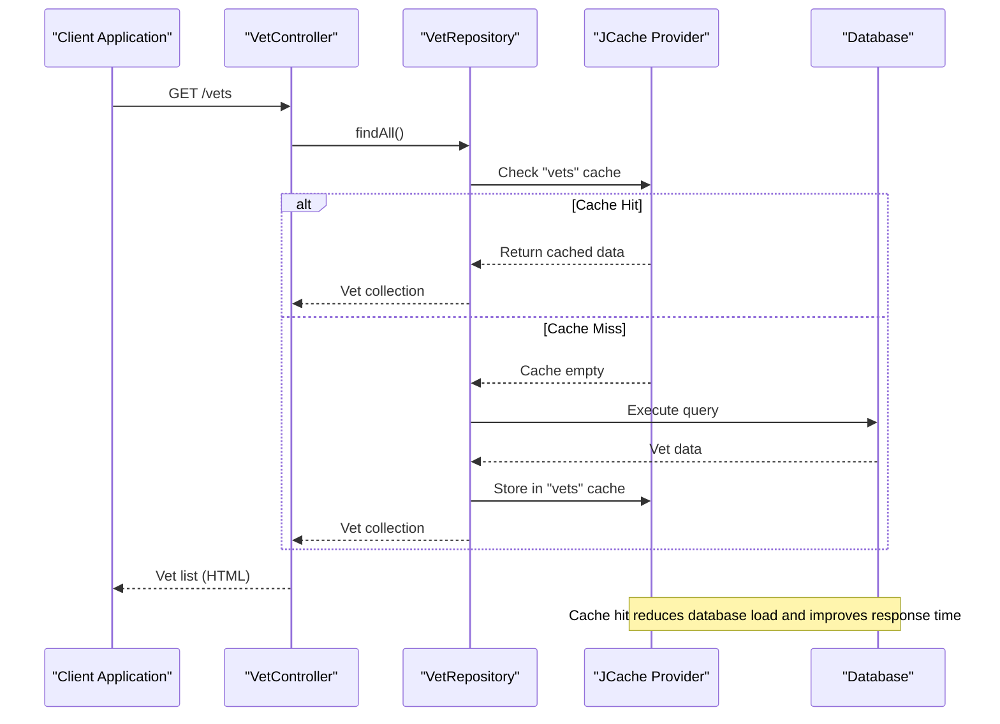
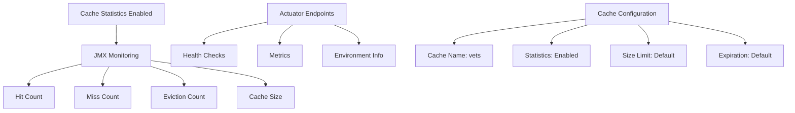

# Caching Mechanism

<cite>
**Referenced Files in This Document**   
- [CacheConfiguration.java](file://src/main/java/org/springframework/samples/petclinic/system/CacheConfiguration.java)
- [VetRepository.java](file://src/main/java/org/springframework/samples/petclinic/vet/VetRepository.java)
- [application.properties](file://src/main/resources/application.properties)
</cite>

## Table of Contents
1. [Caching Configuration](#caching-configuration)
2. [Cache Implementation Details](#cache-implementation-details)
3. [Cache Monitoring and Statistics](#cache-monitoring-and-statistics)
4. [Performance Considerations](#performance-considerations)
5. [Configuration and Tuning](#configuration-and-tuning)

## Caching Configuration

The PetClinic application implements a caching mechanism using Spring's caching abstraction with JCache (JSR-107) as the underlying provider. The caching functionality is enabled through the `@EnableCaching` annotation in the `CacheConfiguration` class, which activates Spring's annotation-driven cache management capabilities.

The cache configuration is defined in the `CacheConfiguration` class located in the system package. This configuration creates a cache named "vets" that is specifically designed to store veterinarian data. The `@Configuration` annotation marks this class as a source of bean definitions, while `@EnableCaching` enables the Spring cache annotations throughout the application.

**Section sources**
- [CacheConfiguration.java](file://src/main/java/org/springframework/samples/petclinic/system/CacheConfiguration.java#L30-L52)

## Cache Implementation Details

The caching mechanism is implemented on the `VetRepository` interface, which defines data access operations for veterinarian entities. The `@Cacheable("vets")` annotation is applied to both `findAll()` methods in the repository, ensuring that the results of these queries are cached for improved performance.

When a client requests veterinarian data, the caching mechanism follows this flow:
1. The application checks if the requested data exists in the "vets" cache
2. If a cache hit occurs, the data is returned directly from the cache
3. If a cache miss occurs, the data is retrieved from the database and stored in the cache for future requests

This implementation significantly reduces database load and improves response times for frequently accessed veterinarian data. Both the collection-based and paginated versions of the `findAll()` method are cached, ensuring consistent performance across different access patterns.

**Diagram sources**
- [VetRepository.java](file://src/main/java/org/springframework/samples/petclinic/vet/VetRepository.java#L43-L45)
- [CacheConfiguration.java](file://src/main/java/org/springframework/samples/petclinic/system/CacheConfiguration.java#L34-L37)

**Section sources**
- [VetRepository.java](file://src/main/java/org/springframework/samples/petclinic/vet/VetRepository.java#L37-L57)

## Cache Monitoring and Statistics

The application is configured to enable cache statistics, which are accessible via JMX (Java Management Extensions). The `cacheConfiguration()` method in `CacheConfiguration` sets `statisticsEnabled(true)` on the MutableConfiguration, allowing monitoring of cache performance metrics such as hit count, miss count, and eviction count.

Although the current configuration enables statistics through the JCache API, more detailed cache configuration options like size limits and expiration policies are not defined in the code. These would typically be configured through the specific JCache implementation's configuration mechanism, which is not included in the standard JCache API.

Spring Boot Actuator endpoints are enabled in the application through the `management.endpoints.web.exposure.include=*` property in `application.properties`, which exposes all available actuator endpoints. However, specific cache monitoring endpoints would depend on the JCache implementation being used and are not explicitly configured in the current setup.

**Diagram sources**
- [CacheConfiguration.java](file://src/main/java/org/springframework/samples/petclinic/system/CacheConfiguration.java#L48-L50)
- [application.properties](file://src/main/resources/application.properties#L22)

**Section sources**
- [CacheConfiguration.java](file://src/main/java/org/springframework/samples/petclinic/system/CacheConfiguration.java#L39-L52)
- [application.properties](file://src/main/resources/application.properties#L22)

## Performance Considerations

The caching implementation provides significant performance benefits by reducing database queries for frequently accessed veterinarian data. When the cache is warm (after the first request), subsequent requests for the same data are served directly from memory, resulting in faster response times and reduced database load.

However, there are several considerations to keep in mind:

**Cache Hit/Miss Behavior:**
- First request: Cache miss, data retrieved from database, stored in cache
- Subsequent requests: Cache hit, data served from cache
- Cache hit ratio improves over time as more data is cached

**Potential Issues:**
- **Stale Data**: Since no explicit eviction policy is configured, cached data may become stale if veterinarian records are updated in the database
- **Memory Usage**: The cache size is limited only by the default settings of the JCache implementation, which could lead to memory pressure in high-data-volume scenarios
- **Cache Initialization**: The cache is populated on first access (lazy loading), which means the first user experiences the full database query time

**Section sources**
- [VetRepository.java](file://src/main/java/org/springframework/samples/petclinic/vet/VetRepository.java#L43-L45)
- [CacheConfiguration.java](file://src/main/java/org/springframework/samples/petclinic/system/CacheConfiguration.java#L34-L37)

## Configuration and Tuning

The current caching configuration provides a basic setup with the "vets" cache and statistics enabled. To optimize the caching behavior for production environments, several configuration options should be considered:

**Cache Size Configuration:**
While the current implementation relies on default size limits, it would be beneficial to configure explicit size constraints based on the expected number of veterinarians and available memory resources.

**Expiration Policies:**
Implementing time-to-live (TTL) or time-to-idle (TTI) policies would help prevent stale data issues. For example, configuring a TTL of 15-30 minutes would ensure that cached data is refreshed periodically.

**Monitoring Configuration:**
The application.properties file enables all actuator endpoints, which provides access to system metrics. Additional configuration could expose specific cache metrics for easier monitoring.

**Performance Benchmarking:**
To measure caching effectiveness, consider implementing benchmarks that compare:
- Response times with cold cache vs. warm cache
- Database query counts with and without caching
- System throughput under load with caching enabled

The current implementation provides a solid foundation for caching, but additional configuration through the JCache implementation's specific configuration mechanism would allow for fine-tuning based on performance requirements and resource constraints.

**Section sources**
- [application.properties](file://src/main/resources/application.properties#L22)
- [CacheConfiguration.java](file://src/main/java/org/springframework/samples/petclinic/system/CacheConfiguration.java#L34-L37)
- [VetRepository.java](file://src/main/java/org/springframework/samples/petclinic/vet/VetRepository.java#L43-L45)