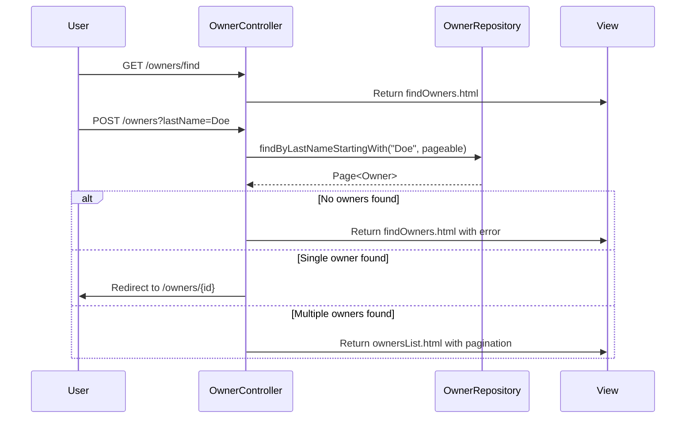
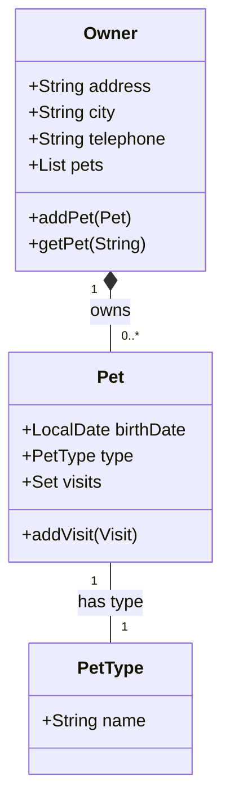
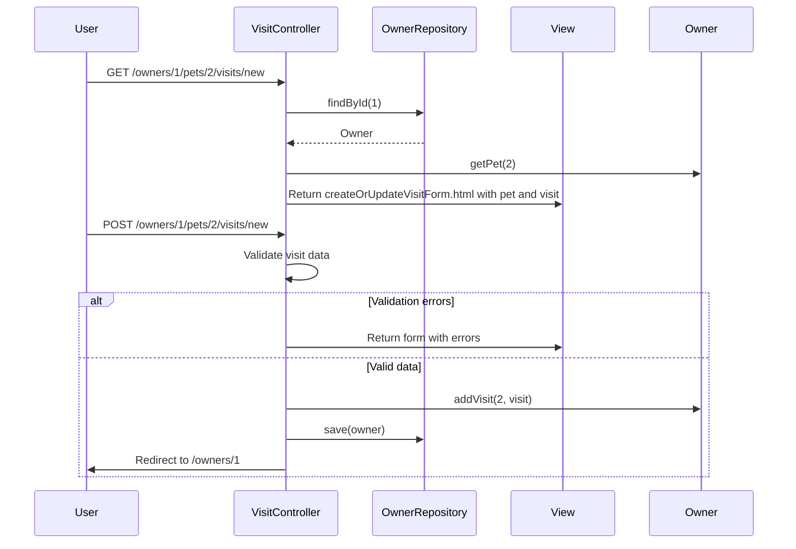
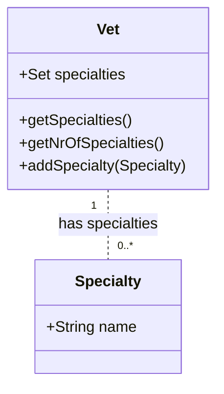
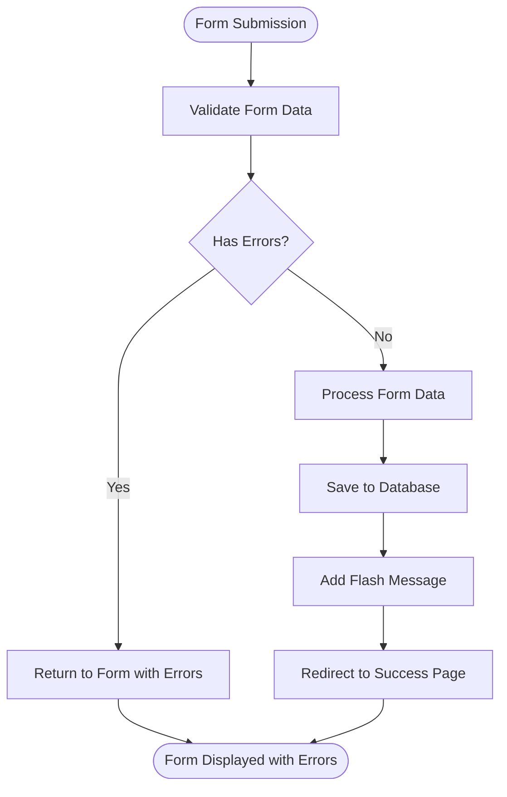
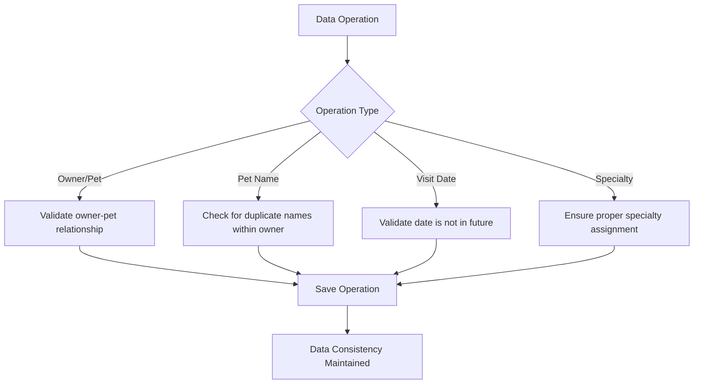

# Core Features

<cite>
**Referenced Files in This Document**   
- [OwnerController.java](file://src/main/java/org/springframework/samples/petclinic/owner/OwnerController.java)
- [PetController.java](file://src/main/java/org/springframework/samples/petclinic/owner/PetController.java)
- [VisitController.java](file://src/main/java/org/springframework/samples/petclinic/owner/VisitController.java)
- [VetController.java](file://src/main/java/org/springframework/samples/petclinic/vet/VetController.java)
- [Owner.java](file://src/main/java/org/springframework/samples/petclinic/owner/Owner.java)
- [Pet.java](file://src/main/java/org/springframework/samples/petclinic/owner/Pet.java)
- [Visit.java](file://src/main/java/org/springframework/samples/petclinic/owner/Visit.java)
- [Vet.java](file://src/main/java/org/springframework/samples/petclinic/vet/Vet.java)
- [PetValidator.java](file://src/main/java/org/springframework/samples/petclinic/owner/PetValidator.java)
- [createOrUpdateOwnerForm.html](file://src/main/resources/templates/owners/createOrUpdateOwnerForm.html)
- [ownerDetails.html](file://src/main/resources/templates/owners/ownerDetails.html)
- [createOrUpdatePetForm.html](file://src/main/resources/templates/pets/createOrUpdatePetForm.html)
- [createOrUpdateVisitForm.html](file://src/main/resources/templates/pets/createOrUpdateVisitForm.html)
- [vetList.html](file://src/main/resources/templates/vets/vetList.html)
</cite>

## Table of Contents
1. [Owner Management](#owner-management)
2. [Pet Management](#pet-management)
3. [Visit Management](#visit-management)
4. [Veterinarian Management](#veterinarian-management)
5. [Form Handling and Validation](#form-handling-and-validation)
6. [Data Consistency and Validation Issues](#data-consistency-and-validation-issues)
7. [Performance Considerations](#performance-considerations)

## Owner Management

The PetClinic application provides comprehensive CRUD operations for owner management through the `OwnerController`. Owners can be created, retrieved, updated, and searched by last name. The controller handles form submissions, validation, and redirection patterns to maintain data integrity.

The `OwnerController` exposes endpoints for creating new owners (`/owners/new`), editing existing owners (`/owners/{ownerId}/edit`), and searching owners by last name (`/owners/find`). When creating or updating an owner, the controller performs validation on required fields such as first name, last name, address, city, and telephone. The telephone field has additional validation to ensure it contains exactly 10 digits.

Search functionality allows users to find owners by last name with pagination support. When a search returns a single result, the application automatically redirects to the owner's details page. For multiple results, a paginated list is displayed with 5 owners per page. The search implementation uses a case-insensitive prefix match on the last name field.



**Diagram sources**
- [OwnerController.java](file://src/main/java/org/springframework/samples/petclinic/owner/OwnerController.java#L86-L115)
- [findOwners.html](file://src/main/resources/templates/owners/findOwners.html)
- [ownersList.html](file://src/main/resources/templates/owners/ownersList.html)

**Section sources**
- [OwnerController.java](file://src/main/java/org/springframework/samples/petclinic/owner/OwnerController.java)
- [Owner.java](file://src/main/java/org/springframework/samples/petclinic/owner/Owner.java)
- [createOrUpdateOwnerForm.html](file://src/main/resources/templates/owners/createOrUpdateOwnerForm.html)

## Pet Management

Pet management in the PetClinic application is handled through the `PetController`, which provides functionality for adding pets to owners and managing pet details. The controller operates within the context of an owner, as indicated by the `@RequestMapping("/owners/{ownerId}")` annotation, ensuring that all pet operations are owner-specific.

The pet creation process begins with the `initCreationForm` method, which initializes a new `Pet` object and adds it to the owner's collection of pets before rendering the form. When the form is submitted, the `processCreationForm` method validates the pet data, including checking for duplicate pet names within the same owner and ensuring the birth date is not in the future. The validation is enhanced by the `PetValidator` class, which implements Spring's `Validator` interface to provide custom validation logic.

Pet updates follow a similar pattern, with the `initUpdateForm` and `processUpdateForm` methods handling the retrieval and modification of existing pets. The controller ensures data consistency by validating that the pet being updated belongs to the specified owner and that the pet name is unique within that owner's collection of pets.



**Diagram sources**
- [PetController.java](file://src/main/java/org/springframework/samples/petclinic/owner/PetController.java)
- [Owner.java](file://src/main/java/org/springframework/samples/petclinic/owner/Owner.java)
- [Pet.java](file://src/main/java/org/springframework/samples/petclinic/owner/Pet.java)

**Section sources**
- [PetController.java](file://src/main/java/org/springframework/samples/petclinic/owner/PetController.java)
- [Pet.java](file://src/main/java/org/springframework/samples/petclinic/owner/Pet.java)
- [PetValidator.java](file://src/main/java/org/springframework/samples/petclinic/owner/PetValidator.java)
- [createOrUpdatePetForm.html](file://src/main/resources/templates/pets/createOrUpdatePetForm.html)

## Visit Management

Visit management in the PetClinic application allows users to schedule visits for pets and view visit history. The `VisitController` handles the creation of new visits through the `/owners/{ownerId}/pets/{petId}/visits/new` endpoint. The controller uses the `@ModelAttribute("visit")` annotation to pre-populate the visit form with a new `Visit` object that is associated with the specified pet.

The visit creation process includes validation of the visit date and description. The `Visit` class includes validation annotations such as `@NotBlank` for the description field and `@DateTimeFormat` for the date field. When a visit is created, it is automatically associated with the pet through the `addVisit` method in the `Pet` class, which adds the visit to the pet's collection of visits.

Visit history is displayed on the owner details page, where all visits for each pet are listed in chronological order. The implementation uses a sorted set with `@OrderBy("date ASC")` to ensure visits are displayed in chronological order.



**Diagram sources**
- [VisitController.java](file://src/main/java/org/springframework/samples/petclinic/owner/VisitController.java)
- [Visit.java](file://src/main/java/org/springframework/samples/petclinic/owner/Visit.java)
- [createOrUpdateVisitForm.html](file://src/main/resources/templates/pets/createOrUpdateVisitForm.html)

**Section sources**
- [VisitController.java](file://src/main/java/org/springframework/samples/petclinic/owner/VisitController.java)
- [Visit.java](file://src/main/java/org/springframework/samples/petclinic/owner/Visit.java)
- [Pet.java](file://src/main/java/org/springframework/samples/petclinic/owner/Pet.java)

## Veterinarian Management

Veterinarian management in the PetClinic application focuses on displaying a list of veterinarians with their specialties. The `VetController` provides two endpoints for retrieving veterinarian data: `/vets.html` for HTML views and `/vets` for JSON responses. Both endpoints support pagination with 5 veterinarians per page.

The veterinarian data model includes a many-to-many relationship between veterinarians and specialties, implemented using the `@ManyToMany` annotation with a join table named "vet_specialties". The `Vet` class provides methods to access specialties, including `getSpecialties()` which returns a sorted list of specialties and `getNrOfSpecialties()` which returns the count of specialties.

The controller uses caching to improve performance, with the `@Cacheable("vets")` annotation on the `findAll` method in the `VetRepository`. This ensures that repeated requests for veterinarian data are served from the cache rather than querying the database each time.



**Diagram sources**
- [VetController.java](file://src/main/java/org/springframework/samples/petclinic/vet/VetController.java)
- [Vet.java](file://src/main/java/org/springframework/samples/petclinic/vet/Vet.java)
- [vetList.html](file://src/main/resources/templates/vets/vetList.html)

**Section sources**
- [VetController.java](file://src/main/java/org/springframework/samples/petclinic/vet/VetController.java)
- [Vet.java](file://src/main/java/org/springframework/samples/petclinic/vet/Vet.java)
- [VetRepository.java](file://src/main/java/org/springframework/samples/petclinic/vet/VetRepository.java)

## Form Handling and Validation

The PetClinic application implements a robust form handling and validation system using Spring MVC's validation framework. Each form submission is processed through controller methods that use the `@Valid` annotation to trigger validation and a `BindingResult` parameter to capture validation errors.

For owner forms, validation is performed on the `Owner` class using JSR-303 annotations such as `@NotBlank` for required fields and `@Pattern` for the telephone field. The `OwnerController` uses `RedirectAttributes` to flash error and success messages between requests, providing feedback to users without storing messages in the session.

Pet forms use a custom `PetValidator` class that implements additional validation rules beyond what can be expressed with annotations. The validator checks that pet names are not empty, pet types are specified for new pets, and birth dates are provided. The validator is registered with the controller through the `@InitBinder` method, which sets the validator for the pet model attribute.

Visit forms leverage the built-in validation annotations on the `Visit` class, with the description field marked as `@NotBlank`. The controller ensures that the visit is properly associated with the correct pet and owner before saving.



**Diagram sources**
- [OwnerController.java](file://src/main/java/org/springframework/samples/petclinic/owner/OwnerController.java)
- [PetController.java](file://src/main/java/org/springframework/samples/petclinic/owner/PetController.java)
- [VisitController.java](file://src/main/java/org/springframework/samples/petclinic/owner/VisitController.java)
- [PetValidator.java](file://src/main/java/org/springframework/samples/petclinic/owner/PetValidator.java)

**Section sources**
- [OwnerController.java](file://src/main/java/org/springframework/samples/petclinic/owner/OwnerController.java)
- [PetController.java](file://src/main/java/org/springframework/samples/petclinic/owner/PetController.java)
- [VisitController.java](file://src/main/java/org/springframework/samples/petclinic/owner/VisitController.java)
- [PetValidator.java](file://src/main/java/org/springframework/samples/petclinic/owner/PetValidator.java)

## Data Consistency and Validation Issues

The PetClinic application addresses several data consistency and validation issues to maintain data integrity. One key issue is ensuring consistency between owners and their pets. The application prevents orphaned pets by requiring that all pets belong to an owner and by validating that pet operations are performed within the context of a valid owner.

For pet name uniqueness, the application checks for duplicate names within the same owner's collection of pets. This is implemented in the `PetController`'s `processCreationForm` and `processUpdateForm` methods, which use the `getPet` method to check if a pet with the same name already exists for the owner.

Visit date validation ensures that visits cannot be scheduled for dates in the future. This is implemented in the `PetController` by comparing the submitted birth date with the current date using `LocalDate.now()`. If a future date is detected, a validation error is added to the `BindingResult`.

Specialty assignment to veterinarians is handled through the `addSpecialty` method in the `Vet` class, which ensures that specialties are properly added to the internal set. The implementation uses a lazy initialization pattern in the `getSpecialtiesInternal` method to ensure the set is created when needed.



**Diagram sources**
- [Owner.java](file://src/main/java/org/springframework/samples/petclinic/owner/Owner.java)
- [PetController.java](file://src/main/java/org/springframework/samples/petclinic/owner/PetController.java)
- [VisitController.java](file://src/main/java/org/springframework/samples/petclinic/owner/VisitController.java)
- [Vet.java](file://src/main/java/org/springframework/samples/petclinic/vet/Vet.java)

**Section sources**
- [Owner.java](file://src/main/java/org/springframework/samples/petclinic/owner/Owner.java)
- [PetController.java](file://src/main/java/org/springframework/samples/petclinic/owner/PetController.java)
- [VisitController.java](file://src/main/java/org/springframework/samples/petclinic/owner/VisitController.java)
- [Vet.java](file://src/main/java/org/springframework/samples/petclinic/vet/Vet.java)

## Performance Considerations

The PetClinic application implements several performance optimizations to ensure efficient data loading and response times. The most significant optimization is the use of caching for veterinarian data, with the `@Cacheable("vets")` annotation on the `findAll` method in the `VetRepository`. This reduces database load by serving repeated requests for veterinarian data from the cache.

Pagination is used extensively throughout the application to limit the amount of data loaded at once. Both owner and veterinarian lists are paginated with 5 items per page, reducing memory usage and improving response times for large datasets. The pagination implementation uses Spring Data's `Pageable` interface and `Page` return type to efficiently retrieve only the required data from the database.

Data loading strategies are optimized through the use of fetch types in JPA annotations. The `@OneToMany` relationship between owners and pets uses `FetchType.EAGER` to load pets when an owner is retrieved, reducing the number of database queries needed to display owner details. Similarly, the `@ManyToMany` relationship between veterinarians and specialties uses `FetchType.EAGER` to load specialties with veterinarians.

The application also uses efficient query methods such as `findByLastNameStartingWith` for owner searches, which leverages database indexing for fast prefix searches. The use of `Optional` return types for findById methods helps prevent null pointer exceptions and provides a clear contract for handling missing entities.

```mermaid
graph TD
A[Performance Strategy] --> B[Caching]
A --> C[Pagination]
A --> D[Fetch Optimization]
A --> E[Efficient Queries]
B --> F["@Cacheable(\"vets\") on VetRepository"]
C --> G["Pageable with 5 items per page"]
D --> H["FetchType.EAGER for collections"]
E --> I["findByLastNameStartingWith for searches"]
F --> J[Reduced Database Load]
G --> K[Lower Memory Usage]
H --> L[Fewer Database Queries]
I --> M[Faster Search Performance]
```

**Diagram sources**
- [VetRepository.java](file://src/main/java/org/springframework/samples/petclinic/vet/VetRepository.java)
- [OwnerController.java](file://src/main/java/org/springframework/samples/petclinic/owner/OwnerController.java)
- [VetController.java](file://src/main/java/org/springframework/samples/petclinic/vet/VetController.java)
- [Owner.java](file://src/main/java/org/springframework/samples/petclinic/owner/Owner.java)

**Section sources**
- [VetRepository.java](file://src/main/java/org/springframework/samples/petclinic/vet/VetRepository.java)
- [OwnerController.java](file://src/main/java/org/springframework/samples/petclinic/owner/OwnerController.java)
- [VetController.java](file://src/main/java/org/springframework/samples/petclinic/vet/VetController.java)
- [Owner.java](file://src/main/java/org/springframework/samples/petclinic/owner/Owner.java)