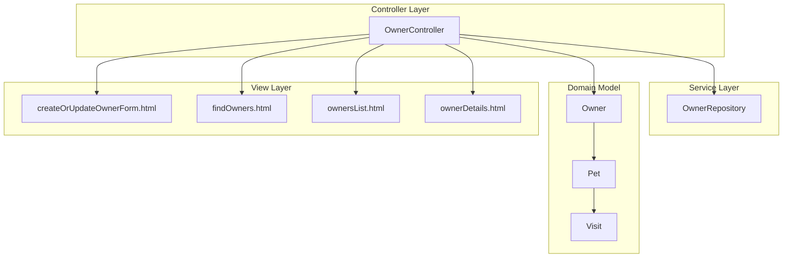
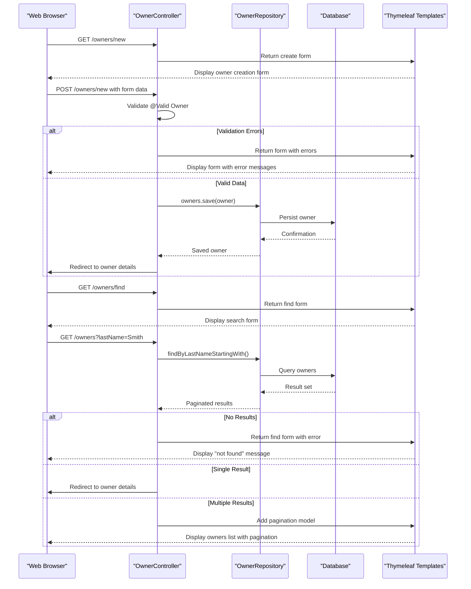
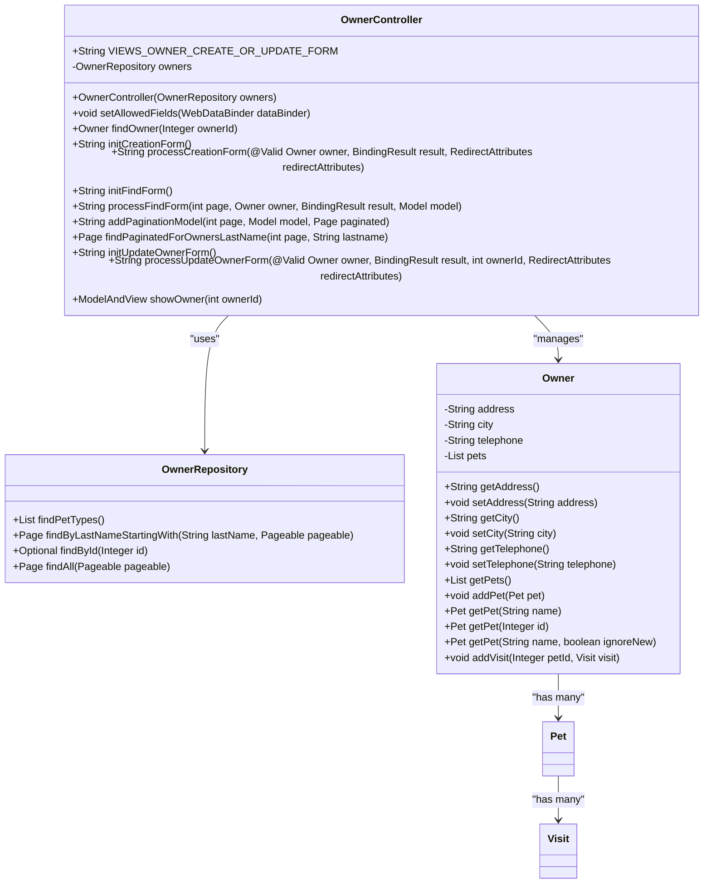
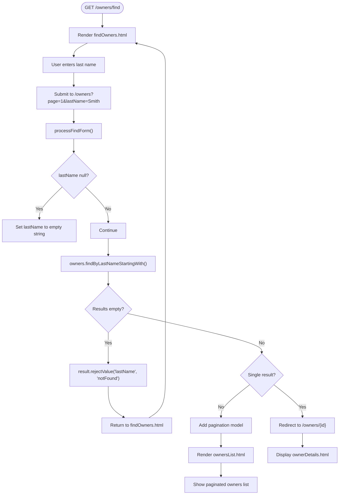
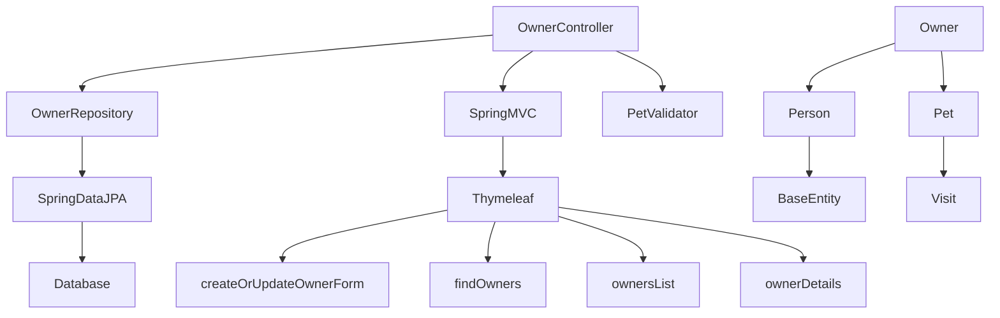

# Owner Management

<cite>
**Referenced Files in This Document**   
- [OwnerController.java](file://src/main/java/org/springframework/samples/petclinic/owner/OwnerController.java)
- [OwnerRepository.java](file://src/main/java/org/springframework/samples/petclinic/owner/OwnerRepository.java)
- [Owner.java](file://src/main/java/org/springframework/samples/petclinic/owner/Owner.java)
- [PetValidator.java](file://src/main/java/org/springframework/samples/petclinic/owner/PetValidator.java)
- [createOrUpdateOwnerForm.html](file://src/main/resources/templates/owners/createOrUpdateOwnerForm.html)
- [findOwners.html](file://src/main/resources/templates/owners/findOwners.html)
- [ownersList.html](file://src/main/resources/templates/owners/ownersList.html)
- [ownerDetails.html](file://src/main/resources/templates/owners/ownerDetails.html)
</cite>

## Table of Contents
1. [Introduction](#introduction)
2. [Project Structure](#project-structure)
3. [Core Components](#core-components)
4. [Architecture Overview](#architecture-overview)
5. [Detailed Component Analysis](#detailed-component-analysis)
6. [Dependency Analysis](#dependency-analysis)
7. [Performance Considerations](#performance-considerations)
8. [Troubleshooting Guide](#troubleshooting-guide)
9. [Conclusion](#conclusion)

## Introduction
The Owner Management feature in the Spring PetClinic application provides a comprehensive system for managing pet owners through CRUD operations. This documentation details the implementation of owner creation, retrieval, updating, and deletion through the OwnerController and OwnerRepository components. The system integrates Spring MVC for request handling, Thymeleaf for view rendering, and Spring Data JPA for database persistence. The feature supports form validation, search functionality with pagination, and proper error handling throughout the workflow.

## Project Structure
The Owner Management feature is organized within the `src/main/java/org/springframework/samples/petclinic/owner` package for Java components and `src/main/resources/templates/owners` for Thymeleaf templates. The controller layer handles HTTP requests, the repository interface manages data access, and the domain model represents owner entities with their associated pets. Templates provide the user interface for owner management operations.



**Diagram sources**
- [OwnerController.java](file://src/main/java/org/springframework/samples/petclinic/owner/OwnerController.java)
- [OwnerRepository.java](file://src/main/java/org/springframework/samples/petclinic/owner/OwnerRepository.java)
- [Owner.java](file://src/main/java/org/springframework/samples/petclinic/owner/Owner.java)
- [createOrUpdateOwnerForm.html](file://src/main/resources/templates/owners/createOrUpdateOwnerForm.html)
- [findOwners.html](file://src/main/resources/templates/owners/findOwners.html)

**Section sources**
- [OwnerController.java](file://src/main/java/org/springframework/samples/petclinic/owner/OwnerController.java)
- [OwnerRepository.java](file://src/main/java/org/springframework/samples/petclinic/owner/OwnerRepository.java)
- [Owner.java](file://src/main/java/org/springframework/samples/petclinic/owner/Owner.java)
- [createOrUpdateOwnerForm.html](file://src/main/resources/templates/owners/createOrUpdateOwnerForm.html)
- [findOwners.html](file://src/main/resources/templates/owners/findOwners.html)

## Core Components
The core components of the Owner Management feature include the OwnerController for handling HTTP requests, OwnerRepository for data persistence operations, Owner entity for representing owner data, and associated Thymeleaf templates for user interface rendering. The system follows Spring MVC patterns with controller methods mapped to specific URL endpoints, utilizing model attributes for data transfer between controller and view layers.

**Section sources**
- [OwnerController.java](file://src/main/java/org/springframework/samples/petclinic/owner/OwnerController.java)
- [OwnerRepository.java](file://src/main/java/org/springframework/samples/petclinic/owner/OwnerRepository.java)
- [Owner.java](file://src/main/java/org/springframework/samples/petclinic/owner/Owner.java)

## Architecture Overview
The Owner Management architecture follows a layered approach with clear separation of concerns. HTTP requests are handled by the OwnerController, which processes input, validates data, interacts with the OwnerRepository for data persistence, and returns appropriate views or redirects. The OwnerRepository extends JpaRepository, providing CRUD operations and custom query methods for owner data retrieval. Thymeleaf templates render the user interface, with form data bound to Owner model objects.



**Diagram sources**
- [OwnerController.java](file://src/main/java/org/springframework/samples/petclinic/owner/OwnerController.java)
- [OwnerRepository.java](file://src/main/java/org/springframework/samples/petclinic/owner/OwnerRepository.java)
- [createOrUpdateOwnerForm.html](file://src/main/resources/templates/owners/createOrUpdateOwnerForm.html)
- [findOwners.html](file://src/main/resources/templates/owners/findOwners.html)

## Detailed Component Analysis

### Owner CRUD Operations
The OwnerController implements full CRUD functionality for pet owners through specific request mappings. Creation is handled by `processCreationForm` with POST to `/owners/new`, reading form data into an Owner object annotated with `@Valid` for automatic validation. Updates are processed by `processUpdateOwnerForm` with POST to `/owners/{ownerId}/edit`, including ID validation to prevent mismatch attacks. Reading operations include `showOwner` for individual owners and `processFindForm` for search results. Deletion functionality is not explicitly shown but would typically be implemented through a DELETE mapping or form submission.



**Diagram sources**
- [OwnerController.java](file://src/main/java/org/springframework/samples/petclinic/owner/OwnerController.java#L45-L172)
- [OwnerRepository.java](file://src/main/java/org/springframework/samples/petclinic/owner/OwnerRepository.java#L38-L76)
- [Owner.java](file://src/main/java/org/springframework/samples/petclinic/owner/Owner.java#L45-L174)

**Section sources**
- [OwnerController.java](file://src/main/java/org/springframework/samples/petclinic/owner/OwnerController.java)
- [OwnerRepository.java](file://src/main/java/org/springframework/samples/petclinic/owner/OwnerRepository.java)
- [Owner.java](file://src/main/java/org/springframework/samples/petclinic/owner/Owner.java)

### Form Handling Workflow
The form handling workflow for owner creation and updates follows Spring MVC patterns with model attribute binding and validation. The `createOrUpdateOwnerForm.html` template binds to an Owner model object, with form fields for firstName, lastName, address, city, and telephone. The `@Valid` annotation triggers validation against constraints defined in the Owner entity, such as `@NotBlank` and `@Pattern` for telephone format. While PetValidator is available in the codebase, it is specifically designed for Pet validation rather than Owner forms.

```mermaid
flowchart TD
Start([Request /owners/new or /owners/{id}/edit]) --> FindOwner["@ModelAttribute findOwner()"]
FindOwner --> DisplayForm["Render createOrUpdateOwnerForm.html"]
DisplayForm --> UserInput["User enters owner details"]
UserInput --> SubmitForm["Submit form to /owners/new or /owners/{id}/edit"]
SubmitForm --> Validate["@Valid annotation triggers validation"]
Validate --> HasErrors{"Validation Errors?"}
HasErrors --> |Yes| AddErrorFlash["Add error flash attribute"]
AddErrorFlash --> ReturnForm["Return to form view"]
HasErrors --> |No| SaveOwner["owners.save(owner)"]
SaveOwner --> AddSuccessFlash["Add success flash attribute"]
AddSuccessFlash --> Redirect["Redirect to owner details"]
ReturnForm --> DisplayForm
Redirect --> ShowDetails["Display ownerDetails.html"]
```

**Diagram sources**
- [OwnerController.java](file://src/main/java/org/springframework/samples/petclinic/owner/OwnerController.java#L74-L84)
- [createOrUpdateOwnerForm.html](file://src/main/resources/templates/owners/createOrUpdateOwnerForm.html)

**Section sources**
- [OwnerController.java](file://src/main/java/org/springframework/samples/petclinic/owner/OwnerController.java)
- [createOrUpdateOwnerForm.html](file://src/main/resources/templates/owners/createOrUpdateOwnerForm.html)

### Search Functionality
The search functionality allows users to find owners by last name through the `findOwners.html` form. When submitted, the `processFindForm` method in OwnerController handles the request, using pagination with a page size of 5 results per page. The search employs `findByLastNameStartingWith` from OwnerRepository, which performs a case-insensitive prefix match. The system implements intelligent response handling: if no results are found, it returns to the search form with an error; if one result exists, it redirects directly to that owner's details; and if multiple results are found, it displays a paginated list.



**Diagram sources**
- [OwnerController.java](file://src/main/java/org/springframework/samples/petclinic/owner/OwnerController.java#L91-L115)
- [findOwners.html](file://src/main/resources/templates/owners/findOwners.html)
- [ownersList.html](file://src/main/resources/templates/owners/ownersList.html)

**Section sources**
- [OwnerController.java](file://src/main/java/org/springframework/samples/petclinic/owner/OwnerController.java)
- [findOwners.html](file://src/main/resources/templates/owners/findOwners.html)
- [ownersList.html](file://src/main/resources/templates/owners/ownersList.html)

## Dependency Analysis
The Owner Management feature has well-defined dependencies between components. The OwnerController depends on OwnerRepository for data access, which in turn depends on Spring Data JPA and the underlying database. The Owner entity depends on the Person base class for common attributes like firstName and lastName. The controller methods depend on Spring MVC components for request handling, model binding, and validation. The templates depend on the model attributes populated by the controller for data display.



**Diagram sources**
- [OwnerController.java](file://src/main/java/org/springframework/samples/petclinic/owner/OwnerController.java)
- [OwnerRepository.java](file://src/main/java/org/springframework/samples/petclinic/owner/OwnerRepository.java)
- [Owner.java](file://src/main/java/org/springframework/samples/petclinic/owner/Owner.java)
- [Person.java](file://src/main/java/org/springframework/samples/petclinic/model/Person.java)
- [BaseEntity.java](file://src/main/java/org/springframework/samples/petclinic/model/BaseEntity.java)
- [PetValidator.java](file://src/main/java/org/springframework/samples/petclinic/owner/PetValidator.java)

**Section sources**
- [OwnerController.java](file://src/main/java/org/springframework/samples/petclinic/owner/OwnerController.java)
- [OwnerRepository.java](file://src/main/java/org/springframework/samples/petclinic/owner/OwnerRepository.java)
- [Owner.java](file://src/main/java/org/springframework/samples/petclinic/owner/Owner.java)
- [Person.java](file://src/main/java/org/springframework/samples/petclinic/model/Person.java)
- [BaseEntity.java](file://src/main/java/org/springframework/samples/petclinic/model/BaseEntity.java)
- [PetValidator.java](file://src/main/java/org/springframework/samples/petclinic/owner/PetValidator.java)

## Performance Considerations
The OwnerRepository implementation includes performance optimizations through pagination, limiting results to 5 owners per page to prevent excessive database load and network transfer. The `findByLastNameStartingWith` method uses database indexing efficiently for prefix searches. However, the current implementation eagerly fetches all associated pets when retrieving an owner (`FetchType.EAGER`), which could lead to performance issues with owners having many pets. The system could benefit from query optimization, such as adding database indexes on frequently searched columns like lastName, and implementing caching strategies for frequently accessed owner data.

**Section sources**
- [OwnerRepository.java](file://src/main/java/org/springframework/samples/petclinic/owner/OwnerRepository.java)
- [Owner.java](file://src/main/java/org/springframework/samples/petclinic/owner/Owner.java)

## Troubleshooting Guide
Common issues in the Owner Management feature include form validation errors, ID mismatch errors during updates, and search results handling. Form binding errors typically occur when required fields are empty or telephone format is invalid, addressed by the validation constraints in the Owner entity. The ID mismatch protection in `processUpdateOwnerForm` prevents security issues but requires careful form design to ensure the ID is properly included. Search functionality may return unexpected results if the lastName parameter is not properly handled, particularly with null values. Database integrity constraints are enforced through JPA annotations, preventing invalid data from being persisted.

**Section sources**
- [OwnerController.java](file://src/main/java/org/springframework/samples/petclinic/owner/OwnerController.java)
- [Owner.java](file://src/main/java/org/springframework/samples/petclinic/owner/Owner.java)

## Conclusion
The Owner Management feature provides a robust implementation of CRUD operations for pet owners with proper validation, search functionality, and user interface integration. The architecture follows Spring best practices with clear separation of concerns between controller, repository, and view layers. The system handles common web application concerns including form validation, pagination, and error handling. Opportunities for improvement include optimizing the eager fetching strategy for associated pets and implementing caching for frequently accessed data. The comprehensive test coverage demonstrated in the test classes ensures the reliability of the implemented functionality.