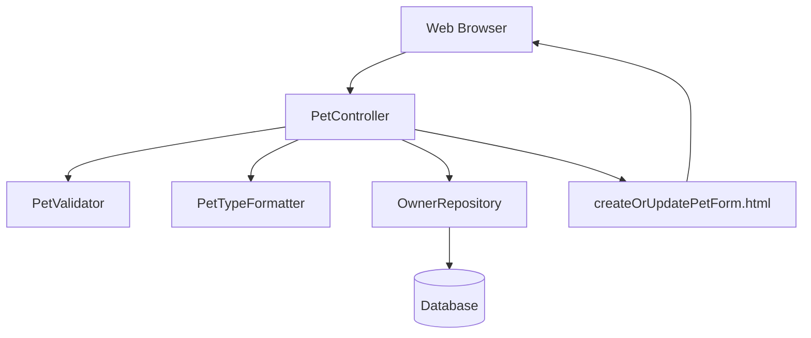
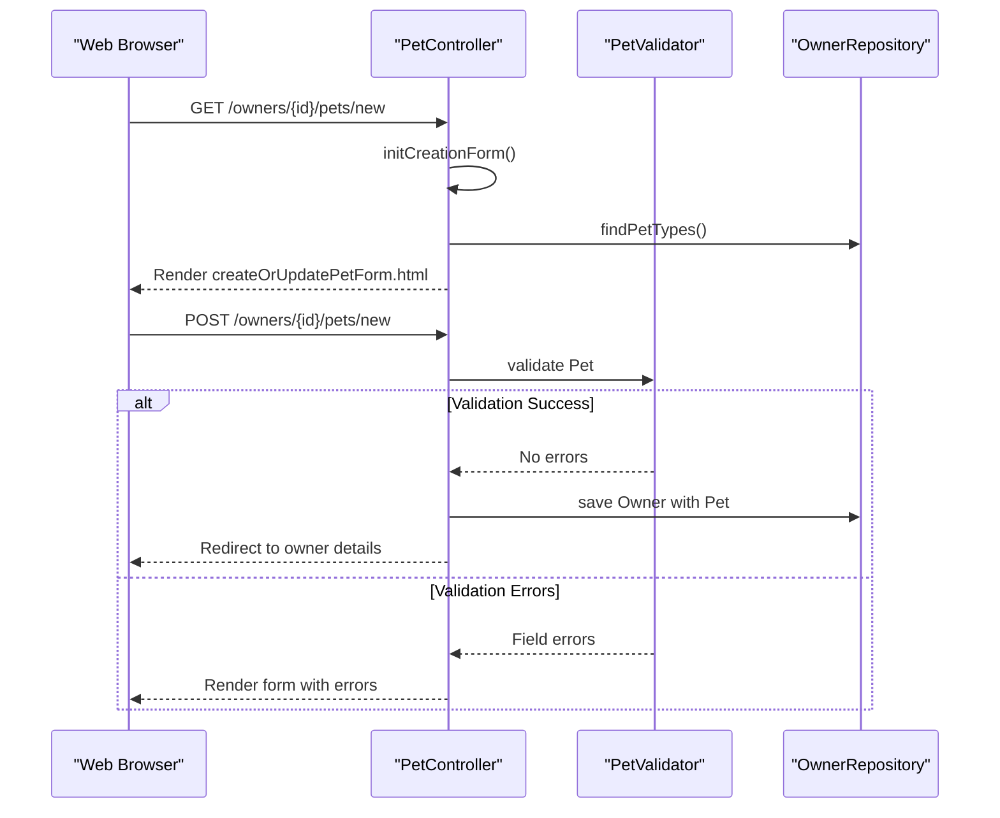
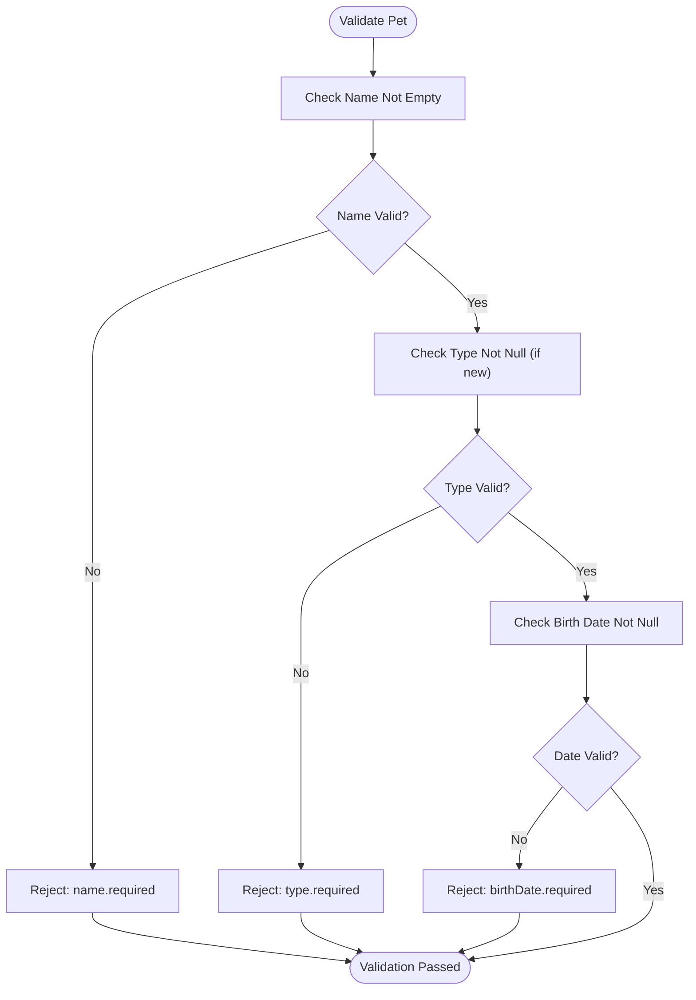
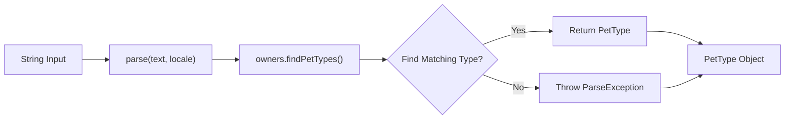
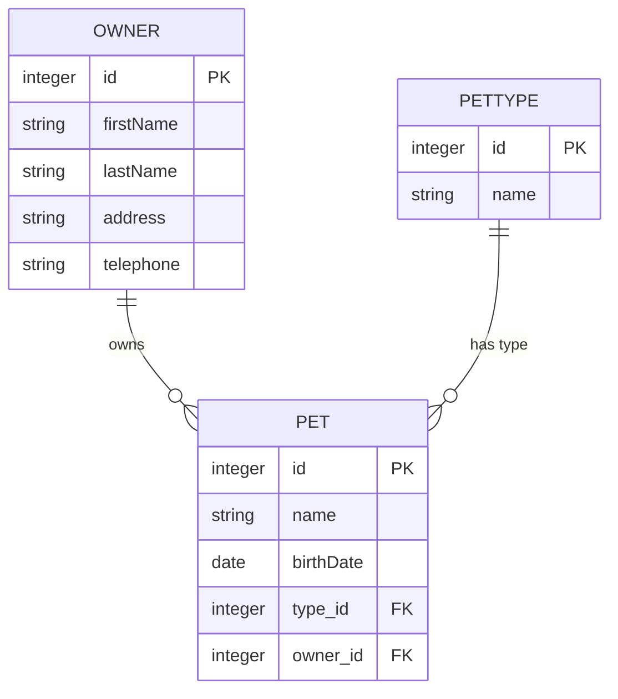
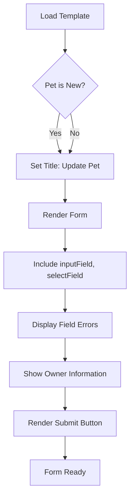
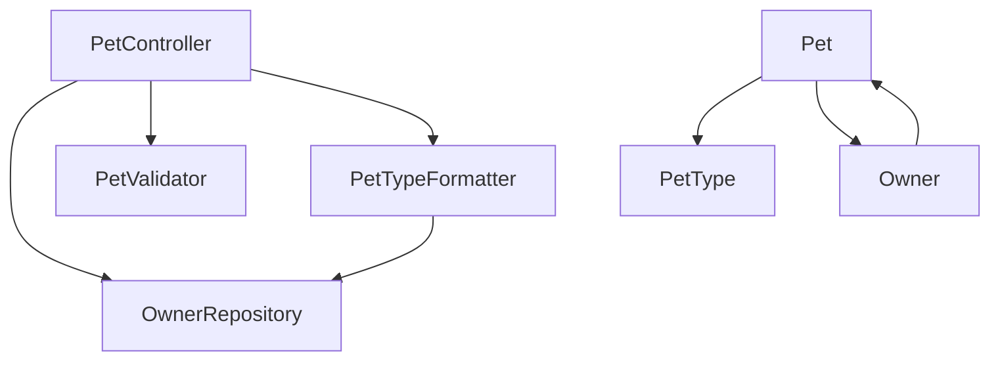

# Pet Management

<cite>
**Referenced Files in This Document**   
- [PetController.java](file://src/main/java/org/springframework/samples/petclinic/owner/PetController.java)
- [PetValidator.java](file://src/main/java/org/springframework/samples/petclinic/owner/PetValidator.java)
- [PetTypeFormatter.java](file://src/main/java/org/springframework/samples/petclinic/owner/PetTypeFormatter.java)
- [Pet.java](file://src/main/java/org/springframework/samples/petclinic/owner/Pet.java)
- [PetType.java](file://src/main/java/org/springframework/samples/petclinic/owner/PetType.java)
- [createOrUpdatePetForm.html](file://src/main/resources/templates/pets/createOrUpdatePetForm.html)
- [Owner.java](file://src/main/java/org/springframework/samples/petclinic/owner/Owner.java)
- [OwnerRepository.java](file://src/main/java/org/springframework/samples/petclinic/owner/OwnerRepository.java)
</cite>

## Table of Contents
1. [Introduction](#introduction)
2. [Core Components](#core-components)
3. [Architecture Overview](#architecture-overview)
4. [Detailed Component Analysis](#detailed-component-analysis)
5. [Dependency Analysis](#dependency-analysis)
6. [Performance Considerations](#performance-considerations)
7. [Troubleshooting Guide](#troubleshooting-guide)
8. [Conclusion](#conclusion)

## Introduction
The Pet Management feature in the Spring PetClinic application enables comprehensive handling of pet information within the context of their owners. This system supports creation, editing, and validation of pet records through a well-structured MVC architecture. The implementation leverages Spring Framework components including controllers, validators, formatters, and JPA repositories to provide a robust solution for pet data management. The feature ensures data integrity through business rule enforcement and provides a user-friendly interface for pet operations.

## Core Components

The Pet Management system consists of several key components that work together to manage pet data. The PetController handles HTTP requests and coordinates between the web layer and data access layer. PetValidator enforces business rules such as required fields and date validation. PetTypeFormatter facilitates type conversion between form inputs and domain objects. The Pet and PetType entities represent the domain model with proper JPA annotations for database persistence. The createOrUpdatePetForm.html template provides the user interface for pet operations with dynamic field rendering and error display.

**Section sources**
- [PetController.java](file://src/main/java/org/springframework/samples/petclinic/owner/PetController.java#L36-L154)
- [PetValidator.java](file://src/main/java/org/springframework/samples/petclinic/owner/PetValidator.java#L31-L63)
- [PetTypeFormatter.java](file://src/main/java/org/springframework/samples/petclinic/owner/PetTypeFormatter.java#L35-L61)
- [Pet.java](file://src/main/java/org/springframework/samples/petclinic/owner/Pet.java#L43-L84)
- [createOrUpdatePetForm.html](file://src/main/resources/templates/pets/createOrUpdatePetForm.html#L0-L38)

## Architecture Overview

The Pet Management feature follows a clean separation of concerns with distinct layers for presentation, business logic, and data access. HTTP requests are handled by the PetController which delegates to the OwnerRepository for data persistence. Validation is performed through a dedicated PetValidator component, while type conversion is managed by PetTypeFormatter. The system uses Spring Data JPA for database operations with proper entity relationships between Pet, PetType, and Owner entities.

**Diagram sources**
- [PetController.java](file://src/main/java/org/springframework/samples/petclinic/owner/PetController.java#L36-L154)
- [PetValidator.java](file://src/main/java/org/springframework/samples/petclinic/owner/PetValidator.java#L31-L63)
- [PetTypeFormatter.java](file://src/main/java/org/springframework/samples/petclinic/owner/PetTypeFormatter.java#L35-L61)
- [OwnerRepository.java](file://src/main/java/org/springframework/samples/petclinic/owner/OwnerRepository.java#L40-L76)
- [createOrUpdatePetForm.html](file://src/main/resources/templates/pets/createOrUpdatePetForm.html#L0-L38)

## Detailed Component Analysis

### PetController Analysis
The PetController is responsible for handling all HTTP requests related to pet management. It uses Spring MVC annotations to map URLs to specific methods for creating and updating pet records. The controller leverages model attributes to populate form data, including pet types and owner information. It implements both creation and update workflows with proper validation and error handling.

**Diagram sources**
- [PetController.java](file://src/main/java/org/springframework/samples/petclinic/owner/PetController.java#L86-L154)

**Section sources**
- [PetController.java](file://src/main/java/org/springframework/samples/petclinic/owner/PetController.java#L86-L154)

### PetValidator Analysis
The PetValidator component enforces business rules for pet data integrity. It implements Spring's Validator interface to provide custom validation logic that cannot be easily expressed with standard Bean Validation annotations. The validator checks for required fields including name, type (for new pets), and birth date, rejecting invalid inputs with appropriate error codes.

**Diagram sources**
- [PetValidator.java](file://src/main/java/org/springframework/samples/petclinic/owner/PetValidator.java#L31-L63)

**Section sources**
- [PetValidator.java](file://src/main/java/org/springframework/samples/petclinic/owner/PetValidator.java#L31-L63)

### PetTypeFormatter Analysis
The PetTypeFormatter handles type conversion between string representations in forms and PetType domain objects. It implements Spring's Formatter interface to provide custom parsing and printing logic. The formatter queries the OwnerRepository to retrieve available pet types and matches incoming string values to corresponding PetType instances.

**Diagram sources**
- [PetTypeFormatter.java](file://src/main/java/org/springframework/samples/petclinic/owner/PetTypeFormatter.java#L35-L61)

**Section sources**
- [PetTypeFormatter.java](file://src/main/java/org/springframework/samples/petclinic/owner/PetTypeFormatter.java#L35-L61)

### Entity Relationship Analysis
The Pet and PetType entities maintain a many-to-one relationship where multiple pets can share the same pet type. The relationship is implemented using JPA annotations with proper foreign key mapping. The Owner entity maintains a one-to-many relationship with Pet entities, representing the ownership hierarchy.

**Diagram sources**
- [Pet.java](file://src/main/java/org/springframework/samples/petclinic/owner/Pet.java#L43-L84)
- [PetType.java](file://src/main/java/org/springframework/samples/petclinic/owner/PetType.java#L25-L29)
- [Owner.java](file://src/main/java/org/springframework/samples/petclinic/owner/Owner.java#L35-L108)

**Section sources**
- [Pet.java](file://src/main/java/org/springframework/samples/petclinic/owner/Pet.java#L43-L84)
- [PetType.java](file://src/main/java/org/springframework/samples/petclinic/owner/PetType.java#L25-L29)
- [Owner.java](file://src/main/java/org/springframework/samples/petclinic/owner/Owner.java#L35-L108)

### Template Logic Analysis
The createOrUpdatePetForm.html template implements the user interface for pet management operations. It uses Thymeleaf templating to dynamically render form fields and display validation errors. The template leverages fragment inclusion for consistent input field rendering and supports both creation and update scenarios through conditional logic.

**Diagram sources**
- [createOrUpdatePetForm.html](file://src/main/resources/templates/pets/createOrUpdatePetForm.html#L0-L38)

**Section sources**
- [createOrUpdatePetForm.html](file://src/main/resources/templates/pets/createOrUpdatePetForm.html#L0-L38)

## Dependency Analysis

The Pet Management components have well-defined dependencies that follow dependency injection principles. The PetController depends on OwnerRepository for data access, while PetTypeFormatter also requires OwnerRepository to retrieve pet types. The validation and formatting components are injected into the controller through Spring's WebDataBinder mechanism. The entity relationships create dependencies between Pet, PetType, and Owner classes, with proper JPA annotations managing the persistence aspects.

**Diagram sources**
- [PetController.java](file://src/main/java/org/springframework/samples/petclinic/owner/PetController.java#L50-L52)
- [PetTypeFormatter.java](file://src/main/java/org/springframework/samples/petclinic/owner/PetTypeFormatter.java#L40-L43)
- [Pet.java](file://src/main/java/org/springframework/samples/petclinic/owner/Pet.java#L47-L84)
- [Owner.java](file://src/main/java/org/springframework/samples/petclinic/owner/Owner.java#L35-L108)

**Section sources**
- [PetController.java](file://src/main/java/org/springframework/samples/petclinic/owner/PetController.java#L50-L52)
- [PetTypeFormatter.java](file://src/main/java/org/springframework/samples/petclinic/owner/PetTypeFormatter.java#L40-L43)
- [OwnerRepository.java](file://src/main/java/org/springframework/samples/petclinic/owner/OwnerRepository.java#L40-L76)

## Performance Considerations

The Pet Management implementation includes several performance considerations. The Pet entity uses FetchType.EAGER for visits to avoid lazy loading issues, while the Owner's pets collection also uses EAGER fetching to prevent N+1 query problems when displaying owner details. The PetTypeFormatter caches pet types by retrieving them from the repository on each request, which could be optimized with application-level caching. The validation logic is implemented efficiently without expensive operations, ensuring fast response times for form submissions.

**Section sources**
- [Pet.java](file://src/main/java/org/springframework/samples/petclinic/owner/Pet.java#L47-L84)
- [Owner.java](file://src/main/java/org/springframework/samples/petclinic/owner/Owner.java#L35-L108)
- [PetTypeFormatter.java](file://src/main/java/org/springframework/samples/petclinic/owner/PetTypeFormatter.java#L55-L61)

## Troubleshooting Guide

Common issues in the Pet Management system include validation errors, type conversion problems, and referential integrity violations. Validation errors typically occur when required fields are missing or when a pet name duplicates an existing pet for the same owner. Type conversion errors happen when form inputs don't match available pet types. Referential integrity issues may arise from circular dependencies between Owner and Pet entities, though the current implementation avoids this through proper JPA configuration. Debugging should focus on the validation error messages and repository interactions to identify the root cause of issues.

**Section sources**
- [PetValidator.java](file://src/main/java/org/springframework/samples/petclinic/owner/PetValidator.java#L31-L63)
- [PetController.java](file://src/main/java/org/springframework/samples/petclinic/owner/PetController.java#L100-L130)
- [PetTypeFormatter.java](file://src/main/java/org/springframework/samples/petclinic/owner/PetTypeFormatter.java#L55-L61)

## Conclusion

The Pet Management feature provides a comprehensive solution for handling pet data within the Spring PetClinic application. Through a well-structured architecture with clear separation of concerns, the system effectively manages pet creation, editing, and validation workflows. The implementation leverages Spring Framework capabilities including MVC controllers, custom validators, formatters, and JPA repositories to create a robust and maintainable solution. The feature demonstrates best practices in web application development with proper error handling, data validation, and user interface design.