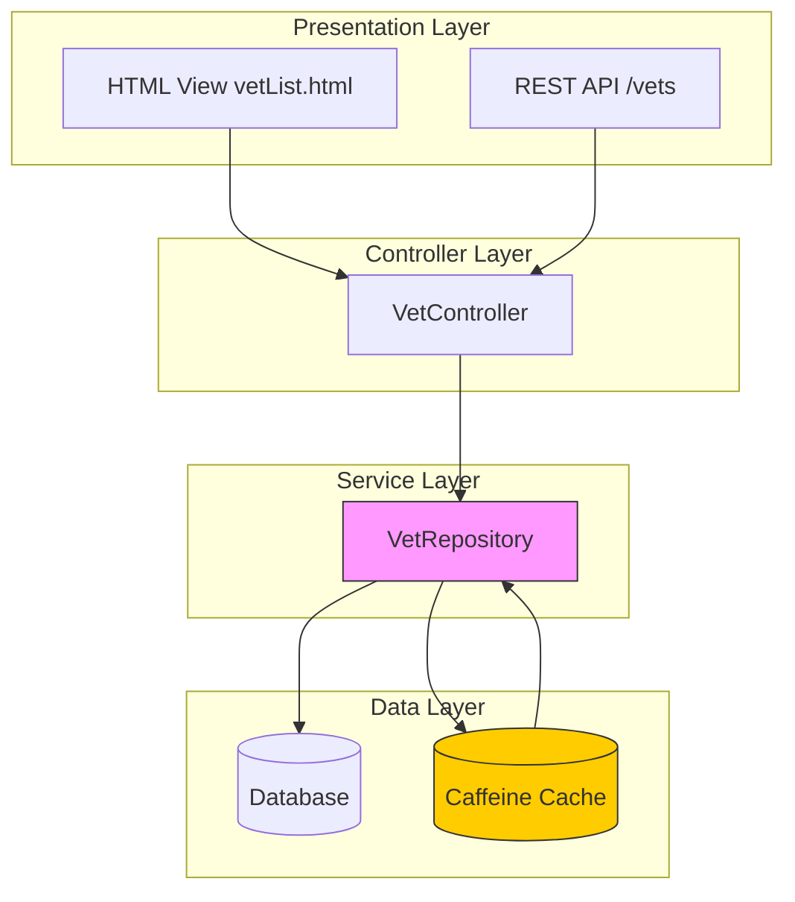
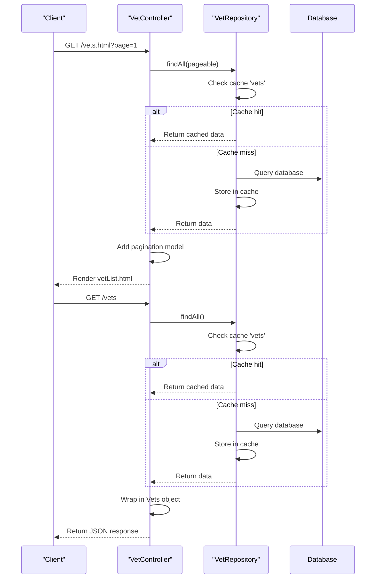
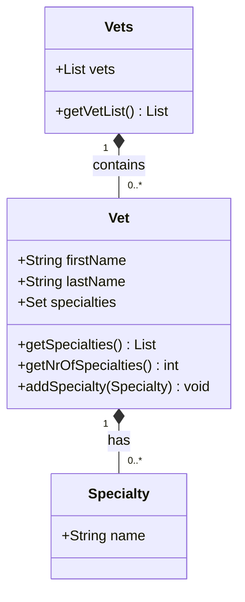
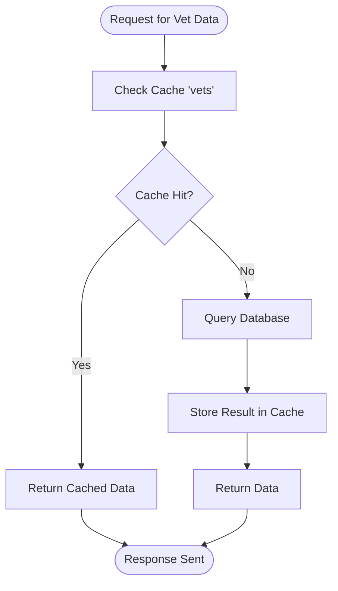

# Veterinarian Management

<cite>
**Referenced Files in This Document**   
- [VetController.java](file://src/main/java/org/springframework/samples/petclinic/vet/VetController.java)
- [VetRepository.java](file://src/main/java/org/springframework/samples/petclinic/vet/VetRepository.java)
- [Vet.java](file://src/main/java/org/springframework/samples/petclinic/vet/Vet.java)
- [Specialty.java](file://src/main/java/org/springframework/samples/petclinic/vet/Specialty.java)
- [Vets.java](file://src/main/java/org/springframework/samples/petclinic/vet/Vets.java)
- [CacheConfiguration.java](file://src/main/java/org/springframework/samples/petclinic/system/CacheConfiguration.java)
- [vetList.html](file://src/main/resources/templates/vets/vetList.html)
</cite>

## Table of Contents
1. [Introduction](#introduction)
2. [Core Components](#core-components)
3. [Architecture Overview](#architecture-overview)
4. [Detailed Component Analysis](#detailed-component-analysis)
5. [Entity Relationships](#entity-relationships)
6. [Caching Implementation](#caching-implementation)
7. [Performance Considerations](#performance-considerations)
8. [Troubleshooting Guide](#troubleshooting-guide)

## Introduction
The Veterinarian Management feature in the Spring PetClinic application provides comprehensive functionality for managing veterinarian data, including retrieval, display, and caching mechanisms. This system supports both HTML-based user interfaces and RESTful JSON endpoints, serving data efficiently through optimized data access patterns and caching strategies. The implementation leverages Spring Framework capabilities for web handling, data persistence, and performance optimization, creating a robust solution for veterinary information management.

## Core Components
The Veterinarian Management system consists of several key components that work together to provide complete functionality for managing veterinarian data. These components include controllers for handling HTTP requests, repositories for data access, domain entities representing veterinarians and their specialties, and wrapper classes for API responses. The system is designed to efficiently serve both web views and RESTful endpoints while maintaining data consistency and performance through caching mechanisms.

**Section sources**
- [VetController.java](file://src/main/java/org/springframework/samples/petclinic/vet/VetController.java#L34-L77)
- [VetRepository.java](file://src/main/java/org/springframework/samples/petclinic/vet/VetRepository.java#L37-L57)
- [Vet.java](file://src/main/java/org/springframework/samples/petclinic/vet/Vet.java#L42-L73)
- [Specialty.java](file://src/main/java/org/springframework/samples/petclinic/vet/Specialty.java#L27-L31)
- [Vets.java](file://src/main/java/org/springframework/samples/petclinic/vet/Vets.java#L29-L42)
- [CacheConfiguration.java](file://src/main/java/org/springframework/samples/petclinic/system/CacheConfiguration.java#L30-L52)

## Architecture Overview
The Veterinarian Management feature follows a layered architecture with clear separation of concerns between presentation, business logic, and data access layers. The system implements both traditional server-rendered HTML views and modern RESTful JSON endpoints, allowing flexible integration with different client types. Caching is implemented at the data access layer to optimize performance for frequently accessed veterinarian data.



**Diagram sources**
- [VetController.java](file://src/main/java/org/springframework/samples/petclinic/vet/VetController.java#L34-L77)
- [VetRepository.java](file://src/main/java/org/springframework/samples/petclinic/vet/VetRepository.java#L37-L57)
- [CacheConfiguration.java](file://src/main/java/org/springframework/samples/petclinic/system/CacheConfiguration.java#L30-L52)

## Detailed Component Analysis

### VetController Analysis
The VetController serves as the central component for handling veterinarian-related requests, providing endpoints for both HTML views and RESTful JSON responses. It implements two primary GET endpoints: one for serving the HTML view (vets.html) with pagination support, and another for serving JSON data to REST clients. The controller delegates data access to VetRepository and uses the Vets wrapper class to standardize response formats for both XML and JSON serialization.



**Diagram sources**
- [VetController.java](file://src/main/java/org/springframework/samples/petclinic/vet/VetController.java#L34-L77)
- [VetRepository.java](file://src/main/java/org/springframework/samples/petclinic/vet/VetRepository.java#L37-L57)

**Section sources**
- [VetController.java](file://src/main/java/org/springframework/samples/petclinic/vet/VetController.java#L34-L77)

### Vets Wrapper Class
The Vets class serves as a wrapper for veterinarian data in API responses, facilitating both JSON and XML serialization. By wrapping the collection of veterinarians in a dedicated class with the @XmlRootElement annotation, the system ensures consistent formatting across different data representation formats. This approach simplifies object-to-XML mapping for SOAP-style responses while also providing a clean structure for JSON serialization in RESTful endpoints.



**Diagram sources**
- [Vets.java](file://src/main/java/org/springframework/samples/petclinic/vet/Vets.java#L29-L42)
- [Vet.java](file://src/main/java/org/springframework/samples/petclinic/vet/Vet.java#L42-L73)
- [Specialty.java](file://src/main/java/org/springframework/samples/petclinic/vet/Specialty.java#L27-L31)

**Section sources**
- [Vets.java](file://src/main/java/org/springframework/samples/petclinic/vet/Vets.java#L29-L42)

## Entity Relationships
The Veterinarian Management system implements a many-to-many relationship between veterinarians and their specialties, allowing each veterinarian to have multiple areas of expertise. This relationship is managed through a dedicated join table (vet_specialties) that links veterinarian IDs with specialty IDs. The implementation uses JPA annotations to define the relationship mapping and ensure proper data persistence and retrieval.

### Vet-Specialty Relationship
The relationship between veterinarians and specialties is implemented using JPA's @ManyToMany annotation with EAGER fetch type, ensuring that specialty information is loaded immediately when veterinarian data is retrieved. The relationship is managed through a join table that maintains the associations between veterinarians and their specialties, allowing for flexible assignment of multiple specialties to each veterinarian.

```mermaid
erDiagram
VET {
int id PK
string firstName
string lastName
}
SPECIALTY {
int id PK
string name
}
VET ||--o{ VET_SPECIALTIES : "has"
SPECIALTY ||--o{ VET_SPECIALTIES : "assigned_to"
VET_SPECIALTIES }o--|| VET : "vet_id"
VET_SPECIALTIES }o--|| SPECIALTY : "specialty_id"
class VET_SPECIALTIES "Join Table"
```

**Diagram sources**
- [Vet.java](file://src/main/java/org/springframework/samples/petclinic/vet/Vet.java#L46-L73)
- [Specialty.java](file://src/main/java/org/springframework/samples/petclinic/vet/Specialty.java#L27-L31)
- [data.sql](file://src/main/resources/db/hsqldb/data.sql#L1-L22)

**Section sources**
- [Vet.java](file://src/main/java/org/springframework/samples/petclinic/vet/Vet.java#L46-L73)

## Caching Implementation
The Veterinarian Management system implements caching at the data access layer to improve performance for frequently accessed veterinarian data. The caching mechanism uses Spring's @Cacheable annotation on repository methods, storing results in a Caffeine-based cache named "vets". This implementation significantly reduces database load and improves response times for both HTML views and RESTful endpoints.

### Cache Configuration
The caching system is configured through the CacheConfiguration class, which creates and customizes the cache instance used by the application. The configuration enables statistics collection for monitoring cache performance and sets up the cache with appropriate parameters for the application's needs. The cache is integrated with the JCache API, providing a standardized interface for cache operations.



**Diagram sources**
- [VetRepository.java](file://src/main/java/org/springframework/samples/petclinic/vet/VetRepository.java#L39-L57)
- [CacheConfiguration.java](file://src/main/java/org/springframework/samples/petclinic/system/CacheConfiguration.java#L30-L52)

**Section sources**
- [VetRepository.java](file://src/main/java/org/springframework/samples/petclinic/vet/VetRepository.java#L39-L57)
- [CacheConfiguration.java](file://src/main/java/org/springframework/samples/petclinic/system/CacheConfiguration.java#L30-L52)

## Performance Considerations
The Veterinarian Management system incorporates several performance optimization strategies to ensure efficient data retrieval and response times. The primary performance feature is the implementation of caching at the repository layer, which dramatically reduces database queries for frequently accessed veterinarian data. The system uses Caffeine as the caching provider, which offers high-performance in-memory caching with features like automatic eviction and statistics collection.

Cache hit ratios are expected to be high for veterinarian data, as this information tends to be relatively static and frequently accessed. Memory usage is optimized by storing serialized representations of veterinarian objects in the cache, reducing the overhead of repeated database queries and object instantiation. The EAGER fetch strategy for specialties ensures that related data is loaded efficiently in a single query, avoiding the N+1 query problem that could occur with lazy loading.

The pagination implementation for the HTML view further enhances performance by limiting the amount of data transferred in each request, with a page size of 5 veterinarians. This approach balances user experience with system performance, ensuring quick response times while maintaining usability.

## Troubleshooting Guide
When working with the Veterinarian Management system, several common issues may arise that require attention. Cache invalidation is handled automatically by the Spring caching framework, but developers should be aware that updates to veterinarian data may require manual cache clearing if immediate consistency is required. The EAGER fetch strategy for specialties prevents lazy loading exceptions but may impact performance if the number of specialties grows significantly.

Serialization issues can occur when transmitting veterinarian data, particularly when dealing with circular references or complex object graphs. The use of the Vets wrapper class helps mitigate these issues by providing a clean structure for serialization. When debugging performance problems, developers should monitor cache statistics to assess hit ratios and identify potential issues with cache utilization.

Database schema changes should be carefully managed, particularly for the vet_specialties join table, as modifications to the relationship structure can impact data integrity. The system's integration tests provide examples of expected behavior and can be used as a reference when troubleshooting issues with veterinarian data retrieval or display.

**Section sources**
- [VetControllerTests.java](file://src/test/java/org/springframework/samples/petclinic/vet/VetControllerTests.java#L33-L99)
- [data.sql](file://src/main/resources/db/hsqldb/data.sql#L1-L22)
- [VetTests.java](file://src/test/java/org/springframework/samples/petclinic/vet/VetTests.java#L0-L40)