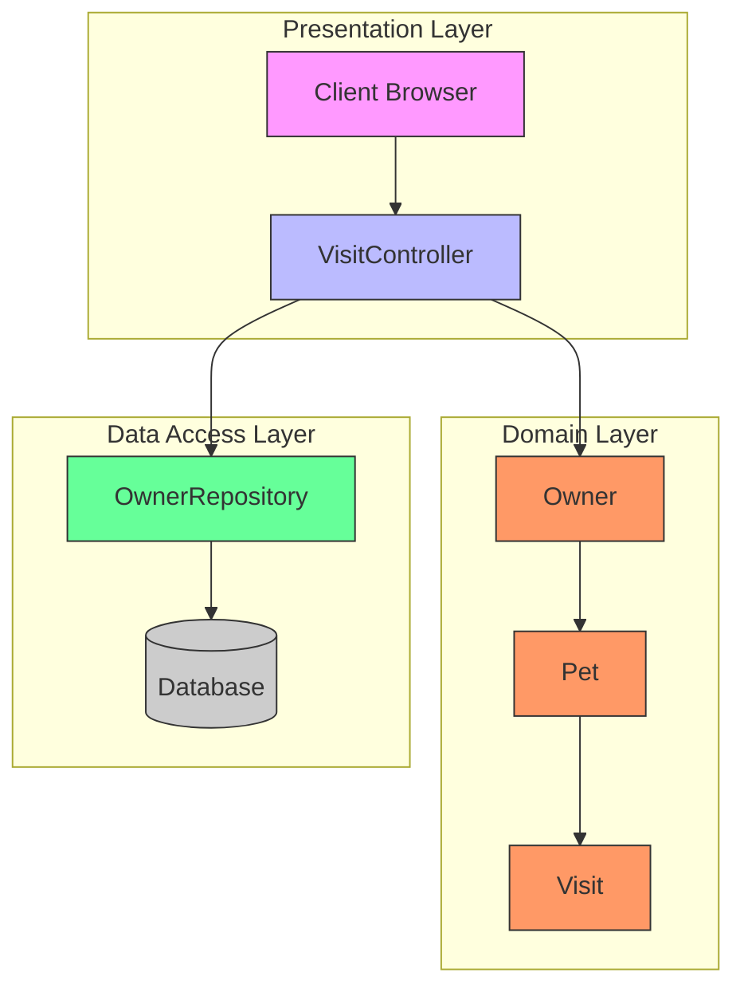
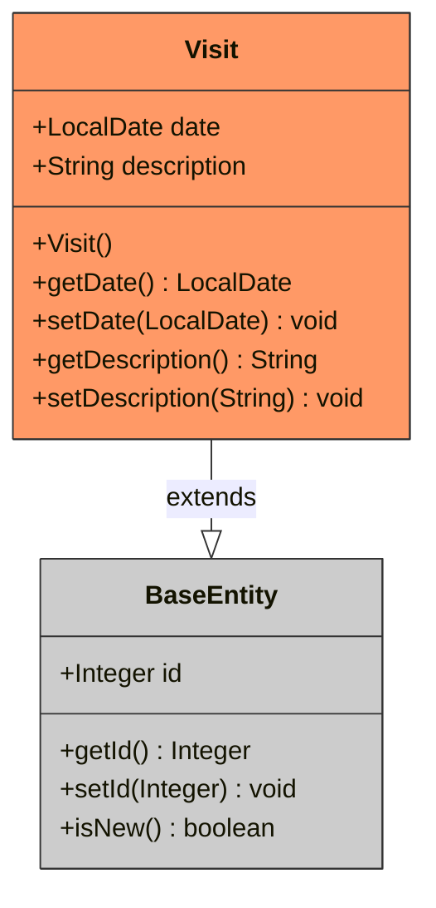
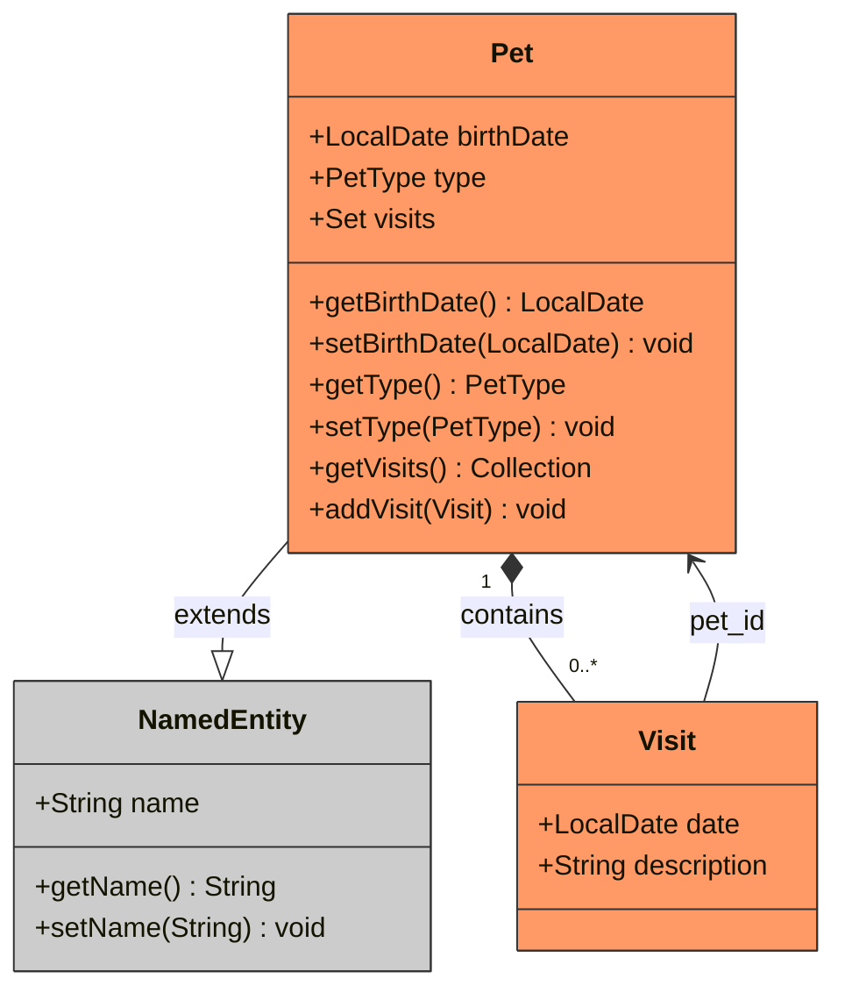
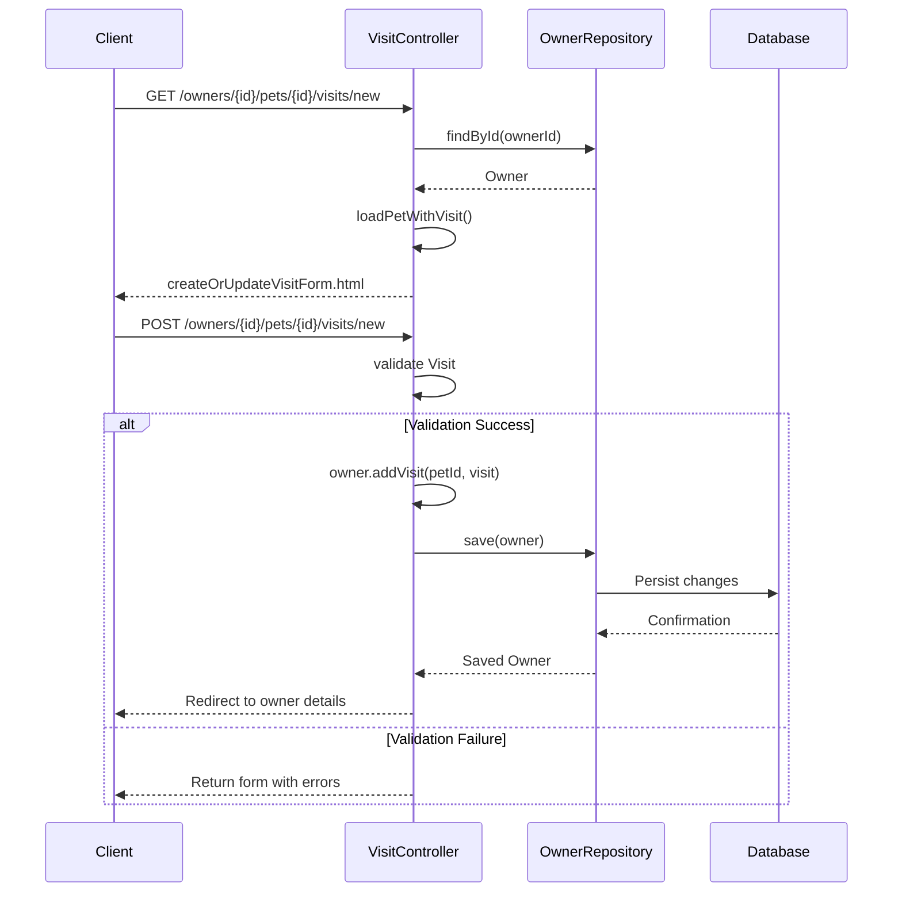
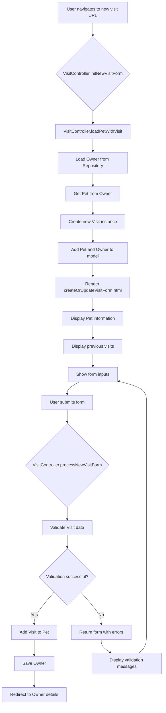
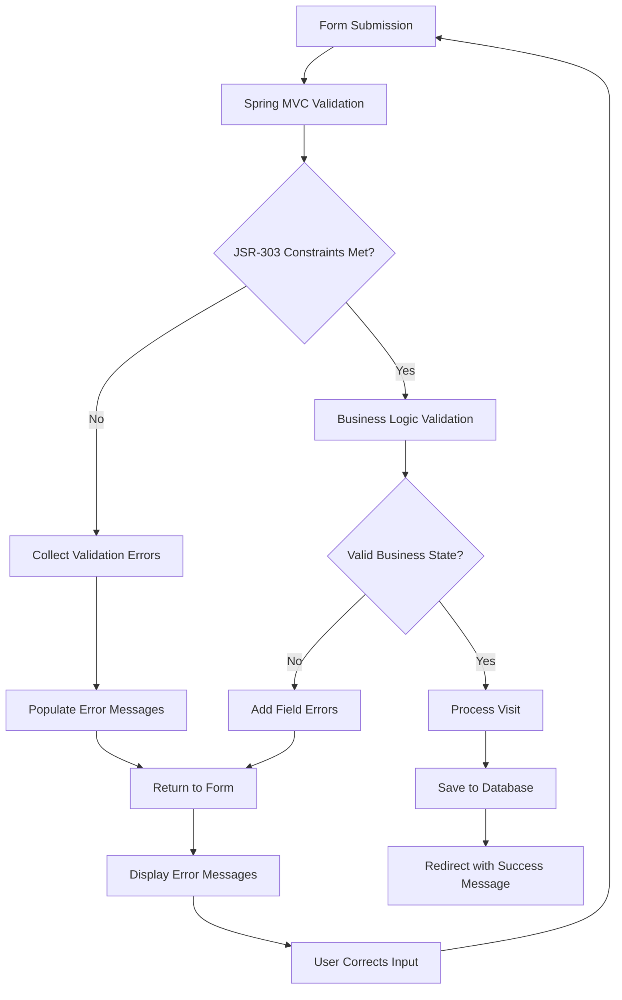
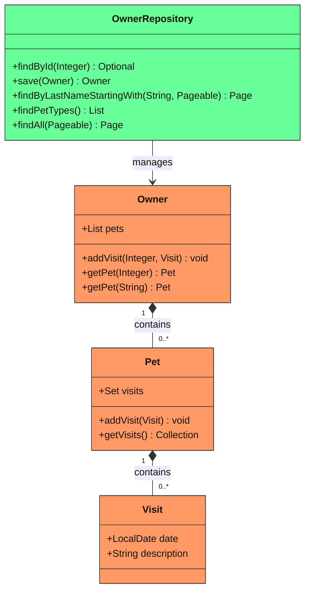

# Visit Management

<cite>
**Referenced Files in This Document**   
- [VisitController.java](file://src/main/java/org/springframework/samples/petclinic/owner/VisitController.java)
- [Visit.java](file://src/main/java/org/springframework/samples/petclinic/owner/Visit.java)
- [Pet.java](file://src/main/java/org/springframework/samples/petclinic/owner/Pet.java)
- [Owner.java](file://src/main/java/org/springframework/samples/petclinic/owner/Owner.java)
- [createOrUpdateVisitForm.html](file://src/main/resources/templates/pets/createOrUpdateVisitForm.html)
- [messages.properties](file://src/main/resources/messages/messages.properties)
- [ClinicServiceTests.java](file://src/test/java/org/springframework/samples/petclinic/service/ClinicServiceTests.java)
</cite>

## Table of Contents
1. [Introduction](#introduction)
2. [Core Components](#core-components)
3. [Architecture Overview](#architecture-overview)
4. [Detailed Component Analysis](#detailed-component-analysis)
5. [Workflow and Form Handling](#workflow-and-form-handling)
6. [Data Validation and Error Handling](#data-validation-and-error-handling)
7. [Persistence and Transactional Behavior](#persistence-and-transactional-behavior)
8. [Performance Considerations](#performance-considerations)
9. [Common Issues and Solutions](#common-issues-and-solutions)

## Introduction

The Visit Management feature in the Spring PetClinic application enables clinic staff to schedule and record visits for pets within the context of their owners. This functionality is centered around the `VisitController` which handles form submissions, validates input data, and persists visit records through Spring Data JPA. The system maintains a hierarchical relationship between owners, pets, and visits, ensuring that all visits are properly nested within the pet's context. The implementation follows Spring MVC patterns with proper separation of concerns between controllers, domain entities, and repositories.

**Section sources**
- [VisitController.java](file://src/main/java/org/springframework/samples/petclinic/owner/VisitController.java#L40-L99)
- [Visit.java](file://src/main/java/org/springframework/samples/petclinic/owner/Visit.java#L33-L67)

## Core Components

The Visit Management system consists of several key components that work together to provide a complete solution for scheduling and recording pet visits. The primary components include the `VisitController` for handling HTTP requests, the `Visit` entity for representing visit data, the `Pet` entity which contains a collection of visits, and the Thymeleaf template `createOrUpdateVisitForm.html` for rendering the user interface. These components are interconnected through dependency injection and follow the domain-driven design principles of the application.

**Section sources**
- [VisitController.java](file://src/main/java/org/springframework/samples/petclinic/owner/VisitController.java#L40-L99)
- [Visit.java](file://src/main/java/org/springframework/samples/petclinic/owner/Visit.java#L33-L67)
- [Pet.java](file://src/main/java/org/springframework/samples/petclinic/owner/Pet.java#L43-L84)
- [createOrUpdateVisitForm.html](file://src/main/resources/templates/pets/createOrUpdateVisitForm.html#L0-L61)

## Architecture Overview

The Visit Management feature follows a layered architecture with clear separation between presentation, business logic, and data access layers. The controller receives HTTP requests and coordinates with domain entities and repositories to process visit data. The architecture maintains the hierarchical relationship between owners, pets, and visits, ensuring data integrity and proper context.

**Diagram sources**
- [VisitController.java](file://src/main/java/org/springframework/samples/petclinic/owner/VisitController.java#L40-L99)
- [Owner.java](file://src/main/java/org/springframework/samples/petclinic/owner/Owner.java#L85-L172)
- [Pet.java](file://src/main/java/org/springframework/samples/petclinic/owner/Pet.java#L43-L84)
- [Visit.java](file://src/main/java/org/springframework/samples/petclinic/owner/Visit.java#L33-L67)

## Detailed Component Analysis

### Visit Entity Analysis

The `Visit` entity represents a single clinic visit for a pet and contains essential information such as the visit date and description. The entity extends `BaseEntity` to inherit common properties like the unique identifier. By default, new visits are initialized with the current date, ensuring that the date field is never null.

**Diagram sources**
- [Visit.java](file://src/main/java/org/springframework/samples/petclinic/owner/Visit.java#L33-L67)
- [BaseEntity.java](file://src/main/java/org/springframework/samples/petclinic/model/BaseEntity.java#L31-L50)

### Pet Entity Analysis

The `Pet` entity maintains a collection of visits through a one-to-many relationship, ensuring that all visits are properly associated with their respective pets. The visits collection is ordered chronologically by date, maintaining the correct sequence of visit history. The eager fetch strategy ensures that visit data is loaded when the pet is retrieved, optimizing for the common use case of displaying visit history.

**Diagram sources**
- [Pet.java](file://src/main/java/org/springframework/samples/petclinic/owner/Pet.java#L43-L84)
- [NamedEntity.java](file://src/main/java/org/springframework/samples/petclinic/model/NamedEntity.java#L29-L49)
- [Visit.java](file://src/main/java/org/springframework/samples/petclinic/owner/Visit.java#L33-L67)

### VisitController Analysis

The `VisitController` handles all HTTP requests related to visit management, including form initialization and submission. It uses Spring MVC annotations to map URLs to controller methods and leverages model attributes to populate form data. The controller follows the post-redirect-get pattern to prevent duplicate form submissions.

**Diagram sources**
- [VisitController.java](file://src/main/java/org/springframework/samples/petclinic/owner/VisitController.java#L40-L99)
- [OwnerRepository.java](file://src/main/java/org/springframework/samples/petclinic/owner/OwnerRepository.java#L38-L76)

## Workflow and Form Handling

The visit management workflow begins when a user navigates to the new visit form URL, which triggers the `initNewVisitForm` method in `VisitController`. Before any request mapping method is executed, Spring MVC calls the `loadPetWithVisit` method annotated with `@ModelAttribute`, which prepares the model by loading the owner and pet data and creating a new visit instance. This ensures that the form always has fresh data and that the pet object has a proper context.

The form template `createOrUpdateVisitForm.html` uses Thymeleaf to dynamically render the pet's information and previous visit history. The form includes input fields for the visit date and description, with client-side validation attributes. When the form is submitted, the `processNewVisitForm` method handles the POST request, validates the input data, and persists the visit if validation passes.

**Diagram sources**
- [VisitController.java](file://src/main/java/org/springframework/samples/petclinic/owner/VisitController.java#L79-L97)
- [createOrUpdateVisitForm.html](file://src/main/resources/templates/pets/createOrUpdateVisitForm.html#L0-L61)

**Section sources**
- [VisitController.java](file://src/main/java/org/springframework/samples/petclinic/owner/VisitController.java#L61-L75)
- [createOrUpdateVisitForm.html](file://src/main/resources/templates/pets/createOrUpdateVisitForm.html#L0-L61)

## Data Validation and Error Handling

The system implements comprehensive validation at multiple levels to ensure data integrity. The `Visit` entity uses JSR-303 validation annotations such as `@NotBlank` to enforce that the description field cannot be empty. The date field is automatically initialized to the current date in the constructor, preventing null values.

When form submission occurs, Spring MVC automatically validates the `Visit` object against these constraints. If validation fails, the form is redisplayed with appropriate error messages. The system uses message properties to provide user-friendly error messages, with the `messages.properties` file containing standard validation messages like "is required" for required fields.

The controller also performs business logic validation by checking for duplicate form submissions through the post-redirect-get pattern. After successfully processing a visit, the user is redirected to the owner details page with a flash message indicating success, preventing the possibility of resubmitting the same form by refreshing the page.

**Diagram sources**
- [Visit.java](file://src/main/java/org/springframework/samples/petclinic/owner/Visit.java#L33-L67)
- [VisitController.java](file://src/main/java/org/springframework/samples/petclinic/owner/VisitController.java#L86-L97)
- [messages.properties](file://src/main/resources/messages/messages.properties#L0-L8)

**Section sources**
- [Visit.java](file://src/main/java/org/springframework/samples/petclinic/owner/Visit.java#L41-L42)
- [VisitController.java](file://src/main/java/org/springframework/samples/petclinic/owner/VisitController.java#L86-L97)
- [messages.properties](file://src/main/resources/messages/messages.properties#L0-L8)

## Persistence and Transactional Behavior

Visit persistence is handled through the `OwnerRepository` interface, which extends Spring Data JPA's `JpaRepository`. When a new visit is added, it is associated with a pet, which is in turn associated with an owner. The entire owner aggregate is saved, ensuring that all changes are persisted in a single transaction.

The `Owner` class provides the `addVisit` method that takes a pet ID and visit instance, locating the appropriate pet and adding the visit to its collection. This method includes null checks to ensure data integrity. The repository's save operation cascades to all child entities, persisting the new visit along with the owner and pet.

**Diagram sources**
- [OwnerRepository.java](file://src/main/java/org/springframework/samples/petclinic/owner/OwnerRepository.java#L38-L76)
- [Owner.java](file://src/main/java/org/springframework/samples/petclinic/owner/Owner.java#L85-L172)
- [Pet.java](file://src/main/java/org/springframework/samples/petclinic/owner/Pet.java#L43-L84)
- [Visit.java](file://src/main/java/org/springframework/samples/petclinic/owner/Visit.java#L33-L67)

**Section sources**
- [Owner.java](file://src/main/java/org/springframework/samples/petclinic/owner/Owner.java#L162-L172)
- [VisitController.java](file://src/main/java/org/springframework/samples/petclinic/owner/VisitController.java#L86-L97)
- [ClinicServiceTests.java](file://src/test/java/org/springframework/samples/petclinic/service/ClinicServiceTests.java#L210-L228)

## Performance Considerations

The current implementation uses eager fetching for the visits collection in the `Pet` entity, which loads all visit data when a pet is retrieved. While this optimizes for the common use case of displaying visit history, it may lead to performance issues when retrieving pets without needing their visit history. For large datasets, consider implementing lazy loading with proper transaction boundaries or using projections to retrieve only the necessary data.

Database indexing on the `visit_date` column is recommended to optimize queries that filter or sort visits by date. The `@OrderBy("date ASC")` annotation on the visits collection ensures chronological ordering, but proper database indexing will improve the performance of this operation.

For applications with high visit volume, consider implementing pagination for visit history display rather than loading all visits at once. This would reduce memory usage and improve response times for owners with many pets or pets with extensive visit histories.

**Section sources**
- [Pet.java](file://src/main/java/org/springframework/samples/petclinic/owner/Pet.java#L55-L58)
- [Visit.java](file://src/main/java/org/springframework/samples/petclinic/owner/Visit.java#L37-L39)

## Common Issues and Solutions

Several common issues are addressed in the current implementation:

1. **Future Date Prevention**: While the current implementation does not explicitly prevent future visit dates, this could be addressed by adding a custom validator or using Hibernate Validator's `@PastOrPresent` annotation on the date field.

2. **Chronological Order Maintenance**: The `@OrderBy("date ASC")` annotation ensures that visits are always returned in chronological order, maintaining the correct sequence in the user interface.

3. **Concurrent Modifications**: The current implementation does not include explicit optimistic locking, which could lead to lost updates in high-concurrency scenarios. Adding a `@Version` field to the `Visit` entity would enable optimistic locking and prevent concurrent modification issues.

4. **Data Integrity**: The system ensures data integrity through cascading persistence and proper entity relationships. When an owner is saved, all associated pets and visits are persisted in a single transaction, maintaining referential integrity.

5. **Duplicate Form Submissions**: The post-redirect-get pattern prevents duplicate form submissions by redirecting to a different page after successful submission, ensuring that refreshing the page does not resubmit the form.

**Section sources**
- [Visit.java](file://src/main/java/org/springframework/samples/petclinic/owner/Visit.java#L37-L39)
- [Pet.java](file://src/main/java/org/springframework/samples/petclinic/owner/Pet.java#L55-L58)
- [VisitController.java](file://src/main/java/org/springframework/samples/petclinic/owner/VisitController.java#L86-L97)
- [messages.properties](file://src/main/resources/messages/messages.properties#L0-L8)