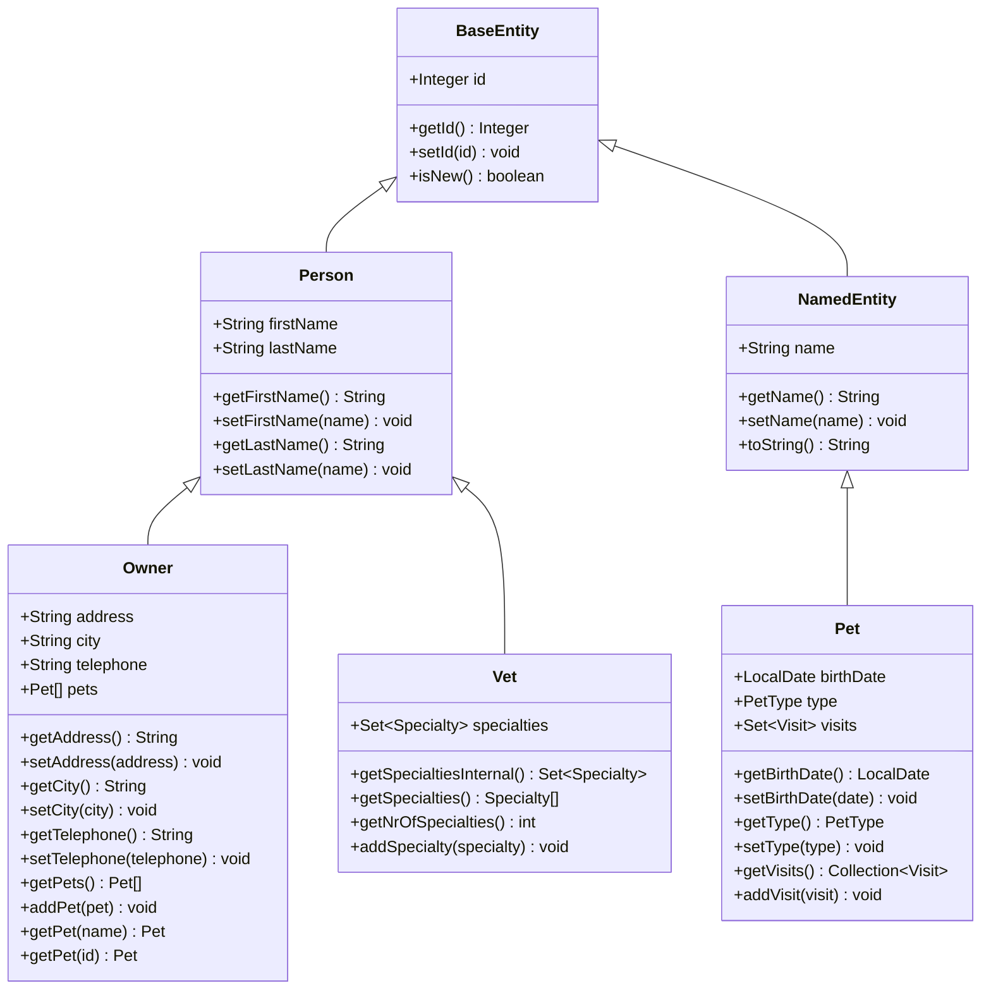
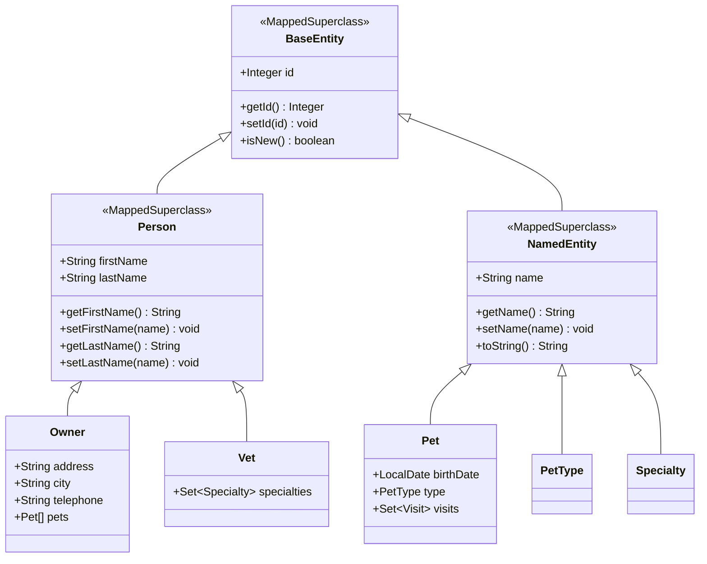

# BaseEntity

<cite>
**Referenced Files in This Document**   
- [BaseEntity.java](file://src/main/java/org/springframework/samples/petclinic/model/BaseEntity.java)
- [Person.java](file://src/main/java/org/springframework/samples/petclinic/model/Person.java)
- [NamedEntity.java](file://src/main/java/org/springframework/samples/petclinic/model/NamedEntity.java)
- [Owner.java](file://src/main/java/org/springframework/samples/petclinic/owner/Owner.java)
- [Pet.java](file://src/main/java/org/springframework/samples/petclinic/owner/Pet.java)
- [Vet.java](file://src/main/java/org/springframework/samples/petclinic/vet/Vet.java)
</cite>

## Table of Contents
1. [Introduction](#introduction)
2. [Core Components](#core-components)
3. [Architecture Overview](#architecture-overview)
4. [Detailed Component Analysis](#detailed-component-analysis)
5. [Inheritance Hierarchy](#inheritance-hierarchy)
6. [Best Practices and Common Issues](#best-practices-and-common-issues)
7. [Conclusion](#conclusion)

## Introduction

The BaseEntity class serves as the foundational entity for all persistent domain objects in the Spring PetClinic application. As a base class annotated with @MappedSuperclass, it provides a common structure for entity identification and persistence state management across the entire domain model. This documentation provides comprehensive analysis of its design, implementation, and usage patterns within the application's object-relational mapping architecture.

**Section sources**
- [BaseEntity.java](file://src/main/java/org/springframework/samples/petclinic/model/BaseEntity.java#L1-L52)

## Core Components

The BaseEntity class implements the fundamental persistence capabilities required by all domain entities in the PetClinic application. Its primary responsibilities include providing a standardized ID field with auto-generation capabilities and implementing logic to determine the persistence state of entities. The class is designed to be extended by all entity classes, ensuring consistency in how entities are identified and managed throughout the application's data access layer.

**Section sources**
- [BaseEntity.java](file://src/main/java/org/springframework/samples/petclinic/model/BaseEntity.java#L31-L50)

## Architecture Overview

The BaseEntity class plays a central role in the application's domain model architecture by establishing a consistent foundation for all persistent entities. Through the use of JPA's @MappedSuperclass annotation, it enables inheritance of database mapping metadata without requiring a separate database table for the base class itself. This architectural pattern allows derived entities to inherit the ID field and its configuration while maintaining their own distinct database tables.

**Diagram sources**
- [BaseEntity.java](file://src/main/java/org/springframework/samples/petclinic/model/BaseEntity.java#L31-L50)
- [Person.java](file://src/main/java/org/springframework/samples/petclinic/model/Person.java#L26-L53)
- [NamedEntity.java](file://src/main/java/org/springframework/samples/petclinic/model/NamedEntity.java#L29-L49)

## Detailed Component Analysis

### BaseEntity Implementation

The BaseEntity class provides the essential infrastructure for entity persistence in the PetClinic application. Its implementation focuses on two critical aspects of JPA entity management: identifier generation and persistence state determination.

#### ID Generation Strategy

The class uses JPA annotations to define a standardized approach to entity identification. The @Id annotation marks the 'id' field as the primary key, while @GeneratedValue with GenerationType.IDENTITY specifies that the database should automatically generate unique identifiers for new entities. This strategy leverages database-specific auto-increment capabilities, ensuring that each persisted entity receives a unique identifier without requiring application-level coordination.

**Section sources**
- [BaseEntity.java](file://src/main/java/org/springframework/samples/petclinic/model/BaseEntity.java#L35-L36)

#### Persistence State Management

The isNew() method plays a crucial role in determining whether an entity instance represents a new record to be inserted or an existing record to be updated. By checking if the ID is null, this method provides a reliable way to distinguish between transient and persistent entities. This functionality is essential for proper JPA lifecycle management and is used throughout the application to make decisions about persistence operations.

**Section sources**
- [BaseEntity.java](file://src/main/java/org/springframework/samples/petclinic/model/BaseEntity.java#L48-L50)

## Inheritance Hierarchy

The BaseEntity class forms the root of an inheritance hierarchy that organizes the domain model according to shared characteristics and responsibilities. This hierarchical structure enables code reuse while maintaining appropriate separation of concerns across different types of domain entities.

### Intermediate Base Classes

The model includes two intermediate base classes that extend BaseEntity and provide specialized functionality:

- **Person**: Extends BaseEntity to represent individuals with first and last names. This class serves as the foundation for both owners and veterinarians.
- **NamedEntity**: Extends BaseEntity to represent entities with a simple name property. This class is used for categorical data such as pet types and specialties.

These intermediate classes demonstrate a layered approach to inheritance that balances code reuse with domain-specific requirements.

### Domain Entity Specialization

Specific domain entities extend either Person or NamedEntity based on their characteristics:

- **Owner**: Extends Person to represent pet owners with contact information and a collection of pets.
- **Vet**: Extends Person to represent veterinarians with associated specialties.
- **Pet**: Extends NamedEntity to represent animals with birth dates, types, and medical visits.

This inheritance structure ensures that common properties and behaviors are inherited appropriately while allowing each entity type to define its unique characteristics.

**Diagram sources**
- [BaseEntity.java](file://src/main/java/org/springframework/samples/petclinic/model/BaseEntity.java#L31-L50)
- [Person.java](file://src/main/java/org/springframework/samples/petclinic/model/Person.java#L26-L53)
- [NamedEntity.java](file://src/main/java/org/springframework/samples/petclinic/model/NamedEntity.java#L29-L49)
- [Owner.java](file://src/main/java/org/springframework/samples/petclinic/owner/Owner.java#L45-L174)
- [Pet.java](file://src/main/java/org/springframework/samples/petclinic/owner/Pet.java#L43-L84)
- [Vet.java](file://src/main/java/org/springframework/samples/petclinic/vet/Vet.java#L42-L73)

**Section sources**
- [Person.java](file://src/main/java/org/springframework/samples/petclinic/model/Person.java#L26-L53)
- [NamedEntity.java](file://src/main/java/org/springframework/samples/petclinic/model/NamedEntity.java#L29-L49)

## Best Practices and Common Issues

### When to Extend BaseEntity Directly

While most entities extend BaseEntity through intermediate classes like Person or NamedEntity, there may be cases where direct extension is appropriate. This approach should be considered when creating entity types that don't fit naturally into the existing hierarchy but still require the basic persistence capabilities provided by BaseEntity. However, developers should first evaluate whether creating a new intermediate base class might better serve the domain model's organization and maintainability.

### ID Generation Considerations

The use of GenerationType.IDENTITY has implications for database portability. While this strategy works well with databases that support auto-increment columns (such as MySQL, PostgreSQL, and H2), it may not be optimal for all database systems. Applications requiring high scalability or distributed databases might benefit from alternative strategies like GenerationType.SEQUENCE or GenerationType.TABLE, which provide more control over identifier generation.

### Entity Equality and HashCode

When implementing equals() and hashCode() methods in derived classes, it's essential to base these implementations on the entity's ID rather than business attributes. This practice ensures consistent behavior in collections and across persistence operations. The isNew() method can be particularly useful in these implementations, as it helps distinguish between transient and persistent entities when determining equality.

**Section sources**
- [BaseEntity.java](file://src/main/java/org/springframework/samples/petclinic/model/BaseEntity.java#L48-L50)
- [Owner.java](file://src/main/java/org/springframework/samples/petclinic/owner/Owner.java#L150-L174)

## Conclusion

The BaseEntity class serves as a critical foundation for the PetClinic application's domain model, providing standardized persistence capabilities through JPA annotations and utility methods. Its design as a @MappedSuperclass enables efficient inheritance of database mapping metadata while avoiding the creation of unnecessary database tables. The class's implementation of ID generation and persistence state determination supports reliable entity management throughout the application. By understanding the inheritance hierarchy and best practices associated with BaseEntity, developers can effectively extend and maintain the domain model while ensuring consistency in persistence operations.