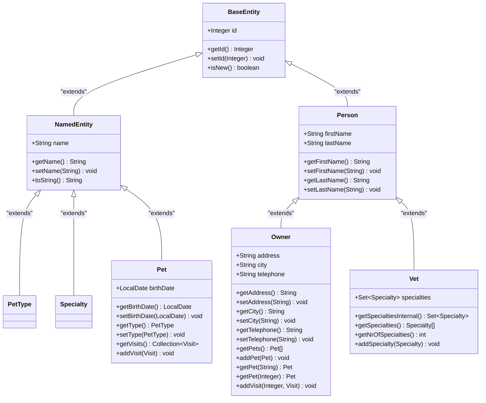
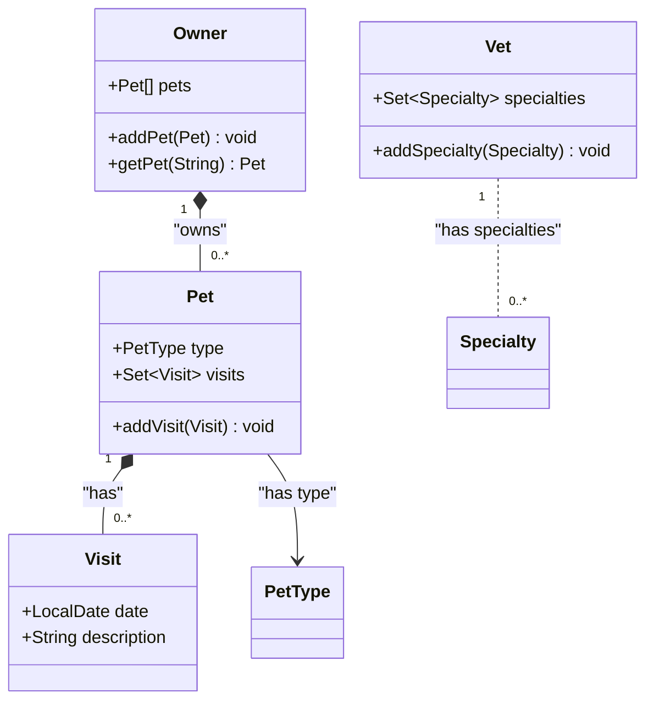
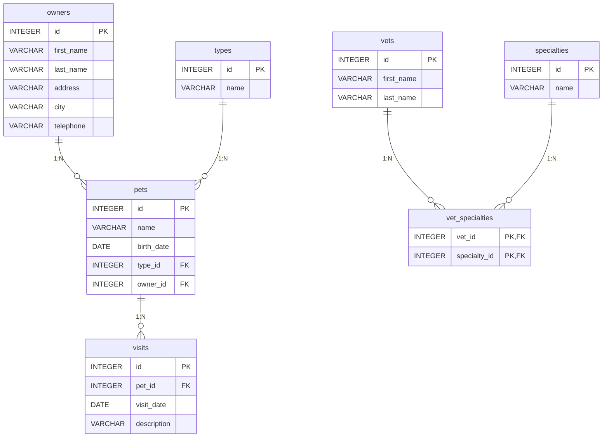
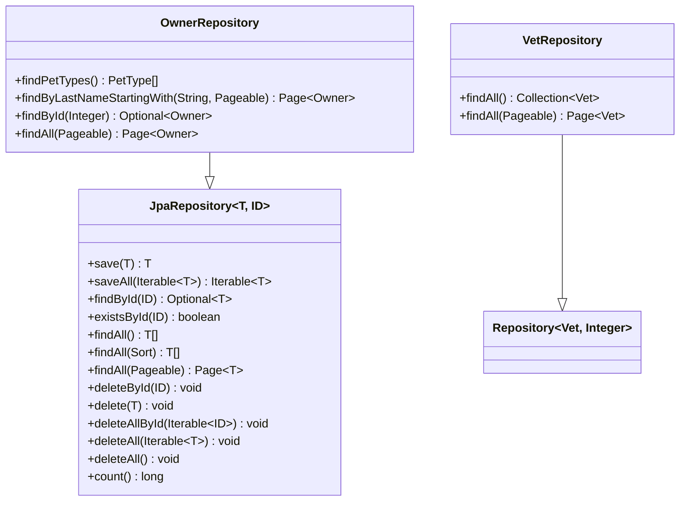
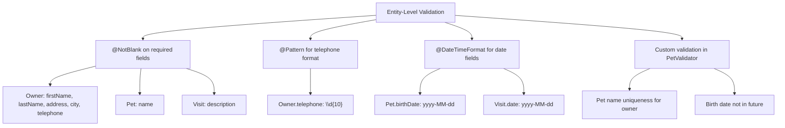
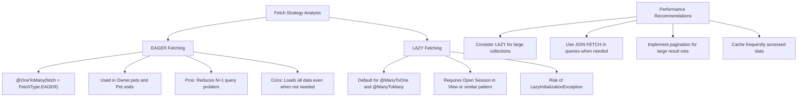
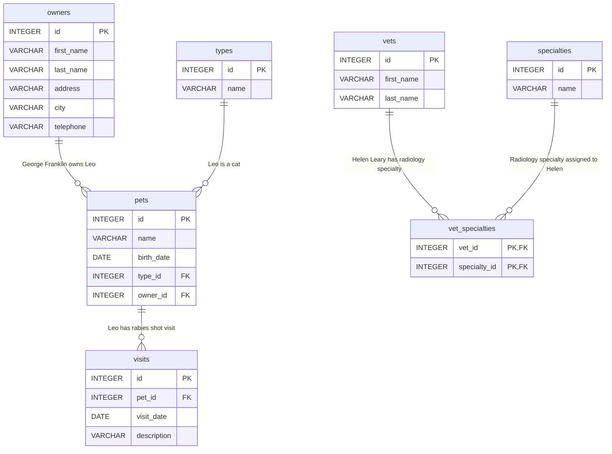

# Data Models & Entity Relationships

<cite>
**Referenced Files in This Document**   
- [BaseEntity.java](file://src/main/java/org/springframework/samples/petclinic/model/BaseEntity.java)
- [NamedEntity.java](file://src/main/java/org/springframework/samples/petclinic/model/NamedEntity.java)
- [Person.java](file://src/main/java/org/springframework/samples/petclinic/model/Person.java)
- [Owner.java](file://src/main/java/org/springframework/samples/petclinic/owner/Owner.java)
- [Pet.java](file://src/main/java/org/springframework/samples/petclinic/owner/Pet.java)
- [PetType.java](file://src/main/java/org/springframework/samples/petclinic/owner/PetType.java)
- [Visit.java](file://src/main/java/org/springframework/samples/petclinic/owner/Visit.java)
- [Vet.java](file://src/main/java/org/springframework/samples/petclinic/vet/Vet.java)
- [Specialty.java](file://src/main/java/org/springframework/samples/petclinic/vet/Specialty.java)
- [OwnerRepository.java](file://src/main/java/org/springframework/samples/petclinic/owner/OwnerRepository.java)
- [VetRepository.java](file://src/main/java/org/springframework/samples/petclinic/vet/VetRepository.java)
- [schema.sql](file://src/main/resources/db/h2/schema.sql)
- [data.sql](file://src/main/resources/db/h2/data.sql)
</cite>

## Table of Contents
1. [Introduction](#introduction)
2. [Entity Inheritance Hierarchy](#entity-inheritance-hierarchy)
3. [Core Entity Relationships](#core-entity-relationships)
4. [Database Schema](#database-schema)
5. [Data Access Patterns](#data-access-patterns)
6. [Data Validation Rules](#data-validation-rules)
7. [Performance Considerations](#performance-considerations)
8. [Sample Data](#sample-data)

## Introduction
The PetClinic application implements a comprehensive domain model for managing veterinary clinic operations. This documentation details the entity relationships, inheritance hierarchy, and data access patterns used in the application. The model centers around key domain entities including owners, pets, veterinarians, specialties, and visits, with well-defined relationships and constraints. The implementation leverages Spring Data JPA for persistence, with entities annotated for proper mapping to the underlying database schema.

## Entity Inheritance Hierarchy

The PetClinic domain model implements a hierarchical inheritance structure using JPA's `@MappedSuperclass` annotation to share common properties across related entities. The hierarchy begins with `BaseEntity` as the root class and extends through intermediate classes to concrete entity types.

**Diagram sources**
- [BaseEntity.java](file://src/main/java/org/springframework/samples/petclinic/model/BaseEntity.java#L31-L50)
- [NamedEntity.java](file://src/main/java/org/springframework/samples/petclinic/model/NamedEntity.java#L29-L49)
- [Person.java](file://src/main/java/org/springframework/samples/petclinic/model/Person.java#L26-L53)
- [Owner.java](file://src/main/java/org/springframework/samples/petclinic/owner/Owner.java#L45-L174)
- [Pet.java](file://src/main/java/org/springframework/samples/petclinic/owner/Pet.java#L43-L84)
- [Vet.java](file://src/main/java/org/springframework/samples/petclinic/vet/Vet.java#L42-L73)
- [Specialty.java](file://src/main/java/org/springframework/samples/petclinic/vet/Specialty.java#L27-L31)
- [PetType.java](file://src/main/java/org/springframework/samples/petclinic/owner/PetType.java#L25-L29)

**Section sources**
- [BaseEntity.java](file://src/main/java/org/springframework/samples/petclinic/model/BaseEntity.java#L31-L50)
- [NamedEntity.java](file://src/main/java/org/springframework/samples/petclinic/model/NamedEntity.java#L29-L49)
- [Person.java](file://src/main/java/org/springframework/samples/petclinic/model/Person.java#L26-L53)

## Core Entity Relationships

The PetClinic domain model implements several key relationships between entities, using JPA annotations to define the multiplicity and directionality of these associations. The primary relationships include Owner-Pet (one-to-many), Pet-Visit (one-to-many), and Vet-Specialty (many-to-many).

**Diagram sources**
- [Owner.java](file://src/main/java/org/springframework/samples/petclinic/owner/Owner.java#L45-L174)
- [Pet.java](file://src/main/java/org/springframework/samples/petclinic/owner/Pet.java#L43-L84)
- [Visit.java](file://src/main/java/org/springframework/samples/petclinic/owner/Visit.java#L33-L67)
- [Vet.java](file://src/main/java/org/springframework/samples/petclinic/vet/Vet.java#L42-L73)
- [Specialty.java](file://src/main/java/org/springframework/samples/petclinic/vet/Specialty.java#L27-L31)
- [PetType.java](file://src/main/java/org/springframework/samples/petclinic/owner/PetType.java#L25-L29)

**Section sources**
- [Owner.java](file://src/main/java/org/springframework/samples/petclinic/owner/Owner.java#L45-L174)
- [Pet.java](file://src/main/java/org/springframework/samples/petclinic/owner/Pet.java#L43-L84)
- [Visit.java](file://src/main/java/org/springframework/samples/petclinic/owner/Visit.java#L33-L67)
- [Vet.java](file://src/main/java/org/springframework/samples/petclinic/vet/Vet.java#L42-L73)

## Database Schema

The database schema for the PetClinic application consists of seven main tables with appropriate primary keys, foreign keys, and constraints to maintain data integrity. The schema is defined in SQL scripts and maps directly to the JPA entity classes through table and column annotations.

**Diagram sources**
- [schema.sql](file://src/main/resources/db/h2/schema.sql#L0-L64)

**Section sources**
- [schema.sql](file://src/main/resources/db/h2/schema.sql#L0-L64)

## Data Access Patterns

The PetClinic application uses Spring Data JPA repositories to provide data access patterns for the domain entities. These repositories extend JpaRepository and provide standard CRUD operations along with custom query methods defined through method naming conventions or @Query annotations.

**Diagram sources**
- [OwnerRepository.java](file://src/main/java/org/springframework/samples/petclinic/owner/OwnerRepository.java#L25-L77)
- [VetRepository.java](file://src/main/java/org/springframework/samples/petclinic/vet/VetRepository.java#L25-L58)

**Section sources**
- [OwnerRepository.java](file://src/main/java/org/springframework/samples/petclinic/owner/OwnerRepository.java#L25-L77)
- [VetRepository.java](file://src/main/java/org/springframework/samples/petclinic/vet/VetRepository.java#L25-L58)

## Data Validation Rules

The PetClinic application implements data validation rules at both the entity level through JPA annotations and at the service level through custom validators. These rules ensure data integrity and enforce business constraints on the domain entities.

**Diagram sources**
- [Owner.java](file://src/main/java/org/springframework/samples/petclinic/owner/Owner.java#L45-L174)
- [Pet.java](file://src/main/java/org/springframework/samples/petclinic/owner/Pet.java#L43-L84)
- [Visit.java](file://src/main/java/org/springframework/samples/petclinic/owner/Visit.java#L33-L67)
- [PetValidator.java](file://src/main/java/org/springframework/samples/petclinic/owner/PetValidator.java)

**Section sources**
- [Owner.java](file://src/main/java/org/springframework/samples/petclinic/owner/Owner.java#L45-L174)
- [Pet.java](file://src/main/java/org/springframework/samples/petclinic/owner/Pet.java#L43-L84)
- [Visit.java](file://src/main/java/org/springframework/samples/petclinic/owner/Visit.java#L33-L67)

## Performance Considerations

The PetClinic application includes several performance considerations in its data model design, particularly around fetch strategies and lazy loading. The choice of fetch types can significantly impact application performance, especially when retrieving entities with collections.

**Diagram sources**
- [Owner.java](file://src/main/java/org/springframework/samples/petclinic/owner/Owner.java#L45-L174)
- [Pet.java](file://src/main/java/org/springframework/samples/petclinic/owner/Pet.java#L43-L84)
- [Vet.java](file://src/main/java/org/springframework/samples/petclinic/vet/Vet.java#L42-L73)

**Section sources**
- [Owner.java](file://src/main/java/org/springframework/samples/petclinic/owner/Owner.java#L45-L174)
- [Pet.java](file://src/main/java/org/springframework/samples/petclinic/owner/Pet.java#L43-L84)
- [Vet.java](file://src/main/java/org/springframework/samples/petclinic/vet/Vet.java#L42-L73)

## Sample Data

The PetClinic application includes sample data that demonstrates the relationships between entities and provides realistic examples of how the data model is populated in practice. This data is used for testing and demonstration purposes.

**Diagram sources**
- [data.sql](file://src/main/resources/db/h2/data.sql#L0-L53)
- [schema.sql](file://src/main/resources/db/h2/schema.sql#L0-L64)

**Section sources**
- [data.sql](file://src/main/resources/db/h2/data.sql#L0-L53)