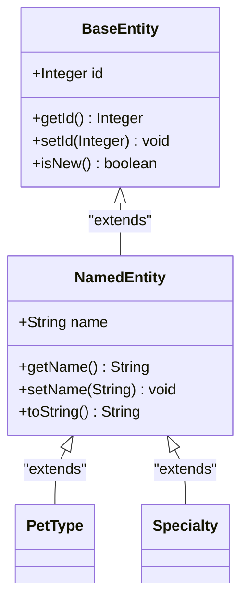
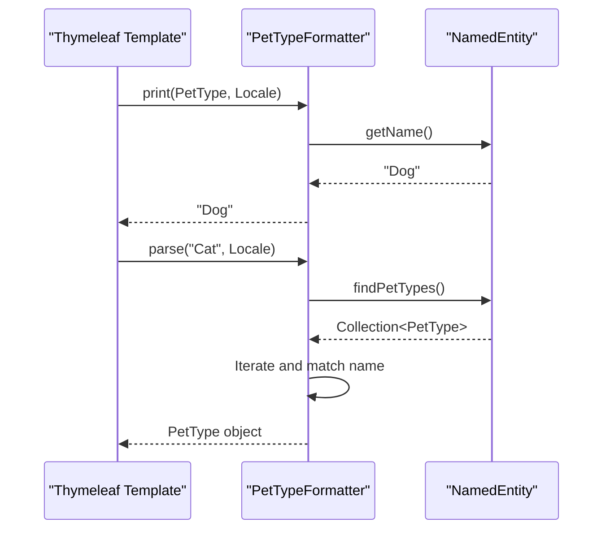
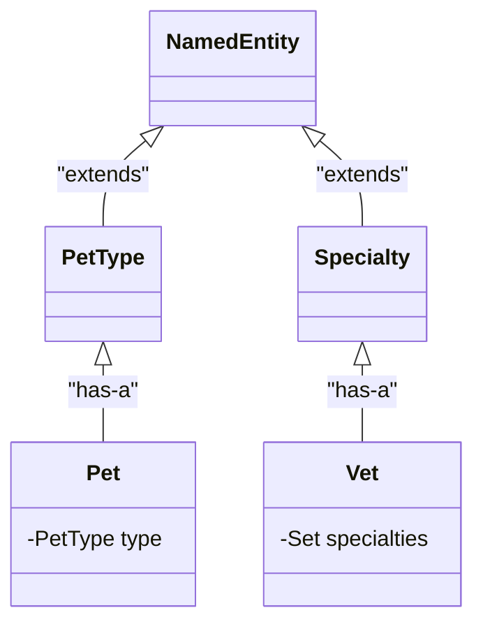

# NamedEntity

<cite>
**Referenced Files in This Document**   
- [NamedEntity.java](file://src/main/java/org/springframework/samples/petclinic/model/NamedEntity.java)
- [BaseEntity.java](file://src/main/java/org/springframework/samples/petclinic/model/BaseEntity.java)
- [PetType.java](file://src/main/java/org/springframework/samples/petclinic/owner/PetType.java)
- [Specialty.java](file://src/main/java/org/springframework/samples/petclinic/vet/Specialty.java)
- [PetTypeFormatter.java](file://src/main/java/org/springframework/samples/petclinic/owner/PetTypeFormatter.java)
- [data.sql](file://src/main/resources/db/h2/data.sql)
- [selectField.html](file://src/main/resources/templates/fragments/selectField.html)
</cite>

## Table of Contents
1. [Introduction](#introduction)
2. [Inheritance Hierarchy](#inheritance-hierarchy)
3. [Core Attributes and Constraints](#core-attributes-and-constraints)
4. [String Representation and Display](#string-representation-and-display)
5. [Usage in Forms and Dropdowns](#usage-in-forms-and-dropdowns)
6. [Subclass Implementation Examples](#subclass-implementation-examples)
7. [Data Integrity and Validation](#data-integrity-and-validation)
8. [Database Initialization Best Practices](#database-initialization-best-practices)
9. [Common Issues and Solutions](#common-issues-and-solutions)

## Introduction
The NamedEntity class serves as a foundational building block in the PetClinic application for representing categorical entities that require a standardized name attribute. As an extension of BaseEntity, NamedEntity provides a consistent pattern for named domain objects across the application. This documentation explores the implementation details, usage patterns, and best practices associated with the NamedEntity class and its role in maintaining data consistency throughout the PetClinic system.

**Section sources**
- [NamedEntity.java](file://src/main/java/org/springframework/samples/petclinic/model/NamedEntity.java#L1-L15)

## Inheritance Hierarchy
NamedEntity extends BaseEntity to inherit fundamental entity properties while adding the name attribute essential for categorical entities. The inheritance chain enables all NamedEntity subclasses to benefit from the identifier management and serialization capabilities provided by BaseEntity. This hierarchical design promotes code reuse and ensures consistent behavior across all named entities in the application.

**Diagram sources**
- [NamedEntity.java](file://src/main/java/org/springframework/samples/petclinic/model/NamedEntity.java#L15-L25)
- [BaseEntity.java](file://src/main/java/org/springframework/samples/petclinic/model/BaseEntity.java#L31-L50)

**Section sources**
- [NamedEntity.java](file://src/main/java/org/springframework/samples/petclinic/model/NamedEntity.java#L15-L25)
- [BaseEntity.java](file://src/main/java/org/springframework/samples/petclinic/model/BaseEntity.java#L31-L50)

## Core Attributes and Constraints
The NamedEntity class defines a single core attribute: name. This field is annotated with @NotBlank to enforce data integrity by preventing empty or null values. The @Column annotation maps the name attribute to the "name" column in the corresponding database table. These constraints ensure that every instance of a NamedEntity subclass maintains a valid, non-empty name, which is critical for the proper functioning of categorical entities in the application.

**Section sources**
- [NamedEntity.java](file://src/main/java/org/springframework/samples/petclinic/model/NamedEntity.java#L27-L30)

## String Representation and Display
The toString() method in NamedEntity is overridden to return the entity's name directly. This implementation simplifies display logic throughout the application by ensuring that when a NamedEntity instance is rendered in a view or logged, its name is shown rather than a generic object representation. This behavior is particularly valuable in dropdown menus, lists, and other UI components where human-readable text is required.

**Section sources**
- [NamedEntity.java](file://src/main/java/org/springframework/samples/petclinic/model/NamedEntity.java#L47-L49)

## Usage in Forms and Dropdowns
NamedEntity plays a crucial role in form handling and dropdown population through the PetTypeFormatter class. When displaying named entities in forms, the formatter's print method returns the entity's name, while the parse method converts string inputs back to entity objects by matching against existing named entities. This bidirectional conversion enables seamless integration between the user interface and domain model, particularly in form fields that use select elements to present named entity options.

**Diagram sources**
- [PetTypeFormatter.java](file://src/main/java/org/springframework/samples/petclinic/owner/PetTypeFormatter.java#L45-L59)
- [selectField.html](file://src/main/resources/templates/fragments/selectField.html#L15-L18)

**Section sources**
- [PetTypeFormatter.java](file://src/main/java/org/springframework/samples/petclinic/owner/PetTypeFormatter.java#L45-L59)
- [selectField.html](file://src/main/resources/templates/fragments/selectField.html#L1-L30)

## Subclass Implementation Examples
Two primary examples of NamedEntity subclasses in the PetClinic application are PetType and Specialty. PetType represents different animal categories (e.g., dog, cat, bird) and is used to classify pets in the system. Specialty represents veterinary expertise areas (e.g., radiology, surgery) and is associated with veterinarians. Both classes inherit the name attribute and validation rules from NamedEntity, ensuring consistent behavior while serving distinct domain purposes.

**Diagram sources**
- [PetType.java](file://src/main/java/org/springframework/samples/petclinic/owner/PetType.java#L25-L29)
- [Specialty.java](file://src/main/java/org/springframework/samples/petclinic/vet/Specialty.java#L27-L31)
- [Pet.java](file://src/main/java/org/springframework/samples/petclinic/owner/Pet.java#L51-L53)
- [Vet.java](file://src/main/java/org/springframework/samples/petclinic/vet/Vet.java#L69-L71)

**Section sources**
- [PetType.java](file://src/main/java/org/springframework/samples/petclinic/owner/PetType.java#L25-L29)
- [Specialty.java](file://src/main/java/org/springframework/samples/petclinic/vet/Specialty.java#L27-L31)

## Data Integrity and Validation
The @NotBlank constraint on the name field enforces data integrity at both the application and database levels. This validation prevents the creation of named entities without a proper name, which could lead to inconsistent data and user interface issues. The constraint is validated during form submission and object persistence, ensuring that only valid named entities are stored in the database. This validation mechanism works in conjunction with database constraints to provide comprehensive data protection.

**Section sources**
- [NamedEntity.java](file://src/main/java/org/springframework/samples/petclinic/model/NamedEntity.java#L27-L30)

## Database Initialization Best Practices
When initializing the database with NamedEntity data, it's essential to follow consistent naming conventions and avoid duplicates. The data.sql file demonstrates proper initialization by inserting predefined pet types and specialties with standardized names. This approach ensures that the application starts with a consistent set of categorical entities, which can be reliably referenced throughout the system. The use of default values for identifiers allows the database to generate appropriate primary keys while maintaining referential integrity.

**Section sources**
- [data.sql](file://src/main/resources/db/h2/data.sql#L11-L22)

## Common Issues and Solutions
Common issues with NamedEntity typically involve duplicate name entries and case sensitivity conflicts. To prevent duplicates, applications should implement repository methods that check for existing names before creating new entities. Case sensitivity can be addressed by normalizing input (e.g., converting to lowercase) before comparison. Another potential issue is the improper handling of named entity references in forms, which can be resolved by using proper formatters like PetTypeFormatter to ensure correct parsing and rendering of named entities.

**Section sources**
- [PetTypeFormatter.java](file://src/main/java/org/springframework/samples/petclinic/owner/PetTypeFormatter.java#L50-L59)
- [data.sql](file://src/main/resources/db/h2/data.sql#L11-L22)