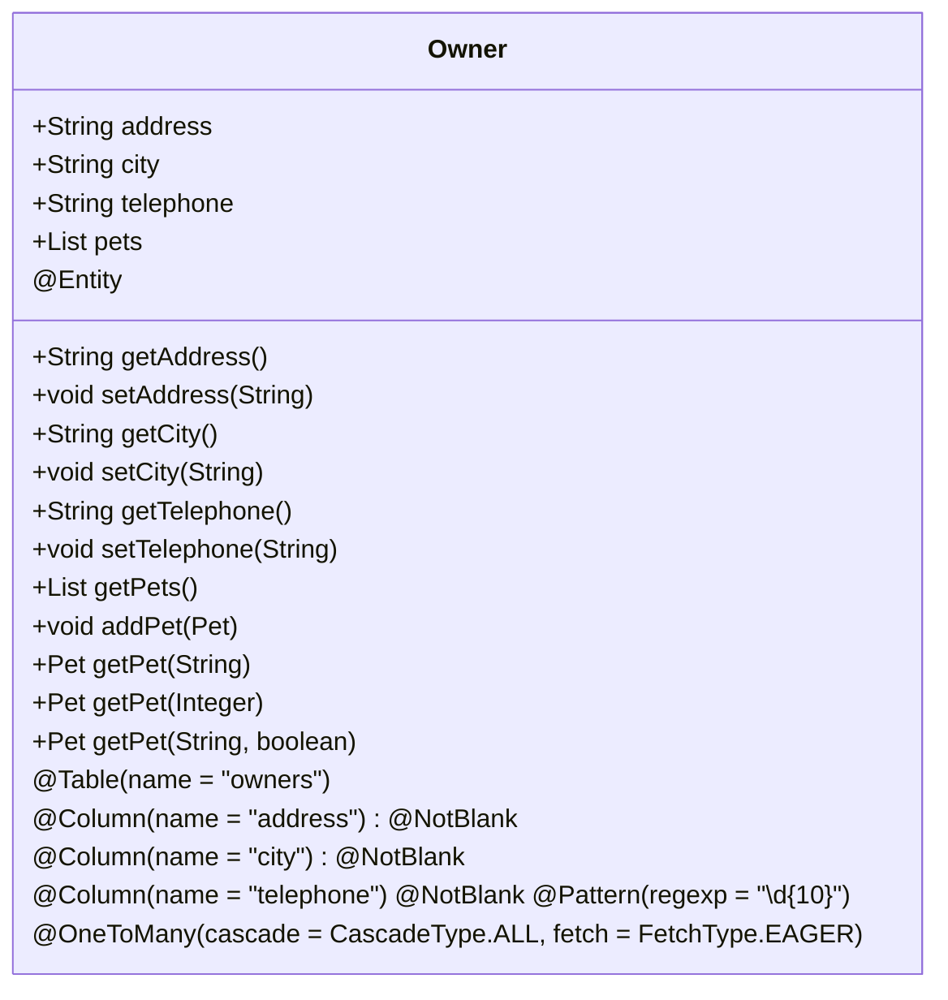
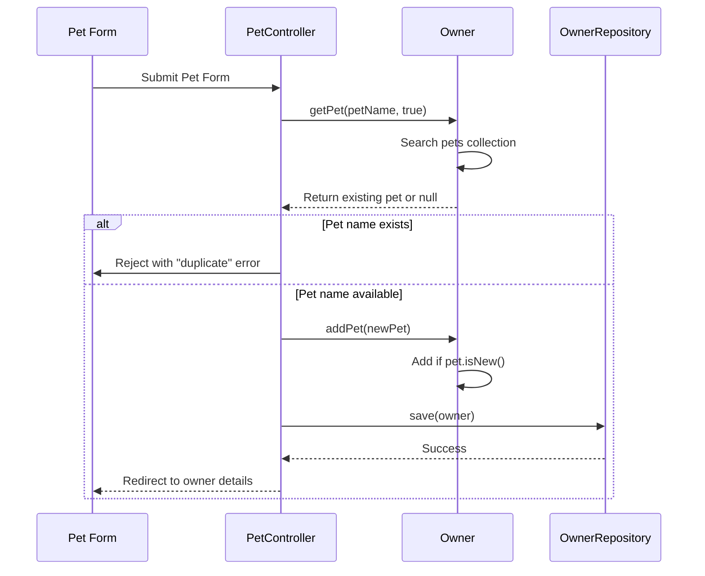
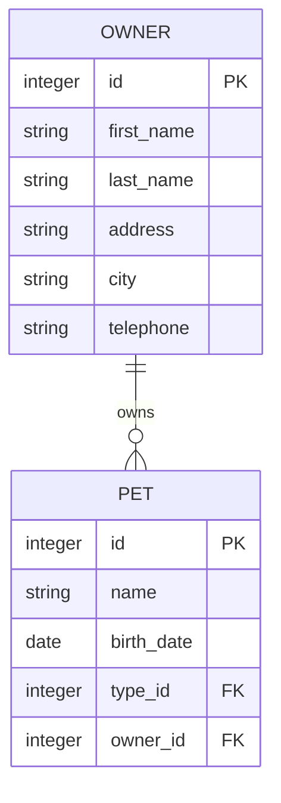

# Owner

<cite>
**Referenced Files in This Document**   
- [Owner.java](file://src/main/java/org/springframework/samples/petclinic/owner/Owner.java)
- [OwnerController.java](file://src/main/java/org/springframework/samples/petclinic/owner/OwnerController.java)
- [createOrUpdateOwnerForm.html](file://src/main/resources/templates/owners/createOrUpdateOwnerForm.html)
- [ownerDetails.html](file://src/main/resources/templates/owners/ownerDetails.html)
- [Pet.java](file://src/main/java/org/springframework/samples/petclinic/owner/Pet.java)
- [Visit.java](file://src/main/java/org/springframework/samples/petclinic/owner/Visit.java)
- [ownersList.html](file://src/main/resources/templates/owners/ownersList.html)
- [findOwners.html](file://src/main/resources/templates/owners/findOwners.html)
- [messages.properties](file://src/main/resources/messages/messages.properties)
- [schema.sql](file://src/main/resources/db/h2/schema.sql)
- [OwnerRepository.java](file://src/main/java/org/springframework/samples/petclinic/owner/OwnerRepository.java)
</cite>

## Table of Contents
1. [Introduction](#introduction)
2. [Core Fields and Validation](#core-fields-and-validation)
3. [Owner-Pet Relationship Management](#owner-pet-relationship-management)
4. [Data Access and Repository Integration](#data-access-and-repository-integration)
5. [Web Controller and Form Binding](#web-controller-and-form-binding)
6. [Thymeleaf Template Integration](#thymeleaf-template-integration)
7. [Common Issues and Best Practices](#common-issues-and-best-practices)

## Introduction

The Owner entity represents pet owners in the veterinary clinic system, serving as a central domain object that manages owner information and their associated pets. This document provides comprehensive documentation of the Owner entity's structure, behavior, and integration points within the Spring PetClinic application. The entity extends the Person class to inherit basic personal information fields while adding specific attributes for address, city, and telephone. It maintains a one-to-many relationship with the Pet entity, allowing owners to have multiple pets registered in the system. The Owner entity is integrated with Spring MVC controllers and Thymeleaf templates to provide a complete web interface for owner management, including creation, updating, and viewing owner details along with their pets and visit history.

## Core Fields and Validation

The Owner entity contains several core fields that store essential information about pet owners, each with specific validation constraints to ensure data integrity.

### Address and City Fields
The `address` and `city` fields are marked with the `@NotBlank` annotation, ensuring that these fields cannot be null or contain only whitespace. These fields are stored in the database with VARCHAR types, with address supporting up to 255 characters and city supporting up to 80 characters. The validation ensures that every owner record contains complete location information, which is essential for clinic operations and communication.

### Telephone Field with Pattern Validation
The `telephone` field is subject to both `@NotBlank` and `@Pattern` constraints. The pattern validation enforces a 10-digit numeric format using the regular expression `\\d{10}`, ensuring telephone numbers are standardized across the system. This validation prevents common data entry errors such as alphabetic characters, special symbols, or incorrect digit counts. When validation fails, the system displays the message "Telephone must be a 10-digit number" to guide users toward correct input. The field is stored as VARCHAR(20) in the database to accommodate the 10-digit requirement with potential formatting or extension information.



**Diagram sources**
- [Owner.java](file://src/main/java/org/springframework/samples/petclinic/owner/Owner.java#L45-L62)

**Section sources**
- [Owner.java](file://src/main/java/org/springframework/samples/petclinic/owner/Owner.java#L45-L62)
- [schema.sql](file://src/main/resources/db/h2/schema.sql#L55-L59)
- [messages.properties](file://src/main/resources/messages/messages.properties#L5)

## Owner-Pet Relationship Management

The Owner entity manages its relationship with pets through a carefully designed collection and set of utility methods that ensure data consistency and prevent common issues.

### EAGER Fetch Strategy and Performance Implications
The pets collection is configured with `FetchType.EAGER`, meaning that when an Owner entity is loaded from the database, its associated pets are automatically retrieved in the same query. This strategy eliminates the N+1 query problem that would occur with LAZY loading when accessing the pets collection, as it prevents the execution of additional queries for each pet. While this improves performance for use cases where pets are always needed (such as displaying owner details), it may lead to unnecessary data retrieval when only owner information is required. The trade-off favors the common use case of displaying owners with their pets, optimizing the most frequent access pattern at the expense of potentially loading more data than needed in some scenarios.

### addPet() Method Logic
The `addPet()` method implements a safeguard against duplicate pet entries by only adding pets that are new (not yet persisted). The method checks the pet's `isNew()` status before adding it to the collection, preventing the accidental addition of pets that have already been saved to the database. This logic ensures that only new pets are added to the owner's collection during form processing, maintaining data integrity and preventing potential constraint violations in the database. The method is typically called during form submission when creating or updating pets, ensuring that the owner-pet relationship is properly established before saving to the database.

### getPet() Overloaded Methods
The Owner class provides three overloaded `getPet()` methods to facilitate flexible pet retrieval:

1. `getPet(String name)` - Returns the pet with the matching name, including new pets in the search
2. `getPet(Integer id)` - Returns the pet with the matching ID, excluding new pets (only persisted pets)
3. `getPet(String name, boolean ignoreNew)` - Returns the pet with the matching name, with the ability to exclude new pets based on the ignoreNew parameter

The `ignoreNew` parameter is particularly important in form validation scenarios, where it allows checking for existing pet names while ignoring the currently being-created pet. For example, when validating a new pet name, the system can search for pets with the same name while ignoring new pets to prevent false duplicate detection during pet creation.



**Diagram sources**
- [Owner.java](file://src/main/java/org/springframework/samples/petclinic/owner/Owner.java#L95-L143)
- [PetController.java](file://src/main/java/org/springframework/samples/petclinic/owner/PetController.java#L98-L118)

**Section sources**
- [Owner.java](file://src/main/java/org/springframework/samples/petclinic/owner/Owner.java#L95-L143)
- [Pet.java](file://src/main/java/org/springframework/samples/petclinic/owner/Pet.java#L35-L45)
- [PetController.java](file://src/main/java/org/springframework/samples/petclinic/owner/PetController.java#L98-L118)

## Data Access and Repository Integration

The Owner entity is integrated with Spring Data JPA through the OwnerRepository interface, which provides standardized data access methods and custom queries for owner management.

### OwnerRepository Interface
The OwnerRepository extends JpaRepository<Owner, Integer>, inheriting standard CRUD operations while defining additional custom methods for specific querying needs. The repository provides pagination support through methods that accept Pageable parameters, enabling efficient retrieval of owner lists with controlled result sizes. The findByLastNameStartingWith method implements a search functionality that finds owners whose last name starts with a given string, supporting the find owners use case with partial matching.

### Database Schema Mapping
The Owner entity is mapped to the "owners" database table with columns for id, first_name, last_name, address, city, and telephone. The schema uses appropriate data types and constraints to match the entity definitions, with VARCHAR_IGNORECASE used for the last_name column to support case-insensitive searching. The primary key is auto-generated, and an index is created on the last_name column to optimize search performance.



**Diagram sources**
- [schema.sql](file://src/main/resources/db/h2/schema.sql#L55-L60)
- [Owner.java](file://src/main/java/org/springframework/samples/petclinic/owner/Owner.java#L45-L62)
- [Pet.java](file://src/main/java/org/springframework/samples/petclinic/owner/Pet.java#L35-L45)

**Section sources**
- [OwnerRepository.java](file://src/main/java/org/springframework/samples/petclinic/owner/OwnerRepository.java#L38-L76)
- [schema.sql](file://src/main/resources/db/h2/schema.sql#L55-L60)

## Web Controller and Form Binding

The OwnerController class handles HTTP requests related to owner management, providing endpoints for creating, updating, finding, and displaying owner information.

### Request Handling Flow
The controller implements a standard CRUD pattern with dedicated endpoints for each operation:
- GET /owners/new: Displays the owner creation form
- POST /owners/new: Processes owner creation with validation
- GET /owners/{ownerId}/edit: Displays the owner update form
- POST /owners/{ownerId}/edit: Processes owner updates with validation
- GET /owners: Searches for owners by last name with pagination
- GET /owners/{ownerId}: Displays detailed owner information

The controller uses Spring's @ModelAttribute annotation to automatically bind form data to Owner objects, leveraging the Owner's validation constraints to ensure data integrity. When validation errors occur, the controller adds error messages to the model and returns to the form view, preserving user input for correction.

### Error Handling and Redirects
The controller implements robust error handling with appropriate HTTP status codes and user feedback. Validation errors are captured in the BindingResult and translated into user-friendly messages displayed on the form. The controller uses RedirectAttributes to pass success and error messages across redirects, ensuring users receive feedback even after form submissions that result in redirects. The ID mismatch protection prevents security issues by verifying that the owner ID in the form matches the ID in the URL path.

**Section sources**
- [OwnerController.java](file://src/main/java/org/springframework/samples/petclinic/owner/OwnerController.java#L74-L170)

## Thymeleaf Template Integration

The Owner entity is integrated with Thymeleaf templates to provide a user-friendly web interface for owner management.

### Form Templates
The createOrUpdateOwnerForm.html template uses Thymeleaf's form binding capabilities to display and process owner data. The template binds to an Owner object in the model, automatically populating form fields with existing values when editing and providing empty fields for new owners. Input fields for firstName, lastName, address, city, and telephone are bound to the corresponding Owner properties, with client-side validation supported by HTML5 attributes and server-side validation enforced by the Owner's annotations.

### Display Templates
The ownerDetails.html template displays comprehensive owner information along with their pets and visit history. The template iterates through the owner's pets collection, displaying each pet's name, birth date, and type, followed by a list of visits with dates and descriptions. The template also provides navigation links to edit the owner or add new pets, creating a cohesive user experience. The ownersList.html template displays paginated results of owner searches, showing key information in a tabular format with links to individual owner details.

```mermaid
flowchart TD
A[User Request] --> B{Request Type}
B --> |GET /owners/new| C[Display createOrUpdateOwnerForm]
B --> |POST /owners/new| D[Process form with OwnerController]
D --> E{Validation Success?}
E --> |Yes| F[Save Owner to Database]
E --> |No| G[Return to Form with Errors]
F --> H[Redirect to Owner Details]
B --> |GET /owners/{id}| I[Load Owner from Database]
I --> J[Display ownerDetails Template]
J --> K[Show Owner Info and Pets]
```

**Diagram sources**
- [createOrUpdateOwnerForm.html](file://src/main/resources/templates/owners/createOrUpdateOwnerForm.html#L1-L31)
- [ownerDetails.html](file://src/main/resources/templates/owners/ownerDetails.html#L1-L103)
- [ownersList.html](file://src/main/resources/templates/owners/ownersList.html#L1-L63)

**Section sources**
- [createOrUpdateOwnerForm.html](file://src/main/resources/templates/owners/createOrUpdateOwnerForm.html#L1-L31)
- [ownerDetails.html](file://src/main/resources/templates/owners/ownerDetails.html#L1-L103)
- [ownersList.html](file://src/main/resources/templates/owners/ownersList.html#L1-L63)

## Common Issues and Best Practices

### Telephone Validation Failures
Telephone validation failures occur when users enter non-numeric characters or numbers with incorrect digit counts. To address this, provide clear error messages and consider implementing client-side validation with JavaScript to provide immediate feedback. The validation message "Telephone must be a 10-digit number" should be prominently displayed near the telephone field when validation fails.

### Transactional Context Best Practices
When managing owner-pet associations, ensure operations occur within transactional contexts to maintain data consistency. The OwnerRepository.save() method should be called within @Transactional methods to ensure that both owner and pet data are persisted atomically. Avoid modifying owner-pet relationships outside of transactional boundaries to prevent partial updates and data inconsistencies.

### Performance Optimization
While FetchType.EAGER optimizes the common case of displaying owners with pets, consider using entity graphs or custom queries when only owner information is needed to reduce database load. For large datasets, ensure proper indexing on frequently queried fields like last_name to maintain search performance.

**Section sources**
- [Owner.java](file://src/main/java/org/springframework/samples/petclinic/owner/Owner.java#L62)
- [OwnerController.java](file://src/main/java/org/springframework/samples/petclinic/owner/OwnerController.java#L74-L170)
- [messages.properties](file://src/main/resources/messages/messages.properties#L5)