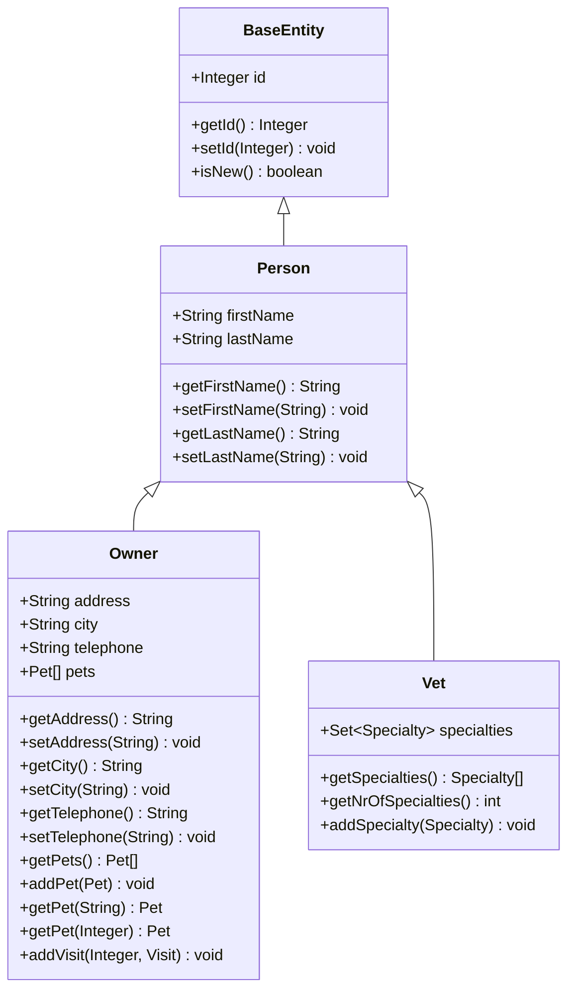
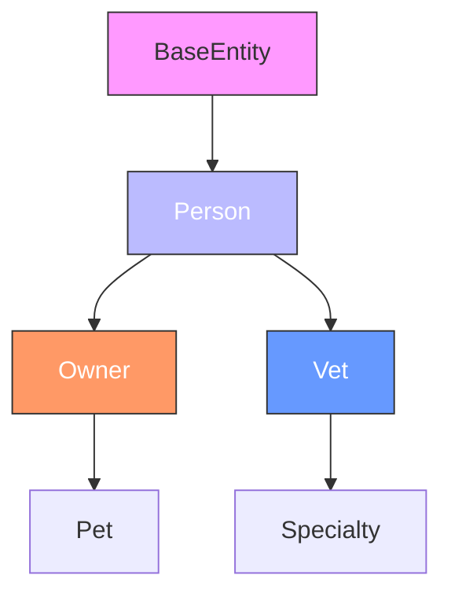
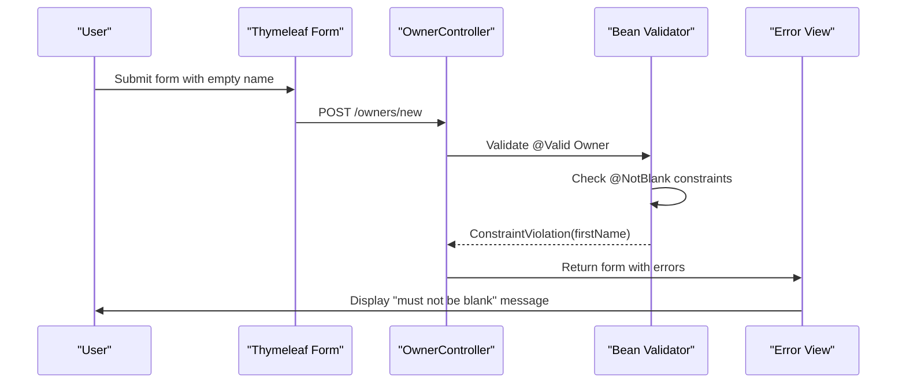

# Person

<cite>
**Referenced Files in This Document**   
- [Person.java](file://src/main/java/org/springframework/samples/petclinic/model/Person.java)
- [BaseEntity.java](file://src/main/java/org/springframework/samples/petclinic/model/BaseEntity.java)
- [Owner.java](file://src/main/java/org/springframework/samples/petclinic/owner/Owner.java)
- [Vet.java](file://src/main/java/org/springframework/samples/petclinic/vet/Vet.java)
- [OwnerController.java](file://src/main/java/org/springframework/samples/petclinic/owner/OwnerController.java)
- [VetController.java](file://src/main/java/org/springframework/samples/petclinic/vet/VetController.java)
- [messages.properties](file://src/main/resources/messages/messages.properties)
- [createOrUpdateOwnerForm.html](file://src/main/resources/templates/owners/createOrUpdateOwnerForm.html)
- [findOwners.html](file://src/main/resources/templates/owners/findOwners.html)
- [ownerDetails.html](file://src/main/resources/templates/owners/ownerDetails.html)
- [ownersList.html](file://src/main/resources/templates/owners/ownersList.html)
- [vetList.html](file://src/main/resources/templates/vets/vetList.html)
- [ValidatorTests.java](file://src/test/java/org/springframework/samples/petclinic/model/ValidatorTests.java)
</cite>

## Table of Contents
1. [Introduction](#introduction)
2. [Core Components](#core-components)
3. [Inheritance Structure](#inheritance-structure)
4. [Field Definitions and JPA Mappings](#field-definitions-and-jpa-mappings)
5. [Validation Framework Integration](#validation-framework-integration)
6. [Controller Usage Patterns](#controller-usage-patterns)
7. [Thymeleaf Template Integration](#thymeleaf-template-integration)
8. [Search Behavior and Case Sensitivity](#search-behavior-and-case-sensitivity)
9. [Internationalization Considerations](#internationalization-considerations)
10. [Performance and Query Optimization](#performance-and-query-optimization)
11. [Conclusion](#conclusion)

## Introduction
The Person entity serves as a foundational domain object in the PetClinic system, providing a common base for individuals managed within the application. As an abstract representation extended by both Owner and Vet entities, Person encapsulates shared attributes and behaviors while enabling specialized functionality through inheritance. This documentation details the implementation, usage, and integration of the Person class across the application stack.

**Section sources**
- [Person.java](file://src/main/java/org/springframework/samples/petclinic/model/Person.java#L26-L53)

## Core Components
The Person class is a central component in the domain model hierarchy, extending BaseEntity to inherit identifier management capabilities. It defines fundamental attributes for individuals in the system—first name and last name—using JPA annotations for persistence mapping and Bean Validation constraints for data integrity. The class acts as a bridge between the generic BaseEntity and concrete implementations like Owner and Vet, promoting code reuse while maintaining separation of concerns.



**Diagram sources**
- [Person.java](file://src/main/java/org/springframework/samples/petclinic/model/Person.java#L26-L53)
- [BaseEntity.java](file://src/main/java/org/springframework/samples/petclinic/model/BaseEntity.java#L31-L50)
- [Owner.java](file://src/main/java/org/springframework/samples/petclinic/owner/Owner.java#L45-L174)
- [Vet.java](file://src/main/java/org/springframework/samples/petclinic/vet/Vet.java#L42-L73)

**Section sources**
- [Person.java](file://src/main/java/org/springframework/samples/petclinic/model/Person.java#L26-L53)
- [BaseEntity.java](file://src/main/java/org/springframework/samples/petclinic/model/BaseEntity.java#L31-L50)

## Inheritance Structure
The Person class utilizes JPA's @MappedSuperclass annotation to enable inheritance-based code reuse without creating a separate database table. This design allows Owner and Vet entities to inherit the firstName and lastName fields along with their validation constraints and JPA column mappings. The inheritance hierarchy promotes consistency across person-related entities while allowing each subclass to define specialized attributes—such as address and telephone for owners, or specialties for veterinarians—without duplicating common functionality.



**Diagram sources**
- [Person.java](file://src/main/java/org/springframework/samples/petclinic/model/Person.java#L26-L53)
- [Owner.java](file://src/main/java/org/springframework/samples/petclinic/owner/Owner.java#L45-L174)
- [Vet.java](file://src/main/java/org/springframework/samples/petclinic/vet/Vet.java#L42-L73)

**Section sources**
- [Person.java](file://src/main/java/org/springframework/samples/petclinic/model/Person.java#L26-L53)
- [Owner.java](file://src/main/java/org/springframework/samples/petclinic/owner/Owner.java#L45-L174)
- [Vet.java](file://src/main/java/org/springframework/samples/petclinic/vet/Vet.java#L42-L73)

## Field Definitions and JPA Mappings
The Person class defines two core fields—firstName and lastName—each annotated with @Column to specify their corresponding database column names ("first_name" and "last_name" respectively). These mappings ensure proper schema alignment while maintaining Java naming conventions. The @MappedSuperclass annotation enables these fields to be included in the table structures of inheriting entities (owners and vets tables) without requiring a separate person table, optimizing database schema design through vertical inheritance.

**Section sources**
- [Person.java](file://src/main/java/org/springframework/samples/petclinic/model/Person.java#L29-L35)

## Validation Framework Integration
Both firstName and lastName fields are annotated with @NotBlank, integrating with Spring's validation framework to enforce non-empty constraints. This validation is automatically triggered during form submission in controller methods annotated with @Valid. When validation fails, the framework populates BindingResult with constraint violations, which are then displayed in Thymeleaf templates. The error message "must not be blank" is derived from Spring's default validation messages and can be customized through message properties.



**Diagram sources**
- [Person.java](file://src/main/java/org/springframework/samples/petclinic/model/Person.java#L29-L35)
- [OwnerController.java](file://src/main/java/org/springframework/samples/petclinic/owner/OwnerController.java#L80-L88)
- [ValidatorTests.java](file://src/test/java/org/springframework/samples/petclinic/model/ValidatorTests.java#L42-L57)

**Section sources**
- [Person.java](file://src/main/java/org/springframework/samples/petclinic/model/Person.java#L29-L35)
- [messages.properties](file://src/main/resources/messages/messages.properties#L2)
- [ValidatorTests.java](file://src/test/java/org/springframework/samples/petclinic/model/ValidatorTests.java#L42-L57)

## Controller Usage Patterns
The Person class's fields are utilized in controller methods for both owners and veterinarians. In OwnerController, the lastName field is used as a search criterion in the processFindForm method, where it supports partial matching through the findByLastNameStartingWith repository method. The controller handles both creation and update operations, with validation automatically applied to firstName and lastName fields. Similar patterns exist in VetController for displaying veterinarian lists with pagination support.

```mermaid
flowchart TD
Start([Request: /owners]) --> CheckLastName{lastName provided?}
CheckLastName --> |No| SetEmpty["owner.setLastName(\"\")"]
CheckLastName --> |Yes| UseProvided["Use provided lastName"]
SetEmpty --> Search["owners.findByLastNameStartingWith()"]
UseProvided --> Search
Search --> Results{Results count}
Results --> |0| ShowError["Reject 'notFound'"]
Results --> |1| Redirect["Redirect to owner details"]
Results --> |>1| ShowList["Display ownersList.html"]
style Start fill:#f9f,stroke:#333
style ShowError fill:#f66,stroke:#333,color:#fff
style Redirect fill:#6f6,stroke:#333,color:#fff
style ShowList fill:#69f,stroke:#333,color:#fff
```

**Diagram sources**
- [OwnerController.java](file://src/main/java/org/springframework/samples/petclinic/owner/OwnerController.java#L100-L125)
- [OwnerRepository.java](file://src/main/java/org/springframework/samples/petclinic/owner/OwnerRepository.java#L50-L58)

**Section sources**
- [OwnerController.java](file://src/main/java/org/springframework/samples/petclinic/owner/OwnerController.java#L100-L125)
- [VetController.java](file://src/main/java/org/springframework/samples/petclinic/vet/VetController.java#L45-L55)

## Thymeleaf Template Integration
Person fields are extensively used in Thymeleaf templates for both data display and form input. The createOrUpdateOwnerForm.html template binds firstName and lastName to input fields using th:field expressions. Display templates like ownerDetails.html and ownersList.html concatenate firstName and lastName to show full names. The vetList.html template similarly combines these fields to present veterinarian names. Error messages for validation failures are automatically rendered when BindingResult contains errors.

**Section sources**
- [createOrUpdateOwnerForm.html](file://src/main/resources/templates/owners/createOrUpdateOwnerForm.html#L10-L11)
- [ownerDetails.html](file://src/main/resources/templates/owners/ownerDetails.html#L15)
- [ownersList.html](file://src/main/resources/templates/owners/ownersList.html#L15)
- [vetList.html](file://src/main/resources/templates/vets/vetList.html#L15)

## Search Behavior and Case Sensitivity
Name-based searches in the PetClinic system are implemented through the findByLastNameStartingWith repository method, which performs case-sensitive prefix matching at the database level. This means searches for "smith" will not match "Smith" unless the database collation is case-insensitive. The system handles empty search criteria by setting lastName to an empty string, which returns all records. For case-insensitive searches, the application would need to implement additional logic or configure database collation appropriately.

**Section sources**
- [OwnerController.java](file://src/main/java/org/springframework/samples/petclinic/owner/OwnerController.java#L105-L107)
- [OwnerRepository.java](file://src/main/java/org/springframework/samples/petclinic/owner/OwnerRepository.java#L50-L58)

## Internationalization Considerations
The Person entity's name fields support internationalization through Spring's message resolution system. While the core validation message "must not be blank" can be localized in messages.properties files for different locales, the field labels in templates are hardcoded in English. To fully support internationalization, the application would need to externalize all text elements and provide locale-specific message bundles. The current implementation includes message property files for multiple languages (de, es, fa, ko, pt, ru, tr), indicating support for internationalization.

**Section sources**
- [messages.properties](file://src/main/resources/messages/messages.properties#L2)
- [messages_de.properties](file://src/main/resources/messages/messages_de.properties)
- [messages_es.properties](file://src/main/resources/messages/messages_es.properties)

## Performance and Query Optimization
Name-based searches are optimized through database indexing on the last_name columns in both owners and vets tables. The use of pagination (5 items per page) in search results prevents performance degradation with large datasets. The findByLastNameStartingWith method leverages database indexing for efficient prefix searches. For high-volume applications, additional optimizations could include full-text indexing, caching of frequent queries, or implementing case-insensitive collation to avoid function-based indexes. The current implementation balances performance with simplicity for typical clinic-sized datasets.

**Section sources**
- [OwnerRepository.java](file://src/main/java/org/springframework/samples/petclinic/owner/OwnerRepository.java#L50-L58)
- [schema.sql](file://src/main/resources/db/h2/schema.sql)
- [OwnerController.java](file://src/main/java/org/springframework/samples/petclinic/owner/OwnerController.java#L130-L135)

## Conclusion
The Person entity effectively serves as a foundational building block in the PetClinic domain model, providing a clean inheritance hierarchy that promotes code reuse between Owner and Vet entities. Its integration with JPA, Spring Validation, and Thymeleaf demonstrates a cohesive approach to enterprise application development. While the current implementation provides solid functionality, opportunities exist for enhancing case-insensitive search capabilities and expanding internationalization support for user interface elements.