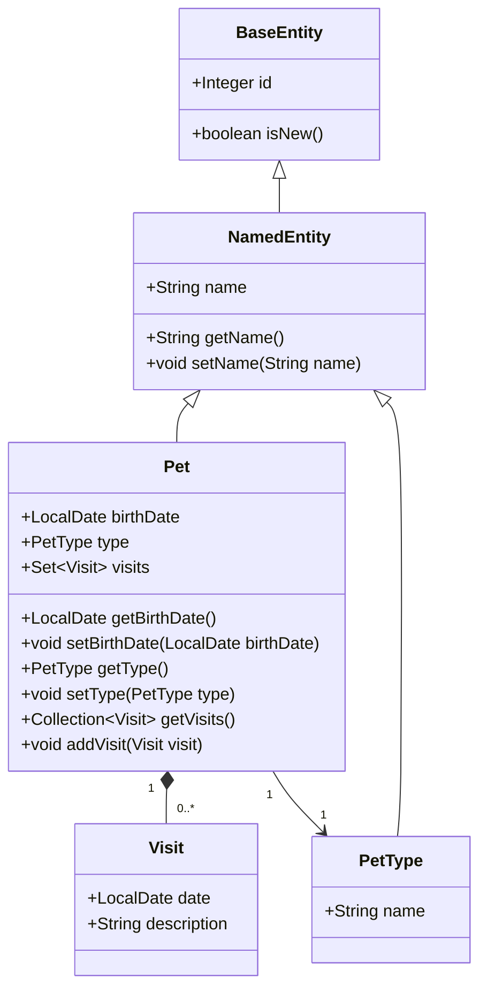
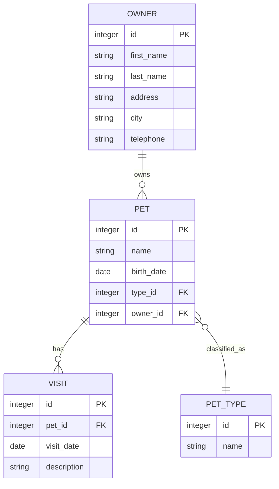
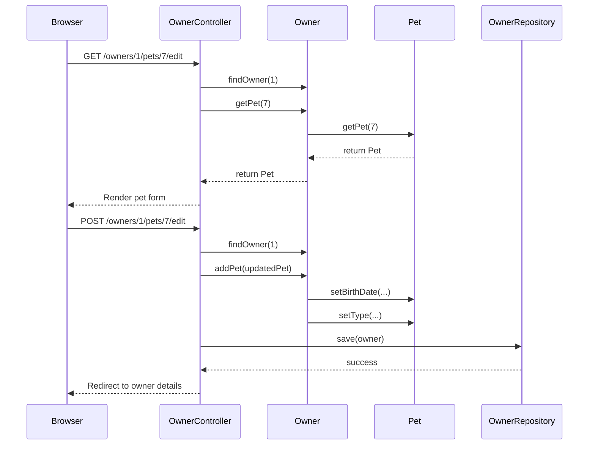
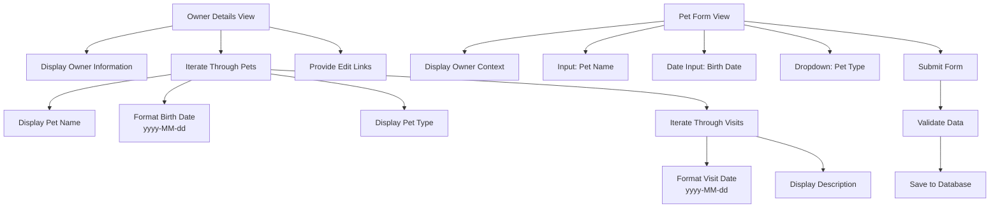

# Pet

<cite>
**Referenced Files in This Document**   
- [Pet.java](file://src/main/java/org/springframework/samples/petclinic/owner/Pet.java)
- [NamedEntity.java](file://src/main/java/org/springframework/samples/petclinic/model/NamedEntity.java)
- [Owner.java](file://src/main/java/org/springframework/samples/petclinic/owner/Owner.java)
- [PetController.java](file://src/main/java/org/springframework/samples/petclinic/owner/PetController.java)
- [PetValidator.java](file://src/main/java/org/springframework/samples/petclinic/owner/PetValidator.java)
- [ownerDetails.html](file://src/main/resources/templates/owners/ownerDetails.html)
- [createOrUpdatePetForm.html](file://src/main/resources/templates/pets/createOrUpdatePetForm.html)
- [schema.sql](file://src/main/resources/db/h2/schema.sql)
</cite>

## Table of Contents
1. [Introduction](#introduction)
2. [Core Fields and Relationships](#core-fields-and-relationships)
3. [Inheritance and Base Entity](#inheritance-and-base-entity)
4. [Data Retrieval and Performance](#data-retrieval-and-performance)
5. [Bidirectional Relationship Management](#bidirectional-relationship-management)
6. [Owner Integration and Access Patterns](#owner-integration-and-access-patterns)
7. [Validation and Business Rules](#validation-and-business-rules)
8. [User Interface Representation](#user-interface-representation)
9. [Best Practices and Common Issues](#best-practices-and-common-issues)

## Introduction
The Pet entity represents animals owned by clients in the veterinary clinic system. It serves as a central domain object that captures essential information about each animal, including its name, birth date, species type, and medical visit history. The entity is designed with JPA annotations to map to the database schema and integrates with Spring Framework features for web presentation and validation. This documentation details the structure, relationships, and usage patterns of the Pet entity within the application ecosystem.

## Core Fields and Relationships
The Pet entity contains several key fields that define its attributes and relationships. The `birthDate` field is annotated with `@DateTimeFormat(pattern = "yyyy-MM-dd")`, ensuring consistent date formatting across the application. This pattern is used both for parsing input and formatting output in web forms and views. The field uses Java's `LocalDate` type for date-only representation without time components.

The entity maintains a many-to-one relationship with `PetType` through the `type` field, establishing the species or breed classification of the pet. This relationship is mapped via `@ManyToOne` annotation with a foreign key column `type_id` in the pets table. Each pet must be associated with a valid pet type, which is enforced through validation rules.

A one-to-many relationship exists between Pet and Visit entities, represented by the `visits` collection field. This relationship is configured with `@OneToMany` annotation and uses `FetchType.EAGER` to ensure visit history is loaded when a pet is retrieved. The collection is ordered by visit date in ascending order using `@OrderBy("date ASC")` to present chronological visit history.

**Section sources**
- [Pet.java](file://src/main/java/org/springframework/samples/petclinic/owner/Pet.java#L47-L58)

## Inheritance and Base Entity
The Pet entity extends `NamedEntity`, inheriting the `name` field that provides a consistent naming pattern across various domain objects in the application. This inheritance relationship allows all named entities (such as Pet, PetType, Owner, and Vet) to share common functionality and constraints. The `@NotBlank` validation constraint on the inherited name field ensures that every pet must have a non-empty name.

By extending `NamedEntity`, which itself extends `BaseEntity`, the Pet class inherits both the `id` field for database identification and the `name` field for human-readable identification. This hierarchical design promotes code reuse and consistency across the domain model. The inheritance chain enables polymorphic behavior and standardized handling of named entities throughout the application.

**Diagram sources**
- [Pet.java](file://src/main/java/org/springframework/samples/petclinic/owner/Pet.java#L43-L84)
- [NamedEntity.java](file://src/main/java/org/springframework/samples/petclinic/model/NamedEntity.java#L29-L49)
- [PetType.java](file://src/main/java/org/springframework/samples/petclinic/owner/PetType.java#L15-L18)

## Data Retrieval and Performance
The Pet entity uses `FetchType.EAGER` for its visits collection, which has significant implications for data retrieval performance. When a Pet is loaded from the database, its associated visits are automatically fetched in the same query, eliminating the need for additional database calls when accessing visit history. This approach optimizes performance for use cases where visit data is frequently accessed alongside pet information, such as in owner detail views.

However, this eager fetching strategy may lead to performance overhead when visit data is not needed, as it always retrieves the complete visit history regardless of whether it will be used. The trade-off favors read performance over memory efficiency, which is appropriate for a veterinary clinic application where viewing a pet's medical history is a common operation. The use of `LinkedHashSet` for the visits collection maintains insertion order while preventing duplicate entries.

The database schema reflects these relationships with foreign key constraints that ensure referential integrity. The pets table contains a `type_id` column that references the types table, and the visits table contains a `pet_id` column that references the pets table, creating a normalized data structure.

**Diagram sources**
- [Pet.java](file://src/main/java/org/springframework/samples/petclinic/owner/Pet.java#L55-L58)
- [schema.sql](file://src/main/resources/db/h2/schema.sql#L45-L63)

## Bidirectional Relationship Management
The `addVisit()` method plays a crucial role in maintaining bidirectional relationships between Pet and Visit entities. This method provides a controlled way to add visits to a pet's history while encapsulating the collection management logic. By exposing this method instead of a setter for the entire visits collection, the entity maintains control over how visits are added, ensuring consistency and enabling potential future validation or business logic.

The method implementation is straightforward, adding the provided Visit instance to the internal visits collection through the `getVisits()` accessor. This design follows the principle of encapsulation, hiding the internal representation of the collection (a `LinkedHashSet`) from external callers. The method ensures that all additions to the visits collection go through a single, well-defined entry point, which could be extended to include additional logic such as date validation or visit deduplication in the future.

This approach supports the bidirectional nature of the relationship, where visits can be accessed from the pet level and pets can be accessed from the visit level through the owner hierarchy. The method works in conjunction with the Owner entity's `addVisit()` method, which first locates the appropriate pet before adding a visit.

**Section sources**
- [Pet.java](file://src/main/java/org/springframework/samples/petclinic/owner/Pet.java#L80-L82)
- [Owner.java](file://src/main/java/org/springframework/samples/petclinic/owner/Owner.java#L162-L172)

## Owner Integration and Access Patterns
Pet entities are managed within the Owner's pets collection, reflecting the real-world relationship between clients and their animals. The Owner class maintains a one-to-many relationship with Pet through its `pets` field, which is also configured with `FetchType.EAGER` to ensure pet information is loaded when an owner is retrieved. This design supports the common use case of displaying all pets belonging to an owner in a single view.

The Owner class provides several methods for accessing pets: `getPet(Integer id)` retrieves a pet by its database identifier, `getPet(String name)` finds a pet by name (including new pets), and `getPet(String name, boolean ignoreNew)` allows filtering out unsaved pets. These methods enable flexible lookup patterns while handling the distinction between persisted and transient pet instances.

The OwnerController methods facilitate web-based access to pet data, with endpoints for creating, updating, and viewing pets within the context of their owner. The controller uses model attributes to automatically resolve owner and pet instances from path variables, streamlining the handling of pet-related operations in the web layer.

**Diagram sources**
- [Owner.java](file://src/main/java/org/springframework/samples/petclinic/owner/Owner.java#L110-L125)
- [PetController.java](file://src/main/java/org/springframework/samples/petclinic/owner/PetController.java#L67-L79)

## Validation and Business Rules
The Pet entity is validated using a dedicated `PetValidator` class that implements Spring's Validator interface. This validator enforces several business rules: the pet name cannot be empty, the pet type must be specified for new pets, and the birth date cannot be null. These rules are applied during form submission through the `@InitBinder` method in `PetController`, which registers the validator for pet objects.

Additional validation occurs in the controller layer, where business rules prevent duplicate pet names for the same owner and ensure the birth date is not in the future. The `processCreationForm` and `processUpdateForm` methods in `PetController` check for existing pets with the same name and reject the operation if a conflict is found, maintaining data integrity at the business logic level.

The validation framework integrates with Spring MVC to provide user feedback through binding results, displaying appropriate error messages in the web interface when validation fails. This multi-layered approach to validation ensures data quality while providing a good user experience.

**Section sources**
- [PetValidator.java](file://src/main/java/org/springframework/samples/petclinic/owner/PetValidator.java#L35-L53)
- [PetController.java](file://src/main/java/org/springframework/samples/petclinic/owner/PetController.java#L98-L118)

## User Interface Representation
Pet data is displayed in the owner detail view (`ownerDetails.html`), which presents a comprehensive overview of an owner's pets and their visit histories. The view iterates through the owner's pets collection, displaying each pet's name, birth date (formatted using the `#temporals.format` utility with the "yyyy-MM-dd" pattern), and type. For each pet, a table shows all associated visits with their dates and descriptions, providing immediate access to medical history.

The pet creation and editing form (`createOrUpdatePetForm.html`) provides a user-friendly interface for managing pet information. It displays the owner's name for context and includes input fields for the pet's name, birth date (as a date input type), and type (as a dropdown selection populated with available pet types). The form uses Thymeleaf templates to bind data to the Pet object and display validation errors.

These views leverage the eager fetching strategy to display complete pet and visit information without requiring additional server requests, creating a responsive user experience. The consistent use of date formatting ensures that birth dates and visit dates are presented uniformly throughout the application.

**Diagram sources**
- [ownerDetails.html](file://src/main/resources/templates/owners/ownerDetails.html#L1-L103)
- [createOrUpdatePetForm.html](file://src/main/resources/templates/pets/createOrUpdatePetForm.html#L1-L39)

## Best Practices and Common Issues
When working with the Pet entity, several best practices should be followed to avoid common issues. Date format validation errors can occur if users enter dates in formats other than "yyyy-MM-dd"; this is mitigated by using HTML5 date input fields that provide a date picker interface. Developers should ensure that all date formatting across the application uses the same pattern to maintain consistency.

A common issue arises when managing pet-type associations, particularly when the list of available pet types is not properly loaded into the view. This can result in validation errors when submitting forms. The `populatePetTypes()` method in `PetController` addresses this by adding available pet types to the model, but developers must ensure this model attribute is available in all relevant views.

Performance considerations include the impact of eager fetching on memory usage, especially for owners with many pets and extensive visit histories. While this strategy improves response times for typical use cases, it may lead to memory pressure in scenarios with large data sets. Monitoring application performance and considering lazy loading for less frequently accessed data may be necessary in high-volume environments.

**Section sources**
- [Pet.java](file://src/main/java/org/springframework/samples/petclinic/owner/Pet.java#L47-L49)
- [PetController.java](file://src/main/java/org/springframework/samples/petclinic/owner/PetController.java#L55-L65)