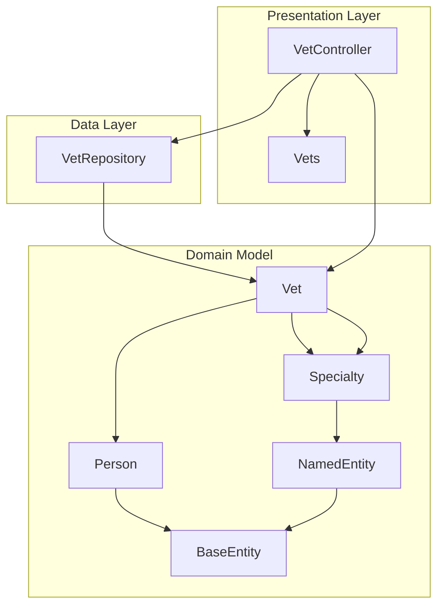
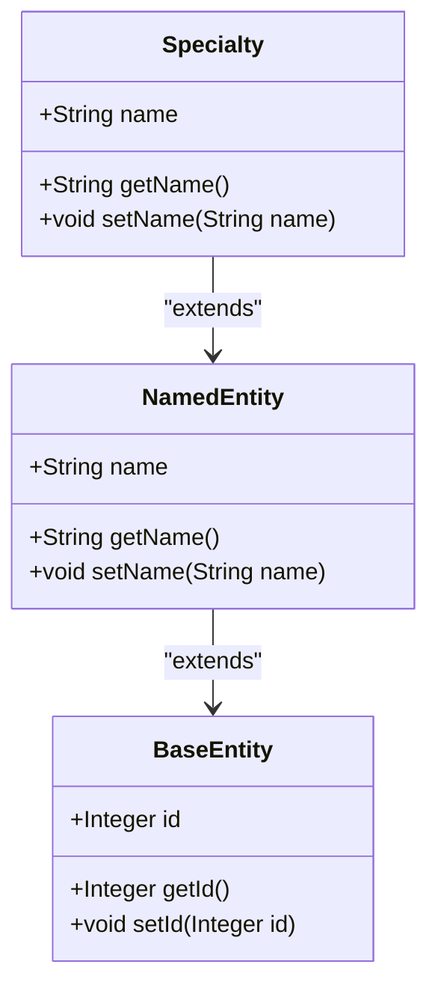
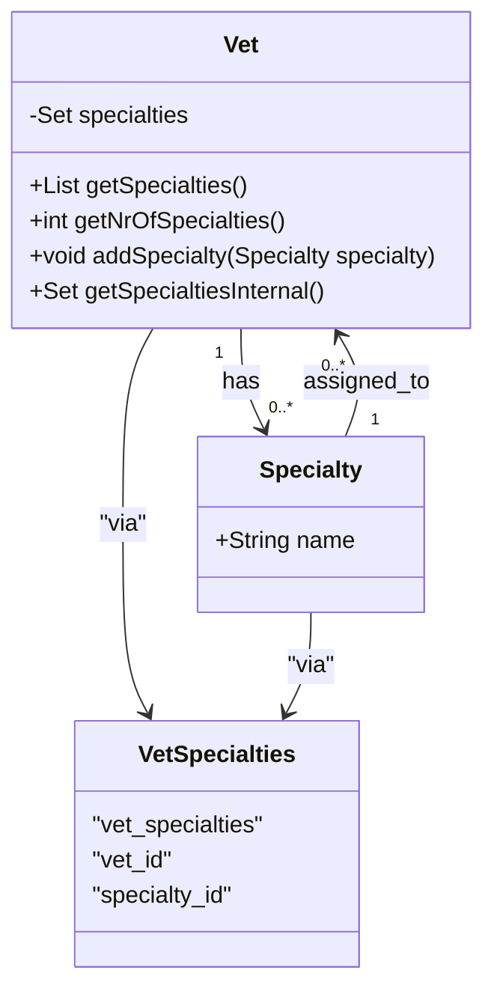
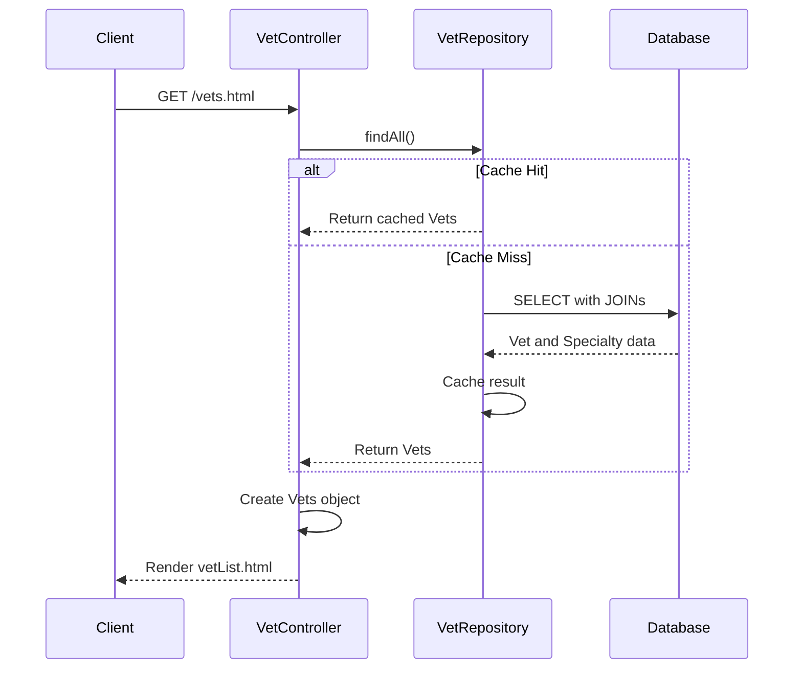
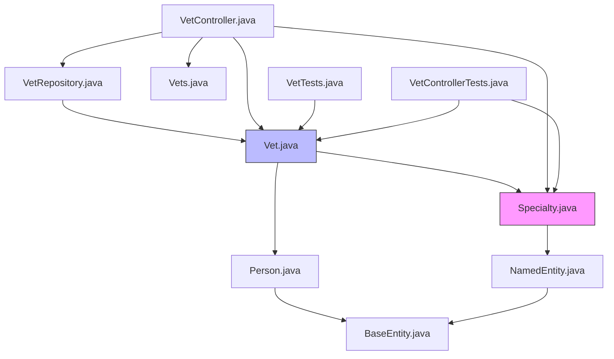

# Specialty

<cite>
**Referenced Files in This Document**   
- [Specialty.java](file://src/main/java/org/springframework/samples/petclinic/vet/Specialty.java)
- [NamedEntity.java](file://src/main/java/org/springframework/samples/petclinic/model/NamedEntity.java)
- [Vet.java](file://src/main/java/org/springframework/samples/petclinic/vet/Vet.java)
- [VetRepository.java](file://src/main/java/org/springframework/samples/petclinic/vet/VetRepository.java)
- [Vets.java](file://src/main/java/org/springframework/samples/petclinic/vet/Vets.java)
- [schema.sql](file://src/main/resources/db/h2/schema.sql)
- [data.sql](file://src/main/resources/db/h2/data.sql)
</cite>

## Table of Contents
1. [Introduction](#introduction)
2. [Core Components](#core-components)
3. [Architecture Overview](#architecture-overview)
4. [Detailed Component Analysis](#detailed-component-analysis)
5. [Dependency Analysis](#dependency-analysis)
6. [Performance Considerations](#performance-considerations)
7. [Troubleshooting Guide](#troubleshooting-guide)
8. [Conclusion](#conclusion)

## Introduction
The Specialty entity in the Spring PetClinic application represents areas of veterinary expertise that veterinarians can possess. This documentation provides a comprehensive analysis of the Specialty entity, its inheritance relationship with NamedEntity, and its many-to-many relationship with the Vet entity. The document covers the entity's implementation, database schema, data seeding process, and usage patterns throughout the application lifecycle.

**Section sources**
- [Specialty.java](file://src/main/java/org/springframework/samples/petclinic/vet/Specialty.java#L1-L31)
- [NamedEntity.java](file://src/main/java/org/springframework/samples/petclinic/model/NamedEntity.java#L1-L50)

## Core Components

The Specialty entity is a fundamental component of the veterinary management system, enabling the categorization of veterinarians by their areas of expertise. It extends the NamedEntity base class to inherit common functionality while establishing a bidirectional many-to-many relationship with the Vet entity through the vet_specialties join table. The entity is persisted using JPA annotations and participates in XML/JSON serialization for API responses.

**Section sources**
- [Specialty.java](file://src/main/java/org/springframework/samples/petclinic/vet/Specialty.java#L1-L31)
- [Vet.java](file://src/main/java/org/springframework/samples/petclinic/vet/Vet.java#L1-L74)
- [VetRepository.java](file://src/main/java/org/springframework/samples/petclinic/vet/VetRepository.java#L1-L58)

## Architecture Overview

The Specialty entity is integrated into the application architecture as a key component of the veterinary domain model. It participates in the entity relationship model alongside Vet, Owner, Pet, and Visit entities, with specific focus on the professional qualifications aspect of veterinarians.



**Diagram sources**
- [Specialty.java](file://src/main/java/org/springframework/samples/petclinic/vet/Specialty.java#L1-L31)
- [Vet.java](file://src/main/java/org/springframework/samples/petclinic/vet/Vet.java#L1-L74)
- [VetRepository.java](file://src/main/java/org/springframework/samples/petclinic/vet/VetRepository.java#L1-L58)
- [VetController.java](file://src/main/java/org/springframework/samples/petclinic/vet/VetController.java#L1-L60)

## Detailed Component Analysis

### Specialty Entity Analysis
The Specialty entity represents a veterinarian's area of expertise such as radiology, surgery, or dentistry. It extends the NamedEntity class to inherit the name field and associated validation constraints, ensuring consistent categorization across the application.



**Diagram sources**
- [Specialty.java](file://src/main/java/org/springframework/samples/petclinic/vet/Specialty.java#L27-L31)
- [NamedEntity.java](file://src/main/java/org/springframework/samples/petclinic/model/NamedEntity.java#L29-L49)

**Section sources**
- [Specialty.java](file://src/main/java/org/springframework/samples/petclinic/vet/Specialty.java#L1-L31)
- [NamedEntity.java](file://src/main/java/org/springframework/samples/petclinic/model/NamedEntity.java#L1-L50)

### Vet-Specialty Relationship Analysis
The relationship between Vet and Specialty entities is implemented as a bidirectional many-to-many association, allowing veterinarians to have multiple specialties and specialties to be associated with multiple veterinarians.



**Diagram sources**
- [Vet.java](file://src/main/java/org/springframework/samples/petclinic/vet/Vet.java#L42-L73)
- [Specialty.java](file://src/main/java/org/springframework/samples/petclinic/vet/Specialty.java#L27-L31)
- [schema.sql](file://src/main/resources/db/h2/schema.sql#L15-L22)

**Section sources**
- [Vet.java](file://src/main/java/org/springframework/samples/petclinic/vet/Vet.java#L42-L73)
- [schema.sql](file://src/main/resources/db/h2/schema.sql#L15-L22)

### Data Access and Repository Analysis
The VetRepository interface provides data access methods for retrieving veterinarian information, including their associated specialties. The repository leverages Spring Data JPA and caching to optimize performance for frequently accessed veterinary data.



**Diagram sources**
- [VetRepository.java](file://src/main/java/org/springframework/samples/petclinic/vet/VetRepository.java#L1-L58)
- [VetController.java](file://src/main/java/org/springframework/samples/petclinic/vet/VetController.java#L43-L51)
- [Vets.java](file://src/main/java/org/springframework/samples/petclinic/vet/Vets.java#L1-L43)

**Section sources**
- [VetRepository.java](file://src/main/java/org/springframework/samples/petclinic/vet/VetRepository.java#L1-L58)
- [VetController.java](file://src/main/java/org/springframework/samples/petclinic/vet/VetController.java#L43-L60)

## Dependency Analysis

The Specialty entity participates in a network of dependencies that connect the domain model, data access layer, and presentation components of the application.



**Diagram sources**
- [Specialty.java](file://src/main/java/org/springframework/samples/petclinic/vet/Specialty.java#L1-L31)
- [Vet.java](file://src/main/java/org/springframework/samples/petclinic/vet/Vet.java#L1-L74)
- [NamedEntity.java](file://src/main/java/org/springframework/samples/petclinic/model/NamedEntity.java#L1-L50)
- [VetRepository.java](file://src/main/java/org/springframework/samples/petclinic/vet/VetRepository.java#L1-L58)
- [VetController.java](file://src/main/java/org/springframework/samples/petclinic/vet/VetController.java#L1-L60)

**Section sources**
- [Specialty.java](file://src/main/java/org/springframework/samples/petclinic/vet/Specialty.java#L1-L31)
- [Vet.java](file://src/main/java/org/springframework/samples/petclinic/vet/Vet.java#L1-L74)
- [VetRepository.java](file://src/main/java/org/springframework/samples/petclinic/vet/VetRepository.java#L1-L58)

## Performance Considerations
The Specialty entity implementation includes several performance considerations. The many-to-many relationship with Vet uses FetchType.EAGER to optimize retrieval of specialty information when veterinarians are loaded, reducing the need for additional database queries. The VetRepository is annotated with @Cacheable("vets") to cache the complete list of veterinarians and their specialties, significantly improving response times for the veterinary listing page. The getSpecialties() method returns a sorted list of specialties, ensuring consistent presentation order across different application instances.

**Section sources**
- [Vet.java](file://src/main/java/org/springframework/samples/petclinic/vet/Vet.java#L46-L49)
- [VetRepository.java](file://src/main/java/org/springframework/samples/petclinic/vet/VetRepository.java#L35-L38)

## Troubleshooting Guide

### Specialty Name Uniqueness
The current implementation does not enforce database-level uniqueness constraints on specialty names. While the application seeds standard specialties (radiology, surgery, dentistry), there is potential for duplicate specialty names to be created. To address this, consider adding a unique constraint to the specialties table:

```sql
ALTER TABLE specialties ADD CONSTRAINT uk_specialties_name UNIQUE (name);
```

### Data Seeding Issues
Specialty data is seeded in the database initialization scripts across different database platforms. Ensure consistency by verifying that the same specialty names are used in all data.sql files:

- H2: `INSERT INTO specialties VALUES (default, 'radiology');`
- MySQL: `INSERT IGNORE INTO specialties VALUES (1, 'radiology');`
- PostgreSQL: `INSERT INTO specialties (name) SELECT 'radiology' WHERE NOT EXISTS (SELECT * FROM specialties WHERE name='radiology');`

### Bidirectional Relationship Management
When adding specialties to veterinarians, always use the addSpecialty() method rather than directly manipulating the internal Set. This ensures proper initialization of the collection:

```java
// Correct usage
vet.addSpecialty(specialty);

// Avoid direct manipulation
vet.getSpecialtiesInternal().add(specialty); // Not recommended
```

**Section sources**
- [data.sql](file://src/main/resources/db/h2/data.sql#L7-L9)
- [schema.sql](file://src/main/resources/db/h2/schema.sql#L15-L17)
- [Vet.java](file://src/main/java/org/springframework/samples/petclinic/vet/Vet.java#L69-L71)

## Conclusion
The Specialty entity serves as a critical component in the veterinary domain model, enabling the categorization of veterinarians by their areas of expertise. By extending the NamedEntity base class, it inherits consistent naming and validation patterns used throughout the application. The bidirectional many-to-many relationship with the Vet entity, implemented through the vet_specialties join table, allows for flexible representation of veterinary qualifications. The entity is properly integrated into the data access and presentation layers, with caching and sorting mechanisms in place to ensure optimal performance. When extending the specialty list, maintain consistency with existing naming conventions and consider adding uniqueness constraints to prevent duplicate entries.