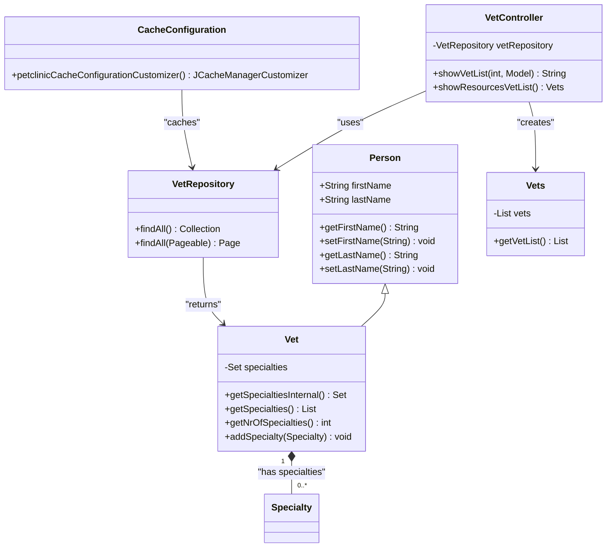
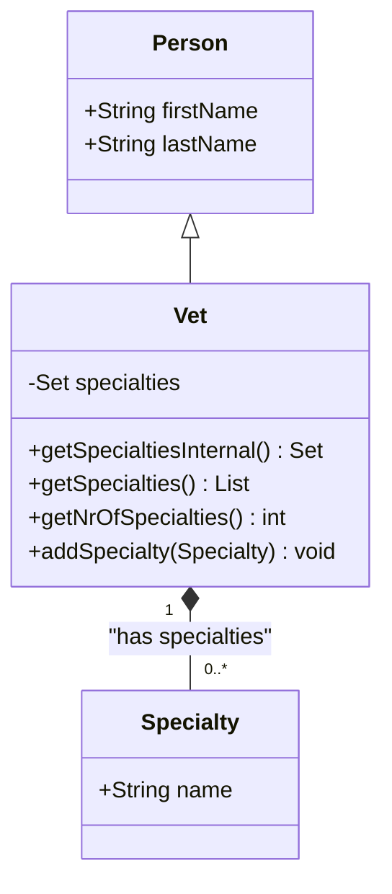
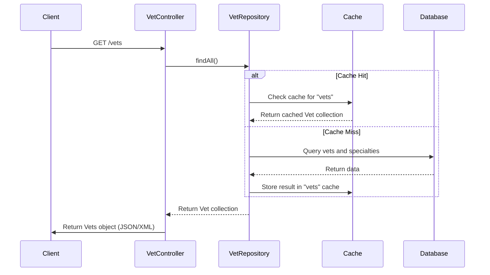
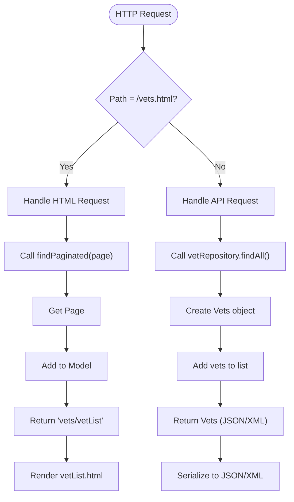
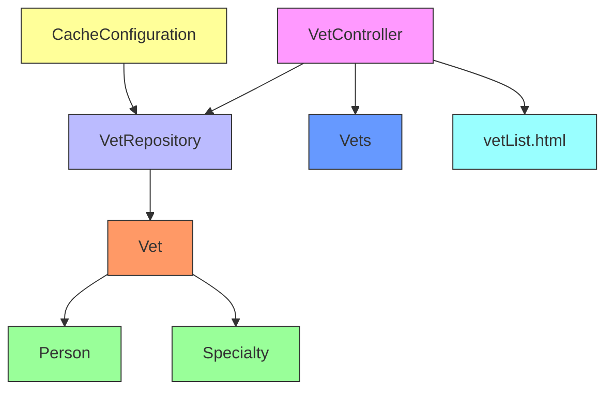

# Vet

<cite>
**Referenced Files in This Document**   
- [Vet.java](file://src/main/java/org/springframework/samples/petclinic/vet/Vet.java)
- [Specialty.java](file://src/main/java/org/springframework/samples/petclinic/vet/Specialty.java)
- [Person.java](file://src/main/java/org/springframework/samples/petclinic/model/Person.java)
- [CacheConfiguration.java](file://src/main/java/org/springframework/samples/petclinic/system/CacheConfiguration.java)
- [VetController.java](file://src/main/java/org/springframework/samples/petclinic/vet/VetController.java)
- [VetRepository.java](file://src/main/java/org/springframework/samples/petclinic/vet/VetRepository.java)
- [Vets.java](file://src/main/java/org/springframework/samples/petclinic/vet/Vets.java)
- [vetList.html](file://src/main/resources/templates/vets/vetList.html)
- [schema.sql](file://src/main/resources/db/h2/schema.sql)
</cite>

## Table of Contents
1. [Introduction](#introduction)
2. [Core Components](#core-components)
3. [Architecture Overview](#architecture-overview)
4. [Detailed Component Analysis](#detailed-component-analysis)
5. [Dependency Analysis](#dependency-analysis)
6. [Performance Considerations](#performance-considerations)
7. [Troubleshooting Guide](#troubleshooting-guide)
8. [Conclusion](#conclusion)

## Introduction
The Vet entity represents veterinarians within the clinic management system, serving as a specialized extension of the Person class with additional professional attributes. This documentation provides a comprehensive analysis of the Vet entity's implementation, focusing on its inheritance pattern, relationship management with specialties, data access patterns, and integration with the web interface. The Vet entity demonstrates key design patterns including inheritance, many-to-many relationships, eager loading strategies, and caching mechanisms that are essential to the application's performance and functionality.

## Core Components
The Vet entity is a central component in the veterinary clinic domain model, extending the Person class to inherit personal information attributes while adding professional specialization capabilities. It maintains a many-to-many relationship with the Specialty entity through a dedicated join table, allowing veterinarians to have multiple areas of expertise. The entity is integrated with Spring's caching mechanism to optimize data retrieval performance and is exposed through REST endpoints for both HTML and API access. Key components include the Vet entity itself, the Specialty entity, the VetRepository for data access, and the VetController for handling web requests.

**Section sources**
- [Vet.java](file://src/main/java/org/springframework/samples/petclinic/vet/Vet.java#L42-L73)
- [Specialty.java](file://src/main/java/org/springframework/samples/petclinic/vet/Specialty.java#L27-L31)
- [Person.java](file://src/main/java/org/springframework/samples/petclinic/model/Person.java#L26-L53)

## Architecture Overview

**Diagram sources **
- [Vet.java](file://src/main/java/org/springframework/samples/petclinic/vet/Vet.java#L42-L73)
- [Specialty.java](file://src/main/java/org/springframework/samples/petclinic/vet/Specialty.java#L27-L31)
- [Person.java](file://src/main/java/org/springframework/samples/petclinic/model/Person.java#L26-L53)
- [VetRepository.java](file://src/main/java/org/springframework/samples/petclinic/vet/VetRepository.java#L37-L57)
- [VetController.java](file://src/main/java/org/springframework/samples/petclinic/vet/VetController.java#L37-L78)
- [Vets.java](file://src/main/java/org/springframework/samples/petclinic/vet/Vets.java#L29-L42)
- [CacheConfiguration.java](file://src/main/java/org/springframework/samples/petclinic/system/CacheConfiguration.java#L26-L53)

## Detailed Component Analysis

### Vet Entity Analysis
The Vet entity extends the Person class to inherit firstName and lastName attributes while adding professional specialization capabilities through a many-to-many relationship with the Specialty entity. This inheritance pattern allows for code reuse while extending functionality for veterinarian-specific requirements.

**Diagram sources **
- [Vet.java](file://src/main/java/org/springframework/samples/petclinic/vet/Vet.java#L42-L73)
- [Specialty.java](file://src/main/java/org/springframework/samples/petclinic/vet/Specialty.java#L27-L31)
- [Person.java](file://src/main/java/org/springframework/samples/petclinic/model/Person.java#L26-L53)

### Data Access and Caching Analysis
The Vet entity is accessed through the VetRepository interface, which provides methods for retrieving all veterinarians with built-in caching support. The repository methods are annotated with @Cacheable("vets") to store results in the application cache, significantly improving performance for frequently accessed data. The CacheConfiguration class defines the cache settings, enabling statistics collection for monitoring cache performance.

**Diagram sources **
- [VetRepository.java](file://src/main/java/org/springframework/samples/petclinic/vet/VetRepository.java#L37-L57)
- [VetController.java](file://src/main/java/org/springframework/samples/petclinic/vet/VetController.java#L68-L75)
- [CacheConfiguration.java](file://src/main/java/org/springframework/samples/petclinic/system/CacheConfiguration.java#L26-L53)

### Web Interface Integration
The Vet data is displayed in the user interface through the vetList.html template, which renders a paginated table of veterinarians and their specialties. The VetController handles both HTML and API requests, using different response formats for each. For HTML requests, it returns a view name with model attributes for Thymeleaf rendering, while API requests return a Vets object that can be serialized to JSON or XML.

**Diagram sources **
- [VetController.java](file://src/main/java/org/springframework/samples/petclinic/vet/VetController.java#L43-L60)
- [vetList.html](file://src/main/resources/templates/vets/vetList.html#L0-L57)

## Dependency Analysis

**Diagram sources **
- [Vet.java](file://src/main/java/org/springframework/samples/petclinic/vet/Vet.java#L42-L73)
- [VetRepository.java](file://src/main/java/org/springframework/samples/petclinic/vet/VetRepository.java#L37-L57)
- [VetController.java](file://src/main/java/org/springframework/samples/petclinic/vet/VetController.java#L37-L78)
- [Vets.java](file://src/main/java/org/springframework/samples/petclinic/vet/Vets.java#L29-L42)
- [Person.java](file://src/main/java/org/springframework/samples/petclinic/model/Person.java#L26-L53)
- [Specialty.java](file://src/main/java/org/springframework/samples/petclinic/vet/Specialty.java#L27-L31)
- [CacheConfiguration.java](file://src/main/java/org/springframework/samples/petclinic/system/CacheConfiguration.java#L26-L53)
- [vetList.html](file://src/main/resources/templates/vets/vetList.html#L0-L57)

## Performance Considerations
The Vet entity employs several performance optimization strategies. The FetchType.EAGER configuration for the specialties relationship ensures that all specialty data is loaded in a single query, eliminating the N+1 query problem. However, this approach increases the initial query complexity and data transfer size. The @Cacheable("vets") annotation on repository methods provides significant performance benefits by storing frequently accessed veterinarian data in memory, reducing database load. The pagination implementation in the showVetList method limits the number of records retrieved at once, improving response times for large datasets. The use of Java 8 streams in the getSpecialties() method provides efficient sorting and transformation of specialty data with minimal memory overhead.

**Section sources**
- [Vet.java](file://src/main/java/org/springframework/samples/petclinic/vet/Vet.java#L46-L49)
- [VetRepository.java](file://src/main/java/org/springframework/samples/petclinic/vet/VetRepository.java#L43-L45)
- [VetController.java](file://src/main/java/org/springframework/samples/petclinic/vet/VetController.java#L62-L66)

## Troubleshooting Guide
Common issues with the Vet entity typically involve specialty assignment conflicts and caching inconsistencies. When adding specialties to a veterinarian, ensure that the Specialty objects are properly initialized and have valid IDs to prevent constraint violations in the vet_specialties join table. Cache-related issues may occur when data becomes stale; the application's cache configuration enables statistics collection that can help identify cache hit/miss ratios and performance bottlenecks. For pagination issues, verify that the Pageable object is correctly configured with the appropriate page size and number. When troubleshooting data display problems in the vetList.html template, check that the model attributes (currentPage, totalPages, listVets) are properly set in the addPaginationModel method. Serialization issues with the Vets object can occur if the JAXB annotations are not properly configured, so ensure that the @XmlRootElement and @XmlElement annotations are present on the appropriate classes and methods.

**Section sources**
- [Vet.java](file://src/main/java/org/springframework/samples/petclinic/vet/Vet.java#L69-L71)
- [VetController.java](file://src/main/java/org/springframework/samples/petclinic/vet/VetController.java#L53-L60)
- [vetList.html](file://src/main/resources/templates/vets/vetList.html#L0-L57)
- [Vets.java](file://src/main/java/org/springframework/samples/petclinic/vet/Vets.java#L34-L40)

## Conclusion
The Vet entity represents a well-designed implementation of a veterinary professional in the clinic management system, demonstrating effective use of inheritance, relationship mapping, and performance optimization techniques. By extending the Person class, it leverages existing personal information functionality while adding specialized capabilities for managing professional specialties. The many-to-many relationship with Specialty entities through the vet_specialties join table provides flexibility in assigning areas of expertise to veterinarians. The combination of eager fetching, caching, and pagination ensures optimal performance for both data access and user interface rendering. The integration with Spring's web framework allows for seamless exposure of veterinarian data through both HTML views and RESTful API endpoints, making it a versatile and efficient component of the overall system architecture.