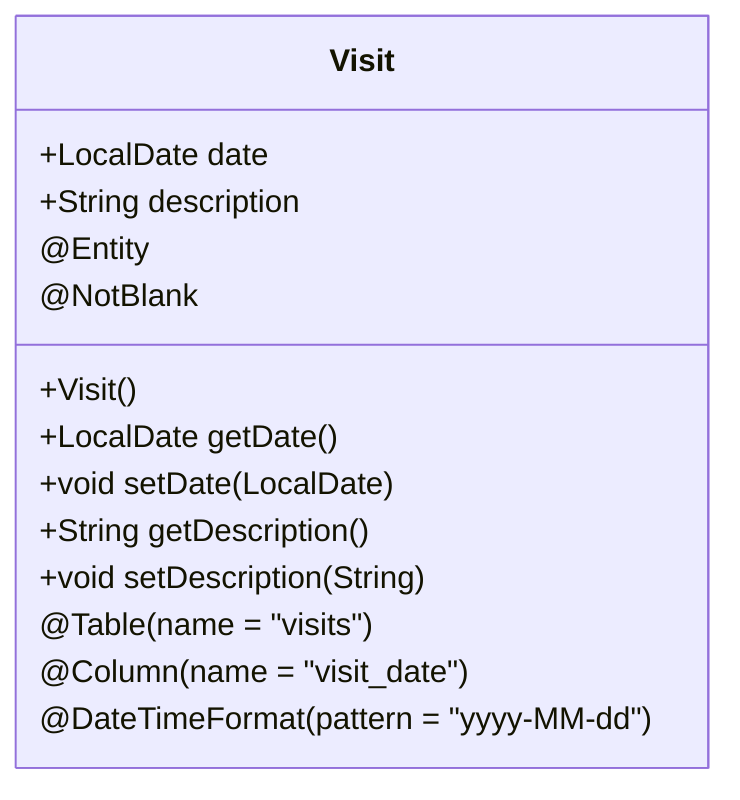
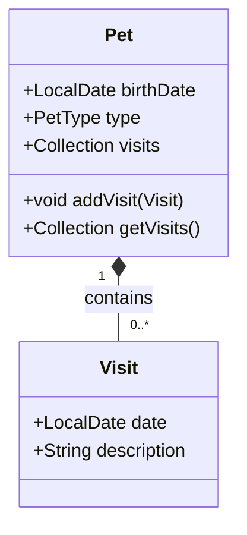
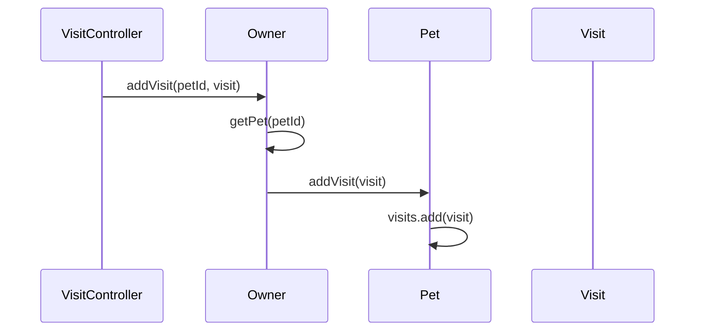
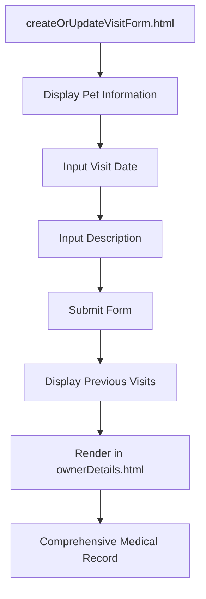
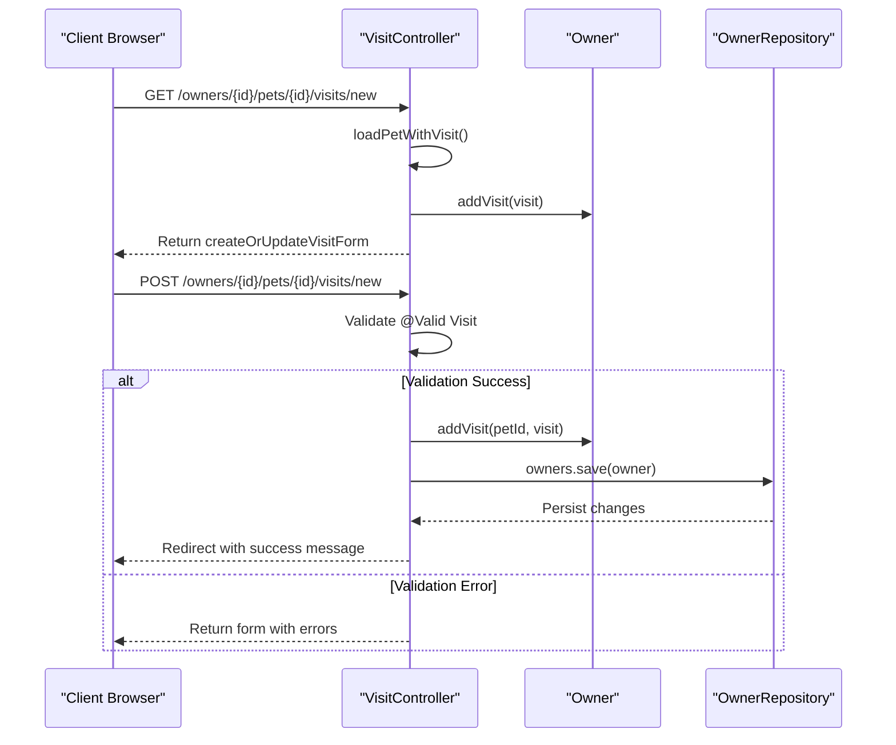

# Visit

<cite>
**Referenced Files in This Document**   
- [Visit.java](file://src/main/java/org/springframework/samples/petclinic/owner/Visit.java)
- [Pet.java](file://src/main/java/org/springframework/samples/petclinic/owner/Pet.java)
- [VisitController.java](file://src/main/java/org/springframework/samples/petclinic/owner/VisitController.java)
- [createOrUpdateVisitForm.html](file://src/main/resources/templates/pets/createOrUpdateVisitForm.html)
- [ownerDetails.html](file://src/main/resources/templates/owners/ownerDetails.html)
- [Owner.java](file://src/main/java/org/springframework/samples/petclinic/owner/Owner.java)
</cite>

## Table of Contents
1. [Introduction](#introduction)
2. [Core Fields and Validation](#core-fields-and-validation)
3. [Entity Relationships](#entity-relationships)
4. [Data Management and Referential Integrity](#data-management-and-referential-integrity)
5. [User Interface Integration](#user-interface-integration)
6. [Validation and Persistence Workflow](#validation-and-persistence-workflow)
7. [Common Issues and Best Practices](#common-issues-and-best-practices)
8. [Conclusion](#conclusion)

## Introduction
The Visit entity in the Spring PetClinic application serves as a critical component for tracking medical appointments and treatments for pets. This documentation provides a comprehensive analysis of the Visit entity, detailing its structure, relationships, and integration within the clinic's medical record system. The entity enables comprehensive visit history tracking by establishing a one-to-many relationship with the Pet entity, allowing each pet to maintain a chronological record of all medical interactions. The documentation covers the entity's field definitions, validation constraints, relationship management, user interface integration, and the complete workflow from data creation to persistence.

**Section sources**
- [Visit.java](file://src/main/java/org/springframework/samples/petclinic/owner/Visit.java#L33-L67)
- [Pet.java](file://src/main/java/org/springframework/samples/petclinic/owner/Pet.java#L43-L84)

## Core Fields and Validation
The Visit entity contains two primary fields that capture essential information about each medical appointment: date and description. The date field is annotated with @Column(name = "visit_date") and @DateTimeFormat(pattern = "yyyy-MM-dd") to ensure proper database mapping and user interface formatting. Crucially, the date field is initialized to the current date in the default constructor, providing a sensible default value when a new visit is created. This initialization occurs in the Visit() constructor which sets this.date to LocalDate.now(), ensuring that every new visit automatically receives the current date unless explicitly modified.

The description field is annotated with @NotBlank validation constraint, requiring that every visit must have a non-empty description. This validation ensures data integrity by preventing the creation of visits without meaningful medical notes. The @NotBlank annotation is applied directly to the private String description field, making it a mandatory field in the domain model. This validation is enforced both at the entity level and through the web interface, providing consistent data quality across the application layers.

**Diagram sources**
- [Visit.java](file://src/main/java/org/springframework/samples/petclinic/owner/Visit.java#L33-L67)

**Section sources**
- [Visit.java](file://src/main/java/org/springframework/samples/petclinic/owner/Visit.java#L37-L42)
- [Visit.java](file://src/main/java/org/springframework/samples/petclinic/owner/Visit.java#L47-L49)

## Entity Relationships
The Visit entity participates in a one-to-many relationship with the Pet entity, which forms the foundation of the pet medical record system. This relationship is established through the Pet class, which contains a Set<Visit> field annotated with @OneToMany(cascade = CascadeType.ALL, fetch = FetchType.EAGER). The relationship is mapped to the database through the @JoinColumn(name = "pet_id") annotation, creating a foreign key relationship in the visits table that references the pet_id.

The @OrderBy("date ASC") annotation ensures that visits are always retrieved in chronological order, with the oldest visits appearing first. This ordering is critical for medical record keeping, as it allows veterinarians and clinic staff to easily review a pet's medical history in the correct sequence. The FetchType.EAGER configuration means that visit data is loaded immediately when a pet is retrieved, optimizing performance for use cases where visit history is typically displayed alongside pet information.

**Diagram sources**
- [Pet.java](file://src/main/java/org/springframework/samples/petclinic/owner/Pet.java#L43-L58)

**Section sources**
- [Pet.java](file://src/main/java/org/springframework/samples/petclinic/owner/Pet.java#L55-L58)
- [Pet.java](file://src/main/java/org/springframework/samples/petclinic/owner/Pet.java#L76-L78)

## Data Management and Referential Integrity
The Visit entity maintains referential integrity through a well-designed method chain that begins with the Pet's addVisit() method and extends to the Owner's addVisit() method. The Pet class provides a public void addVisit(Visit visit) method that adds a visit to the pet's collection of visits. This method is called by the Owner's addVisit(Integer petId, Visit visit) method, which first retrieves the appropriate pet using getPet(petId) and then delegates to the pet's addVisit method.

This layered approach ensures that visit relationships are properly maintained at multiple levels of the domain model. The Owner's addVisit method includes validation checks using Assert.notNull to ensure both the petId and visit parameters are not null, and verifies that the pet exists before attempting to add the visit. This design pattern prevents orphaned visits and ensures that every visit is properly associated with both a pet and its owner, maintaining the integrity of the medical record system.

**Diagram sources**
- [Owner.java](file://src/main/java/org/springframework/samples/petclinic/owner/Owner.java#L162-L172)
- [Pet.java](file://src/main/java/org/springframework/samples/petclinic/owner/Pet.java#L80-L82)

**Section sources**
- [Owner.java](file://src/main/java/org/springframework/samples/petclinic/owner/Owner.java#L162-L172)
- [Pet.java](file://src/main/java/org/springframework/samples/petclinic/owner/Pet.java#L80-L82)

## User Interface Integration
The Visit entity is integrated into the user interface through the createOrUpdateVisitForm.html template, which provides a form for creating new visits. The template displays the pet's information including name, birth date, type, and owner, providing context for the visit being recorded. The form contains input fields for the visit date and description, with the date field using the "date" input type for proper formatting and validation.

The template also displays previous visits in a table below the form, allowing users to review the pet's medical history before adding a new entry. This historical context is crucial for medical decision-making and ensures continuity of care. The visit data is also rendered in the ownerDetails.html template, where all pets and their associated visits are displayed in a comprehensive view. This integration allows clinic staff to quickly access a complete picture of an owner's pets and their medical histories.

**Diagram sources**
- [createOrUpdateVisitForm.html](file://src/main/resources/templates/pets/createOrUpdateVisitForm.html#L1-L61)
- [ownerDetails.html](file://src/main/resources/templates/owners/ownerDetails.html#L1-L102)

**Section sources**
- [createOrUpdateVisitForm.html](file://src/main/resources/templates/pets/createOrUpdateVisitForm.html#L1-L61)
- [ownerDetails.html](file://src/main/resources/templates/owners/ownerDetails.html#L1-L102)

## Validation and Persistence Workflow
The Visit entity's validation and persistence workflow is managed through the VisitController, which handles the complete lifecycle of visit creation. The process begins with the loadPetWithVisit method, which is called before form initialization and creates a new Visit instance while adding it to the pet's collection. This pre-population ensures that the form has a valid visit object to bind to.

When the form is submitted, the processNewVisitForm method validates the visit data using @Valid annotation, which triggers the @NotBlank validation on the description field. If validation fails, the user is redirected back to the form with error messages. Upon successful validation, the controller calls owner.addVisit(petId, visit) to establish the relationship, saves the owner (which cascades to save the visit due to CascadeType.ALL), and redirects with a success message. This workflow ensures that all validation rules are enforced and that data is persisted correctly within the proper relational context.

**Diagram sources**
- [VisitController.java](file://src/main/java/org/springframework/samples/petclinic/owner/VisitController.java#L61-L97)

**Section sources**
- [VisitController.java](file://src/main/java/org/springframework/samples/petclinic/owner/VisitController.java#L61-L97)

## Common Issues and Best Practices
When working with the Visit entity, several common issues and best practices should be considered. One potential issue is date validation conflicts, particularly when users attempt to enter future dates for visits. While the current implementation does not explicitly prevent future dates, best practice would be to add validation to ensure visit dates are not in the future, as this would represent an illogical medical record entry.

For the description field, while @NotBlank ensures the field is not empty, there are no length constraints defined in the current implementation. Best practice would be to add a @Size annotation to limit the description length, preventing excessively long entries that could impact database performance or UI rendering. Additionally, ensuring that the date field is properly formatted and validated across all layers of the application is crucial for data consistency.

Another best practice is to maintain the chronological ordering of visits through the @OrderBy("date ASC") annotation, which should not be modified as it ensures medical history is presented in the correct sequence. When creating new visits programmatically, developers should be aware that the default constructor automatically sets the date to LocalDate.now(), which may need to be overridden for historical data entry.

**Section sources**
- [Visit.java](file://src/main/java/org/springframework/samples/petclinic/owner/Visit.java#L41-L42)
- [Visit.java](file://src/main/java/org/springframework/samples/petclinic/owner/Visit.java#L47-L49)
- [Pet.java](file://src/main/java/org/springframework/samples/petclinic/owner/Pet.java#L55-L58)

## Conclusion
The Visit entity is a fundamental component of the Spring PetClinic application's medical record system, providing a structured way to track pet appointments and treatments. Through its well-defined fields, validation constraints, and relationships with the Pet and Owner entities, the Visit entity enables comprehensive medical history tracking while maintaining data integrity. The integration of the entity into the user interface through dedicated templates allows for easy data entry and review, while the controller-managed workflow ensures proper validation and persistence. By following best practices for validation and data management, the Visit entity contributes significantly to the overall effectiveness and reliability of the clinic's record-keeping system.