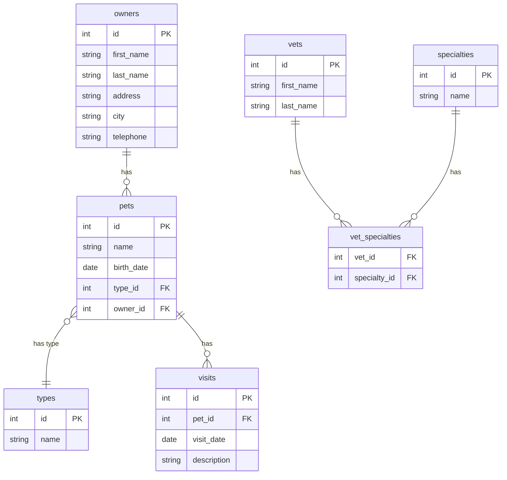

# Database Configuration

<cite>
**Referenced Files in This Document**   
- [application.properties](file://src/main/resources/application.properties)
- [application-mysql.properties](file://src/main/resources/application-mysql.properties)
- [application-postgres.properties](file://src/main/resources/application-postgres.properties)
- [schema.sql](file://src/main/resources/db/h2/schema.sql)
- [data.sql](file://src/main/resources/db/h2/data.sql)
- [schema.sql](file://src/main/resources/db/mysql/schema.sql)
- [data.sql](file://src/main/resources/db/mysql/data.sql)
- [schema.sql](file://src/main/resources/db/postgres/schema.sql)
- [data.sql](file://src/main/resources/db/postgres/data.sql)
- [user.sql](file://src/main/resources/db/mysql/user.sql)
- [petclinic_db_setup_mysql.txt](file://src/main/resources/db/mysql/petclinic_db_setup_mysql.txt)
- [petclinic_db_setup_postgres.txt](file://src/main/resources/db/postgres/petclinic_db_setup_postgres.txt)
- [README.md](file://README.md)
</cite>

## Table of Contents
1. [Default H2 In-Memory Database Configuration](#default-h2-in-memory-database-configuration)
2. [MySQL Database Configuration](#mysql-database-configuration)
3. [PostgreSQL Database Configuration](#postgresql-database-configuration)
4. [Database Schema Design](#database-schema-design)
5. [Initialization Strategies](#initialization-strategies)
6. [Troubleshooting Common Database Issues](#troubleshooting-common-database-issues)
7. [Performance Considerations](#performance-considerations)

## Default H2 In-Memory Database Configuration

The PetClinic application uses H2 as the default in-memory database, configured through the `application.properties` file. The database type is specified via the `database=h2` property, which enables dynamic resolution of SQL script locations using Spring's placeholder mechanism. Schema initialization is handled by `spring.sql.init.schema-locations=classpath*:db/${database}/schema.sql`, pointing to `src/main/resources/db/h2/schema.sql`. Similarly, data population is managed by `spring.sql.init.data-locations=classpath*:db/${database}/data.sql`, referencing `src/main/resources/db/h2/data.sql`.

The H2 console is accessible at `http://localhost:8080/h2-console` for database inspection during development. The connection URL uses a dynamically generated in-memory database name (UUID), printed at application startup. This configuration supports rapid development and testing without requiring external database installations.

**Section sources**
- [application.properties](file://src/main/resources/application.properties#L1-L25)
- [schema.sql](file://src/main/resources/db/h2/schema.sql#L0-L64)
- [data.sql](file://src/main/resources/db/h2/data.sql#L0-L53)
- [README.md](file://README.md#L49-L54)

## MySQL Database Configuration

To configure MySQL as the database backend, activate the `mysql` Spring profile by setting `spring.profiles.active=mysql`. This triggers loading of `application-mysql.properties`, which defines the MySQL-specific configuration. The JDBC URL follows the format `jdbc:mysql://localhost/petclinic`, with environment-variable-driven defaults via `${MYSQL_URL:jdbc:mysql://localhost/petclinic}`. The username and password are similarly configurable using `${MYSQL_USER:petclinic}` and `${MYSQL_PASS:petclinic}` placeholders.

The MySQL setup requires the `petclinic` database to exist prior to application startup. This can be achieved by executing the `db/mysql/user.sql` script, which creates the database, sets UTF-8 character encoding, and grants privileges to the `petclinic` user. Alternatively, the provided `docker-compose.yml` or direct Docker commands can initialize the database container with the necessary environment variables.

MySQL-specific schema and data scripts are located in `src/main/resources/db/mysql/`. The `schema.sql` uses `ENGINE=InnoDB` and `AUTO_INCREMENT` syntax appropriate for MySQL. The `data.sql` file uses `INSERT IGNORE` statements to ensure idempotent execution, preventing errors when records already exist.

**Section sources**
- [application-mysql.properties](file://src/main/resources/application-mysql.properties#L0-L7)
- [schema.sql](file://src/main/resources/db/mysql/schema.sql#L0-L55)
- [data.sql](file://src/main/resources/db/mysql/data.sql#L0-L53)
- [user.sql](file://src/main/resources/db/mysql/user.sql#L0-L7)
- [petclinic_db_setup_mysql.txt](file://src/main/resources/db/mysql/petclinic_db_setup_mysql.txt#L0-L36)
- [README.md](file://README.md#L55-L78)

## PostgreSQL Database Configuration

PostgreSQL configuration is enabled by activating the `postgres` Spring profile (`spring.profiles.active=postgres`), which loads settings from `application-postgres.properties`. The JDBC URL follows the format `jdbc:postgresql://localhost/petclinic`, with defaults provided via `${POSTGRES_URL}`, `${POSTGRES_USER}`, and `${POSTGRES_PASS}` placeholders.

PostgreSQL-specific initialization scripts are located in `src/main/resources/db/postgres/`. The `schema.sql` file uses PostgreSQL syntax including `GENERATED BY DEFAULT AS IDENTITY` for primary keys and `CREATE INDEX ON table_name (column)` for index creation. The `data.sql` file employs conditional `INSERT` statements with `WHERE NOT EXISTS` clauses and `ON CONFLICT DO NOTHING` directives to ensure safe, idempotent data population across multiple application startups.

The database can be initialized using Docker via the provided `docker-compose.yml` file (`docker compose up postgres`) or by running a PostgreSQL container directly with appropriate environment variables. No separate database creation script is needed as the container setup ensures the `petclinic` database exists.

**Section sources**
- [application-postgres.properties](file://src/main/resources/application-postgres.properties#L0-L6)
- [schema.sql](file://src/main/resources/db/postgres/schema.sql#L0-L52)
- [data.sql](file://src/main/resources/db/postgres/data.sql#L0-L53)
- [petclinic_db_setup_postgres.txt](file://src/main/resources/db/postgres/petclinic_db_setup_postgres.txt#L0-L19)
- [README.md](file://README.md#L55-L78)

## Database Schema Design

The PetClinic database schema consists of seven core tables that model the veterinary clinic domain: `owners`, `pets`, `types`, `visits`, `vets`, `specialties`, and `vet_specialties`. The schema implements a normalized relational design with appropriate foreign key constraints and indexes.

The `owners` table stores owner information with fields for name, address, city, and telephone. Each owner can have multiple `pets`, linked via a foreign key. The `pets` table includes a name, birth date, and references to both the owner and pet type (`types` table). The `visits` table records pet visits with a date and description, linked to the pet.

Veterinarians are stored in the `vets` table with first and last names. The many-to-many relationship between vets and specialties is managed through the `vet_specialties` junction table, which enforces uniqueness via a composite primary key. Indexes are defined on frequently queried columns such as `last_name` in `owners` and `vets`, and `name` in `types` and `specialties`.

**Diagram sources**
- [schema.sql](file://src/main/resources/db/h2/schema.sql#L0-L64)
- [schema.sql](file://src/main/resources/db/mysql/schema.sql#L0-L55)
- [schema.sql](file://src/main/resources/db/postgres/schema.sql#L0-L52)

**Section sources**
- [schema.sql](file://src/main/resources/db/h2/schema.sql#L0-L64)
- [schema.sql](file://src/main/resources/db/mysql/schema.sql#L0-L55)
- [schema.sql](file://src/main/resources/db/postgres/schema.sql#L0-L52)

## Initialization Strategies

The PetClinic application employs different initialization strategies based on the active database profile. For H2, the default configuration uses `spring.sql.init.mode=embedded` (default behavior), which automatically detects and executes schema and data scripts for embedded databases. The scripts are executed in order, with `schema.sql` creating the database structure and `data.sql` populating it with initial data.

For MySQL and PostgreSQL, `spring.sql.init.mode=always` is explicitly set, ensuring that initialization scripts run on every application startup regardless of database state. This supports development workflows where the application may be restarted frequently against a persistent database.

Each database platform uses idempotent SQL constructs to prevent errors during repeated executions. H2 uses standard `DROP TABLE IF EXISTS` and `CREATE TABLE` statements. MySQL employs `CREATE TABLE IF NOT EXISTS` and `INSERT IGNORE` to skip existing records. PostgreSQL uses `CREATE TABLE IF NOT EXISTS` and conditional `INSERT` statements with `WHERE NOT EXISTS` and `ON CONFLICT DO NOTHING` clauses.

**Section sources**
- [application.properties](file://src/main/resources/application.properties#L1-L25)
- [application-mysql.properties](file://src/main/resources/application-mysql.properties#L0-L7)
- [application-postgres.properties](file://src/main/resources/application-postgres.properties#L0-L6)
- [data.sql](file://src/main/resources/db/h2/data.sql#L0-L53)
- [data.sql](file://src/main/resources/db/mysql/data.sql#L0-L53)
- [data.sql](file://src/main/resources/db/postgres/data.sql#L0-L53)

## Troubleshooting Common Database Issues

Common database issues in the PetClinic application include connection timeouts, driver not found exceptions, and schema mismatch errors. Connection timeouts typically occur when the database server is unreachable or overloaded. Verify that the database container or service is running and that the connection URL, port, username, and password are correct. For Docker-based setups, ensure proper port mapping (3306 for MySQL, 5432 for PostgreSQL).

Driver not found exceptions indicate missing JDBC driver dependencies. The application relies on Spring Boot's auto-configuration, which includes appropriate drivers for H2, MySQL, and PostgreSQL. If using a custom database, ensure the corresponding JDBC driver is included in the classpath.

Schema mismatch errors often result from version inconsistencies between the application's SQL scripts and the existing database structure. When switching between database types or updating the application, ensure that the correct schema script is being executed. For persistent databases, consider dropping and recreating tables or using database migration tools for production environments. Enable debug logging for `org.springframework.jdbc` to trace SQL execution and identify specific statement failures.

**Section sources**
- [README.md](file://README.md#L49-L78)
- [schema.sql](file://src/main/resources/db/h2/schema.sql#L0-L64)
- [schema.sql](file://src/main/resources/db/mysql/schema.sql#L0-L55)
- [schema.sql](file://src/main/resources/db/postgres/schema.sql#L0-L52)

## Performance Considerations

Performance optimization for the PetClinic database configuration focuses on connection pooling and indexing strategies. By default, Spring Boot configures HikariCP as the connection pool with reasonable defaults. For production deployments with MySQL or PostgreSQL, consider tuning pool settings such as maximum pool size, idle timeout, and connection timeout based on expected load.

The schema includes strategic indexes on columns frequently used in WHERE clauses and JOIN operations, such as `last_name` in `owners` and `vets`, and `name` in `types` and `specialties`. These indexes improve query performance for common lookup operations. Additional indexes on foreign key columns like `pet_id` in `visits` support efficient JOIN operations.

For high-traffic scenarios, consider implementing read replicas, query caching, or database sharding. Monitor slow queries and use database-specific optimization tools (e.g., MySQL's EXPLAIN, PostgreSQL's EXPLAIN ANALYZE) to identify performance bottlenecks. Ensure that the database server has adequate memory and CPU resources, and configure appropriate buffer pool sizes for optimal performance.

**Section sources**
- [schema.sql](file://src/main/resources/db/h2/schema.sql#L0-L64)
- [schema.sql](file://src/main/resources/db/mysql/schema.sql#L0-L55)
- [schema.sql](file://src/main/resources/db/postgres/schema.sql#L0-L52)
- [application.properties](file://src/main/resources/application.properties#L1-L25)