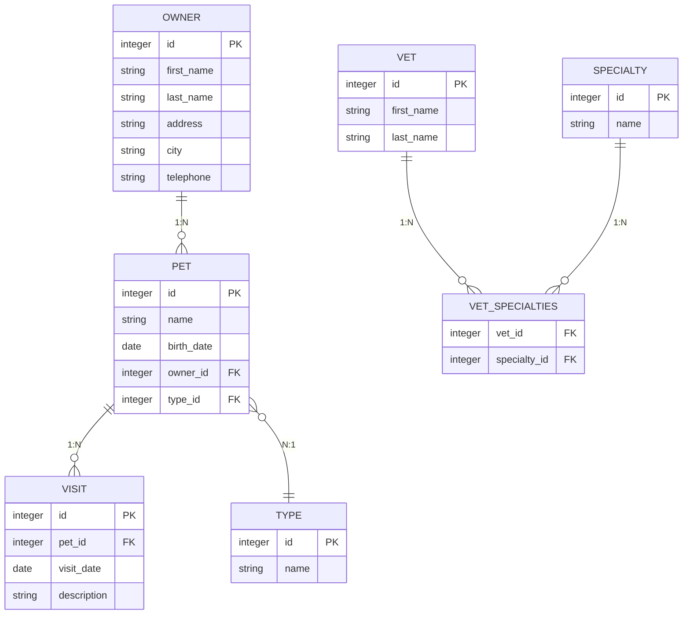
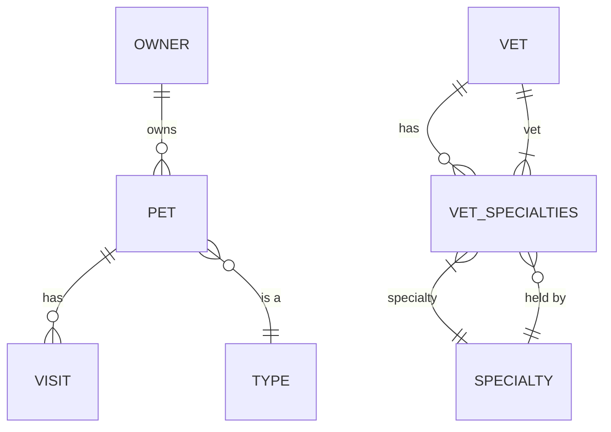
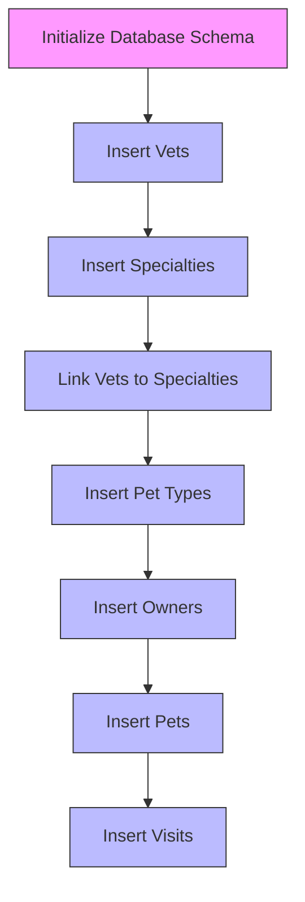

# Database Schema Design

<cite>
**Referenced Files in This Document**   
- [schema.sql](file://src/main/resources/db/h2/schema.sql)
- [data.sql](file://src/main/resources/db/h2/data.sql)
- [Owner.java](file://src/main/java/org/springframework/samples/petclinic/owner/Owner.java)
- [Pet.java](file://src/main/java/org/springframework/samples/petclinic/owner/Pet.java)
- [Visit.java](file://src/main/java/org/springframework/samples/petclinic/owner/Visit.java)
- [Vet.java](file://src/main/java/org/springframework/samples/petclinic/vet/Vet.java)
- [Specialty.java](file://src/main/java/org/springframework/samples/petclinic/vet/Specialty.java)
- [PetType.java](file://src/main/java/org/springframework/samples/petclinic/owner/PetType.java)
- [BaseEntity.java](file://src/main/java/org/springframework/samples/petclinic/model/BaseEntity.java)
- [Person.java](file://src/main/java/org/springframework/samples/petclinic/model/Person.java)
- [NamedEntity.java](file://src/main/java/org/springframework/samples/petclinic/model/NamedEntity.java)
</cite>

## Table of Contents
1. [Introduction](#introduction)
2. [Entity-Relationship Model](#entity-relationship-model)
3. [Table Structures and Constraints](#table-structures-and-constraints)
4. [Primary and Foreign Key Relationships](#primary-and-foreign-key-relationships)
5. [Data Initialization Patterns](#data-initialization-patterns)
6. [Normalization and Indexing Strategy](#normalization-and-indexing-strategy)
7. [Sample Queries](#sample-queries)
8. [Schema Evolution and Migration](#schema-evolution-and-migration)
9. [Conclusion](#conclusion)

## Introduction
The PetClinic application features a relational database schema designed to manage veterinary clinic operations, including owners, pets, visits, veterinarians, specialties, and pet types. This documentation provides a comprehensive analysis of the database schema design, focusing on entity relationships, constraints, indexing strategies, and data initialization patterns across different database platforms (H2, MySQL, PostgreSQL). The schema demonstrates proper normalization principles and implements referential integrity through foreign key constraints.

**Section sources**
- [schema.sql](file://src/main/resources/db/h2/schema.sql#L1-L64)
- [Owner.java](file://src/main/java/org/springframework/samples/petclinic/owner/Owner.java#L45-L174)

## Entity-Relationship Model



**Diagram sources**
- [schema.sql](file://src/main/resources/db/h2/schema.sql#L1-L64)
- [Owner.java](file://src/main/java/org/springframework/samples/petclinic/owner/Owner.java#L45-L174)
- [Pet.java](file://src/main/java/org/springframework/samples/petclinic/owner/Pet.java#L43-L84)

## Table Structures and Constraints

### Owners Table
The owners table stores information about pet owners with personal details and contact information.

| Field | Type | Constraints | Description |
|-------|------|-------------|-------------|
| id | INTEGER | PRIMARY KEY, GENERATED BY DEFAULT AS IDENTITY | Unique identifier for the owner |
| first_name | VARCHAR(30) | NOT NULL | Owner's first name |
| last_name | VARCHAR(30) | NOT NULL | Owner's last name |
| address | VARCHAR(255) | NOT NULL | Street address |
| city | VARCHAR(80) | NOT NULL | City of residence |
| telephone | VARCHAR(20) | NOT NULL | 10-digit telephone number |

**Section sources**
- [schema.sql](file://src/main/resources/db/h2/schema.sql#L38-L45)
- [Owner.java](file://src/main/java/org/springframework/samples/petclinic/owner/Owner.java#L45-L174)

### Pets Table
The pets table contains information about pets owned by customers, including their type and birth date.

| Field | Type | Constraints | Description |
|-------|------|-------------|-------------|
| id | INTEGER | PRIMARY KEY, GENERATED BY DEFAULT AS IDENTITY | Unique identifier for the pet |
| name | VARCHAR(30) | NOT NULL | Pet's name |
| birth_date | DATE | NOT NULL | Date of birth |
| type_id | INTEGER | NOT NULL, FOREIGN KEY | Reference to pet type |
| owner_id | INTEGER | FOREIGN KEY | Reference to owner |

**Section sources**
- [schema.sql](file://src/main/resources/db/h2/schema.sql#L50-L56)
- [Pet.java](file://src/main/java/org/springframework/samples/petclinic/owner/Pet.java#L43-L84)

### Visits Table
The visits table records medical visits for pets, including the date and description of services provided.

| Field | Type | Constraints | Description |
|-------|------|-------------|-------------|
| id | INTEGER | PRIMARY KEY, GENERATED BY DEFAULT AS IDENTITY | Unique identifier for the visit |
| pet_id | INTEGER | FOREIGN KEY | Reference to the pet |
| visit_date | DATE | NOT NULL | Date of the visit |
| description | VARCHAR(255) | NOT NULL | Description of services provided |

**Section sources**
- [schema.sql](file://src/main/resources/db/h2/schema.sql#L60-L64)
- [Visit.java](file://src/main/java/org/springframework/samples/petclinic/owner/Visit.java#L33-L67)

### Vets Table
The vets table stores information about veterinarians working at the clinic.

| Field | Type | Constraints | Description |
|-------|------|-------------|-------------|
| id | INTEGER | PRIMARY KEY, GENERATED BY DEFAULT AS IDENTITY | Unique identifier for the vet |
| first_name | VARCHAR(30) | NOT NULL | Veterinarian's first name |
| last_name | VARCHAR(30) | NOT NULL | Veterinarian's last name |

**Section sources**
- [schema.sql](file://src/main/resources/db/h2/schema.sql#L10-L13)
- [Vet.java](file://src/main/java/org/springframework/samples/petclinic/vet/Vet.java#L42-L73)

### Specialties Table
The specialties table defines the different veterinary specialties available at the clinic.

| Field | Type | Constraints | Description |
|-------|------|-------------|-------------|
| id | INTEGER | PRIMARY KEY, GENERATED BY DEFAULT AS IDENTITY | Unique identifier for the specialty |
| name | VARCHAR(80) | NOT NULL | Name of the specialty (e.g., radiology, surgery) |

**Section sources**
- [schema.sql](file://src/main/resources/db/h2/schema.sql#L15-L18)
- [Specialty.java](file://src/main/java/org/springframework/samples/petclinic/vet/Specialty.java#L27-L31)

### Types Table
The types table defines the different types of pets that can be registered in the system.

| Field | Type | Constraints | Description |
|-------|------|-------------|-------------|
| id | INTEGER | PRIMARY KEY, GENERATED BY DEFAULT AS IDENTITY | Unique identifier for the pet type |
| name | VARCHAR(80) | NOT NULL | Name of the pet type (e.g., cat, dog) |

**Section sources**
- [schema.sql](file://src/main/resources/db/h2/schema.sql#L34-L37)
- [PetType.java](file://src/main/java/org/springframework/samples/petclinic/owner/PetType.java#L25-L29)

## Primary and Foreign Key Relationships

### One-to-Many Relationships
The schema implements several one-to-many relationships:

- **Owners to Pets**: One owner can have multiple pets, but each pet belongs to only one owner. This relationship is established through the `owner_id` foreign key in the pets table referencing the `id` in the owners table.

- **Pets to Visits**: One pet can have multiple visits, but each visit is associated with only one pet. This is implemented through the `pet_id` foreign key in the visits table referencing the `id` in the pets table.

- **Types to Pets**: One pet type can be associated with multiple pets, but each pet has only one type. This relationship is established through the `type_id` foreign key in the pets table referencing the `id` in the types table.

### Many-to-Many Relationships
The schema implements a many-to-many relationship between veterinarians and specialties using a junction table:

- **Vets to Specialties**: A veterinarian can have multiple specialties, and a specialty can be held by multiple veterinarians. This relationship is implemented through the `vet_specialties` junction table containing `vet_id` and `specialty_id` as composite primary keys, both of which are foreign keys referencing their respective tables.



**Diagram sources**
- [schema.sql](file://src/main/resources/db/h2/schema.sql#L26-L27)
- [schema.sql](file://src/main/resources/db/h2/schema.sql#L52-L53)
- [schema.sql](file://src/main/resources/db/h2/schema.sql#L62)
- [Vet.java](file://src/main/java/org/springframework/samples/petclinic/vet/Vet.java#L42-L73)

## Data Initialization Patterns

The PetClinic application provides database initialization scripts for multiple database platforms, with consistent data across all platforms. The data initialization follows a specific order to maintain referential integrity:

1. **Vets**: Initial veterinarians are inserted with predefined IDs
2. **Specialties**: Veterinary specialties are inserted
3. **Vet Specialties**: Junction table entries linking vets to their specialties
4. **Types**: Pet types are inserted
5. **Owners**: Pet owners are inserted
6. **Pets**: Pets are inserted with references to owners and types
7. **Visits**: Visit records are inserted with references to pets

The initialization scripts demonstrate platform-specific variations:

- **H2**: Uses `default` keyword for auto-generated values
- **MySQL**: Uses `AUTO_INCREMENT` and `INSERT IGNORE` to prevent duplicate entries
- **PostgreSQL**: Uses conditional `INSERT ... WHERE NOT EXISTS` statements to ensure idempotency



**Diagram sources**
- [data.sql](file://src/main/resources/db/h2/data.sql#L0-L53)
- [data.sql](file://src/main/resources/db/mysql/data.sql#L0-L53)
- [data.sql](file://src/main/resources/db/postgres/data.sql#L0-L53)

## Normalization and Indexing Strategy

### Normalization Levels
The PetClinic database schema is designed to third normal form (3NF):

- **First Normal Form (1NF)**: All tables have atomic values with no repeating groups. Each column contains scalar values of a single type.
- **Second Normal Form (2NF)**: All non-key attributes are fully functionally dependent on the primary key. There are no partial dependencies.
- **Third Normal Form (3NF)**: No transitive dependencies exist. All non-key attributes depend only on the primary key.

The schema avoids data redundancy by normalizing common attributes:
- Owner names are stored in the owners table, not duplicated in pets
- Pet types are stored in a separate types table and referenced by foreign key
- Veterinarian specialties are stored in a separate specialties table and linked via junction table

### Indexing Strategy
The schema implements strategic indexing to optimize query performance:

- **owners_last_name**: Index on the last_name column of the owners table to speed up searches by owner's last name
- **pets_name**: Index on the name column of the pets table to facilitate pet name searches
- **visits_pet_id**: Index on the pet_id column of the visits table to optimize retrieval of visit history for a specific pet
- **vets_last_name**: Index on the last_name column of the vets table for efficient veterinarian searches
- **specialties_name**: Index on the name column of the specialties table

These indexes support the application's common access patterns, such as finding owners by last name, retrieving all pets for an owner, and listing all visits for a pet.

**Section sources**
- [schema.sql](file://src/main/resources/db/h2/schema.sql#L14)
- [schema.sql](file://src/main/resources/db/h2/schema.sql#L20)
- [schema.sql](file://src/main/resources/db/h2/schema.sql#L45)
- [schema.sql](file://src/main/resources/db/h2/schema.sql#L56)
- [schema.sql](file://src/main/resources/db/h2/schema.sql#L64)

## Sample Queries

### Find All Pets for an Owner
```sql
SELECT p.name, p.birth_date, t.name as type_name, 
       GROUP_CONCAT(v.visit_date ORDER BY v.visit_date DESC) as visit_dates
FROM pets p
JOIN owners o ON p.owner_id = o.id
JOIN types t ON p.type_id = t.id
LEFT JOIN visits v ON p.id = v.pet_id
WHERE o.last_name = 'Davis'
GROUP BY p.id, p.name, p.birth_date, t.name
ORDER BY p.name;
```

### Find All Vets with Their Specialties
```sql
SELECT v.first_name, v.last_name, 
       GROUP_CONCAT(s.name ORDER BY s.name) as specialties
FROM vets v
LEFT JOIN vet_specialties vs ON v.id = vs.vet_id
LEFT JOIN specialties s ON vs.specialty_id = s.id
GROUP BY v.id, v.first_name, v.last_name
ORDER BY v.last_name, v.first_name;
```

### Find Recent Visits for a Specific Pet Type
```sql
SELECT o.first_name as owner_first, o.last_name as owner_last,
       p.name as pet_name, v.visit_date, v.description
FROM visits v
JOIN pets p ON v.pet_id = p.id
JOIN owners o ON p.owner_id = o.id
JOIN types t ON p.type_id = t.id
WHERE t.name = 'cat' 
  AND v.visit_date >= CURRENT_DATE - INTERVAL '90 days'
ORDER BY v.visit_date DESC;
```

### Find Owners with Multiple Pets
```sql
SELECT o.first_name, o.last_name, o.city, 
       COUNT(p.id) as pet_count
FROM owners o
JOIN pets p ON o.id = p.owner_id
GROUP BY o.id, o.first_name, o.last_name, o.city
HAVING COUNT(p.id) > 1
ORDER BY pet_count DESC, o.last_name;
```

**Section sources**
- [Owner.java](file://src/main/java/org/springframework/samples/petclinic/owner/Owner.java#L91-L93)
- [Pet.java](file://src/main/java/org/springframework/samples/petclinic/owner/Pet.java#L76-L78)
- [Visit.java](file://src/main/java/org/springframework/samples/petclinic/owner/Visit.java#L51-L53)

## Schema Evolution and Migration

### Schema Evolution Considerations
When modifying the PetClinic database schema, several considerations must be addressed to maintain backward compatibility:

1. **Additive Changes**: Adding new columns or tables is generally safe and backward compatible. New columns should include appropriate default values when possible.

2. **Non-Additive Changes**: Modifying or removing columns requires careful planning:
   - Changing data types should consider existing data
   - Renaming columns should maintain backward compatibility through views or application-level mapping
   - Removing columns should be done gradually, first marking them as deprecated

3. **Referential Integrity**: Any changes to primary keys or foreign key relationships require coordinated migrations to maintain data integrity.

### Migration Strategies
The PetClinic application supports multiple database platforms, requiring platform-agnostic migration strategies:

1. **Versioned Migration Scripts**: Maintain sequential migration scripts (e.g., V1__initial_schema.sql, V2__add_index.sql) that can be applied incrementally.

2. **Idempotent Operations**: Design migration scripts to be idempotent, allowing safe re-execution without side effects.

3. **Data Migration**: When structural changes require data transformation, implement data migration scripts that:
   - Preserve existing data
   - Transform data to the new structure
   - Validate the migration results

4. **Rollback Procedures**: For each migration, define a corresponding rollback procedure to enable recovery from failed migrations.

5. **Testing**: Test migrations on all supported database platforms to ensure compatibility.

Example migration to add a new column:
```sql
-- Add email column to owners table
ALTER TABLE owners ADD COLUMN email VARCHAR(255);

-- Create index on email for faster lookups
CREATE INDEX owners_email ON owners (email);

-- Update existing records with default value if needed
UPDATE owners SET email = LOWER(first_name || '.' || last_name || '@example.com') 
WHERE email IS NULL;
```

**Section sources**
- [schema.sql](file://src/main/resources/db/h2/schema.sql#L1-L64)
- [Owner.java](file://src/main/java/org/springframework/samples/petclinic/owner/Owner.java#L45-L174)

## Conclusion
The PetClinic database schema demonstrates well-structured relational database design principles with clear entity relationships, proper normalization, and effective indexing strategies. The schema effectively models the veterinary clinic domain with appropriate one-to-many and many-to-many relationships between entities. The implementation of referential integrity through foreign key constraints ensures data consistency across the application. The provision of platform-specific initialization scripts demonstrates consideration for deployment across different database systems. The schema is designed to be extensible, allowing for future enhancements while maintaining backward compatibility through careful migration planning.