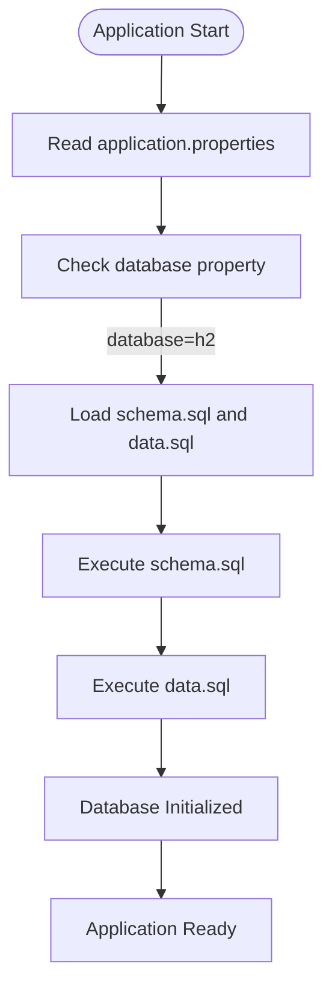
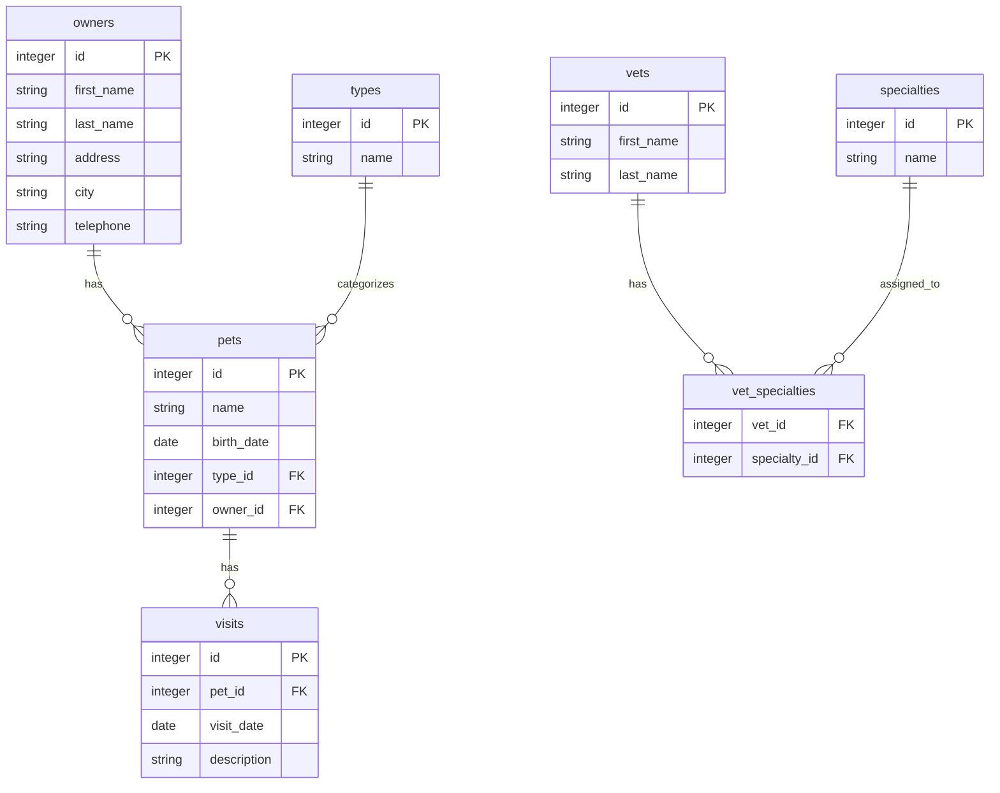

# H2 Database Configuration

<cite>
**Referenced Files in This Document**   
- [application.properties](file://src/main/resources/application.properties)
- [schema.sql](file://src/main/resources/db/h2/schema.sql)
- [data.sql](file://src/main/resources/db/h2/data.sql)
</cite>

## Table of Contents
1. [Introduction](#introduction)
2. [H2 Database Configuration](#h2-database-configuration)
3. [Schema and Data Initialization](#schema-and-data-initialization)
4. [Database Schema Structure](#database-schema-structure)
5. [H2 Console Access](#h2-console-access)
6. [Troubleshooting Common Issues](#troubleshooting-common-issues)
7. [Performance Considerations](#performance-considerations)

## Introduction
The Spring PetClinic application utilizes H2 as its default in-memory database for development purposes. This configuration provides a lightweight, zero-configuration database solution that automatically initializes with sample data, enabling rapid development and testing. The H2 database is configured through Spring Boot's application properties and SQL initialization scripts, creating a complete data environment upon application startup.

## H2 Database Configuration
The PetClinic application sets H2 as the default database through the `database=h2` property in the application.properties file. This configuration leverages Spring Boot's database initialization capabilities to automatically configure and populate the database at startup. The application is designed with multiple database profiles, but H2 serves as the default option, making it immediately usable without additional setup.

**Section sources**
- [application.properties](file://src/main/resources/application.properties#L1-L3)

## Schema and Data Initialization
Spring Boot initializes the H2 database using the `spring.sql.init.schema-locations` and `spring.sql.init.data-locations` properties, which specify the locations of SQL scripts for schema creation and data population. These properties use the `${database}` placeholder to dynamically resolve to the appropriate database configuration directory.

The `schema.sql` file located in the `db/h2/` directory contains DDL statements that define the database structure, including table creation, primary key definitions, foreign key constraints, and indexes. The `data.sql` file in the same directory contains DML statements that populate the database with initial sample data for owners, pets, veterinarians, and visits.

This initialization process occurs automatically during application startup, ensuring that the database is properly configured and populated before the application becomes available.

**Diagram sources**
- [application.properties](file://src/main/resources/application.properties#L1-L3)
- [schema.sql](file://src/main/resources/db/h2/schema.sql)
- [data.sql](file://src/main/resources/db/h2/data.sql)

**Section sources**
- [application.properties](file://src/main/resources/application.properties#L2-L3)
- [schema.sql](file://src/main/resources/db/h2/schema.sql)
- [data.sql](file://src/main/resources/db/h2/data.sql)

## Database Schema Structure
The H2 database schema in PetClinic consists of seven interrelated tables that model the core entities of a veterinary clinic management system. The schema is designed with proper normalization, referential integrity, and indexing for optimal query performance.

The primary tables include:
- **owners**: Stores owner information with personal details and contact information
- **pets**: Contains pet records linked to owners and pet types
- **types**: Defines pet types (cat, dog, etc.) referenced by pets
- **visits**: Records veterinary visits for pets with descriptions and dates
- **vets**: Stores veterinarian information with first and last names
- **specialties**: Defines veterinary specialties (radiology, surgery, etc.)
- **vet_specialties**: Junction table for the many-to-many relationship between veterinarians and specialties

The schema employs foreign key constraints to maintain data integrity, with cascading references ensuring consistent relationships between entities. Indexes are created on frequently queried columns such as last names and pet names to optimize search performance.

**Diagram sources**
- [schema.sql](file://src/main/resources/db/h2/schema.sql)

**Section sources**
- [schema.sql](file://src/main/resources/db/h2/schema.sql)

## H2 Console Access
During development, the H2 console is accessible at `http://localhost:8080/h2-console` for database inspection and debugging. This web-based interface allows developers to execute SQL queries, view table data, and verify database schema directly from a browser.

To access the console:
1. Start the PetClinic application using `./mvnw spring-boot:run`
2. Navigate to `http://localhost:8080/h2-console` in a web browser
3. Use the JDBC URL displayed in the console output (typically `jdbc:h2:mem:<uuid>`)
4. Leave the username as `sa` and password empty
5. Click "Connect" to access the database

The H2 console is particularly useful for verifying data initialization, debugging queries, and understanding the current state of the in-memory database during development.

**Section sources**
- [README.md](file://README.md#L4-L7)

## Troubleshooting Common Issues
Several common issues may arise when working with the H2 database configuration in PetClinic:

**Schema Initialization Failures**: If the application fails to start due to schema errors, verify that the `schema.sql` and `data.sql` files are properly formatted and located in the correct directory. Check for syntax errors in SQL statements and ensure that table dependencies are created in the correct order (parent tables before child tables with foreign keys).

**Case Sensitivity in Queries**: H2 treats unquoted identifiers as uppercase by default. When writing queries, ensure consistent casing or use quoted identifiers. For example, `SELECT * FROM owners` should be used instead of `SELECT * FROM Owners`. The `last_name` column in the owners table uses `VARCHAR_IGNORECASE` to provide case-insensitive comparison.

**Data Persistence Across Restarts**: Since H2 runs in memory by default, all data is lost when the application restarts. This behavior is expected in development but can be confusing. If persistent storage is needed for testing, consider configuring H2 to use a file-based database instead of in-memory storage.

**Section sources**
- [schema.sql](file://src/main/resources/db/h2/schema.sql)
- [data.sql](file://src/main/resources/db/h2/data.sql)
- [application.properties](file://src/main/resources/application.properties)

## Performance Considerations
While H2 provides excellent performance for development and testing, it has important limitations for production use:

**Development Advantages**:
- Zero configuration and setup
- Fast in-memory operations
- Automatic initialization with sample data
- Easy debugging with web console
- No external database dependencies

**Production Limitations**:
- In-memory storage means data is not persistent across application restarts
- Limited scalability for high-concurrency scenarios
- Reduced durability compared to production-grade databases
- Not optimized for large datasets

For production deployments, the application supports MySQL and PostgreSQL through profile-specific configuration files. These databases provide better performance, reliability, and data persistence for production workloads.

The current configuration with `spring.jpa.hibernate.ddl-auto=none` ensures that Hibernate does not modify the schema at runtime, relying instead on the explicitly defined SQL scripts for schema management.

**Section sources**
- [application.properties](file://src/main/resources/application.properties#L6-L7)
- [README.md](file://README.md#L4-L7)