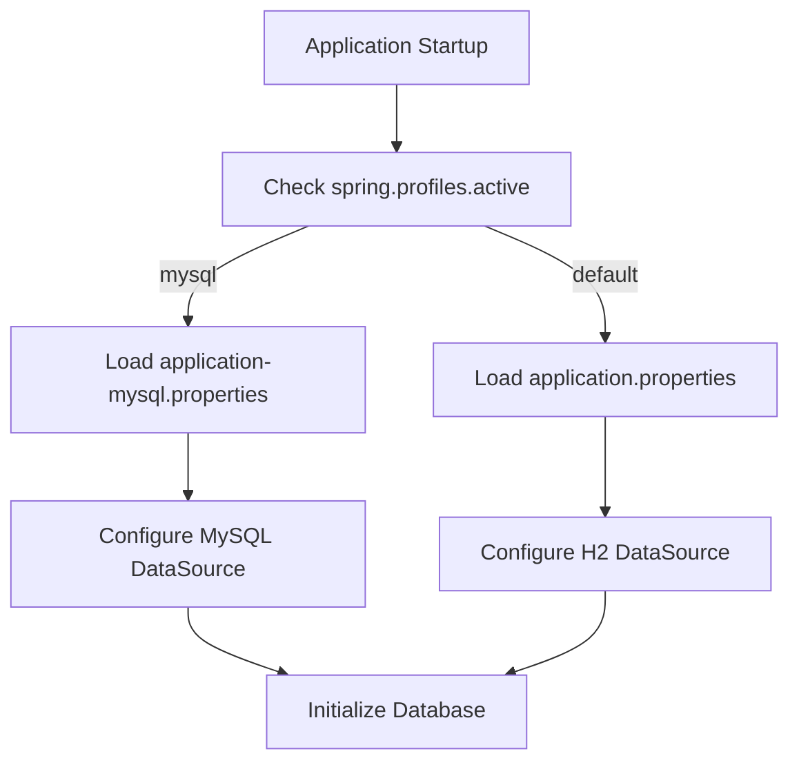
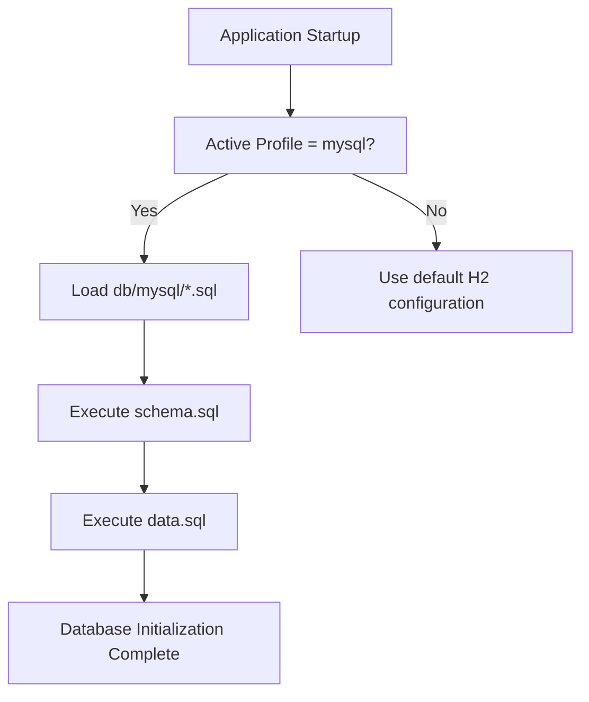

# MySQL Database Configuration

<cite>
**Referenced Files in This Document**   
- [application-mysql.properties](file://src/main/resources/application-mysql.properties)
- [application.properties](file://src/main/resources/application.properties)
- [schema.sql](file://src/main/resources/db/mysql/schema.sql)
- [data.sql](file://src/main/resources/db/mysql/data.sql)
- [user.sql](file://src/main/resources/db/mysql/user.sql)
- [petclinic_db_setup_mysql.txt](file://src/main/resources/db/mysql/petclinic_db_setup_mysql.txt)
- [pom.xml](file://pom.xml)
- [build.gradle](file://build.gradle)
- [README.md](file://README.md)
</cite>

## Table of Contents
1. [Introduction](#introduction)
2. [Profile Activation and Configuration](#profile-activation-and-configuration)
3. [Connection Settings](#connection-settings)
4. [Database Initialization](#database-initialization)
5. [Database Setup Instructions](#database-setup-instructions)
6. [Build Tool Configuration](#build-tool-configuration)
7. [Common Issues and Troubleshooting](#common-issues-and-troubleshooting)
8. [Performance Considerations](#performance-considerations)
9. [Conclusion](#conclusion)

## Introduction
The Spring PetClinic application provides comprehensive support for MySQL database configuration through Spring Boot's profile-based configuration system. This document details the complete setup process for configuring PetClinic with MySQL, covering profile activation, connection parameters, database initialization, and deployment considerations. The application uses Spring Profiles to switch between different database configurations, with a dedicated `mysql` profile that overrides the default H2 in-memory database settings.

**Section sources**
- [README.md](file://README.md#L49-L78)

## Profile Activation and Configuration
The MySQL configuration is activated through Spring Boot's profile system using the `mysql` profile identifier. When the application runs with `spring.profiles.active=mysql`, Spring Boot automatically loads the `application-mysql.properties` file, which contains MySQL-specific configuration that overrides the default settings in `application.properties`. This profile-based approach allows seamless switching between different database backends without code changes.

The profile activation can be accomplished through various methods including command-line arguments, environment variables, or IDE configuration. The most common approach is using the `spring.profiles.active` property, which can be set as a system property during application startup.



**Diagram sources**
- [application-mysql.properties](file://src/main/resources/application-mysql.properties#L1-L7)
- [application.properties](file://src/main/resources/application.properties#L1-L26)

**Section sources**
- [application-mysql.properties](file://src/main/resources/application-mysql.properties#L1-L7)
- [application.properties](file://src/main/resources/application.properties#L1-L26)
- [README.md](file://README.md#L49-L51)

## Connection Settings
The MySQL connection configuration is defined in `application-mysql.properties` with specific parameters tailored for MySQL connectivity. The JDBC URL follows the standard MySQL Connector/J format with environment variable fallbacks for flexible deployment across different environments.

The key connection properties include:
- **JDBC URL**: `${MYSQL_URL:jdbc:mysql://localhost/petclinic}` - Uses environment variable MYSQL_URL with fallback to localhost
- **Username**: `${MYSQL_USER:petclinic}` - Environment variable MYSQL_USER with 'petclinic' default
- **Password**: `${MYSQL_PASS:petclinic}` - Environment variable MYSQL_PASS with 'petclinic' default
- **Database platform**: `database=mysql` - Specifies the database type for resource loading

The configuration leverages Spring Boot's property resolution mechanism, allowing environment-specific overrides through environment variables, system properties, or external configuration files. This enables different connection settings for development, testing, and production environments without modifying the application code.

**Section sources**
- [application-mysql.properties](file://src/main/resources/application-mysql.properties#L1-L7)

## Database Initialization
The database initialization process is managed through Spring Boot's schema and data initialization features, with MySQL-specific SQL scripts located in the `db/mysql/` directory. The initialization process creates the necessary database schema and populates it with initial data using idempotent SQL statements.

### Schema Initialization
The `schema.sql` file contains DDL statements to create all required database tables with MySQL-specific syntax and constraints:

```sql
CREATE TABLE IF NOT EXISTS vets (
  id INT(4) UNSIGNED NOT NULL AUTO_INCREMENT PRIMARY KEY,
  first_name VARCHAR(30),
  last_name VARCHAR(30),
  INDEX(last_name)
) engine=InnoDB;
```

Key MySQL-specific features include:
- **InnoDB storage engine**: Specified with `engine=InnoDB` for transaction support
- **Unsigned integer types**: Used for primary keys and foreign keys
- **Index definitions**: Created inline with table definitions
- **IF NOT EXISTS clauses**: Ensure idempotent execution

### Data Initialization
The `data.sql` file contains DML statements to populate the database with initial data using `INSERT IGNORE` statements:

```sql
INSERT IGNORE INTO vets VALUES (1, 'James', 'Carter');
INSERT IGNORE INTO specialties VALUES (1, 'radiology');
```

The `INSERT IGNORE` syntax prevents errors when the application restarts, making the initialization process safe for repeated execution. This approach ensures consistent data state across application restarts while avoiding duplicate entry errors.



**Diagram sources**
- [schema.sql](file://src/main/resources/db/mysql/schema.sql#L1-L56)
- [data.sql](file://src/main/resources/db/mysql/data.sql#L1-L54)

**Section sources**
- [schema.sql](file://src/main/resources/db/mysql/schema.sql#L1-L56)
- [data.sql](file://src/main/resources/db/mysql/data.sql#L1-L54)
- [application.properties](file://src/main/resources/application.properties#L3-L4)

## Database Setup Instructions
Proper database setup is required before running the application with MySQL. This involves creating the database and configuring the appropriate user permissions.

### Manual Database Creation
The `user.sql` script provides the necessary SQL commands to create the database and user:

```sql
CREATE DATABASE IF NOT EXISTS petclinic;

ALTER DATABASE petclinic
  DEFAULT CHARACTER SET utf8
  DEFAULT COLLATE utf8_general_ci;

GRANT ALL PRIVILEGES ON petclinic.* TO 'petclinic'@'%' IDENTIFIED BY 'petclinic';
```

This script performs three critical operations:
1. Creates the `petclinic` database if it doesn't exist
2. Configures UTF-8 character encoding and collation
3. Grants full privileges to the `petclinic` user from any host

### Docker-Based Setup
Alternatively, the application provides a `docker-compose.yml` file that automatically configures the MySQL database:

```bash
docker compose up mysql
```

This command starts a MySQL container with the petclinic database and user pre-configured, eliminating the need to manually execute the `user.sql` script. The containerized approach ensures consistent database configuration across different development environments.

**Section sources**
- [user.sql](file://src/main/resources/db/mysql/user.sql#L1-L8)
- [petclinic_db_setup_mysql.txt](file://src/main/resources/db/mysql/petclinic_db_setup_mysql.txt#L1-L37)

## Build Tool Configuration
The PetClinic application supports both Maven and Gradle build systems, with profile-specific configuration for MySQL activation.

### Maven Configuration
The Maven build is configured in `pom.xml` with the necessary MySQL dependencies:

```xml
<dependency>
  <groupId>com.mysql</groupId>
  <artifactId>mysql-connector-j</artifactId>
  <scope>runtime</scope>
</dependency>
```

To run the application with MySQL profile using Maven:

```bash
mvn spring-boot:run -Dspring-boot.run.profiles=mysql
```

### Gradle Configuration
The Gradle build in `build.gradle` includes similar MySQL dependencies:

```groovy
runtimeOnly 'com.mysql:mysql-connector-j'
```

To run with MySQL profile using Gradle:

```bash
./gradlew bootRun -Dspring.profiles.active=mysql
```

Both build systems support the same profile activation mechanism, allowing developers to choose their preferred build tool without affecting the database configuration.

**Section sources**
- [pom.xml](file://pom.xml#L1-L456)
- [build.gradle](file://build.gradle#L1-L91)

## Common Issues and Troubleshooting
Several common issues may arise when configuring PetClinic with MySQL. Understanding these issues and their solutions ensures smooth deployment and operation.

### MySQL Server Version Compatibility
The application is tested with MySQL 9.1, but compatibility issues may occur with different versions. Ensure the MySQL server version matches the connector version specified in the build configuration.

### Timezone Configuration
MySQL timezone mismatches can cause date-related issues. Configure the JDBC URL with explicit timezone settings:

```
jdbc:mysql://localhost/petclinic?serverTimezone=UTC
```

### SSL Connection Errors
By default, MySQL 8+ requires SSL connections. For development environments, disable SSL in the JDBC URL:

```
jdbc:mysql://localhost/petclinic?useSSL=false&allowPublicKeyRetrieval=true
```

### Missing Database
Ensure the `petclinic` database exists before starting the application, as the default JDBC URL assumes its existence. Create it using the `user.sql` script or through the MySQL client.

**Section sources**
- [petclinic_db_setup_mysql.txt](file://src/main/resources/db/mysql/petclinic_db_setup_mysql.txt#L1-L37)
- [application-mysql.properties](file://src/main/resources/application-mysql.properties#L1-L7)

## Performance Considerations
Optimizing database performance is crucial for production deployments of the PetClinic application.

### Connection Pooling
Spring Boot automatically configures HikariCP connection pooling with reasonable defaults. For high-traffic applications, consider tuning pool settings:

```properties
spring.datasource.hikari.maximum-pool-size=20
spring.datasource.hikari.minimum-idle=5
spring.datasource.hikari.connection-timeout=20000
```

### Indexing Strategies
The schema includes basic indexes on frequently queried columns like `last_name` in the `owners` and `vets` tables. For large datasets, consider additional indexes on:
- `pets.name` for pet name searches
- `pets.birth_date` for date-based queries
- Composite indexes on frequently joined columns

### Query Optimization
Monitor slow queries and optimize based on access patterns. The application's JPA repository methods should be reviewed for efficient query generation, avoiding N+1 query problems through proper use of `@EntityGraph` or JOIN FETCH operations.

**Section sources**
- [schema.sql](file://src/main/resources/db/mysql/schema.sql#L1-L56)

## Conclusion
The Spring PetClinic application provides a robust and flexible MySQL configuration through Spring Boot's profile system. By leveraging the `mysql` profile, developers can easily switch from the default H2 database to MySQL with minimal configuration changes. The comprehensive setup process, including database initialization scripts and containerized deployment options, ensures consistent behavior across different environments. Understanding the profile activation mechanism, connection settings, and initialization process enables successful deployment of PetClinic with MySQL as the persistent data store.