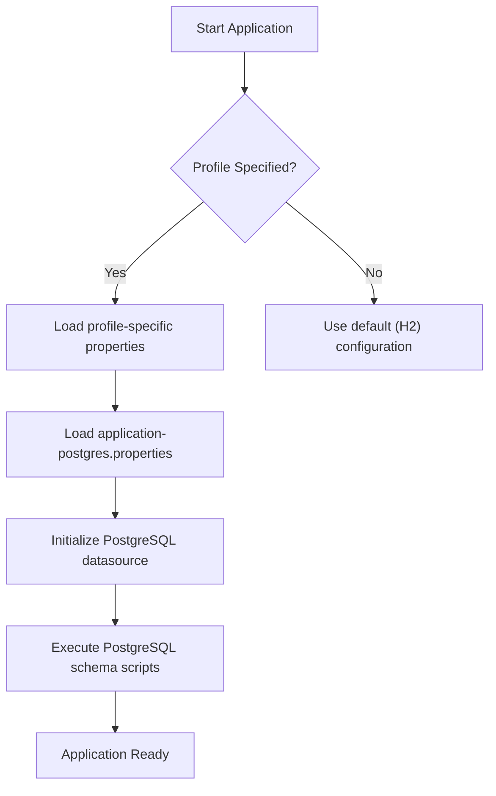
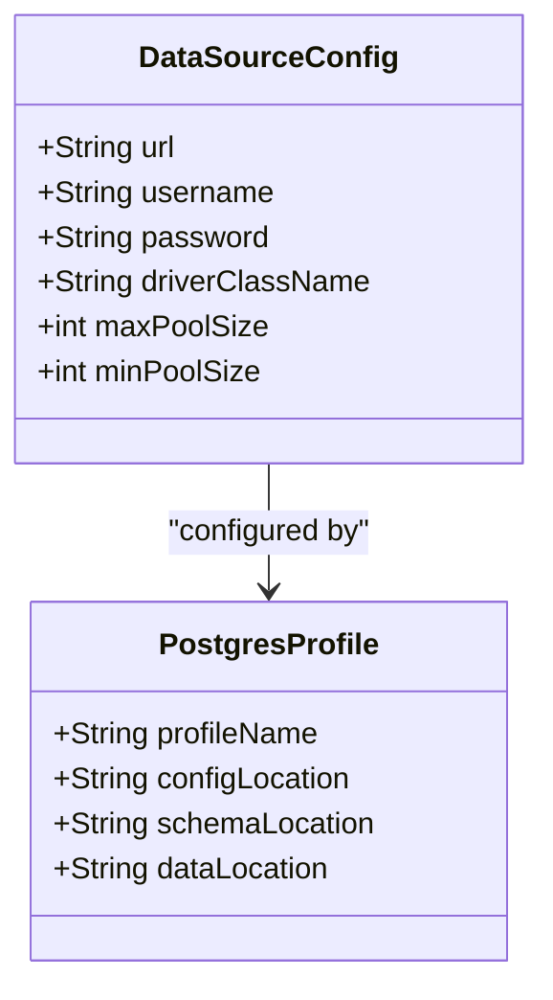
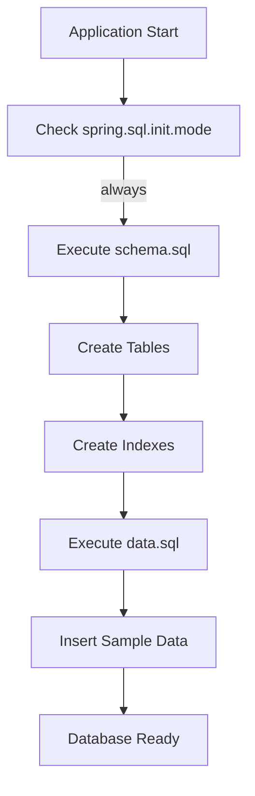
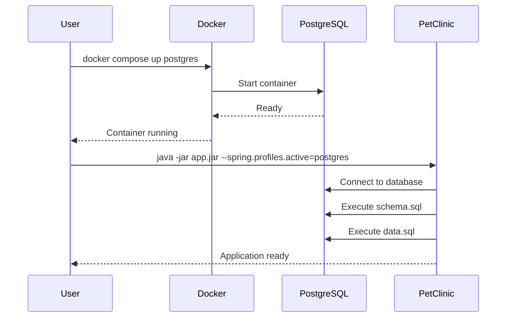
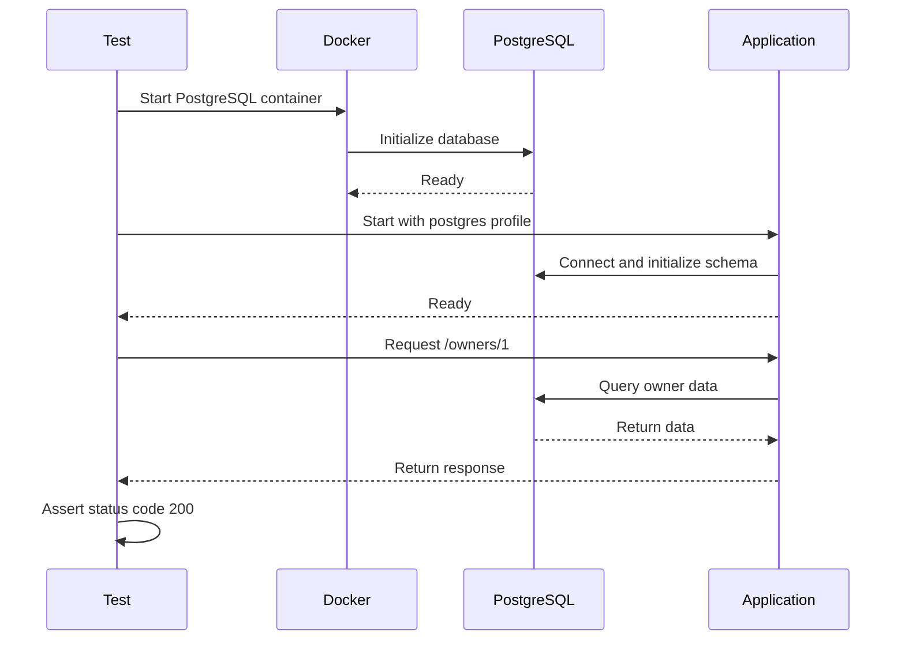

# PostgreSQL Database Configuration

<cite>
**Referenced Files in This Document**   
- [application-postgres.properties](file://src/main/resources/application-postgres.properties)
- [application.properties](file://src/main/resources/application.properties)
- [schema.sql](file://src/main/resources/db/postgres/schema.sql)
- [data.sql](file://src/main/resources/db/postgres/data.sql)
- [petclinic_db_setup_postgres.txt](file://src/main/resources/db/postgres/petclinic_db_setup_postgres.txt)
- [PostgresIntegrationTests.java](file://src/test/java/org/springframework/samples/petclinic/PostgresIntegrationTests.java)
- [docker-compose.yml](file://docker-compose.yml)
- [PetClinicApplication.java](file://src/main/java/org/springframework/samples/petclinic/PetClinicApplication.java)
</cite>

## Table of Contents
1. [Introduction](#introduction)
2. [Profile Activation and Configuration](#profile-activation-and-configuration)
3. [Datasource Configuration](#datasource-configuration)
4. [Schema Initialization](#schema-initialization)
5. [SQL Syntax Differences Between H2 and PostgreSQL](#sql-syntax-differences-between-h2-and-postgresql)
6. [PostgreSQL Setup Instructions](#postgresql-setup-instructions)
7. [Integration Testing with PostgreSQL](#integration-testing-with-postgresql)
8. [Common Issues and Solutions](#common-issues-and-solutions)
9. [Performance Considerations](#performance-considerations)
10. [Conclusion](#conclusion)

## Introduction

The Spring PetClinic application supports multiple database backends, with PostgreSQL being one of the persistent database options alongside the default in-memory H2 database. This document provides comprehensive guidance on configuring PetClinic to use PostgreSQL as its database backend. It covers profile activation, datasource configuration, schema initialization, SQL syntax differences, setup procedures, testing, troubleshooting, and performance optimization.

**Section sources**
- [README.md](file://README.md#L0-L163)

## Profile Activation and Configuration

To activate the PostgreSQL profile in the PetClinic application, the `spring.profiles.active` property must be set to `postgres`. This can be achieved through various methods including command-line arguments, environment variables, or IDE configurations. When the `postgres` profile is active, Spring Boot automatically loads the `application-postgres.properties` file, which contains PostgreSQL-specific configuration overrides.

The profile activation triggers conditional configuration loading, ensuring that database connections, initialization scripts, and other database-related settings are tailored for PostgreSQL. This mechanism allows seamless switching between different database systems without modifying application code.

**Diagram sources**
- [application-postgres.properties](file://src/main/resources/application-postgres.properties)
- [application.properties](file://src/main/resources/application.properties)

**Section sources**
- [application-postgres.properties](file://src/main/resources/application-postgres.properties#L0-L5)
- [README.md](file://README.md#L0-L163)

## Datasource Configuration

The PostgreSQL datasource configuration is defined in `application-postgres.properties`, which provides the necessary overrides for connecting to a PostgreSQL database. The configuration includes the JDBC URL, driver class (implicitly configured), and authentication credentials.

The JDBC URL follows the format `jdbc:postgresql://localhost/petclinic`, with support for environment variable overrides through `${POSTGRES_URL:...}` syntax. Default values are provided for the database URL, username (`petclinic`), and password (`petclinic`), allowing easy customization without modifying the properties file directly.

Connection authentication is configured using standard Spring Boot datasource properties, with credentials also supporting environment variable overrides. The configuration ensures that the application can connect to PostgreSQL instances running locally or in containerized environments.

**Diagram sources**
- [application-postgres.properties](file://src/main/resources/application-postgres.properties#L0-L5)

**Section sources**
- [application-postgres.properties](file://src/main/resources/application-postgres.properties#L0-L5)

## Schema Initialization

The PetClinic application initializes the PostgreSQL database schema using SQL scripts located in `src/main/resources/db/postgres/`. The schema creation process is idempotent, meaning the scripts can be safely executed multiple times without causing errors or data loss.

The `schema.sql` file defines all database tables, constraints, and indexes using PostgreSQL-specific syntax. Key features include the use of `GENERATED BY DEFAULT AS IDENTITY` for auto-incrementing primary keys, which is PostgreSQL's standard approach for sequence-based ID generation. Indexes are created on frequently queried columns such as `last_name` in the `vets` and `owners` tables, and `name` in the `types` and `specialties` tables.

Data initialization is handled by the `data.sql` file, which populates the database with sample data. The scripts use `INSERT ... SELECT ... WHERE NOT EXISTS` patterns to ensure idempotency, preventing duplicate entries when the scripts are executed multiple times. This approach is particularly important in development and testing environments where database initialization may occur frequently.

**Diagram sources**
- [schema.sql](file://src/main/resources/db/postgres/schema.sql)
- [data.sql](file://src/main/resources/db/postgres/data.sql)

**Section sources**
- [schema.sql](file://src/main/resources/db/postgres/schema.sql#L0-L52)
- [data.sql](file://src/main/resources/db/postgres/data.sql#L0-L53)

## SQL Syntax Differences Between H2 and PostgreSQL

There are several important syntax differences between the H2 and PostgreSQL database configurations in the PetClinic application. These differences reflect the distinct SQL dialects and features of each database system.

In the `schema.sql` files, PostgreSQL uses `TEXT` data type for string columns, while H2 uses `VARCHAR` with specified lengths. PostgreSQL employs `GENERATED BY DEFAULT AS IDENTITY` for auto-incrementing primary keys, whereas H2 uses `INTEGER GENERATED BY DEFAULT AS IDENTITY`. Index creation syntax also differs, with PostgreSQL using `CREATE INDEX ON table (column)` while H2 uses `CREATE INDEX index_name ON table (column)`.

The foreign key constraints are defined differently: PostgreSQL includes them inline within the `CREATE TABLE` statement using `REFERENCES`, while H2 creates them separately using `ALTER TABLE` statements. This difference reflects PostgreSQL's support for inline constraint definitions versus H2's more traditional approach.

These syntax variations ensure optimal performance and compatibility with each database system's specific features and best practices.

**Section sources**
- [schema.sql](file://src/main/resources/db/postgres/schema.sql#L0-L52)
- [h2/schema.sql](file://src/main/resources/db/h2/schema.sql#L0-L64)

## PostgreSQL Setup Instructions

Setting up PostgreSQL for the PetClinic application can be accomplished through Docker or local installation. The recommended approach uses Docker Compose, which is provided in the project's `docker-compose.yml` file.

To start PostgreSQL using Docker Compose, execute `docker compose up postgres` from the project root directory. This command launches a PostgreSQL 17.0 container with the necessary environment variables configured, including `POSTGRES_USER=petclinic`, `POSTGRES_PASSWORD=petclinic`, and `POSTGRES_DB=petclinic`. The container exposes port 5432, allowing the application to connect to the database.

For manual Docker execution, use the command: `docker run -e POSTGRES_USER=petclinic -e POSTGRES_PASSWORD=petclinic -e POSTGRES_DB=petclinic -p 5432:5432 postgres:17.0`. This achieves the same result as the Docker Compose configuration.

After starting the PostgreSQL instance, run the PetClinic application with the `postgres` profile activated. The application will automatically initialize the database schema and populate it with sample data upon startup.

**Diagram sources**
- [docker-compose.yml](file://docker-compose.yml)
- [petclinic_db_setup_postgres.txt](file://src/main/resources/db/postgres/petclinic_db_setup_postgres.txt)

**Section sources**
- [docker-compose.yml](file://docker-compose.yml#L0-L21)
- [petclinic_db_setup_postgres.txt](file://src/main/resources/db/postgres/petclinic_db_setup_postgres.txt#L0-L18)

## Integration Testing with PostgreSQL

The PetClinic application includes dedicated integration tests for PostgreSQL configuration, implemented in `PostgresIntegrationTests.java`. These tests verify that the application functions correctly with a PostgreSQL database backend.

The integration tests use Testcontainers and Docker Compose to automatically start a PostgreSQL container before test execution. The `@SpringBootTest` annotation configures the test to run with `webEnvironment = WebEnvironment.RANDOM_PORT` and activates the `postgres` profile through the `@ActiveProfiles("postgres")` annotation.

Key test methods include `testFindAll()` which verifies data access through the `VetRepository`, and `testOwnerDetails()` which confirms that the web layer correctly serves owner details. The tests use a `RestTemplate` to make HTTP requests to the running application, validating that endpoints return the expected status codes and data.

The test configuration also includes a `PropertiesLogger` that outputs all resolved properties during application startup, helping to debug configuration issues. This comprehensive testing approach ensures that the PostgreSQL configuration works as expected in both development and production-like environments.

**Diagram sources**
- [PostgresIntegrationTests.java](file://src/test/java/org/springframework/samples/petclinic/PostgresIntegrationTests.java)
- [docker-compose.yml](file://docker-compose.yml)

**Section sources**
- [PostgresIntegrationTests.java](file://src/test/java/org/springframework/samples/petclinic/PostgresIntegrationTests.java#L0-L150)

## Common Issues and Solutions

When configuring PetClinic with PostgreSQL, several common issues may arise. Understanding these issues and their solutions is crucial for successful deployment.

**Role Permissions**: Ensure the `petclinic` user has appropriate privileges on the `petclinic` database. The Docker configuration automatically creates this user with necessary permissions, but manual installations may require explicit GRANT statements.

**Database Encoding**: Use UTF-8 encoding to avoid character set issues. The default PostgreSQL Docker image uses UTF-8, but custom installations should verify the encoding with `SHOW SERVER_ENCODING;`.

**Sequence Generation**: PostgreSQL uses sequences for ID generation. If records are inserted manually without using the sequence, subsequent auto-generated IDs may conflict. Use `INSERT ... DEFAULT VALUES` or explicitly reference the sequence to maintain consistency.

**Connection Issues**: Verify that PostgreSQL is configured to accept TCP/IP connections. Check the `pg_hba.conf` file to ensure localhost connections are permitted, and confirm that the server is listening on port 5432.

**Schema Initialization Failures**: If schema scripts fail, check that the `spring.sql.init.mode=always` property is set and that the user has DDL privileges. The idempotent nature of the scripts should prevent most issues, but permission problems can still occur.

**Section sources**
- [application-postgres.properties](file://src/main/resources/application-postgres.properties#L0-L5)
- [schema.sql](file://src/main/resources/db/postgres/schema.sql#L0-L52)

## Performance Considerations

Optimizing PostgreSQL performance for the PetClinic application involves several key strategies related to vacuuming, indexing, and connection pooling.

**Vacuuming**: PostgreSQL's MVCC (Multi-Version Concurrency Control) system requires regular vacuuming to reclaim storage occupied by dead tuples. For the PetClinic application, which primarily performs read operations with occasional updates, autovacuum should suffice. However, monitoring vacuum activity using `pg_stat_user_tables` is recommended to ensure optimal performance.

**Indexing**: The application already includes indexes on frequently queried columns. Additional indexes could be considered based on query patterns, such as composite indexes for common WHERE clause combinations. Regular analysis of slow queries using `pg_stat_statements` can identify opportunities for index optimization.

**Connection Pooling**: While the application relies on Spring Boot's default connection pooling, production deployments should consider configuring a dedicated connection pool like HikariCP with appropriate settings for maximum pool size, minimum idle connections, and connection timeout. This prevents connection exhaustion under load and improves response times.

**Query Optimization**: The existing SQL scripts are generally efficient, but monitoring execution plans with `EXPLAIN` can reveal opportunities for improvement, especially as data volume grows. The use of prepared statements and parameterized queries in the application code also contributes to performance by enabling plan caching.

**Section sources**
- [application-postgres.properties](file://src/main/resources/application-postgres.properties#L0-L5)
- [schema.sql](file://src/main/resources/db/postgres/schema.sql#L0-L52)

## Conclusion

Configuring the PetClinic application with PostgreSQL involves activating the `postgres` profile, which triggers the loading of PostgreSQL-specific configuration properties and initialization scripts. The datasource configuration provides the necessary JDBC URL, credentials, and connection parameters, while the schema and data initialization scripts ensure the database is properly set up with the required tables and sample data.

The application supports multiple setup methods, with Docker Compose being the most convenient for development and testing. Integration tests verify the correctness of the PostgreSQL configuration, and various performance optimization strategies can be applied for production deployments. Understanding the SQL syntax differences between H2 and PostgreSQL helps in maintaining database-agnostic code while leveraging database-specific features when appropriate.

By following the guidelines in this document, developers can successfully configure, test, and optimize the PetClinic application with PostgreSQL as its database backend.