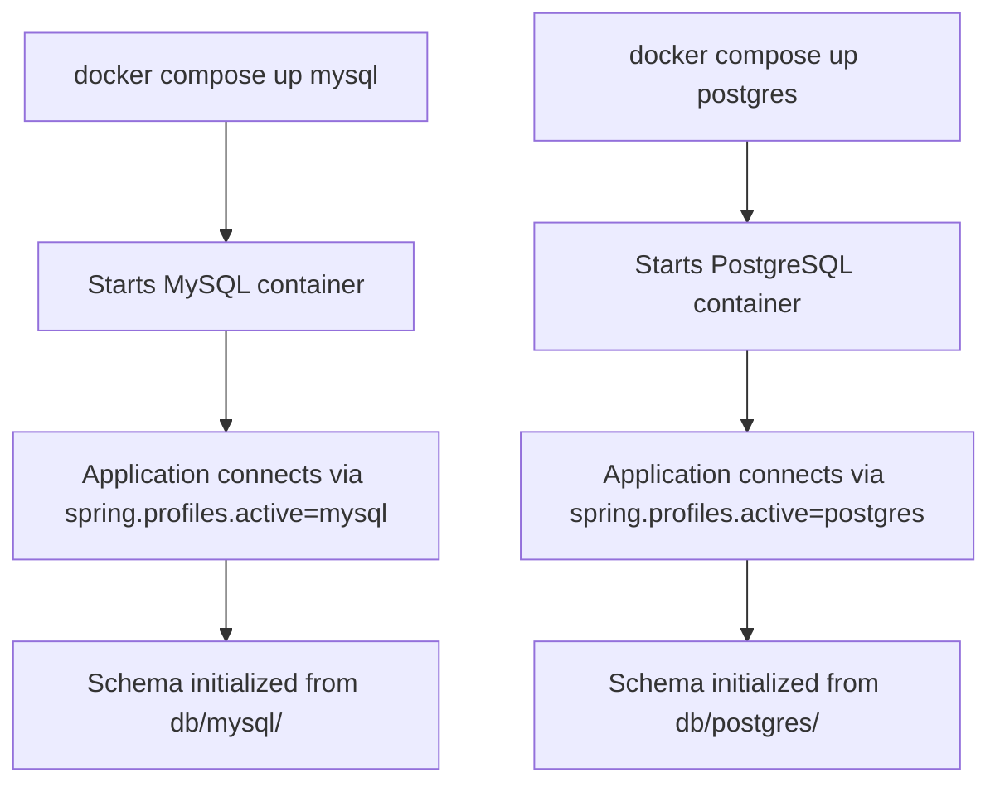
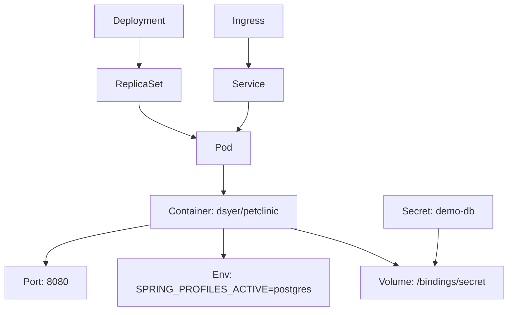
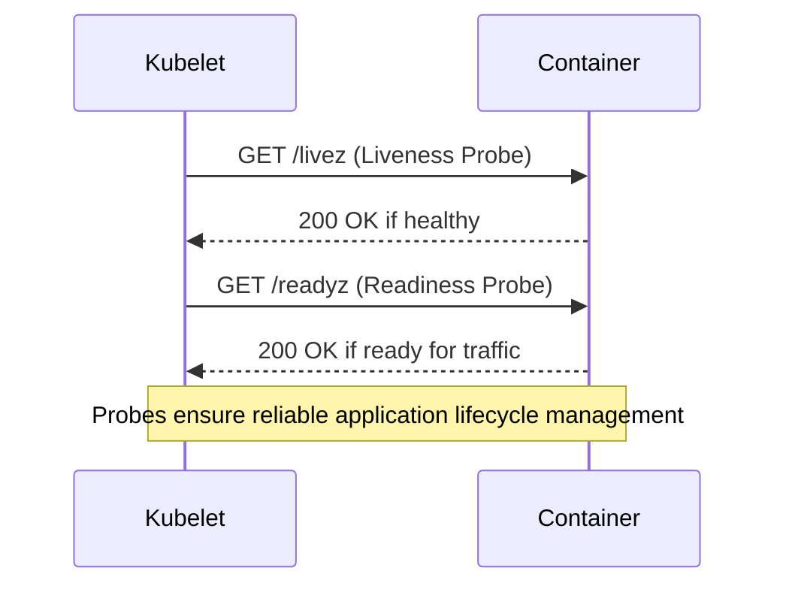

# Deployment Options

<cite>
**Referenced Files in This Document**   
- [pom.xml](file://pom.xml)
- [build.gradle](file://build.gradle)
- [docker-compose.yml](file://docker-compose.yml)
- [k8s/petclinic.yml](file://k8s/petclinic.yml)
- [src/main/resources/application.properties](file://src/main/resources/application.properties)
- [src/main/resources/application-mysql.properties](file://src/main/resources/application-mysql.properties)
- [src/main/resources/application-postgres.properties](file://src/main/resources/application-postgres.properties)
- [src/main/java/org/springframework/samples/petclinic/PetClinicApplication.java](file://src/main/java/org/springframework/samples/petclinic/PetClinicApplication.java)
</cite>

## Table of Contents
1. [Local Deployment](#local-deployment)
2. [Containerization with Docker](#containerization-with-docker)
3. [Docker Compose for Database Services](#docker-compose-for-database-services)
4. [Kubernetes Deployment](#kubernetes-deployment)
5. [Environment Configuration with Spring Profiles](#environment-configuration-with-spring-profiles)
6. [Scaling and Resource Management](#scaling-and-resource-management)
7. [Health Checks and Probes](#health-checks-and-probes)
8. [Troubleshooting Common Issues](#troubleshooting-common-issues)
9. [Performance Optimization Tips](#performance-optimization-tips)

## Local Deployment

The PetClinic application can be deployed locally using either Maven or Gradle build tools. For Maven-based deployment, execute `./mvnw package` to build the executable JAR file, followed by `java -jar target/*.jar` to run the application. Alternatively, use `./mvnw spring-boot:run` for development purposes to enable hot-reloading of changes. For Gradle users, run `./gradlew build` to generate the JAR in the `build/libs` directory, then execute it with `java -jar build/libs/*.jar`. The application will be accessible at `http://localhost:8080` upon successful startup.

**Section sources**
- [pom.xml](file://pom.xml#L1-L455)
- [build.gradle](file://build.gradle#L1-L90)
- [README.md](file://README.md#L0-L163)

## Containerization with Docker

The application supports containerization via the Spring Boot `spring-boot:build-image` goal, eliminating the need for a Dockerfile. This feature leverages Cloud Native Buildpacks to create optimized, layered container images. To build the image, run `./mvnw spring-boot:build-image`, which generates a container image tagged as `docker.io/library/spring-petclinic:3.4.0-SNAPSHOT`. This approach ensures reproducible builds, minimal image sizes, and automatic security updates through base image maintenance. The resulting image includes the JRE, application dependencies, and the compiled application, ready for deployment in any container runtime.

**Section sources**
- [pom.xml](file://pom.xml#L1-L455)
- [README.md](file://README.md#L0-L163)

## Docker Compose for Database Services

The provided `docker-compose.yml` file defines services for MySQL and PostgreSQL databases, enabling local testing with persistent data stores. The MySQL service uses the `mysql:9.1` image with environment variables configured for the PetClinic application, exposing port 3306. Similarly, the PostgreSQL service uses `postgres:17.0` with matching credentials and database name. These services can be started individually using `docker compose up mysql` or `docker compose up postgres`. The application automatically detects the active database through Spring profiles and initializes the schema using SQL scripts located in `src/main/resources/db/`.

**Diagram sources**
- [docker-compose.yml](file://docker-compose.yml#L1-L21)
- [src/main/resources/application-mysql.properties](file://src/main/resources/application-mysql.properties#L1-L7)
- [src/main/resources/application-postgres.properties](file://src/main/resources/application-postgres.properties#L1-L6)

**Section sources**
- [docker-compose.yml](file://docker-compose.yml#L1-L21)
- [src/main/resources/application-mysql.properties](file://src/main/resources/application-mysql.properties#L1-L7)
- [src/main/resources/application-postgres.properties](file://src/main/resources/application-postgres.properties#L1-L6)

## Kubernetes Deployment

The Kubernetes deployment configuration in `k8s/petclinic.yml` defines a Service, Deployment, and Ingress resources for production-grade deployment. The Service exposes the application via NodePort on port 80, routing traffic to container port 8080. The Deployment specifies a single replica with resource constraints and environment variables including `SPRING_PROFILES_ACTIVE=postgres` to enable PostgreSQL connectivity. The pod mounts a projected volume from a Secret named `demo-db` at `/bindings/secret`, facilitating secure configuration injection. This manifest provides a foundation for scaling and managing the application in Kubernetes environments.

**Diagram sources**
- [k8s/petclinic.yml](file://k8s/petclinic.yml#L1-L64)

**Section sources**
- [k8s/petclinic.yml](file://k8s/petclinic.yml#L1-L64)

## Environment Configuration with Spring Profiles

The application uses Spring profiles to manage environment-specific configurations. The default `application.properties` file sets H2 as the default database. Profile-specific files `application-mysql.properties` and `application-postgres.properties` override these settings when the corresponding profile is activated. Database connection parameters use environment variable placeholders (e.g., `${MYSQL_URL:jdbc:mysql://localhost/petclinic}`) for flexibility across deployment environments. The `spring.sql.init.mode=always` setting ensures database schema initialization on every startup, while the `database` property controls which SQL scripts are loaded from the classpath.

**Section sources**
- [src/main/resources/application.properties](file://src/main/resources/application.properties#L1-L24)
- [src/main/resources/application-mysql.properties](file://src/main/resources/application-mysql.properties#L1-L7)
- [src/main/resources/application-postgres.properties](file://src/main/resources/application-postgres.properties#L1-L6)

## Scaling and Resource Management

While the provided Kubernetes manifest starts with a single replica, production deployments should adjust the `replicas` value based on traffic demands. The container should have appropriate resource limits and requests defined for CPU and memory to ensure stable operation and proper scheduling. Horizontal Pod Autoscaler (HPA) can be configured to automatically scale the number of replicas based on CPU utilization or custom metrics. When scaling, ensure the underlying database can handle increased connection loads, potentially requiring connection pooling configuration adjustments in the application.

**Section sources**
- [k8s/petclinic.yml](file://k8s/petclinic.yml#L1-L64)

## Health Checks and Probes

The Kubernetes deployment includes liveness and readiness probes configured to monitor application health. The liveness probe checks the `/livez` endpoint, while the readiness probe monitors `/readyz`. These endpoints are enabled through the `management.endpoint.health.probes.add-additional-paths` property set in `SPRING_APPLICATION_JSON`. Spring Boot Actuator provides these health indicators, which verify the application's internal state and dependencies. Properly configured probes ensure that unhealthy instances are restarted and that traffic is only routed to ready instances, improving overall system reliability.

**Diagram sources**
- [k8s/petclinic.yml](file://k8s/petclinic.yml#L41)
- [src/main/resources/application.properties](file://src/main/resources/application.properties#L1-L24)

**Section sources**
- [k8s/petclinic.yml](file://k8s/petclinic.yml#L1-L64)
- [src/main/resources/application.properties](file://src/main/resources/application.properties#L1-L24)

## Troubleshooting Common Issues

Common deployment issues include network connectivity problems between the application and database containers, incorrect volume mounting for configuration secrets, and profile activation failures. Ensure that database services are running and accessible at the expected hostnames and ports. Verify that environment variables are correctly set, particularly `SPRING_PROFILES_ACTIVE`. When using projected volumes in Kubernetes, confirm that the Secret `demo-db` exists in the same namespace. For configuration overrides, check that property precedence is respected, with command-line arguments taking precedence over environment variables and profile-specific properties.

**Section sources**
- [k8s/petclinic.yml](file://k8s/petclinic.yml#L1-L64)
- [docker-compose.yml](file://docker-compose.yml#L1-L21)
- [src/main/resources/application.properties](file://src/main/resources/application.properties#L1-L24)

## Performance Optimization Tips

For production deployments, optimize performance by enabling connection pooling, adjusting JVM heap settings, and configuring appropriate cache settings. Use the Caffeine cache implementation configured in `CacheConfiguration` for frequently accessed data like veterinarian lists. Set appropriate `spring.web.resources.cache.cachecontrol.max-age` values for static resources to reduce server load. Monitor application performance using Actuator endpoints and adjust thread pool sizes for Tomcat based on expected concurrent users. Consider using a reverse proxy like NGINX in front of the application to handle static resources and SSL termination.

**Section sources**
- [src/main/resources/application.properties](file://src/main/resources/application.properties#L1-L24)
- [src/main/java/org/springframework/samples/petclinic/system/CacheConfiguration.java](file://src/main/java/org/springframework/samples/petclinic/system/CacheConfiguration.java#L1-L37)
- [pom.xml](file://pom.xml#L1-L455)