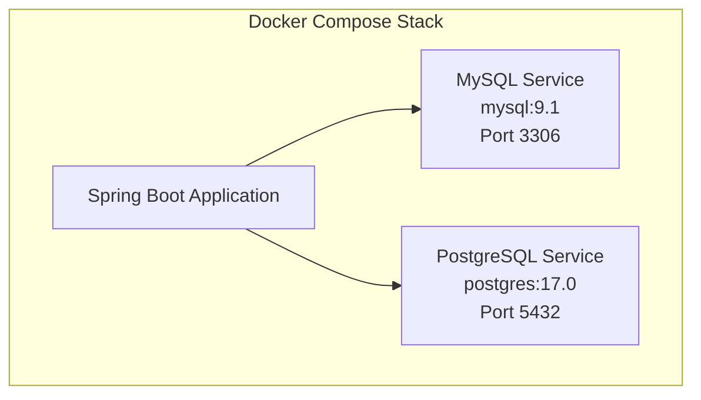

# Docker Deployment

<cite>
**Referenced Files in This Document**   
- [pom.xml](file://pom.xml)
- [build.gradle](file://build.gradle)
- [docker-compose.yml](file://docker-compose.yml)
- [application.properties](file://src/main/resources/application.properties)
- [application-mysql.properties](file://src/main/resources/application-mysql.properties)
- [application-postgres.properties](file://src/main/resources/application-postgres.properties)
- [user.sql](file://src/main/resources/db/mysql/user.sql)
</cite>

## Table of Contents
1. [Introduction](#introduction)
2. [Building Docker Images with Spring Boot](#building-docker-images-with-spring-boot)
3. [Docker Compose Configuration](#docker-compose-configuration)
4. [Environment Variable Configuration](#environment-variable-configuration)
5. [Starting the Application Stack](#starting-the-application-stack)
6. [Best Practices for Docker Deployment](#best-practices-for-docker-deployment)
7. [Common Pitfalls and Troubleshooting](#common-pitfalls-and-troubleshooting)
8. [Conclusion](#conclusion)

## Introduction
The Spring PetClinic application supports containerized deployment through Docker, enabling consistent environments across development, testing, and production. This document details the process of building Docker images using Spring Boot's built-in build-image functionality, configuring multi-container environments via docker-compose.yml, and managing database connectivity for both MySQL and PostgreSQL. The deployment strategy leverages Spring profiles and environment variables to ensure flexibility and portability.

**Section sources**
- [README.md](file://README.md#L21-L47)

## Building Docker Images with Spring Boot
Spring Boot provides native support for building container images without requiring a Dockerfile. The `build-image` goal is available for both Maven and Gradle build systems, allowing developers to create optimized OCI-compliant images directly from the build tool.

For Maven users, the image can be built using:
```bash
./mvnw spring-boot:build-image
```

For Gradle users, the equivalent command is:
```bash
./gradlew bootBuildImage
```

This functionality is enabled by the Spring Boot plugins configured in both `pom.xml` and `build.gradle`. The generated image includes the application jar, a minimal Linux distribution (via Paketo Buildpacks), and a production-ready JVM, all optimized for fast startup and low memory consumption.

**Section sources**
- [pom.xml](file://pom.xml#L10-L15)
- [build.gradle](file://build.gradle#L2-L7)

## Docker Compose Configuration
The `docker-compose.yml` file defines services for both MySQL and PostgreSQL databases, enabling integration testing and production-like environment simulation. Each service is configured with appropriate ports, environment variables, and volume mounts.

The MySQL service uses the `mysql:9.1` image and exposes port 3306. It is configured with environment variables to create a database named `petclinic` and a user with the same name. A volume mount is used to apply custom MySQL configurations from the local `./conf.d` directory.

The PostgreSQL service uses the `postgres:17.0` image and exposes port 5432. It similarly configures a `petclinic` database with appropriate credentials.

Both services are designed to work seamlessly with the Spring Boot application's profile-based configuration system, allowing developers to switch between database backends easily.



**Diagram sources**
- [docker-compose.yml](file://docker-compose.yml#L1-L21)

**Section sources**
- [docker-compose.yml](file://docker-compose.yml#L1-L21)

## Environment Variable Configuration
The application uses environment variables to configure database connectivity, with different sets of variables for MySQL and PostgreSQL. These variables are mapped to Spring Boot properties through placeholder expressions in the profile-specific configuration files.

For MySQL, the following environment variables are used:
- `MYSQL_USER`: Database username (defaults to "petclinic")
- `MYSQL_PASSWORD`: Database password (defaults to "petclinic")
- `MYSQL_DATABASE`: Database name (defaults to "petclinic")
- `MYSQL_ROOT_PASSWORD`: Root password (empty in development)
- `MYSQL_ALLOW_EMPTY_PASSWORD`: Allows empty root password

For PostgreSQL:
- `POSTGRES_USER`: Database username (defaults to "petclinic")
- `POSTGRES_PASSWORD`: Database password (defaults to "petclinic")
- `POSTGRES_DB`: Database name (defaults to "petclinic")

Database connectivity is controlled through Spring profiles. The `SPRING_PROFILES_ACTIVE` environment variable determines which database configuration is loaded:
- `spring.profiles.active=mysql` for MySQL
- `spring.profiles.active=postgres` for PostgreSQL

These profiles are activated by setting the appropriate environment variable or passing it as a command-line argument.

**Section sources**
- [application-mysql.properties](file://src/main/resources/application-mysql.properties#L1-L4)
- [application-postgres.properties](file://src/main/resources/application-postgres.properties#L1-L3)
- [docker-compose.yml](file://docker-compose.yml#L7-L15)

## Starting the Application Stack
To start the full application stack, use the `docker-compose up` command:

```bash
docker-compose up
```

This command starts both the MySQL and PostgreSQL services defined in the compose file. The services run in the foreground by default, displaying logs from both containers. To run in detached mode, use:

```bash
docker-compose up -d
```

After starting the database services, the Spring Boot application can be started with the appropriate profile:

```bash
./mvnw spring-boot:run -Dspring-boot.run.profiles=mysql
```

or for PostgreSQL:

```bash
./mvnw spring-boot:run -Dspring-boot.run.profiles=postgres
```

The application will be accessible at `http://localhost:8080` once started. The docker-compose configuration ensures that the database services are available on standard ports, allowing the application to connect using localhost.

**Section sources**
- [docker-compose.yml](file://docker-compose.yml#L1-L21)
- [README.md](file://README.md#L48-L55)

## Best Practices for Docker Deployment
When deploying the PetClinic application with Docker, several best practices should be followed to ensure optimal performance and security.

**Image Optimization**: The Spring Boot build-image goal automatically produces optimized images using buildpacks. These images are smaller and more secure than traditional Dockerfile-based images, with automatic vulnerability scanning and minimal attack surface.

**Network Configuration**: The docker-compose.yml file uses default networking, which creates a bridge network allowing services to communicate. For production deployments, consider using custom networks with explicit names and configurations.

**Container Lifecycle Management**: Use health checks and proper shutdown hooks to ensure graceful container termination. The Spring Boot actuator endpoints provide health information that can be used for container health checks.

**Volume Management**: The MySQL service mounts a volume for configuration files (`./conf.d:/etc/mysql/conf.d:ro`). Ensure this directory exists and contains any custom MySQL configurations needed for the application.

**Security Considerations**: Avoid using empty passwords and root access in production environments. The current configuration is optimized for development and testing. In production, use strong passwords and consider using Docker secrets for sensitive information.

**Section sources**
- [pom.xml](file://pom.xml#L10-L15)
- [docker-compose.yml](file://docker-compose.yml#L1-L21)

## Common Pitfalls and Troubleshooting
Several common issues may arise when deploying the PetClinic application with Docker.

**Incorrect Profile Activation**: If the application fails to connect to the database, verify that the correct Spring profile is active. The profile must match the database service being used (mysql or postgres). Check that `SPRING_PROFILES_ACTIVE` is set correctly.

**Container Networking Issues**: If the application cannot connect to the database, ensure that the database containers are running and accessible on the expected ports. Use `docker-compose ps` to verify container status and `docker-compose logs` to check for errors.

**Volume Permission Errors**: When mounting the MySQL configuration volume, ensure that the local `./conf.d` directory has appropriate read permissions. Permission errors can prevent the MySQL container from starting properly.

**Database Initialization**: The MySQL container requires the `petclinic` database to exist. The `user.sql` script creates this database and the necessary user. If using a fresh container, ensure this script has been executed or that the environment variables are configured to create the database automatically.

**Port Conflicts**: If other services are using ports 3306 or 5432, the containers will fail to start. Either stop the conflicting services or modify the port mappings in the docker-compose.yml file.

**Section sources**
- [docker-compose.yml](file://docker-compose.yml#L1-L21)
- [src/main/resources/db/mysql/user.sql](file://src/main/resources/db/mysql/user.sql#L1-L7)

## Conclusion
The Docker-based deployment strategy for the Spring PetClinic application provides a robust and flexible approach to containerization. By leveraging Spring Boot's build-image functionality and Docker Compose for multi-container orchestration, developers can create consistent environments across the development lifecycle. The profile-based configuration system allows easy switching between database backends, while environment variables provide secure and flexible configuration options. Following the best practices outlined in this document will help ensure successful deployment and operation of the application in containerized environments.