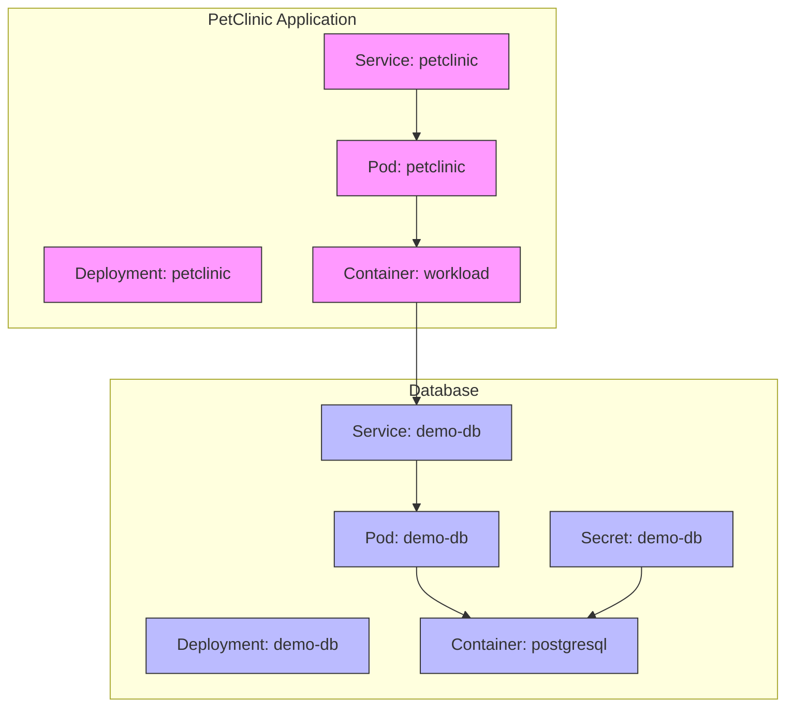
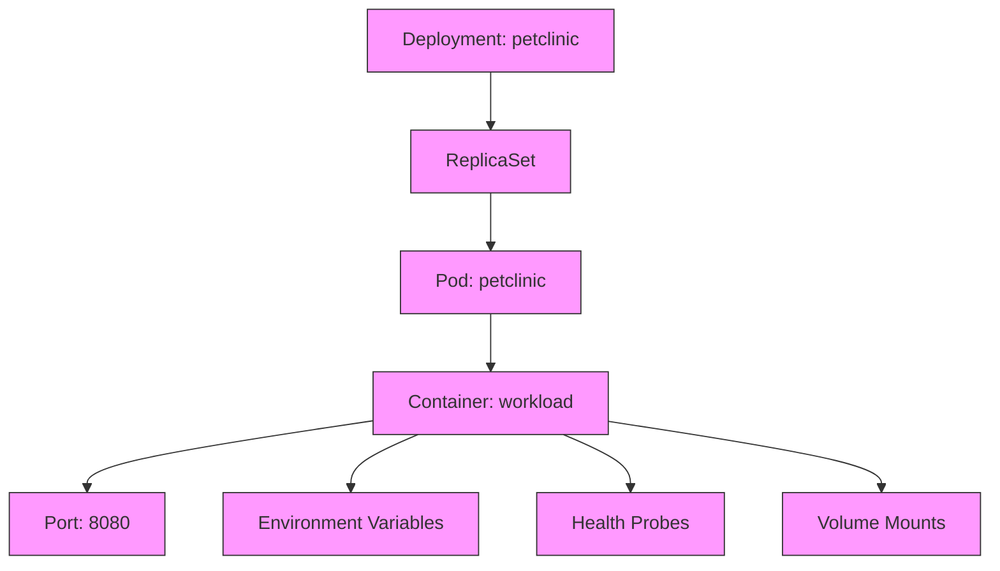
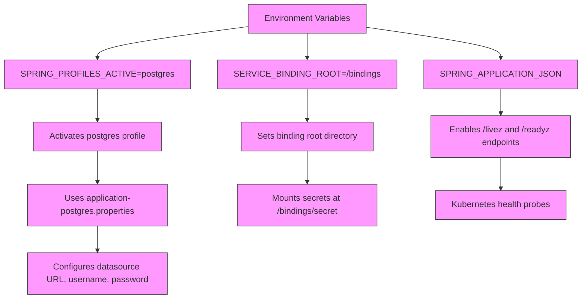
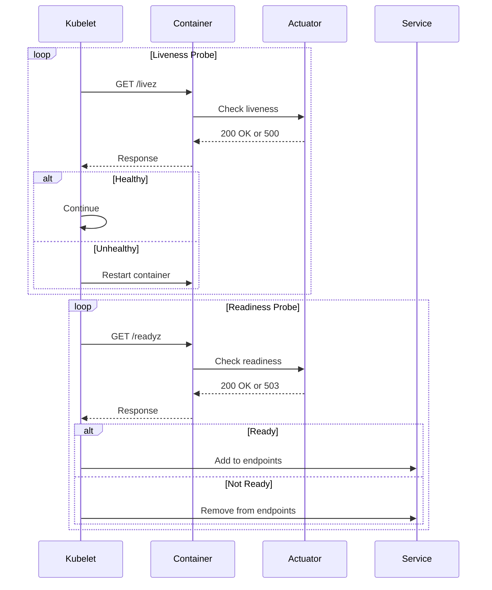
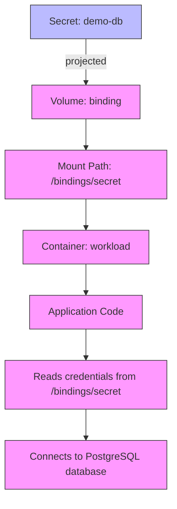

# Kubernetes Deployment

<cite>
**Referenced Files in This Document**   
- [k8s/petclinic.yml](file://k8s/petclinic.yml)
- [k8s/db.yml](file://k8s/db.yml)
- [src/main/resources/application-postgres.properties](file://src/main/resources/application-postgres.properties)
- [src/main/resources/application.properties](file://src/main/resources/application.properties)
- [src/main/java/org/springframework/samples/petclinic/PetClinicApplication.java](file://src/main/java/org/springframework/samples/petclinic/PetClinicApplication.java)
- [README.md](file://README.md)
</cite>

## Table of Contents
1. [Introduction](#introduction)
2. [Kubernetes Manifest Overview](#kubernetes-manifest-overview)
3. [Service Configuration](#service-configuration)
4. [Deployment and Pod Specifications](#deployment-and-pod-specifications)
5. [Environment Variables and Configuration](#environment-variables-and-configuration)
6. [Health Probes](#health-probes)
7. [Secret Management and Volume Mounting](#secret-management-and-volume-mounting)
8. [Labels and Selectors](#labels-and-selectors)
9. [Deployment Operations](#deployment-operations)
10. [Production Considerations](#production-considerations)
11. [Troubleshooting Guide](#troubleshooting-guide)
12. [Conclusion](#conclusion)

## Introduction
This document provides comprehensive guidance for deploying the Spring PetClinic application on Kubernetes. The analysis focuses on the k8s/petclinic.yml manifest file, which defines the Kubernetes resources required to run the PetClinic application with PostgreSQL database integration. The deployment leverages Kubernetes best practices for configuration management, health monitoring, and secure credential handling. The application is configured to use the PostgreSQL profile, connecting to a database instance defined in a separate db.yml manifest. This documentation covers all aspects of the deployment configuration, from service exposure to production readiness considerations.

**Section sources**
- [k8s/petclinic.yml](file://k8s/petclinic.yml#L1-L65)
- [README.md](file://README.md#L1-L164)

## Kubernetes Manifest Overview
The PetClinic Kubernetes deployment consists of two primary manifest files: petclinic.yml for the application and db.yml for the database. The petclinic.yml file defines a Service of type NodePort and a Deployment resource that manages the application Pods. The db.yml file defines a Secret containing database credentials, a Service for database access, and a Deployment for the PostgreSQL container. These manifests work together to create a complete application stack with proper networking, configuration, and security. The application container uses the dsyer/petclinic image and is configured with environment variables that activate the PostgreSQL profile and enable service binding for database credentials.

**Diagram sources**
- [k8s/petclinic.yml](file://k8s/petclinic.yml#L1-L65)
- [k8s/db.yml](file://k8s/db.yml#L1-L74)

**Section sources**
- [k8s/petclinic.yml](file://k8s/petclinic.yml#L1-L65)
- [k8s/db.yml](file://k8s/db.yml#L1-L74)

## Service Configuration
The Service resource in petclinic.yml is configured as a NodePort type, exposing the application on port 80 of each node in the cluster. The service maps port 80 to the container's targetPort 8080, which is the default HTTP port for Spring Boot applications. The selector app: petclinic ensures that the service routes traffic to Pods with the matching label. This configuration allows external access to the application through any node's IP address on the NodePort. The service acts as a stable network endpoint for the application, abstracting the underlying Pods and providing load balancing across them. This approach is suitable for development and testing environments, while production deployments might consider using LoadBalancer or Ingress resources for more sophisticated traffic management.

**Section sources**
- [k8s/petclinic.yml](file://k8s/petclinic.yml#L2-L9)

## Deployment and Pod Specifications
The Deployment resource defines the desired state for the PetClinic application, specifying a single replica that can be scaled as needed. The deployment uses label selectors to identify the Pods it manages, ensuring they have the app: petclinic label. Each Pod contains a single container named "workload" running the dsyer/petclinic image. The container exposes port 8080 for HTTP traffic and includes configuration for liveness and readiness probes. The deployment's declarative nature ensures that Kubernetes maintains the specified number of replicas, automatically replacing any that fail or are terminated. This self-healing capability is a core feature of Kubernetes, providing high availability and reliability for the application.

**Diagram sources**
- [k8s/petclinic.yml](file://k8s/petclinic.yml#L11-L65)

**Section sources**
- [k8s/petclinic.yml](file://k8s/petclinic.yml#L11-L65)

## Environment Variables and Configuration
The deployment configures several critical environment variables for the PetClinic application. The SPRING_PROFILES_ACTIVE=postgres variable activates the PostgreSQL profile, causing the application to use the database configuration defined in application-postgres.properties. This profile-based configuration allows the same application code to work with different database backends by simply changing the active profile. The SERVICE_BINDING_ROOT=/bindings variable specifies the directory where service binding information will be mounted, following the Service Binding Specification for Kubernetes. This standard approach enables consistent configuration across different services and platforms. Additionally, SPRING_APPLICATION_JSON configures the management endpoints to expose additional health probe paths, enabling Kubernetes to use the /livez and /readyz endpoints for health checks.

**Diagram sources**
- [k8s/petclinic.yml](file://k8s/petclinic.yml#L34-L45)
- [src/main/resources/application-postgres.properties](file://src/main/resources/application-postgres.properties#L1-L7)
- [src/main/resources/application.properties](file://src/main/resources/application.properties#L1-L26)

**Section sources**
- [k8s/petclinic.yml](file://k8s/petclinic.yml#L34-L45)
- [src/main/resources/application-postgres.properties](file://src/main/resources/application-postgres.properties#L1-L7)

## Health Probes
The deployment includes both liveness and readiness probes to monitor the application's health and readiness. The liveness probe uses the HTTP GET method to check the /livez endpoint on the container's HTTP port. If this probe fails, Kubernetes will restart the container, assuming the application is in an unrecoverable state. The readiness probe checks the /readyz endpoint, determining whether the container is ready to accept traffic. If the readiness probe fails, the container is removed from the service endpoints, preventing traffic from being routed to it. These probes are essential for maintaining application reliability and ensuring that only healthy instances receive traffic. The endpoints are enabled by the SPRING_APPLICATION_JSON configuration, which activates the additional health probe paths in Spring Boot's actuator.

**Diagram sources**
- [k8s/petclinic.yml](file://k8s/petclinic.yml#L46-L55)
- [src/main/resources/application.properties](file://src/main/resources/application.properties#L19-L20)

**Section sources**
- [k8s/petclinic.yml](file://k8s/petclinic.yml#L46-L55)

## Secret Management and Volume Mounting
The deployment uses Kubernetes Secrets and projected volumes for secure database credential management. The db.yml manifest defines a Secret named demo-db containing PostgreSQL connection details including host, port, database name, username, and password. In the petclinic.yml deployment, a projected volume named "binding" mounts the Secret at /bindings/secret within the container. This approach follows the Service Binding Specification, allowing the application to discover and use service credentials in a standardized way. The projected volume type enables mounting multiple sources (including Secrets, ConfigMaps, and downward API) into the same directory. This secure credential injection mechanism prevents sensitive information from being exposed in environment variables or configuration files, enhancing the security posture of the application.

**Diagram sources**
- [k8s/petclinic.yml](file://k8s/petclinic.yml#L56-L65)
- [k8s/db.yml](file://k8s/db.yml#L2-L20)

**Section sources**
- [k8s/petclinic.yml](file://k8s/petclinic.yml#L56-L65)
- [k8s/db.yml](file://k8s/db.yml#L2-L20)

## Labels and Selectors
Labels and selectors are fundamental Kubernetes concepts used for organizing and selecting resources. In the PetClinic deployment, the label app: petclinic is applied to the Deployment, Pod template, and Service. The Service uses a selector with matchLabels app: petclinic to identify the Pods that should receive traffic. Similarly, the Deployment uses a selector to identify the Pods it manages. This labeling strategy enables service discovery, allowing the Service to automatically route traffic to the correct Pods regardless of their specific names or IP addresses. Labels also facilitate operations like filtering, grouping, and managing resources. The consistent use of the app label across resources creates a clear relationship between them, making the deployment easier to understand and manage.

**Section sources**
- [k8s/petclinic.yml](file://k8s/petclinic.yml#L18-L25)

## Deployment Operations
To deploy the PetClinic application, apply both manifest files using kubectl apply. First, apply the database manifest: kubectl apply -f k8s/db.yml, which creates the Secret, Service, and Deployment for PostgreSQL. Then, apply the application manifest: kubectl apply -f k8s/petclinic.yml, which creates the Service and Deployment for PetClinic. To scale the deployment, use kubectl scale deployment petclinic --replicas=N, where N is the desired number of replicas. Monitor the deployment status with kubectl get deployments and pod status with kubectl get pods. Use kubectl logs to view container logs for troubleshooting. To update the application, modify the manifest file and reapply it with kubectl apply, which will trigger a rolling update if the container image or configuration changes.

**Section sources**
- [k8s/petclinic.yml](file://k8s/petclinic.yml#L1-L65)
- [k8s/db.yml](file://k8s/db.yml#L1-L74)

## Production Considerations
For production deployments, several enhancements should be considered beyond the basic manifest configuration. Resource limits and requests should be defined for CPU and memory to ensure fair resource allocation and prevent resource exhaustion. Security contexts should be configured to run containers with minimal required privileges, following the principle of least privilege. An Ingress resource should be used instead of NodePort for external access, providing more sophisticated routing, TLS termination, and integration with load balancers. Network policies should be implemented to restrict traffic between pods and enforce security boundaries. Additionally, persistent volumes should be used for the database to ensure data durability across pod restarts. Monitoring and logging should be integrated with centralized systems for observability.

**Section sources**
- [k8s/petclinic.yml](file://k8s/petclinic.yml#L1-L65)
- [k8s/db.yml](file://k8s/db.yml#L1-L74)

## Troubleshooting Guide
Common issues during deployment include image pull failures, probe failures, and secret mounting problems. For image pull failures, verify the image name and tag exist in the registry and that the cluster has network access to the registry. For probe failures, check the application logs to ensure it starts correctly and that the /livez and /readyz endpoints are accessible. Verify that the SPRING_APPLICATION_JSON configuration is correctly set. For secret mounting issues, confirm that the Secret exists and contains the expected data, and that the volume mount path matches the SERVICE_BINDING_ROOT environment variable. Use kubectl describe pod to inspect pod events and configuration, and kubectl exec to enter the container and verify file system contents. Ensure that the database is running and accessible from the application pods.

**Section sources**
- [k8s/petclinic.yml](file://k8s/petclinic.yml#L1-L65)
- [k8s/db.yml](file://k8s/db.yml#L1-L74)
- [README.md](file://README.md#L1-L164)

## Conclusion
The Kubernetes deployment of the PetClinic application demonstrates key patterns for running Spring Boot applications in containerized environments. The configuration leverages Kubernetes features like Services, Deployments, Secrets, and health probes to create a reliable and maintainable application stack. The use of environment variables for profile activation and service binding enables flexible configuration across different environments. The projected volume for secret mounting follows security best practices for credential management. While the current configuration is suitable for development and testing, production deployments should incorporate additional considerations like resource limits, security contexts, and ingress configuration. This deployment serves as a solid foundation that can be extended and customized for various deployment scenarios.

[No sources needed since this section summarizes without analyzing specific files]