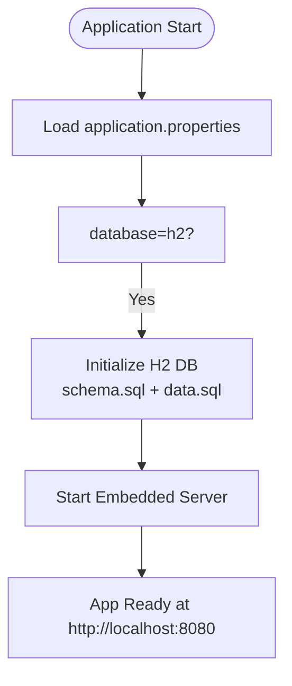
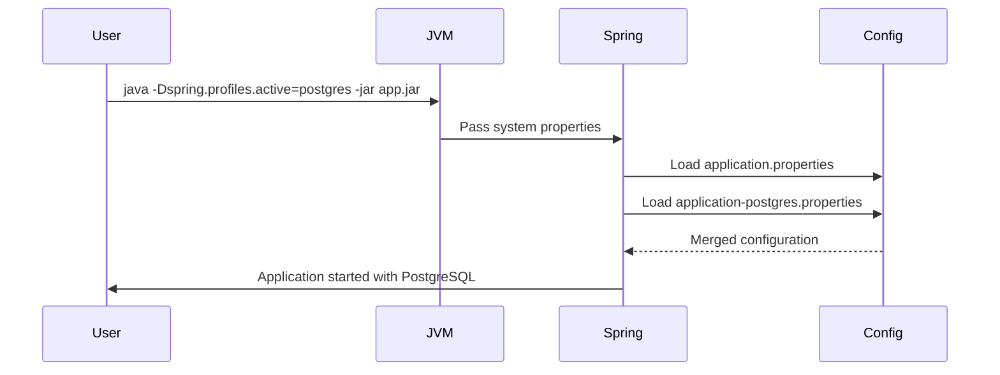
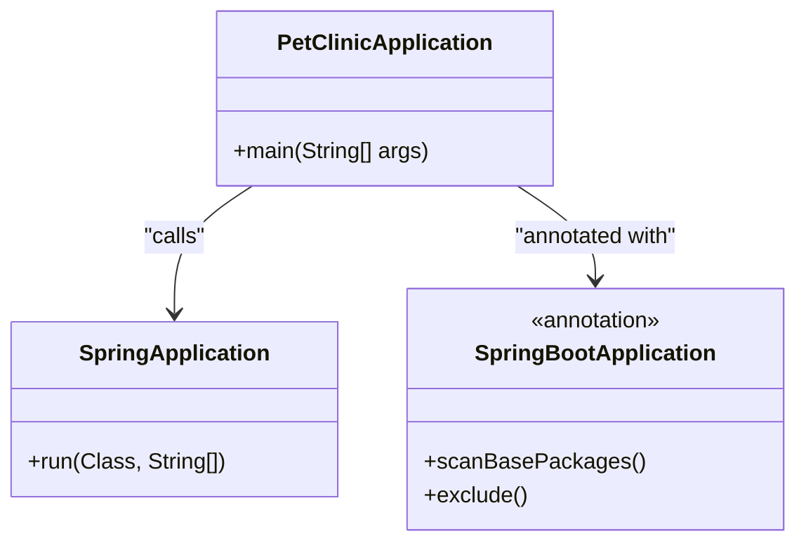

# Local Deployment

<cite>
**Referenced Files in This Document**   
- [pom.xml](file://pom.xml)
- [build.gradle](file://build.gradle)
- [PetClinicApplication.java](file://src/main/java/org/springframework/samples/petclinic/PetClinicApplication.java)
- [application.properties](file://src/main/resources/application.properties)
- [application-mysql.properties](file://src/main/resources/application-mysql.properties)
- [application-postgres.properties](file://src/main/resources/application-postgres.properties)
- [README.md](file://README.md)
</cite>

## Table of Contents
1. [Introduction](#introduction)
2. [Build and Run with Maven](#build-and-run-with-maven)
3. [Build and Run with Gradle](#build-and-run-with-gradle)
4. [Default Configuration with H2 Database](#default-configuration-with-h2-database)
5. [Overriding Configuration via Command-Line Arguments](#overriding-configuration-via-command-line-arguments)
6. [Running in IDEs](#running-in-ides)
7. [Troubleshooting Common Issues](#troubleshooting-common-issues)
8. [Application Entry Point and Auto-Configuration](#application-entry-point-and-auto-configuration)

## Introduction
The Spring PetClinic application is a Spring Boot-based sample application that can be deployed locally using either Maven or Gradle. It leverages Spring Boot’s embedded server capabilities, eliminating the need for external deployment containers. This document provides comprehensive instructions for building and running the application locally, configuring database options, and troubleshooting common startup issues.

**Section sources**
- [README.md](file://README.md#L4-L163)

## Build and Run with Maven
To build and run the PetClinic application using Maven, execute the following steps:

1. Clone the repository:
   ```bash
   git clone https://github.com/spring-projects/spring-petclinic.git
   cd spring-petclinic
   ```

2. Build the JAR file:
   ```bash
   ./mvnw package
   ```

3. Run the application:
   ```bash
   java -jar target/*.jar
   ```

Alternatively, use the Spring Boot Maven plugin to run the application directly, which supports hot reloading during development:
```bash
./mvnw spring-boot:run
```

The application will be accessible at `http://localhost:8080`.

**Section sources**
- [pom.xml](file://pom.xml#L1-L455)
- [README.md](file://README.md#L4-L163)

## Build and Run with Gradle
For Gradle-based builds, follow these steps:

1. Ensure you are in the project root directory.

2. Build the application:
   ```bash
   ./gradlew build
   ```

3. Run the application using the Spring Boot plugin:
   ```bash
   ./gradlew bootRun
   ```

The compiled JAR file will be located in the `build/libs/` directory and can also be executed directly:
```bash
java -jar build/libs/*.jar
```

The application starts on port 8080 by default and is accessible at `http://localhost:8080`.

**Section sources**
- [build.gradle](file://build.gradle#L0-L90)
- [README.md](file://README.md#L4-L163)

## Default Configuration with H2 Database
By default, the PetClinic application uses an in-memory H2 database. The configuration is defined in `application.properties` where the `database=h2` property triggers the loading of schema and data scripts from `classpath*:db/h2/`. The database is automatically initialized at startup using `schema.sql` and `data.sql`.

The H2 console is available at `http://localhost:8080/h2-console` for inspecting the database contents. The JDBC URL uses a dynamically generated UUID, which is printed to the console upon application startup.

This setup enables zero-configuration local development and testing, with all data reset on each restart.



**Diagram sources**
- [application.properties](file://src/main/resources/application.properties#L1-L25)
- [src/main/resources/db/h2/schema.sql](file://src/main/resources/db/h2/schema.sql)
- [src/main/resources/db/h2/data.sql](file://src/main/resources/db/h2/data.sql)

**Section sources**
- [application.properties](file://src/main/resources/application.properties#L1-L25)
- [README.md](file://README.md#L4-L163)

## Overriding Configuration via Command-Line Arguments
The application supports profile-based configuration for different databases. To override the default H2 configuration, activate alternative profiles using command-line arguments.

For MySQL:
```bash
java -jar target/*.jar --spring.profiles.active=mysql
```
Or using system properties:
```bash
java -Dspring.profiles.active=mysql -jar target/*.jar
```

For PostgreSQL:
```bash
java -jar target/*.jar --spring.profiles.active=postgres
```

Profile-specific configurations are defined in `application-mysql.properties` and `application-postgres.properties`, which set the appropriate JDBC URLs, usernames, passwords, and initialization modes. These properties can also be overridden using environment variables such as `MYSQL_URL`, `MYSQL_USER`, and `POSTGRES_DB`.



**Diagram sources**
- [application-mysql.properties](file://src/main/resources/application-mysql.properties#L0-L7)
- [application-postgres.properties](file://src/main/resources/application-postgres.properties#L0-L6)
- [application.properties](file://src/main/resources/application.properties#L1-L25)

**Section sources**
- [application-mysql.properties](file://src/main/resources/application-mysql.properties#L0-L7)
- [application-postgres.properties](file://src/main/resources/application-postgres.properties#L0-L6)
- [README.md](file://README.md#L4-L163)

## Running in IDEs
The PetClinic application can be run directly from popular IDEs such as IntelliJ IDEA, Eclipse, or Spring Tools Suite (STS).

### IntelliJ IDEA
1. Open the project via `File -> Open` and select the `pom.xml` file.
2. Wait for Maven dependencies to resolve.
3. Run the `PetClinicApplication` class by right-clicking the `main()` method and selecting `Run 'PetClinicApplication'`.

### Eclipse or STS
1. Import the project via `File -> Import -> Maven -> Existing Maven Project`.
2. Resolve dependencies and generate resources if needed (`./mvnw generate-resources`).
3. Run the `PetClinicApplication` class as a Java application.

Ensure that Java 17 or later is configured in your IDE, as specified in both `pom.xml` and `build.gradle`.

**Section sources**
- [PetClinicApplication.java](file://src/main/java/org/springframework/samples/petclinic/PetClinicApplication.java#L28-L36)
- [pom.xml](file://pom.xml#L20-L20)
- [build.gradle](file://build.gradle#L20-L20)
- [README.md](file://README.md#L4-L163)

## Troubleshooting Common Issues
### Port Conflicts
If port 8080 is already in use, change the server port using:
```bash
java -jar target/*.jar --server.port=8081
```
Or set `server.port=8081` in `application.properties`.

### Missing Java Version
The application requires Java 17 or higher. The `pom.xml` enforces this via the `maven-enforcer-plugin`. Ensure your `JAVA_HOME` points to a valid JDK 17+ installation.

### Dependency Resolution Errors
If dependencies fail to resolve:
- For Maven: Run `./mvnw dependency:resolve`
- For Gradle: Run `./gradlew dependencies`
- Ensure internet access and repository availability (Maven Central)

### H2 Console Access Issues
If the H2 console does not load:
- Verify the application started successfully
- Check the console output for the correct JDBC URL with UUID
- Ensure no browser extensions are blocking the connection

**Section sources**
- [pom.xml](file://pom.xml#L170-L173)
- [README.md](file://README.md#L4-L163)

## Application Entry Point and Auto-Configuration
The `PetClinicApplication.java` file serves as the entry point for the application. It contains the `main()` method annotated with `@SpringBootApplication`, which enables Spring Boot’s auto-configuration, component scanning, and configuration property support.

Spring Boot auto-configuration automatically configures beans based on the classpath and defined properties. For example:
- `spring-boot-starter-web` sets up an embedded Tomcat server
- `spring-boot-starter-data-jpa` configures JPA and Hibernate
- `spring-boot-starter-thymeleaf` configures view resolution

This eliminates the need for manual configuration, simplifying local execution and reducing boilerplate code.



**Diagram sources**
- [PetClinicApplication.java](file://src/main/java/org/springframework/samples/petclinic/PetClinicApplication.java#L28-L36)

**Section sources**
- [PetClinicApplication.java](file://src/main/java/org/springframework/samples/petclinic/PetClinicApplication.java#L28-L36)
- [pom.xml](file://pom.xml#L42-L77)
- [build.gradle](file://build.gradle#L37-L60)