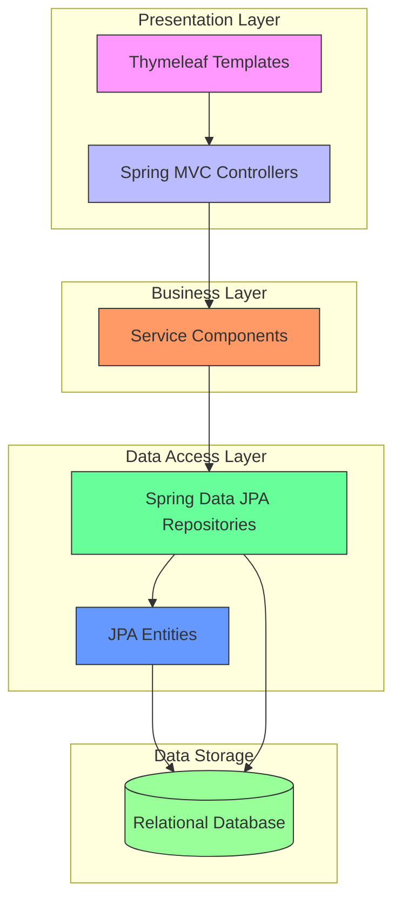
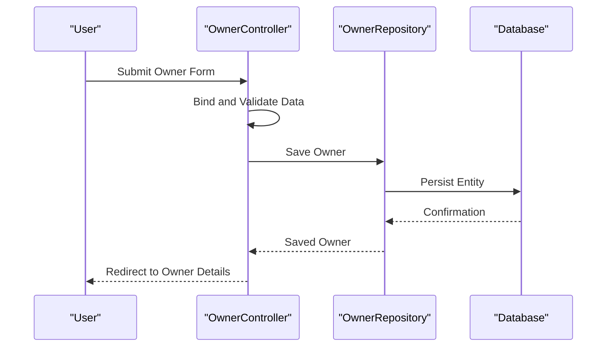
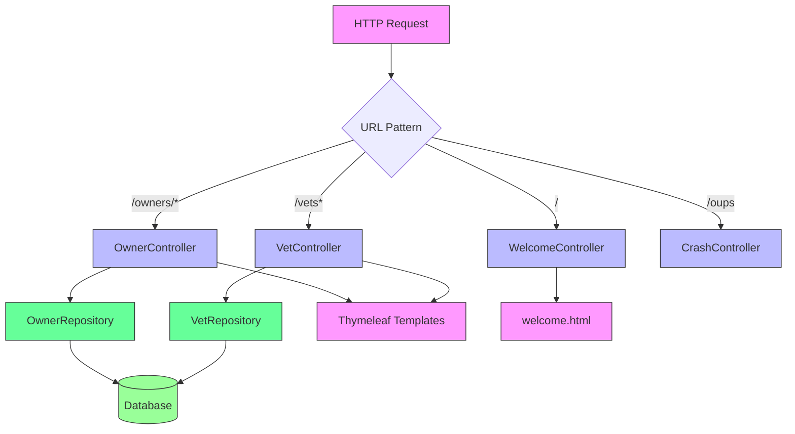

# Project Overview

<cite>
**Referenced Files in This Document**   
- [PetClinicApplication.java](file://src/main/java/org/springframework/samples/petclinic/PetClinicApplication.java)
- [application.properties](file://src/main/resources/application.properties)
- [OwnerController.java](file://src/main/java/org/springframework/samples/petclinic/owner/OwnerController.java)
- [VetController.java](file://src/main/java/org/springframework/samples/petclinic/vet/VetController.java)
- [WelcomeController.java](file://src/main/java/org/springframework/samples/petclinic/system/WelcomeController.java)
- [OwnerRepository.java](file://src/main/java/org/springframework/samples/petclinic/owner/OwnerRepository.java)
- [VetRepository.java](file://src/main/java/org/springframework/samples/petclinic/vet/VetRepository.java)
- [welcome.html](file://src/main/resources/templates/welcome.html)
- [layout.html](file://src/main/resources/templates/fragments/layout.html)
- [PetClinicRuntimeHints.java](file://src/main/java/org/springframework/samples/petclinic/PetClinicRuntimeHints.java)
</cite>

## Table of Contents
1. [Introduction](#introduction)
2. [High-Level Architecture](#high-level-architecture)
3. [Entry Point and Runtime Configuration](#entry-point-and-runtime-configuration)
4. [Core Spring Concepts Demonstration](#core-spring-concepts-demonstration)
5. [Component Relationships](#component-relationships)
6. [Common Configuration Issues](#common-configuration-issues)
7. [Performance Considerations](#performance-considerations)

## Introduction

The Spring PetClinic application serves as a comprehensive sample veterinary clinic management system designed to demonstrate enterprise-grade Java development practices using the Spring Boot framework. It models a real-world veterinary clinic with entities such as owners, pets, visits, and veterinarians, providing a full-stack web application with a relational data model, service layer, and user interface. The application is structured to showcase modern Spring ecosystem capabilities including Spring Web MVC for request handling, Spring Data JPA for database persistence, and Thymeleaf for server-side templating. As an official Spring sample project, it is widely used for learning and reference purposes, illustrating best practices in dependency management, configuration, and modular design.

**Section sources**
- [PetClinicApplication.java](file://src/main/java/org/springframework/samples/petclinic/PetClinicApplication.java#L1-L36)
- [application.properties](file://src/main/resources/application.properties#L1-L25)

## High-Level Architecture

The Spring PetClinic application follows a layered architectural pattern built on the Spring Boot foundation. At the presentation layer, Thymeleaf templates render dynamic HTML content, leveraging Spring MVC controllers to handle HTTP requests and responses. The business logic layer is managed through Spring-managed components that coordinate operations between the web layer and data access layer. For persistence, the application uses Spring Data JPA with JPA annotations to map domain entities to database tables, supporting multiple database backends including H2, MySQL, PostgreSQL, and HSQLDB through configurable profiles. The architecture promotes separation of concerns by organizing code into distinct packages for owners, veterinarians, and system components, each containing related models, repositories, and controllers. Internationalization is supported through message property files, and caching is implemented for frequently accessed data such as veterinarian lists.



**Diagram sources**
- [OwnerController.java](file://src/main/java/org/springframework/samples/petclinic/owner/OwnerController.java#L1-L173)
- [VetController.java](file://src/main/java/org/springframework/samples/petclinic/vet/VetController.java#L1-L78)
- [OwnerRepository.java](file://src/main/java/org/springframework/samples/petclinic/owner/OwnerRepository.java#L1-L77)
- [VetRepository.java](file://src/main/java/org/springframework/samples/petclinic/vet/VetRepository.java#L1-L58)

**Section sources**
- [OwnerController.java](file://src/main/java/org/springframework/samples/petclinic/owner/OwnerController.java#L1-L173)
- [VetController.java](file://src/main/java/org/springframework/samples/petclinic/vet/VetController.java#L1-L78)
- [application.properties](file://src/main/resources/application.properties#L1-L25)

## Entry Point and Runtime Configuration

The `PetClinicApplication` class serves as the entry point for the Spring Boot application, annotated with `@SpringBootApplication` which enables three essential features: component scanning, auto-configuration, and configuration property support. This annotation combines `@Configuration`, `@EnableAutoConfiguration`, and `@ComponentScan` to bootstrap the application context with all necessary beans. The class contains the standard `main` method that invokes `SpringApplication.run()` to start the embedded web server and initialize the Spring context. Additionally, the application includes runtime hints through the `@ImportRuntimeHints(PetClinicRuntimeHints.class)` annotation, which supports GraalVM native image compilation by specifying resources and serialization types that must be included at build time. The `PetClinicRuntimeHints` class explicitly registers patterns for database scripts, message bundles, and key domain classes to ensure proper functionality in native images.

```mermaid
classDiagram
class PetClinicApplication {
+main(String[] args)
}
class PetClinicRuntimeHints {
+registerHints(RuntimeHints, ClassLoader)
}
PetClinicApplication <|-- @SpringBootApplication
PetClinicApplication <|-- @ImportRuntimeHints
PetClinicApplication --> PetClinicRuntimeHints : "imports hints"
```

**Diagram sources**
- [PetClinicApplication.java](file://src/main/java/org/springframework/samples/petclinic/PetClinicApplication.java#L1-L36)
- [PetClinicRuntimeHints.java](file://src/main/java/org/springframework/samples/petclinic/PetClinicRuntimeHints.java#L1-L37)

**Section sources**
- [PetClinicApplication.java](file://src/main/java/org/springframework/samples/petclinic/PetClinicApplication.java#L1-L36)
- [PetClinicRuntimeHints.java](file://src/main/java/org/springframework/samples/petclinic/PetClinicRuntimeHints.java#L1-L37)

## Core Spring Concepts Demonstration

The Spring PetClinic application exemplifies key Spring framework concepts including dependency injection, auto-configuration, and component scanning. Dependency injection is demonstrated through constructor injection in controllers such as `OwnerController` and `VetController`, where repository dependencies are injected by the Spring container, promoting loose coupling and testability. Auto-configuration is evident in the automatic setup of JPA repositories, data sources, and Thymeleaf view resolvers based on classpath dependencies without explicit configuration. Component scanning enables Spring to automatically detect and register beans annotated with stereotypes like `@Controller` and `@Repository` from the base package. The application also showcases Spring Data JPA's repository abstraction, allowing developers to define query methods by convention without implementing the data access logic. Validation is integrated through Bean Validation annotations on domain objects, while Spring MVC handles data binding and form processing.



**Diagram sources**
- [OwnerController.java](file://src/main/java/org/springframework/samples/petclinic/owner/OwnerController.java#L1-L173)
- [OwnerRepository.java](file://src/main/java/org/springframework/samples/petclinic/owner/OwnerRepository.java#L1-L77)

**Section sources**
- [OwnerController.java](file://src/main/java/org/springframework/samples/petclinic/owner/OwnerController.java#L1-L173)
- [OwnerRepository.java](file://src/main/java/org/springframework/samples/petclinic/owner/OwnerRepository.java#L1-L77)

## Component Relationships

The application's components are organized in a cohesive structure where controllers, repositories, and templates work together to deliver functionality. Controllers in the `owner` and `vet` packages handle HTTP requests, delegating data access operations to their corresponding repositories. The `OwnerController` manages owner-related operations including creation, search, and editing, while `VetController` handles veterinarian display with both HTML and JSON endpoints. Repositories extend Spring Data JPA interfaces to provide CRUD operations and custom query methods without explicit implementation. Templates in the `templates` directory use Thymeleaf to generate dynamic content, with layout templates providing consistent navigation and styling. The `WelcomeController` directs root requests to the `welcome.html` template, which displays the application landing page with branding and navigation options. The fragment-based template design promotes reuse of UI components across different views.



**Diagram sources**
- [OwnerController.java](file://src/main/java/org/springframework/samples/petclinic/owner/OwnerController.java#L1-L173)
- [VetController.java](file://src/main/java/org/springframework/samples/petclinic/vet/VetController.java#L1-L78)
- [WelcomeController.java](file://src/main/java/org/springframework/samples/petclinic/system/WelcomeController.java#L1-L30)
- [layout.html](file://src/main/resources/templates/fragments/layout.html#L1-L94)
- [welcome.html](file://src/main/resources/templates/welcome.html#L1-L15)

**Section sources**
- [OwnerController.java](file://src/main/java/org/springframework/samples/petclinic/owner/OwnerController.java#L1-L173)
- [VetController.java](file://src/main/java/org/springframework/samples/petclinic/vet/VetController.java#L1-L78)
- [WelcomeController.java](file://src/main/java/org/springframework/samples/petclinic/system/WelcomeController.java#L1-L30)

## Common Configuration Issues

Users of the Spring PetClinic application may encounter several common configuration issues related to profile activation and port conflicts. By default, the application runs with the H2 in-memory database, but switching to other databases like MySQL or PostgreSQL requires activating the corresponding profile (e.g., `mysql` or `postgres`) and ensuring the database server is running with the proper schema initialized. The `application.properties` file uses a placeholder `${database}` that must match an available configuration profile. Port conflicts can occur if the default port 8080 is already in use, which can be resolved by setting `server.port` in application properties or using command-line arguments. Another common issue involves static resource caching, where the `spring.web.resources.cache.cachecontrol.max-age` setting may cause stale CSS or JavaScript files to be served in development. Internationalization problems may arise if message property files are not properly loaded, typically due to incorrect file placement or naming.

**Section sources**
- [application.properties](file://src/main/resources/application.properties#L1-L25)
- [PetClinicRuntimeHints.java](file://src/main/java/org/springframework/samples/petclinic/PetClinicRuntimeHints.java#L1-L37)

## Performance Considerations

Performance characteristics differ significantly between development and production usage of the Spring PetClinic application. In development, the H2 database provides convenience but lacks the performance and durability of production databases like MySQL or PostgreSQL. The application enables JPA's `ddl-auto=none` setting to prevent schema modifications in production, relying instead on manual schema management through SQL scripts. Caching is implemented for veterinarian data using Spring's `@Cacheable` annotation with a cache named "vets", reducing database load for frequently accessed reference data. The application configures resource caching with a 12-hour maximum age for static assets, improving response times in production. However, developers should be aware that the default page size of 5 records in paginated results may lead to excessive round trips when browsing large datasets. For production deployment, additional considerations include connection pooling, JVM tuning, and monitoring through Actuator endpoints which are exposed by default.

**Section sources**
- [application.properties](file://src/main/resources/application.properties#L1-L25)
- [VetRepository.java](file://src/main/java/org/springframework/samples/petclinic/vet/VetRepository.java#L1-L58)
- [OwnerController.java](file://src/main/java/org/springframework/samples/petclinic/owner/OwnerController.java#L1-L173)