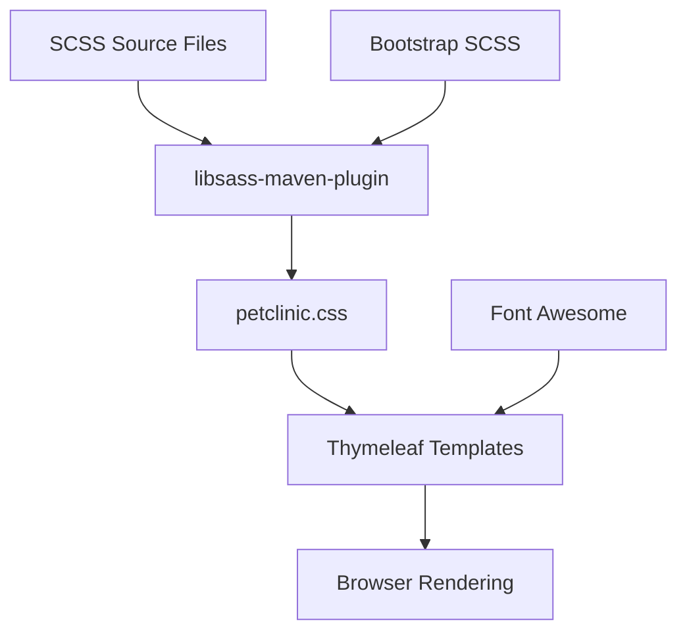
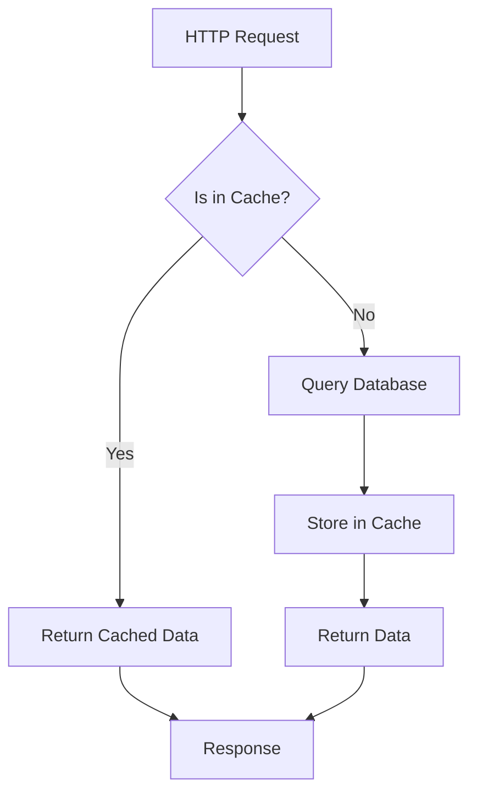

# Technology Stack & Dependencies

<cite>
**Referenced Files in This Document**   
- [pom.xml](file://pom.xml)
- [build.gradle](file://build.gradle)
- [PetClinicApplication.java](file://src/main/java/org/springframework/samples/petclinic/PetClinicApplication.java)
- [CacheConfiguration.java](file://src/main/java/org/springframework/samples/petclinic/system/CacheConfiguration.java)
- [application.properties](file://src/main/resources/application.properties)
- [petclinic.css](file://src/main/resources/static/resources/css/petclinic.css)
</cite>

## Table of Contents
1. [Java 17 & Spring Boot 3.x Foundation](#java-17--spring-boot-3x-foundation)
2. [Core Spring Boot Starter Dependencies](#core-spring-boot-starter-dependencies)
3. [Frontend Technology Integration](#frontend-technology-integration)
4. [Build Configuration with Maven and Gradle](#build-configuration-with-maven-and-gradle)
5. [Testing Framework Dependencies](#testing-framework-dependencies)
6. [Dependency Management and Conflict Resolution](#dependency-management-and-conflict-resolution)
7. [Performance Considerations and Optimization](#performance-considerations-and-optimization)

## Java 17 & Spring Boot 3.x Foundation

The Spring PetClinic application is built on Java 17 as the base language, leveraging modern Java features and performance improvements. This version choice aligns with Spring Boot 3.x requirements, which mandates Java 17 or higher for full compatibility with the latest Spring ecosystem components. The application uses Spring Boot 3.4.2 as its core framework, providing opinionated auto-configuration, embedded server capabilities, and production-ready features through the `spring-boot-starter-parent` POM inheritance.

The foundation is established in the main application class `PetClinicApplication.java`, which uses the `@SpringBootApplication` annotation to enable component scanning, configuration, and auto-configuration. This annotation is a convenience annotation that combines `@Configuration`, `@EnableAutoConfiguration`, and `@ComponentScan`. The application also utilizes `@ImportRuntimeHints` for GraalVM native image compatibility, demonstrating support for modern runtime environments.

**Section sources**
- [pom.xml](file://pom.xml#L5-L10)
- [PetClinicApplication.java](file://src/main/java/org/springframework/samples/petclinic/PetClinicApplication.java#L28-L36)

## Core Spring Boot Starter Dependencies

The application leverages several Spring Boot starter dependencies to provide essential functionality:

- **spring-boot-starter-web**: Provides the foundation for building web applications with Spring MVC, including embedded Tomcat server, Spring Web, and related dependencies for RESTful services and MVC pattern implementation.

- **spring-boot-starter-data-jpa**: Enables JPA-based data access with Hibernate as the default implementation, providing repository support, transaction management, and database connectivity through the Java Persistence API.

- **spring-boot-starter-thymeleaf**: Integrates the Thymeleaf template engine for server-side rendering of HTML content, allowing for dynamic content generation with natural templates that can be previewed in browsers.

- **spring-boot-starter-cache**: Implements Spring's caching abstraction, enabling declarative caching through annotations like `@Cacheable` and `@CacheEvict`, with support for various cache providers.

These starters are configured in both Maven and Gradle build files, ensuring consistent dependency management across build systems. The starters automatically resolve transitive dependencies, reducing configuration overhead while maintaining version compatibility within the Spring ecosystem.

**Section sources**
- [pom.xml](file://pom.xml#L50-L66)
- [build.gradle](file://build.gradle#L54-L57)

## Frontend Technology Integration

The frontend of the Spring PetClinic application is built using Bootstrap 5.3.3 and Font Awesome 4.7.0, delivered through WebJars for seamless integration with the Java-based build system. These static assets are managed as Maven/Gradle dependencies, allowing version control and dependency management through the same mechanisms as backend libraries.

Bootstrap provides the responsive CSS framework and UI components, while Font Awesome supplies scalable vector icons. The CSS is compiled from SCSS source files using the libsass-maven-plugin, which processes `petclinic.scss` and combines it with Bootstrap's SCSS files to generate the final `petclinic.css`. This compilation process occurs during the Maven build when the "css" profile is activated, ensuring that frontend assets are properly generated and versioned alongside the application code.

The integration is configured through runtime dependencies in both build systems, with WebJars providing a bridge between the Java ecosystem and frontend libraries. This approach eliminates the need for separate frontend build tools while maintaining the benefits of modern CSS frameworks.

**Diagram sources**
- [pom.xml](file://pom.xml#L280-L310)
- [petclinic.css](file://src/main/resources/static/resources/css/petclinic.css)
- [application.properties](file://src/main/resources/application.properties#L1-L25)

**Section sources**
- [pom.xml](file://pom.xml#L75-L82)
- [build.gradle](file://build.gradle#L60-L62)
- [petclinic.css](file://src/main/resources/static/resources/css/petclinic.css)

## Build Configuration with Maven and Gradle

The Spring PetClinic application supports both Maven and Gradle as build systems, providing flexibility for developers. The Maven configuration is defined in `pom.xml`, which inherits from `spring-boot-starter-parent` to ensure version alignment across Spring Boot dependencies. Key plugins include the Spring Boot Maven Plugin for executable JAR creation, Maven Enforcer Plugin to verify Java 17 compatibility, and Checkstyle plugins for code quality enforcement.

The Gradle configuration in `build.gradle` uses the Spring Dependency Management plugin to maintain version consistency with the Maven build. Both build systems configure the same dependencies with identical versions, ensuring consistent behavior regardless of the chosen build tool. The Gradle build applies the Spring Java Format plugin and configures test execution with JUnit Platform.

Both configurations include specialized plugins for additional functionality: the CycloneDX plugin generates SBOM (Software Bill of Materials) for security and compliance, while the Git Commit ID plugin integrates version control information into the build artifacts. The native image plugin supports GraalVM compilation, demonstrating the application's compatibility with modern runtime environments.

**Section sources**
- [pom.xml](file://pom.xml#L1-L455)
- [build.gradle](file://build.gradle#L1-L90)

## Testing Framework Dependencies

The application includes a comprehensive testing suite with multiple testing frameworks:

- **JUnit 5**: The primary testing framework, configured through `spring-boot-starter-test` which includes JUnit Jupiter, Spring Test, and other testing utilities.

- **Mockito**: Used for mocking dependencies in unit tests, allowing isolation of components during testing.

- **Testcontainers**: Enables integration testing with real database instances in Docker containers, providing more reliable tests than in-memory databases for complex scenarios.

The test configuration includes `spring-boot-testcontainers` and `spring-boot-docker-compose` for seamless integration with containerized environments. Testcontainers are used specifically for MySQL integration tests, starting a real MySQL database in a Docker container during test execution. This approach provides more accurate testing of database interactions compared to in-memory databases.

The application includes dedicated test classes for each controller and service component, with integration tests configured to run against different database profiles (H2, MySQL, PostgreSQL). The test configuration ensures that test-specific dependencies are scoped appropriately, preventing them from being included in production builds.

**Section sources**
- [pom.xml](file://pom.xml#L85-L95)
- [build.gradle](file://build.gradle#L54-L57)

## Dependency Management and Conflict Resolution

The Spring PetClinic application employs several strategies to manage dependencies and resolve potential conflicts:

1. **Parent POM Inheritance**: By extending `spring-boot-starter-parent`, the application inherits version management for all Spring Boot components, ensuring compatibility across the framework.

2. **BOM Import Pattern**: The dependency management plugin in Gradle replicates the BOM (Bill of Materials) functionality, maintaining version alignment between Maven and Gradle builds.

3. **Explicit Version Properties**: Common dependencies like WebJars are versioned through properties, allowing centralized management and easy updates.

4. **Scope Management**: Dependencies are properly scoped (compile, runtime, test) to prevent unnecessary transitive dependencies in production builds.

Potential conflicts are mitigated through careful version selection and dependency ordering. The application includes workarounds for known issues, such as the reactor-core dependency added to address an AOT (Ahead-of-Time) compilation issue. The build configuration also includes exclusions for problematic dependencies and enforces Java 17 compatibility through the Maven Enforcer Plugin.

The dependency tree is optimized to minimize duplication while maintaining functionality, with careful consideration given to transitive dependencies that might introduce version conflicts or security vulnerabilities.

**Section sources**
- [pom.xml](file://pom.xml#L1-L455)
- [build.gradle](file://build.gradle#L1-L90)

## Performance Considerations and Optimization

The application incorporates several performance optimization strategies:

- **Caching Configuration**: The `CacheConfiguration` class enables JCache with statistics collection, specifically configuring a cache named "vets" for frequently accessed data. This reduces database load and improves response times for commonly requested resources.

- **Transitive Dependency Management**: By carefully managing starter dependencies, the application minimizes the number of loaded classes, reducing memory footprint and startup time.

- **Startup Time Optimization**: The application uses Spring Boot's lazy initialization capabilities and optimizes component scanning to reduce startup time. The `@ComponentScan` annotation is implicitly configured through `@SpringBootApplication` to scan only necessary packages.

- **Resource Caching**: Static resources are configured with a 12-hour cache control header (`spring.web.resources.cache.cachecontrol.max-age=12h`), reducing repeated downloads of CSS, JavaScript, and image assets.

- **Database Optimization**: The application supports multiple database backends (H2, MySQL, PostgreSQL) with optimized configuration for each, including proper connection pooling and query optimization.

The caching strategy is particularly important for the veterinary listing functionality, where the `@Cacheable("vets")` annotation on the `VetRepository.findAll()` method prevents repeated database queries for the same data. This optimization is crucial for maintaining performance under load while providing consistent data access patterns.

**Diagram sources**
- [CacheConfiguration.java](file://src/main/java/org/springframework/samples/petclinic/system/CacheConfiguration.java#L30-L52)
- [VetRepository.java](file://src/main/java/org/springframework/samples/petclinic/vet/VetRepository.java#L37-L57)

**Section sources**
- [CacheConfiguration.java](file://src/main/java/org/springframework/samples/petclinic/system/CacheConfiguration.java#L30-L52)
- [application.properties](file://src/main/resources/application.properties#L1-L25)