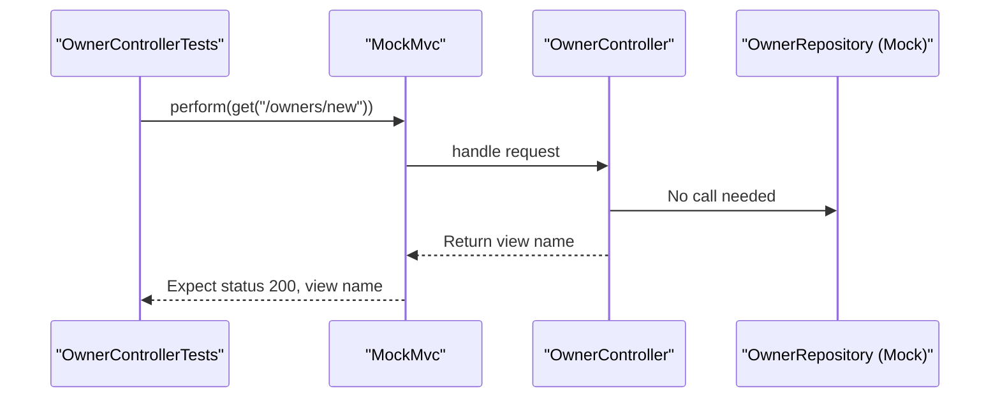
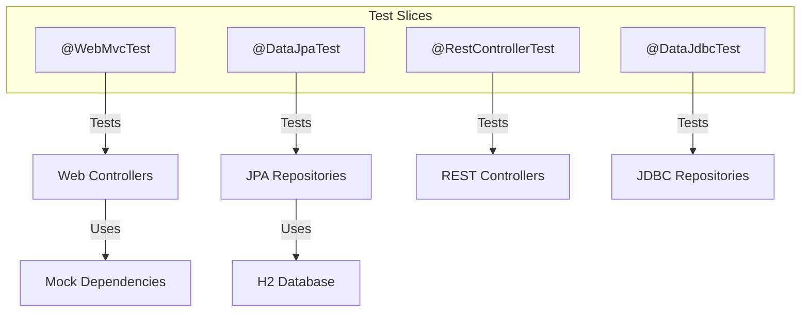
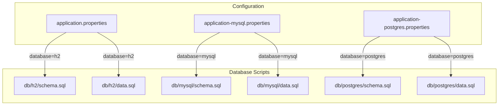
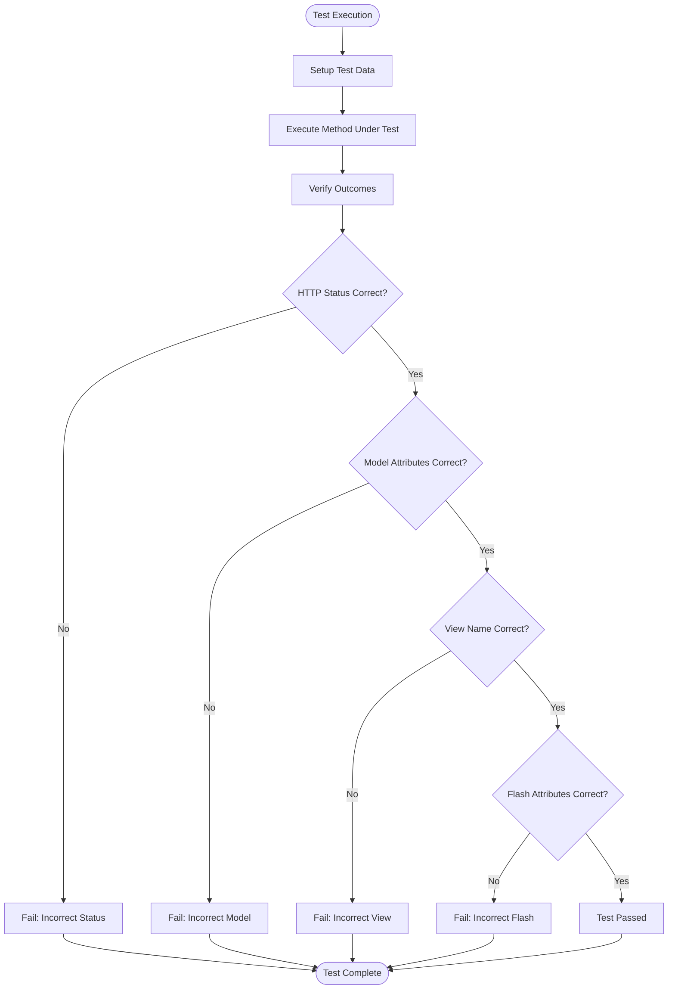

# Testing Strategy

<cite>
**Referenced Files in This Document**   
- [OwnerControllerTests.java](file://src/test/java/org/springframework/samples/petclinic/owner/OwnerControllerTests.java)
- [VetControllerTests.java](file://src/test/java/org/springframework/samples/petclinic/vet/VetControllerTests.java)
- [ClinicServiceTests.java](file://src/test/java/org/springframework/samples/petclinic/service/ClinicServiceTests.java)
- [PetClinicIntegrationTests.java](file://src/test/java/org/springframework/samples/petclinic/PetClinicIntegrationTests.java)
- [MySqlIntegrationTests.java](file://src/test/java/org/springframework/samples/petclinic/MySqlIntegrationTests.java)
- [PostgresIntegrationTests.java](file://src/test/java/org/springframework/samples/petclinic/PostgresIntegrationTests.java)
- [EntityUtils.java](file://src/test/java/org/springframework/samples/petclinic/service/EntityUtils.java)
- [application.properties](file://src/main/resources/application.properties)
- [application-mysql.properties](file://src/main/resources/application-mysql.properties)
- [application-postgres.properties](file://src/main/resources/application-postgres.properties)
</cite>

## Table of Contents
1. [Unit Testing with JUnit 5 and Mockito](#unit-testing-with-junit-5-and-mockito)
2. [Integration Testing with @SpringBootTest and Testcontainers](#integration-testing-with-springsboottest-and-testcontainers)
3. [Test Slices for Targeted Testing](#test-slices-for-targeted-testing)
4. [Test Data Management and Configuration](#test-data-management-and-configuration)
5. [Effective Assertions and Service Interaction Verification](#effective-assertions-and-service-interaction-verification)
6. [Performance Considerations and Parallel Test Execution](#performance-considerations-and-parallel-test-execution)
7. [Extending the Test Suite for New Features](#extending-the-test-suite-for-new-features)

## Unit Testing with JUnit 5 and Mockito

The PetClinic application employs JUnit 5 as the primary testing framework for unit testing, combined with Mockito for dependency mocking. Controller classes are tested in isolation using the `@WebMvcTest` annotation, which configures the Spring MVC infrastructure while excluding other components. This approach enables focused testing of web layer components without loading the complete application context.

Mockito's `@MockitoBean` annotation is used to inject mock instances of dependencies such as repository interfaces, allowing tests to simulate various scenarios without relying on actual database operations. For example, in `OwnerControllerTests`, the `OwnerRepository` is mocked to return predefined data when specific methods are called, enabling comprehensive testing of controller logic under different conditions.

The test suite includes comprehensive coverage of controller methods, verifying HTTP status codes, model attributes, view names, and flash attributes. Assertions are made on binding results to ensure proper validation handling, including tests for both successful form submissions and cases where validation errors occur. The use of `MockMvc` allows for simulating HTTP requests and inspecting the resulting responses, providing a realistic testing environment for web endpoints.



**Diagram sources**
- [OwnerControllerTests.java](file://src/test/java/org/springframework/samples/petclinic/owner/OwnerControllerTests.java#L57-L252)
- [OwnerController.java](file://src/main/java/org/springframework/samples/petclinic/owner/OwnerController.java#L45-L172)

**Section sources**
- [OwnerControllerTests.java](file://src/test/java/org/springframework/samples/petclinic/owner/OwnerControllerTests.java#L57-L252)

## Integration Testing with @SpringBootTest and Testcontainers

For comprehensive integration testing, the PetClinic application utilizes the `@SpringBootTest` annotation to load the complete application context, enabling end-to-end testing of the entire system. This approach verifies the integration between components, including controllers, services, repositories, and configuration classes, ensuring that the application functions correctly as a whole.

The test suite includes dedicated integration test classes for different database configurations: `PetClinicIntegrationTests` for the default H2 database, `MySqlIntegrationTests` for MySQL, and `PostgresIntegrationTests` for PostgreSQL. These tests use the `@ActiveProfiles` annotation to activate specific configuration profiles, allowing the application to connect to different database systems during testing.

To facilitate realistic database testing, the application leverages Testcontainers for MySQL testing and Docker Compose for PostgreSQL testing. The `MySqlIntegrationTests` class uses the `@Testcontainers` annotation with a `MySQLContainer` to spin up a MySQL database in a Docker container, ensuring that tests run against a genuine MySQL instance. Similarly, the `PostgresIntegrationTests` class uses Docker Compose to manage the PostgreSQL database container, providing a consistent testing environment across different development setups.

```mermaid
graph TB
subgraph "Test Environment"
Test[PetClinicIntegrationTests]
subgraph "Database"
MySQL[MySQL Container]
H2[H2 Database]
PostgreSQL[PostgreSQL Container]
end
end
Test --> |@SpringBootTest| ApplicationContext[Spring Application Context]
ApplicationContext --> |Uses| H2
Test --> |@ActiveProfiles(mysql)| MySQL
Test --> |@ActiveProfiles(postgres)| PostgreSQL
```

**Diagram sources**
- [PetClinicIntegrationTests.java](file://src/test/java/org/springframework/samples/petclinic/PetClinicIntegrationTests.java#L33-L62)
- [MySqlIntegrationTests.java](file://src/test/java/org/springframework/samples/petclinic/MySqlIntegrationTests.java#L39-L72)
- [PostgresIntegrationTests.java](file://src/test/java/org/springframework/samples/petclinic/PostgresIntegrationTests.java#L50-L149)

**Section sources**
- [PetClinicIntegrationTests.java](file://src/test/java/org/springframework/samples/petclinic/PetClinicIntegrationTests.java#L33-L62)
- [MySqlIntegrationTests.java](file://src/test/java/org/springframework/samples/petclinic/MySqlIntegrationTests.java#L39-L72)
- [PostgresIntegrationTests.java](file://src/test/java/org/springframework/samples/petclinic/PostgresIntegrationTests.java#L50-L149)

## Test Slices for Targeted Testing

The PetClinic application implements a test slicing strategy using Spring Boot's test slice annotations to enable faster and more focused testing. This approach allows developers to test specific layers of the application without loading the entire application context, significantly reducing test execution time.

The `@WebMvcTest` annotation is used for testing web controllers in isolation, configuring only the Spring MVC infrastructure and the specified controller class. This test slice automatically configures `MockMvc`, allowing for comprehensive testing of HTTP endpoints, request handling, and response generation. Repository dependencies are typically mocked using `@MockBean` or `@MockitoBean` to isolate the controller logic from data access concerns.

For data access layer testing, the application uses `@DataJpaTest`, which configures an in-memory database and JPA components, allowing repository methods to be tested against a real database without affecting the production data. This test slice rolls back transactions after each test method, ensuring test isolation and eliminating the need for manual cleanup.

The test slicing approach enables developers to write focused tests that verify specific aspects of the application, from controller behavior to repository queries, while maintaining fast feedback cycles during development.



**Diagram sources**
- [OwnerControllerTests.java](file://src/test/java/org/springframework/samples/petclinic/owner/OwnerControllerTests.java#L57-L252)
- [ClinicServiceTests.java](file://src/test/java/org/springframework/samples/petclinic/service/ClinicServiceTests.java#L33-L247)

**Section sources**
- [OwnerControllerTests.java](file://src/test/java/org/springframework/samples/petclinic/owner/OwnerControllerTests.java#L57-L252)
- [ClinicServiceTests.java](file://src/test/java/org/springframework/samples/petclinic/service/ClinicServiceTests.java#L33-L247)

## Test Data Management and Configuration

The PetClinic application employs a comprehensive strategy for test data management and configuration, ensuring consistent and reliable test execution across different environments. Test data is managed through a combination of in-memory database initialization scripts and programmatic data setup within test classes.

Database schema and initial data are defined in SQL scripts located in the `src/main/resources/db` directory, with separate subdirectories for H2, HSQLDB, MySQL, and PostgreSQL. These scripts are automatically executed during test execution based on the active profile, ensuring that the database is properly initialized before tests run. The `application.properties` file uses property placeholders to dynamically select the appropriate database configuration, while profile-specific properties files (`application-mysql.properties` and `application-postgres.properties`) provide database connection details for different environments.

The `EntityUtils` class provides utility methods for retrieving entities from collections by ID, which is particularly useful in test assertions where specific entities need to be verified. This utility method simplifies test code by eliminating the need for manual iteration through collections to find specific entities.

Test configurations are managed through Spring profiles, allowing different database setups to be activated based on the testing requirements. The `@ActiveProfiles` annotation is used to specify which profile should be active during test execution, enabling seamless switching between different database configurations.



**Diagram sources**
- [application.properties](file://src/main/resources/application.properties#L1-L26)
- [application-mysql.properties](file://src/main/resources/application-mysql.properties#L1-L8)
- [application-postgres.properties](file://src/main/resources/application-postgres.properties#L1-L7)
- [EntityUtils.java](file://src/test/java/org/springframework/samples/petclinic/service/EntityUtils.java#L32-L52)

**Section sources**
- [application.properties](file://src/main/resources/application.properties#L1-L26)
- [application-mysql.properties](file://src/main/resources/application-mysql.properties#L1-L8)
- [application-postgres.properties](file://src/main/resources/application-postgres.properties#L1-L7)
- [EntityUtils.java](file://src/test/java/org/springframework/samples/petclinic/service/EntityUtils.java#L32-L52)

## Effective Assertions and Service Interaction Verification

The PetClinic test suite demonstrates effective assertion patterns and service interaction verification techniques that ensure comprehensive test coverage and reliable validation of application behavior. Tests use a combination of Hamcrest matchers and AssertJ assertions to verify expected outcomes, providing clear and expressive test conditions.

For controller tests, assertions focus on HTTP response status, view names, model attributes, and flash attributes. The `MockMvc` framework enables detailed inspection of the request-response cycle, allowing tests to verify that controllers return the correct views, populate models with expected data, and handle form validation appropriately. Binding result assertions ensure that validation errors are properly detected and communicated to the user interface.

Service interaction verification is achieved through Mockito's verification capabilities, ensuring that dependencies are called with the expected parameters and the correct number of times. This approach validates the integration between components without requiring the actual implementation of dependent services to be executed.

The test suite also includes assertions for business logic, such as verifying that entities are properly saved to the database, relationships are maintained correctly, and calculated values are accurate. These assertions ensure that the application's core functionality works as expected under various conditions.



**Diagram sources**
- [OwnerControllerTests.java](file://src/test/java/org/springframework/samples/petclinic/owner/OwnerControllerTests.java#L57-L252)
- [VetControllerTests.java](file://src/test/java/org/springframework/samples/petclinic/vet/VetControllerTests.java#L42-L99)

**Section sources**
- [OwnerControllerTests.java](file://src/test/java/org/springframework/samples/petclinic/owner/OwnerControllerTests.java#L57-L252)
- [VetControllerTests.java](file://src/test/java/org/springframework/samples/petclinic/vet/VetControllerTests.java#L42-L99)

## Performance Considerations and Parallel Test Execution

The PetClinic application addresses performance considerations in testing through strategic use of test slices, caching, and parallel execution capabilities. By employing test slices like `@WebMvcTest` and `@DataJpaTest`, the application minimizes the overhead of loading the complete application context, resulting in faster test execution times and improved developer productivity.

The integration tests demonstrate performance optimization through the use of caching mechanisms. For example, the `testFindAll` method in various integration test classes calls the repository method twice, with the second call expected to be served from cache. This pattern verifies that caching is working correctly and provides insight into the performance benefits of caching in the application.

The test suite is designed to support parallel test execution, allowing multiple test classes to run simultaneously and reducing overall test suite execution time. This capability is particularly important for integration tests that may have longer execution times due to database operations and container startup.

The use of in-memory databases for most tests further enhances performance by eliminating the overhead of disk I/O and network communication. Only when testing against specific database systems (MySQL, PostgreSQL) are external database containers used, and even then, the test infrastructure is optimized to minimize startup time and resource consumption.

```mermaid
graph TB
subgraph "Test Performance"
FastTests[Fast Unit Tests]
SlowTests[Slow Integration Tests]
end
FastTests --> |@WebMvcTest| WebTests[Web Layer Tests]
FastTests --> |@DataJpaTest| DataTests[Data Layer Tests]
SlowTests --> |@SpringBootTest| FullTests[Full Context Tests]
SlowTests --> |Testcontainers| ContainerTests[Container-Based Tests]
WebTests --> |Fast Execution| Results[Quick Feedback]
DataTests --> |Fast Execution| Results
FullTests --> |Slower Execution| Results2[Comprehensive Validation]
ContainerTests --> |Slowest Execution| Results2
```

**Diagram sources**
- [PetClinicIntegrationTests.java](file://src/test/java/org/springframework/samples/petclinic/PetClinicIntegrationTests.java#L33-L62)
- [MySqlIntegrationTests.java](file://src/test/java/org/springframework/samples/petclinic/MySqlIntegrationTests.java#L39-L72)
- [PostgresIntegrationTests.java](file://src/test/java/org/springframework/samples/petclinic/PostgresIntegrationTests.java#L50-L149)

**Section sources**
- [PetClinicIntegrationTests.java](file://src/test/java/org/springframework/samples/petclinic/PetClinicIntegrationTests.java#L33-L62)
- [MySqlIntegrationTests.java](file://src/test/java/org/springframework/samples/petclinic/MySqlIntegrationTests.java#L39-L72)
- [PostgresIntegrationTests.java](file://src/test/java/org/springframework/samples/petclinic/PostgresIntegrationTests.java#L50-L149)

## Extending the Test Suite for New Features

Extending the PetClinic test suite for new features follows established patterns and best practices demonstrated throughout the existing test codebase. When adding new controllers, developers should create corresponding test classes annotated with `@WebMvcTest`, mocking repository dependencies and using `MockMvc` to verify HTTP endpoints.

For new service or repository components, developers should create integration tests using `@DataJpaTest` or `@SpringBootTest` as appropriate, ensuring that data access logic is thoroughly tested against a real database. The test suite provides examples of how to set up test data, verify repository queries, and validate service interactions.

When adding support for new database systems, developers can follow the pattern established by the existing MySQL and PostgreSQL integration tests, creating new test classes that activate the appropriate profile and configure the necessary database containers. The modular structure of the test configuration makes it straightforward to add new database configurations without modifying existing tests.

The test suite's use of utility classes like `EntityUtils` demonstrates the value of creating shared test infrastructure that can be reused across multiple test classes, reducing code duplication and improving maintainability.

```mermaid
graph TD
NewFeature[New Feature] --> |Add| Controller[Controller Class]
NewFeature --> |Add| Service[Service Class]
NewFeature --> |Add| Repository[Repository Interface]
Controller --> |Test with| WebTest[@WebMvcTest]
Service --> |Test with| ServiceTest[@SpringBootTest]
Repository --> |Test with| DataTest[@DataJpaTest]
WebTest --> |Mock| Repository
ServiceTest --> |Integrate| Repository
DataTest --> |Use| H2[H2 Database]
WebTest --> |Verify| HTTP[HTTP Endpoints]
ServiceTest --> |Verify| Business[Business Logic]
DataTest --> |Verify| Data[Data Access]
```

**Diagram sources**
- [OwnerControllerTests.java](file://src/test/java/org/springframework/samples/petclinic/owner/OwnerControllerTests.java#L57-L252)
- [ClinicServiceTests.java](file://src/test/java/org/springframework/samples/petclinic/service/ClinicServiceTests.java#L33-L247)
- [PetClinicIntegrationTests.java](file://src/test/java/org/springframework/samples/petclinic/PetClinicIntegrationTests.java#L33-L62)

**Section sources**
- [OwnerControllerTests.java](file://src/test/java/org/springframework/samples/petclinic/owner/OwnerControllerTests.java#L57-L252)
- [ClinicServiceTests.java](file://src/test/java/org/springframework/samples/petclinic/service/ClinicServiceTests.java#L33-L247)
- [PetClinicIntegrationTests.java](file://src/test/java/org/springframework/samples/petclinic/PetClinicIntegrationTests.java#L33-L62)