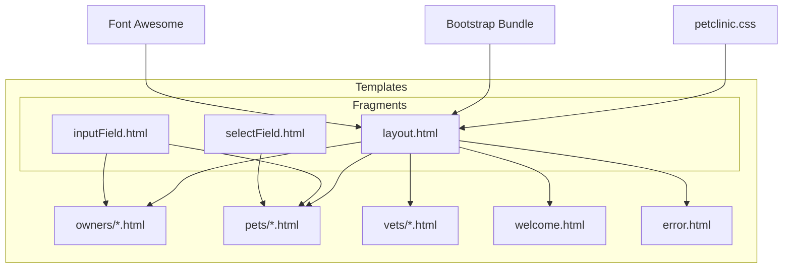
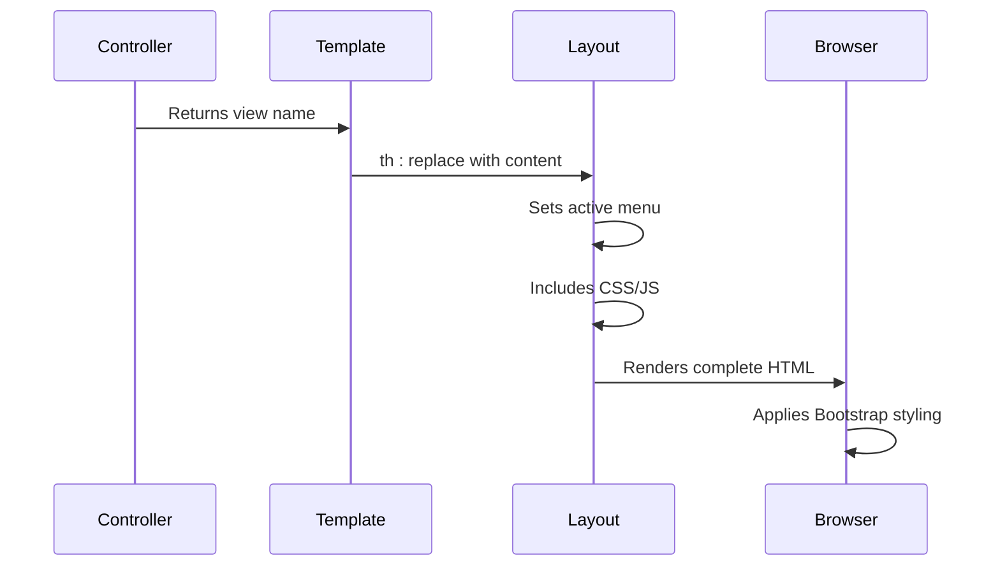
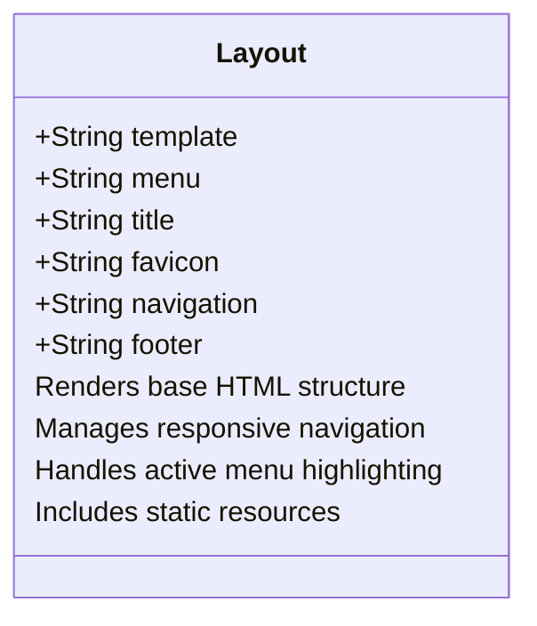
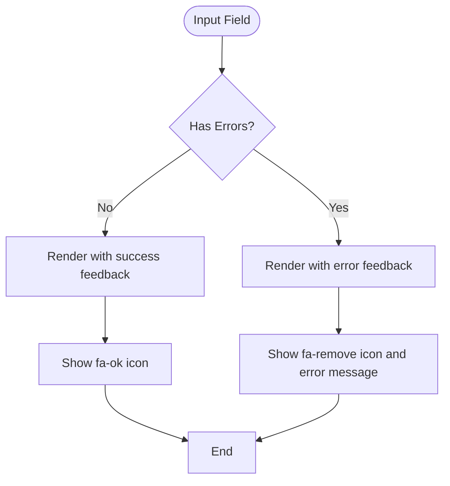
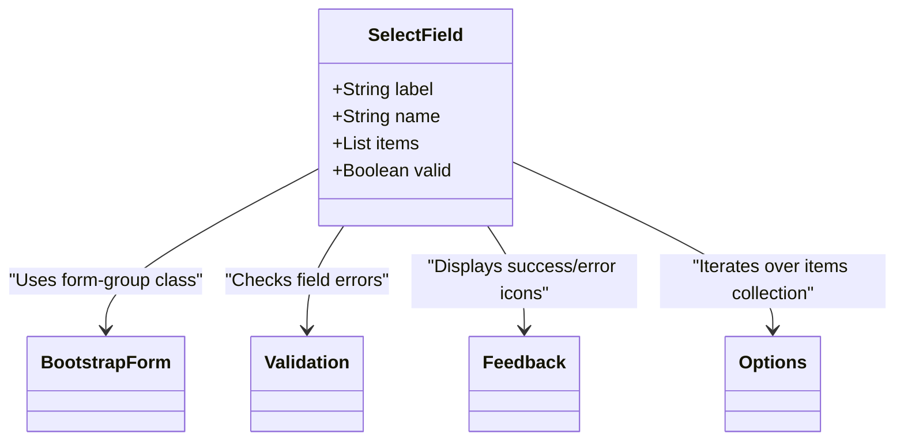
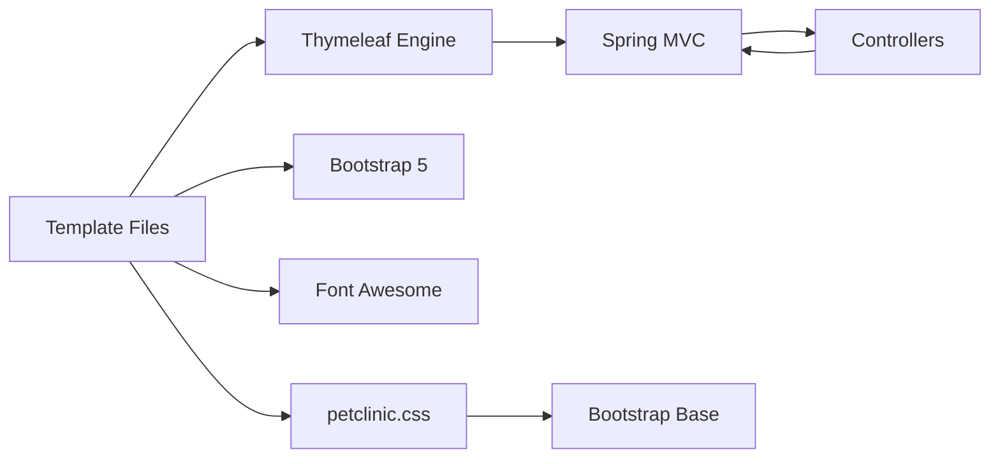

# Layout and Templating

<cite>
**Referenced Files in This Document**   
- [layout.html](file://src/main/resources/templates/fragments/layout.html)
- [inputField.html](file://src/main/resources/templates/fragments/inputField.html)
- [selectField.html](file://src/main/resources/templates/fragments/selectField.html)
- [welcome.html](file://src/main/resources/templates/welcome.html)
- [ownerDetails.html](file://src/main/resources/templates/owners/ownerDetails.html)
- [createOrUpdateOwnerForm.html](file://src/main/resources/templates/owners/createOrUpdateOwnerForm.html)
- [petclinic.css](file://src/main/resources/static/resources/css/petclinic.css)
- [WelcomeController.java](file://src/main/java/org/springframework/samples/petclinic/system/WelcomeController.java)
- [OwnerController.java](file://src/main/java/org/springframework/samples/petclinic/owner/OwnerController.java)
- [VetController.java](file://src/main/java/org/springframework/samples/petclinic/vet/VetController.java)
</cite>

## Table of Contents
1. [Introduction](#introduction)
2. [Project Structure](#project-structure)
3. [Core Components](#core-components)
4. [Architecture Overview](#architecture-overview)
5. [Detailed Component Analysis](#detailed-component-analysis)
6. [Dependency Analysis](#dependency-analysis)
7. [Performance Considerations](#performance-considerations)
8. [Troubleshooting Guide](#troubleshooting-guide)
9. [Conclusion](#conclusion)

## Introduction
The PetClinic application utilizes a robust Thymeleaf-based templating system to ensure consistent, maintainable, and accessible user interface rendering. This documentation details the layout and component architecture, focusing on the reusable fragments that standardize the presentation layer across the application. The system leverages Bootstrap 5 for responsive design, Font Awesome for icons, and Spring MVC for dynamic content rendering. The templating approach enables separation of concerns, promotes code reuse, and supports internationalization through message properties.

## Project Structure
The templating system is organized under the `src/main/resources/templates` directory, with reusable fragments located in the `fragments` subdirectory. The main layout template (`layout.html`) provides a consistent page structure, while form components (`inputField.html`, `selectField.html`) standardize input rendering and validation. Page-specific templates in directories like `owners`, `pets`, and `vets` extend the base layout, ensuring visual and structural consistency across the application.

**Diagram sources**
- [layout.html](file://src/main/resources/templates/fragments/layout.html)
- [inputField.html](file://src/main/resources/templates/fragments/inputField.html)
- [selectField.html](file://src/main/resources/templates/fragments/selectField.html)

**Section sources**
- [layout.html](file://src/main/resources/templates/fragments/layout.html)
- [inputField.html](file://src/main/resources/templates/fragments/inputField.html)
- [selectField.html](file://src/main/resources/templates/fragments/selectField.html)

## Core Components
The core templating components include the main `layout.html` fragment, which defines the application shell with a responsive navigation bar and consistent styling. The `inputField.html` and `selectField.html` fragments provide standardized rendering for form inputs, including automatic validation error display. These components use Thymeleaf's fragment expressions and expression syntax to dynamically render content based on controller-provided models.

**Section sources**
- [layout.html](file://src/main/resources/templates/fragments/layout.html#L1-L94)
- [inputField.html](file://src/main/resources/templates/fragments/inputField.html#L1-L28)
- [selectField.html](file://src/main/resources/templates/fragments/selectField.html#L1-L29)

## Architecture Overview
The templating architecture follows a composition-based approach where page templates extend the base layout using Thymeleaf's `th:replace` directive. The layout accepts two parameters: the page content to insert and the active menu item for navigation highlighting. This design enables consistent page structure while allowing individual pages to define their unique content. Form components are similarly composed into forms, ensuring uniform styling and behavior across all input fields.

**Diagram sources**
- [layout.html](file://src/main/resources/templates/fragments/layout.html)
- [welcome.html](file://src/main/resources/templates/welcome.html)
- [WelcomeController.java](file://src/main/java/org/springframework/samples/petclinic/system/WelcomeController.java)

## Detailed Component Analysis

### Layout Template Analysis
The `layout.html` template provides the foundational structure for all pages in the application. It includes proper meta tags for responsive design, accessibility, and SEO. The navigation bar uses Bootstrap 5's navbar component with responsive toggling for mobile devices. Menu item highlighting is dynamically controlled through the `menu` parameter passed from individual pages.

#### Layout Structure

**Diagram sources**
- [layout.html](file://src/main/resources/templates/fragments/layout.html#L1-L94)

**Section sources**
- [layout.html](file://src/main/resources/templates/fragments/layout.html#L1-L94)

### Form Component Analysis
The form components `inputField.html` and `selectField.html` standardize the rendering of form inputs across the application. They handle validation state display, proper labeling for accessibility, and consistent styling using Bootstrap's form classes.

#### Input Field Component

**Diagram sources**
- [inputField.html](file://src/main/resources/templates/fragments/inputField.html#L1-L28)

#### Select Field Component

**Diagram sources**
- [selectField.html](file://src/main/resources/templates/fragments/selectField.html#L1-L29)

**Section sources**
- [inputField.html](file://src/main/resources/templates/fragments/inputField.html#L1-L28)
- [selectField.html](file://src/main/resources/templates/fragments/selectField.html#L1-L29)
- [createOrUpdateOwnerForm.html](file://src/main/resources/templates/owners/createOrUpdateOwnerForm.html#L1-L29)

## Dependency Analysis
The templating system depends on several external and internal resources. The layout imports Bootstrap 5 and Font Awesome via WebJars, ensuring version consistency. CSS styling is provided by the custom `petclinic.css` file, which extends Bootstrap's base styles. The templates are processed by Thymeleaf, which integrates with Spring MVC to render models provided by controllers.

**Diagram sources**
- [layout.html](file://src/main/resources/templates/fragments/layout.html)
- [petclinic.css](file://src/main/resources/static/resources/css/petclinic.css)
- [WelcomeController.java](file://src/main/java/org/springframework/samples/petclinic/system/WelcomeController.java)

**Section sources**
- [layout.html](file://src/main/resources/templates/fragments/layout.html)
- [petclinic.css](file://src/main/resources/static/resources/css/petclinic.css)
- [WelcomeController.java](file://src/main/java/org/springframework/samples/petclinic/system/WelcomeController.java)

## Performance Considerations
The templating system is optimized for performance through several mechanisms. Static resources are served with appropriate caching headers, and the use of WebJars ensures efficient resource bundling. The fragment-based approach minimizes template processing overhead by reusing compiled templates. CSS is optimized and minified, and the responsive design ensures appropriate resource loading across device types.

## Troubleshooting Guide
Common issues with the templating system typically involve incorrect fragment references, missing model attributes, or CSS conflicts. When a template fails to render, verify that the fragment expression syntax is correct and that all required model attributes are provided by the controller. For styling issues, check the browser's developer tools to verify that CSS files are loading properly and that there are no selector conflicts.

**Section sources**
- [layout.html](file://src/main/resources/templates/fragments/layout.html)
- [ownerDetails.html](file://src/main/resources/templates/owners/ownerDetails.html)
- [OwnerController.java](file://src/main/java/org/springframework/samples/petclinic/owner/OwnerController.java)

## Conclusion
The PetClinic application's layout and templating system demonstrates a well-structured approach to web interface development using Thymeleaf and Bootstrap 5. The fragment-based architecture promotes code reuse and consistency, while the integration with Spring MVC enables dynamic content rendering. The system supports accessibility, mobile responsiveness, and internationalization, making it a robust foundation for enterprise web applications. Customization for branding can be achieved by modifying the CSS files and updating the logo and favicon references in the layout template.