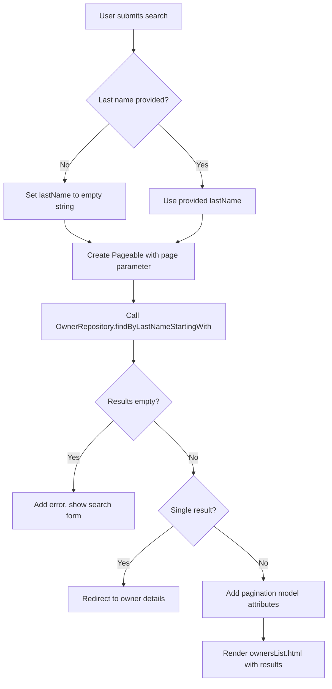
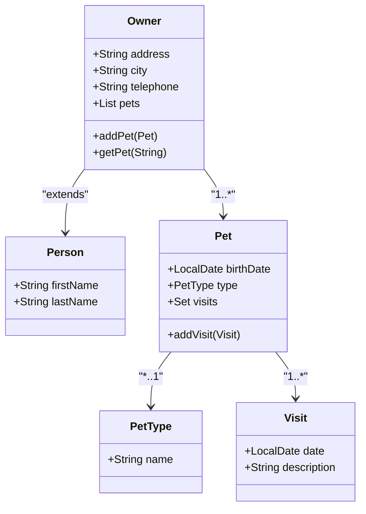

# Owner Management Pages

<cite>
**Referenced Files in This Document**   
- [OwnerController.java](file://src/main/java/org/springframework/samples/petclinic/owner/OwnerController.java)
- [Owner.java](file://src/main/java/org/springframework/samples/petclinic/owner/Owner.java)
- [OwnerRepository.java](file://src/main/java/org/springframework/samples/petclinic/owner/OwnerRepository.java)
- [Pet.java](file://src/main/java/org/springframework/samples/petclinic/owner/Pet.java)
- [Visit.java](file://src/main/java/org/springframework/samples/petclinic/owner/Visit.java)
- [findOwners.html](file://src/main/resources/templates/owners/findOwners.html)
- [ownersList.html](file://src/main/resources/templates/owners/ownersList.html)
- [ownerDetails.html](file://src/main/resources/templates/owners/ownerDetails.html)
- [createOrUpdateOwnerForm.html](file://src/main/resources/templates/owners/createOrUpdateOwnerForm.html)
</cite>

## Table of Contents
1. [Introduction](#introduction)
2. [OwnerController Request Mapping](#ownercontroller-request-mapping)
3. [Search Functionality](#search-functionality)
4. [Pagination Implementation](#pagination-implementation)
5. [CRUD Operations and Form Handling](#crud-operations-and-form-handling)
6. [Owner and Pet Information Display](#owner-and-pet-information-display)
7. [Thymeleaf Template Constructs](#thymeleaf-template-constructs)
8. [Error Handling and Validation](#error-handling-and-validation)
9. [Data Model Relationships](#data-model-relationships)

## Introduction
The PetClinic application provides a comprehensive owner management system with four primary pages: findOwners.html for searching owners, ownersList.html for displaying search results with pagination, ownerDetails.html for viewing detailed owner and pet information, and createOrUpdateOwnerForm.html for creating and updating owner records. These pages are orchestrated by the OwnerController, which handles HTTP requests, manages model attributes, and coordinates data flow between the presentation layer and data access layer. The system implements robust form handling with validation, error display, and flash messages for user feedback, while also providing pagination for search results and handling common issues such as ID mismatches.

## OwnerController Request Mapping
The OwnerController class manages all HTTP requests related to owner operations through annotated handler methods. It uses Spring MVC annotations to map specific URL patterns to controller methods, with each method responsible for a particular aspect of owner management. The controller injects OwnerRepository to access data and uses model attributes to pass data to views. Key request mappings include GET requests for displaying forms and search interfaces, and POST requests for processing form submissions. The controller also employs @ModelAttribute to pre-populate the owner object for forms and @InitBinder to configure data binding rules, specifically disallowing direct binding of the ID field to prevent security issues.

**Section sources**
- [OwnerController.java](file://src/main/java/org/springframework/samples/petclinic/owner/OwnerController.java#L45-L172)

## Search Functionality
The search functionality is implemented through a two-step process beginning with the findOwners.html template, which presents a form for entering a last name to search. When submitted, the form triggers the processFindForm method in OwnerController with a GET request to /owners. This method handles the search logic by first checking if a last name was provided; if not, it searches for all owners. The search uses the OwnerRepository's findByLastNameStartingWith method to find owners whose last name starts with the provided string, enabling partial matching. The search results are then processed according to their count: if no owners are found, an error is added to the binding result and the search form is redisplayed; if exactly one owner is found, the user is redirected directly to that owner's details page; if multiple owners are found, they are displayed in the ownersList.html template with pagination.

**Section sources**
- [OwnerController.java](file://src/main/java/org/springframework/samples/petclinic/owner/OwnerController.java#L108-L133)
- [findOwners.html](file://src/main/resources/templates/owners/findOwners.html#L1-L35)

## Pagination Implementation
Pagination is implemented using Spring Data's Page and Pageable interfaces to manage large result sets efficiently. The system displays five owners per page, with navigation controls for moving between pages. When processing a search, the processFindForm method receives a page parameter (defaulting to 1) and creates a Pageable object using PageRequest.of() with the current page (adjusted for zero-based indexing) and page size. The paginated results are passed to the addPaginationModel method, which extracts the content and adds pagination metadata (current page, total pages, total items) to the model. The ownersList.html template uses Thymeleaf's #numbers.sequence function to generate page number links and conditional rendering to highlight the current page. Navigation buttons for first, previous, next, and last pages are also conditionally displayed based on the current page position.



**Diagram sources**
- [OwnerController.java](file://src/main/java/org/springframework/samples/petclinic/owner/OwnerController.java#L118-L133)
- [OwnerController.java](file://src/main/java/org/springframework/samples/petclinic/owner/OwnerController.java#L135-L145)
- [ownersList.html](file://src/main/resources/templates/owners/ownersList.html#L1-L63)

## CRUD Operations and Form Handling
CRUD operations are handled through the createOrUpdateOwnerForm.html template and corresponding controller methods. The form is used for both creating new owners and updating existing ones, with the displayed button text determined by the owner's "new" status. Form submission is processed by either processCreationForm (for new owners) or processUpdateOwnerForm (for existing owners), both of which use @Valid to trigger validation and receive a BindingResult to capture any validation errors. If errors are present, the form is redisplayed with error messages, and a flash attribute is added to preserve the error message across the redirect. For updates, an additional check ensures the form's owner ID matches the URL parameter to prevent ID manipulation attacks. Successful operations save the owner to the repository and redirect to the owner's details page with a success message stored as a flash attribute.

**Section sources**
- [OwnerController.java](file://src/main/java/org/springframework/samples/petclinic/owner/OwnerController.java#L78-L106)
- [OwnerController.java](file://src/main/java/org/springframework/samples/petclinic/owner/OwnerController.java#L147-L164)
- [createOrUpdateOwnerForm.html](file://src/main/resources/templates/owners/createOrUpdateOwnerForm.html#L1-L31)

## Owner and Pet Information Display
The ownerDetails.html template provides a comprehensive view of an owner's information and their associated pets and visits. The page displays the owner's personal details in a table format using Thymeleaf's field expressions to bind data from the owner model attribute. Below the owner information, a section lists all pets with their details (name, birth date, type) and associated visits, using nested iteration to display each pet and its visits. The template includes edit and add pet buttons with dynamically generated URLs based on the owner's ID. Flash messages for success and error conditions are displayed at the top of the page and automatically hidden after three seconds using JavaScript. The page structure uses Thymeleaf fragments for consistent layout and styling across the application.

```mermaid
flowchart TD
A[GET /owners/{ownerId}] --> B[OwnerController.showOwner]
B --> C[Call OwnerRepository.findById]
C --> D{Owner found?}
D --> |No| E[Throw IllegalArgumentException]
D --> |Yes| F[Create ModelAndView with ownerDetails view]
F --> G[Add Owner to model]
G --> H[Render ownerDetails.html]
H --> I[Display owner info]
H --> J[Iterate through pets]
J --> K[Display pet details]
K --> L[Iterate through visits]
L --> M[Display visit info]
```

**Diagram sources**
- [OwnerController.java](file://src/main/java/org/springframework/samples/petclinic/owner/OwnerController.java#L166-L172)
- [ownerDetails.html](file://src/main/resources/templates/owners/ownerDetails.html#L1-L103)

## Thymeleaf Template Constructs
The owner management pages utilize various Thymeleaf constructs for dynamic content rendering. Field binding is achieved using th:field and *{...} expressions to connect form inputs to model attributes. Iteration over collections is implemented with th:each to display lists of owners and nested pet/visit data. Conditional rendering with th:if and th:unless controls the display of pagination controls and flash messages based on model state. The templates use th:replace to incorporate reusable fragments for consistent UI elements like input fields and layouts. Dynamic URL generation is handled with th:href and @{} expressions that create RESTful URLs incorporating owner and pet IDs. The createOrUpdateOwnerForm.html uses th:with to conditionally set the submit button text based on whether the owner is new or existing.

**Section sources**
- [findOwners.html](file://src/main/resources/templates/owners/findOwners.html#L1-L35)
- [ownersList.html](file://src/main/resources/templates/owners/ownersList.html#L1-L63)
- [ownerDetails.html](file://src/main/resources/templates/owners/ownerDetails.html#L1-L103)
- [createOrUpdateOwnerForm.html](file://src/main/resources/templates/owners/createOrUpdateOwnerForm.html#L1-L31)

## Error Handling and Validation
The system implements comprehensive error handling at both the controller and template levels. Validation is performed using JSR-303 annotations on the Owner entity (such as @NotBlank and @Pattern) and triggered by the @Valid annotation on controller method parameters. Binding errors are captured in the BindingResult and can be displayed in templates using #fields expressions. The controller adds global errors to the binding result when business rules are violated, such as when no owners match a search criteria. Flash attributes are used to preserve error and success messages across redirects, ensuring users receive feedback even when navigation occurs. The system specifically handles ID mismatch attacks by comparing the form-submitted ID with the URL parameter in update operations. Client-side JavaScript automatically hides flash messages after three seconds to improve user experience.

**Section sources**
- [OwnerController.java](file://src/main/java/org/springframework/samples/petclinic/owner/OwnerController.java#L88-L94)
- [OwnerController.java](file://src/main/java/org/springframework/samples/petclinic/owner/OwnerController.java#L114-L117)
- [OwnerController.java](file://src/main/java/org/springframework/samples/petclinic/owner/OwnerController.java#L154-L158)
- [ownerDetails.html](file://src/main/resources/templates/owners/ownerDetails.html#L1-L103)

## Data Model Relationships
The owner management system is built on a hierarchical data model with Owner as the central entity. An Owner extends the Person class and contains a one-to-many relationship with Pet entities, represented by a List<Pet> field with CascadeType.ALL for automatic persistence of pet changes. Each Pet has a many-to-one relationship with PetType and a one-to-many relationship with Visit entities. The Visit entity extends BaseEntity and contains basic visit information. These relationships are mapped using JPA annotations and are navigable in the templates, allowing the ownerDetails.html page to display not only owner information but also their pets and the pets' visit histories through object graph traversal.



**Diagram sources**
- [Owner.java](file://src/main/java/org/springframework/samples/petclinic/owner/Owner.java#L45-L174)
- [Pet.java](file://src/main/java/org/springframework/samples/petclinic/owner/Pet.java#L43-L84)
- [Visit.java](file://src/main/java/org/springframework/samples/petclinic/owner/Visit.java#L33-L67)