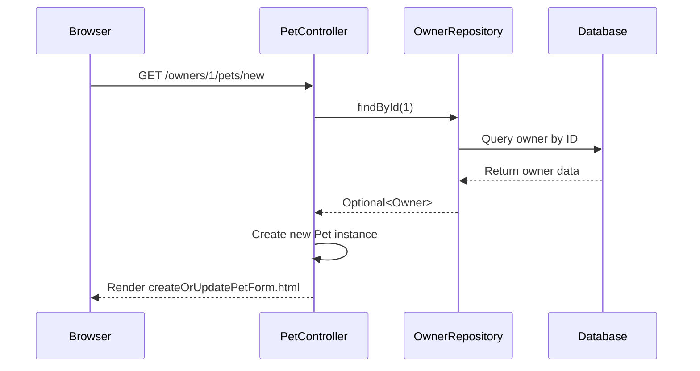
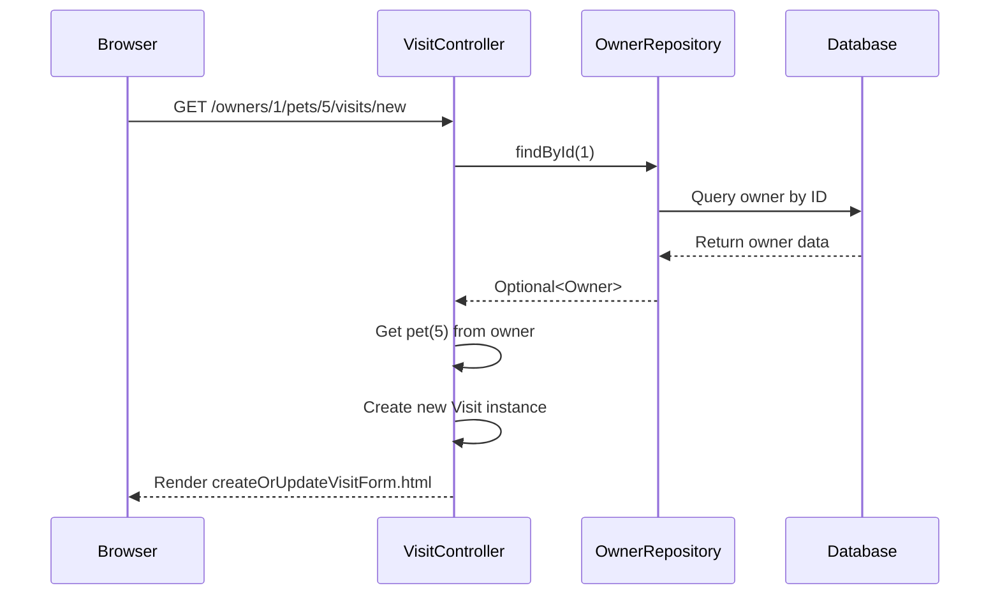
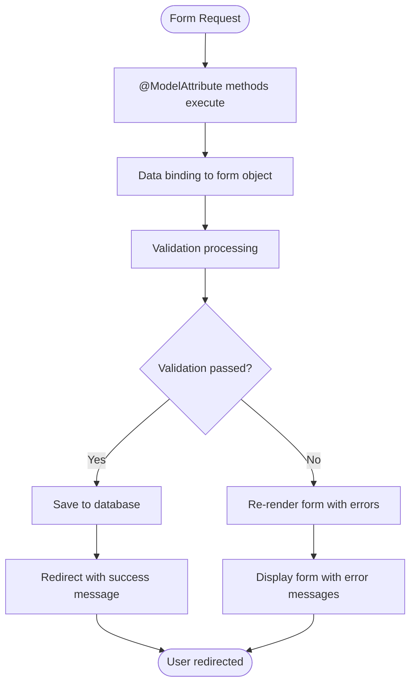
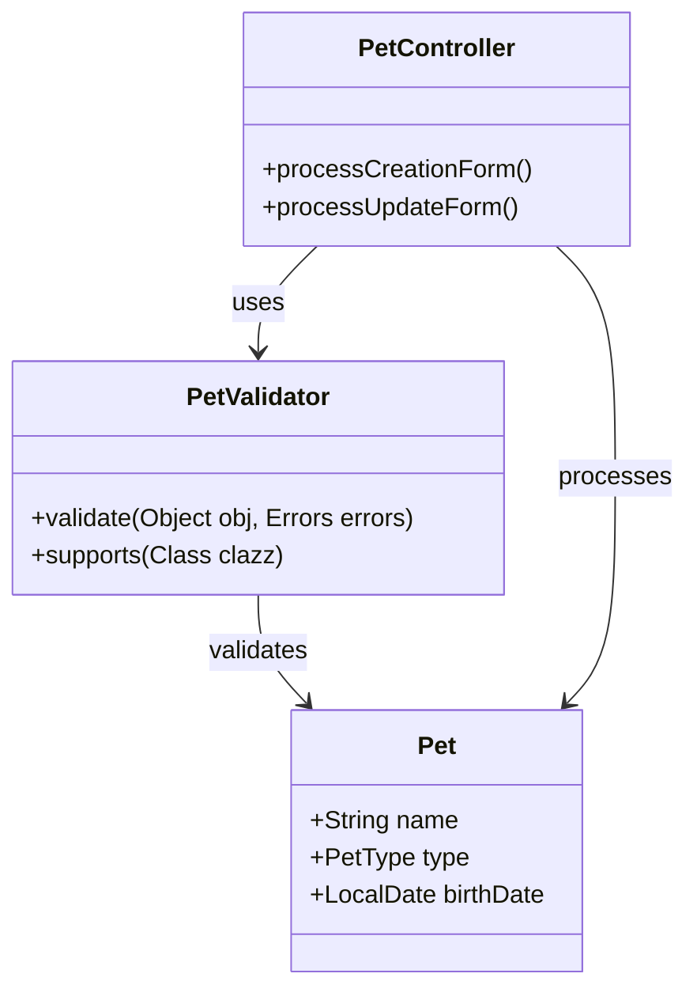
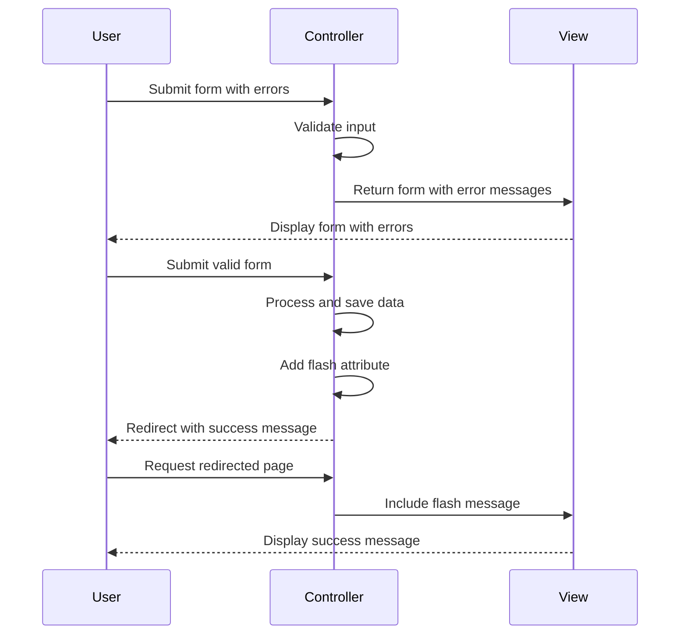

# Pet and Visit Management Pages

<cite>
**Referenced Files in This Document**   
- [PetController.java](file://src/main/java/org/springframework/samples/petclinic/owner/PetController.java)
- [VisitController.java](file://src/main/java/org/springframework/samples/petclinic/owner/VisitController.java)
- [createOrUpdatePetForm.html](file://src/main/resources/templates/pets/createOrUpdatePetForm.html)
- [createOrUpdateVisitForm.html](file://src/main/resources/templates/pets/createOrUpdateVisitForm.html)
- [PetValidator.java](file://src/main/java/org/springframework/samples/petclinic/owner/PetValidator.java)
- [Pet.java](file://src/main/java/org/springframework/samples/petclinic/owner/Pet.java)
- [Visit.java](file://src/main/java/org/springframework/samples/petclinic/owner/Visit.java)
- [Owner.java](file://src/main/java/org/springframework/samples/petclinic/owner/Owner.java)
- [OwnerRepository.java](file://src/main/java/org/springframework/samples/petclinic/owner/OwnerRepository.java)
- [messages.properties](file://src/main/resources/messages/messages.properties)
</cite>

## Table of Contents
1. [Introduction](#introduction)
2. [Pet Management Functionality](#pet-management-functionality)
3. [Visit Management Functionality](#visit-management-functionality)
4. [Form Data Flow and Processing](#form-data-flow-and-processing)
5. [Validation and Business Rules](#validation-and-business-rules)
6. [Thymeleaf Form Handling](#thymeleaf-form-handling)
7. [Error Handling and User Feedback](#error-handling-and-user-feedback)
8. [Edge Cases and Constraints](#edge-cases-and-constraints)
9. [Conclusion](#conclusion)

## Introduction
The Pet and Visit Management Pages in the PetClinic application provide functionality for managing pet information and scheduling visits. These pages are implemented through two primary controllers: PetController and VisitController, which handle form submissions, validation, and persistence operations. The system uses Spring MVC annotations to manage form-backing objects, validate input, and maintain owner context through path variables. This document details the implementation and integration of these features, focusing on the createOrUpdatePetForm.html and createOrUpdateVisitForm.html templates and their corresponding controller logic.

## Pet Management Functionality

### Form Initialization and Context Setup
The pet management functionality is handled by the PetController class, which is mapped to the "/owners/{ownerId}" path. This controller uses path variables to maintain context about the current owner throughout pet operations. The @ModelAttribute("owner") annotation in the findOwner method ensures that the owner object is automatically loaded from the database using the ownerId path variable and made available to all controller methods.

**Diagram sources**
- [PetController.java](file://src/main/java/org/springframework/samples/petclinic/owner/PetController.java#L59-L65)
- [OwnerRepository.java](file://src/main/java/org/springframework/samples/petclinic/owner/OwnerRepository.java#L38-L76)

**Section sources**
- [PetController.java](file://src/main/java/org/springframework/samples/petclinic/owner/PetController.java#L42-L154)
- [createOrUpdatePetForm.html](file://src/main/resources/templates/pets/createOrUpdatePetForm.html)

### Pet Type Population
The pet form displays available pet types in a dropdown menu, which are populated through the @ModelAttribute("types") annotation in the populatePetTypes method. This method calls the OwnerRepository.findPetTypes() method to retrieve all available pet types from the database, ordered by name. The PetTypeFormatter class handles the conversion between string representations and PetType objects during form submission.

**Section sources**
- [PetController.java](file://src/main/java/org/springframework/samples/petclinic/owner/PetController.java#L54-L57)
- [PetTypeFormatter.java](file://src/main/java/org/springframework/samples/petclinic/owner/PetTypeFormatter.java)

## Visit Management Functionality

### Visit Context Initialization
The VisitController handles visit management operations and uses the loadPetWithVisit method annotated with @ModelAttribute("visit") to prepare the form-backing object. This method loads the owner and pet objects using the ownerId and petId path variables, then creates a new Visit instance associated with the specified pet. The method also adds the pet and owner objects to the model, making them available for display in the form.

**Diagram sources**
- [VisitController.java](file://src/main/java/org/springframework/samples/petclinic/owner/VisitController.java#L61-L75)
- [OwnerRepository.java](file://src/main/java/org/springframework/samples/petclinic/owner/OwnerRepository.java#L38-L76)

**Section sources**
- [VisitController.java](file://src/main/java/org/springframework/samples/petclinic/owner/VisitController.java#L40-L99)
- [createOrUpdateVisitForm.html](file://src/main/resources/templates/pets/createOrUpdateVisitForm.html)

### Visit History Display
The createOrUpdateVisitForm.html template displays the selected pet's information and previous visit history. The form shows the pet's name, birth date, type, and owner information in a read-only table above the visit form fields. Below the form, a table displays all previous visits for the pet, showing the date and description of each visit. This provides context for the user when scheduling a new visit.

## Form Data Flow and Processing

### Data Binding and Initialization
Both controllers use @InitBinder annotations to configure data binding for form submissions. The PetController uses @InitBinder("pet") to set up validation for pet forms, while the VisitController uses @InitBinder to prevent binding to the "id" field. The @ModelAttribute annotations ensure that form-backing objects (pet and visit) are properly initialized before form display and populated with submitted data during processing.

**Diagram sources**
- [PetController.java](file://src/main/java/org/springframework/samples/petclinic/owner/PetController.java#L81-L89)
- [VisitController.java](file://src/main/java/org/springframework/samples/petclinic/owner/VisitController.java#L49-L52)

**Section sources**
- [PetController.java](file://src/main/java/org/springframework/samples/petclinic/owner/PetController.java#L86-L89)
- [VisitController.java](file://src/main/java/org/springframework/samples/petclinic/owner/VisitController.java#L49-L52)

### Persistence Workflow
When a form is successfully validated, the data flow proceeds through the service layer to database persistence. For pet creation, the process involves adding the pet to the owner's pet collection and saving the owner entity. For visits, the process adds the visit to the specified pet and saves the owner entity. The OwnerRepository.save() method handles the persistence of the entire object graph, ensuring that all changes are committed to the database.

## Validation and Business Rules

### Pet Validation Rules
The PetValidator class implements custom validation logic for pet forms, enforcing three primary rules:
- Name cannot be empty or blank
- Type must be specified for new pets
- Birth date cannot be null

These validations are applied automatically through the @InitBinder("pet") configuration in the PetController. Additionally, the controller implements business rules to prevent duplicate pet names for the same owner and ensure birth dates are not in the future.

**Diagram sources**
- [PetValidator.java](file://src/main/java/org/springframework/samples/petclinic/owner/PetValidator.java#L35-L53)
- [PetController.java](file://src/main/java/org/springframework/samples/petclinic/owner/PetController.java#L98-L118)

**Section sources**
- [PetValidator.java](file://src/main/java/org/springframework/samples/petclinic/owner/PetValidator.java)
- [PetController.java](file://src/main/java/org/springframework/samples/petclinic/owner/PetController.java#L98-L152)

### Visit Validation
Visit validation is handled through Bean Validation annotations on the Visit entity. The @NotBlank annotation on the description field ensures that a description is provided. The controller also checks for binding errors through the BindingResult object, preventing submission of invalid data. The system does not allow direct modification of the visit ID through form binding, as configured in the @InitBinder method.

## Thymeleaf Form Handling

### Form Structure and Binding
The Thymeleaf templates use th:object="${pet}" and th:object="${visit}" to bind forms to their respective model attributes. Input fields use th:field syntax implicitly through the fragment includes (inputField and selectField). The pet form includes fields for name, birth date, and type, while the visit form includes fields for date and description. Hidden fields are used to maintain entity IDs during form submission.

### Dynamic Button Text
The pet form uses Thymeleaf's conditional expression to display appropriate button text based on whether the operation is creating a new pet or updating an existing one. The expression ${pet['new']} ? 'Add Pet' : 'Update Pet' evaluates the new property of the pet object to determine the correct button label, providing a clear user interface for both operations.

## Error Handling and User Feedback

### Error Message Display
When validation fails, the system returns to the form view with error messages attached to the appropriate fields. The messages.properties file contains the text for validation error codes such as "required", "duplicate", and "typeMismatch.birthDate". These messages are displayed next to the corresponding form fields, helping users correct their input.

### Success Feedback
Upon successful form submission, the system uses RedirectAttributes to add a flash attribute containing a success message. This message is displayed to the user after redirection to the owner details page. The redirect pattern prevents duplicate form submissions and provides a clean user experience. Messages such as "New Pet has been Added" and "Your visit has been booked" confirm successful operations.

**Diagram sources**
- [PetController.java](file://src/main/java/org/springframework/samples/petclinic/owner/PetController.java#L108-L118)
- [VisitController.java](file://src/main/java/org/springframework/samples/petclinic/owner/VisitController.java#L92-L97)

**Section sources**
- [PetController.java](file://src/main/java/org/springframework/samples/petclinic/owner/PetController.java#L98-L152)
- [VisitController.java](file://src/main/java/org/springframework/samples/petclinic/owner/VisitController.java#L86-L97)

## Edge Cases and Constraints

### Duplicate Pet Name Handling
When creating a new pet, the system checks for duplicate names using owner.getPet(pet.getName(), true). When updating an existing pet, it checks for name conflicts with other pets belonging to the same owner, excluding the pet being edited. This prevents owners from having multiple pets with the same name while allowing name updates as long as they don't create conflicts.

### Future Date Validation
Both pet and visit forms include validation to prevent dates in the future. For pets, the birth date cannot be after the current date. This business rule is enforced in the controller's processCreationForm and processUpdateForm methods by checking if the birth date is after LocalDate.now() and rejecting the value if it is.

### Visit Scheduling Constraints
The system automatically sets the default date for new visits to the current date through the Visit entity's constructor. While users can modify this date, the system validates that the date is in a proper format. The visit form is always associated with a specific pet through the petId path variable, ensuring that visits are properly linked to their corresponding pets in the data model.

## Conclusion
The Pet and Visit Management Pages in the PetClinic application demonstrate a robust implementation of form handling, validation, and persistence using Spring MVC and Thymeleaf. The use of @ModelAttribute annotations effectively maintains context across requests, while @InitBinder configurations ensure proper data binding and validation. The integration between controllers, repositories, and views provides a seamless user experience for managing pet information and scheduling visits. The system's attention to edge cases, error handling, and user feedback makes it a comprehensive solution for pet clinic management.