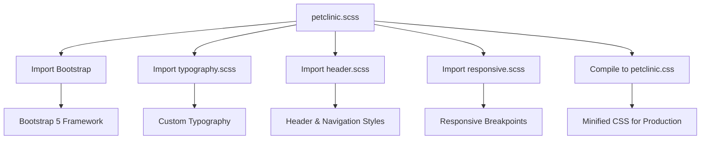
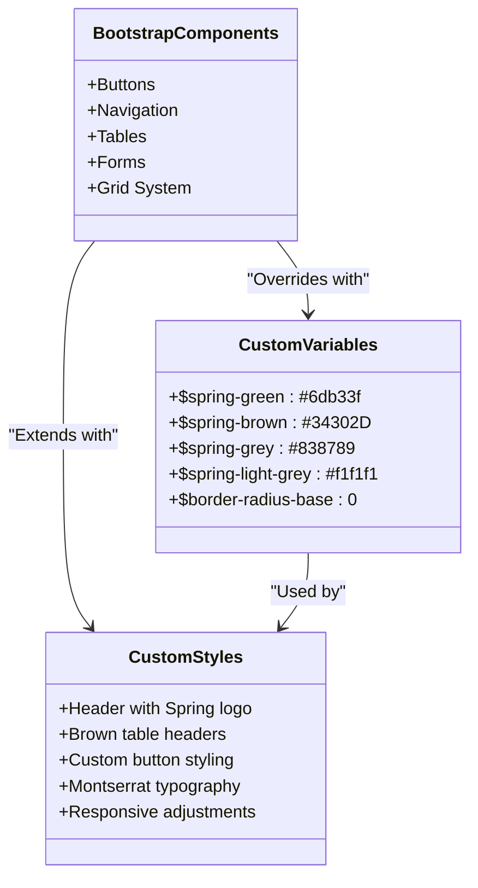
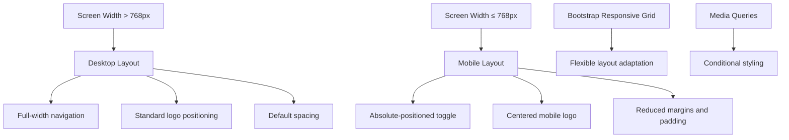
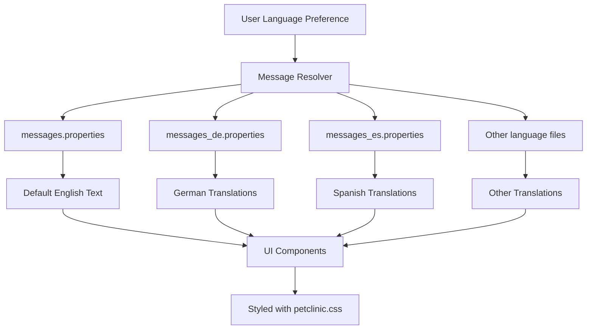

# Static Resources and Styling

<cite>
**Referenced Files in This Document**   
- [petclinic.css](file://src/main/resources/static/resources/css/petclinic.css)
- [petclinic.scss](file://src/main/scss/petclinic.scss)
- [header.scss](file://src/main/scss/header.scss)
- [responsive.scss](file://src/main/scss/responsive.scss)
- [typography.scss](file://src/main/scss/typography.scss)
- [messages.properties](file://src/main/resources/messages/messages.properties)
- [messages_de.properties](file://src/main/resources/messages/messages_de.properties)
- [messages_en.properties](file://src/main/resources/messages/messages_en.properties)
</cite>

## Table of Contents
1. [Introduction](#introduction)
2. [CSS Architecture Overview](#css-architecture-overview)
3. [SCSS Source Files and Compilation Process](#scss-source-files-and-compilation-process)
4. [Custom Styling and Bootstrap Integration](#custom-styling-and-bootstrap-integration)
5. [Responsive Design Considerations](#responsive-design-considerations)
6. [Cross-Browser Compatibility](#cross-browser-compatibility)
7. [Font Awesome and Favicon Configuration](#font-awesome-and-favicon-configuration)
8. [Internationalization and UI Presentation](#internationalization-and-ui-presentation)
9. [Customization and Theme Maintenance](#customization-and-theme-maintenance)
10. [Performance Optimization for Static Assets](#performance-optimization-for-static-assets)

## Introduction
The PetClinic web interface utilizes a comprehensive styling system built on Bootstrap 5 and customized through SCSS preprocessing. This documentation provides an in-depth analysis of the static resources and styling architecture, focusing on the integration between custom styles and Bootstrap components. The system is designed to create a unique visual identity while maintaining responsiveness and cross-browser compatibility. The styling approach combines SCSS source files that are compiled into a single CSS file, enabling efficient style management and customization.

## CSS Architecture Overview
The CSS architecture of the PetClinic application is centered around the `petclinic.css` file, which serves as the primary stylesheet. This file is generated from multiple SCSS source files and includes both Bootstrap 5 framework styles and custom application-specific styles. The architecture follows a modular approach, with distinct SCSS files handling different aspects of the styling system. The final CSS file integrates Bootstrap's component-based design system with custom overrides and extensions to create the application's distinctive look and feel. The styling system leverages CSS custom properties (variables) for theme consistency and provides a foundation for responsive design across various screen sizes.

**Section sources**
- [petclinic.css](file://src/main/resources/static/resources/css/petclinic.css#L1-L9520)

## SCSS Source Files and Compilation Process
The styling system utilizes four primary SCSS source files that are compiled into the final `petclinic.css` file. The main entry point is `petclinic.scss`, which imports Bootstrap and other SCSS partials. The `typography.scss` file defines custom font faces and typographic styles, including Varela Round and Montserrat fonts. The `header.scss` file contains styles specific to the application header and navigation bar, including the Spring logo and brand colors. The `responsive.scss` file implements media queries for responsive behavior on smaller screens. These SCSS files are processed through a compilation pipeline that resolves variables, mixins, and imports, ultimately generating the optimized CSS file used in production.

**Diagram sources**
- [petclinic.scss](file://src/main/scss/petclinic.scss#L1-L215)
- [typography.scss](file://src/main/scss/typography.scss#L1-L61)
- [header.scss](file://src/main/scss/header.scss#L1-L74)
- [responsive.scss](file://src/main/scss/responsive.scss#L1-L42)

**Section sources**
- [petclinic.scss](file://src/main/scss/petclinic.scss#L1-L215)
- [typography.scss](file://src/main/scss/typography.scss#L1-L61)
- [header.scss](file://src/main/scss/header.scss#L1-L74)
- [responsive.scss](file://src/main/scss/responsive.scss#L1-L42)

## Custom Styling and Bootstrap Integration
The PetClinic application extends and overrides Bootstrap 5 components through a series of custom SCSS variables and CSS rules. The `petclinic.scss` file defines custom color variables such as `$spring-green`, `$spring-brown`, and `$spring-grey`, which replace Bootstrap's default color palette. These variables are applied to various Bootstrap components, including buttons, navigation bars, and tables, to create a cohesive brand identity. The application overrides Bootstrap's default border radius, setting it to zero for a more angular design aesthetic. Custom button styles modify the primary button appearance with a brown background and green border, while maintaining Bootstrap's hover and focus states. Table styles are customized with brown headers and borders, creating a distinctive data presentation style. The integration approach preserves Bootstrap's responsive grid system and component functionality while applying custom visual treatments.

**Diagram sources**
- [petclinic.scss](file://src/main/scss/petclinic.scss#L1-L215)

**Section sources**
- [petclinic.scss](file://src/main/scss/petclinic.scss#L1-L215)

## Responsive Design Considerations
The responsive design system in PetClinic is implemented through media queries in the `responsive.scss` file, which targets screens with a maximum width of 768px. The mobile-specific styles adjust the navigation bar to accommodate smaller viewports, repositioning the toggle button to the top-left corner with absolute positioning. The brand logo is replaced with a mobile-optimized version and centered in the navigation bar. Various spacing elements are reduced on mobile devices, including the `xd-container` margin and subtitle margins, to optimize screen real estate. The responsive design maintains the application's functionality and usability across devices while adapting the layout for touch interfaces. The implementation leverages Bootstrap's responsive utilities and grid system, ensuring consistent behavior across different screen sizes.

**Diagram sources**
- [responsive.scss](file://src/main/scss/responsive.scss#L1-L42)

**Section sources**
- [responsive.scss](file://src/main/scss/responsive.scss#L1-L42)

## Cross-Browser Compatibility
The PetClinic styling system ensures cross-browser compatibility through several strategies. The CSS codebase includes vendor prefixes for older browser versions, particularly for transitions and animations. The use of standard CSS properties and values ensures broad compatibility across modern browsers. The application leverages Bootstrap 5's built-in browser compatibility features, which handle many cross-browser inconsistencies automatically. The styling system avoids using experimental or non-standard CSS features that might not be supported across all browsers. The responsive design adapts to different viewport sizes and device characteristics, ensuring consistent appearance and functionality. The CSS reset and normalization provided by Bootstrap helps maintain consistent rendering across different browsers, while custom styles are tested to ensure they don't introduce browser-specific rendering issues.

## Font Awesome and Favicon Configuration
The PetClinic application integrates Font Awesome icons to enhance the user interface with visual elements. While the specific implementation details are not visible in the provided files, the standard Spring PetClinic distribution typically includes Font Awesome for icons in navigation, buttons, and other UI elements. The favicon is configured through standard HTML link tags in the application templates, pointing to a favicon file in the static resources directory. The application uses custom fonts defined in the `typography.scss` file, including Varela Round for general text and Montserrat for headings. These fonts are loaded from local files in the `fonts` directory, ensuring reliable delivery regardless of network conditions. The font configuration includes multiple formats (EOT, WOFF, TTF, SVG) to support different browsers and their font loading mechanisms.

**Section sources**
- [typography.scss](file://src/main/scss/typography.scss#L1-L61)

## Internationalization and UI Presentation
The PetClinic application supports internationalization through message properties files that provide translated text for different languages. The `messages.properties` file contains the default English messages, while language-specific files like `messages_de.properties` provide translations for German and other supported languages. These message files contain key-value pairs for UI elements such as "welcome", "required", and "notFound", allowing the application to display appropriate text based on the user's language preference. The internationalization system works in conjunction with the styling system to ensure that translated text fits within the designed UI elements, accounting for potential differences in text length between languages. The styling system does not need to change for different languages, as the responsive design accommodates varying text lengths through flexible layouts and text wrapping.

**Diagram sources**
- [messages.properties](file://src/main/resources/messages/messages.properties#L1-L9)
- [messages_de.properties](file://src/main/resources/messages/messages_de.properties#L1-L10)
- [messages_en.properties](file://src/main/resources/messages/messages_en.properties#L1-L1)

**Section sources**
- [messages.properties](file://src/main/resources/messages/messages.properties#L1-L9)
- [messages_de.properties](file://src/main/resources/messages/messages_de.properties#L1-L10)
- [messages_en.properties](file://src/main/resources/messages/messages_en.properties#L1-L1)

## Customization and Theme Maintenance
Customizing the visual theme of the PetClinic application involves modifying the SCSS source files rather than the compiled CSS. The primary customization points are the variables defined in `petclinic.scss`, such as color variables and border radius settings. To change the application's color scheme, developers can modify the `$spring-green`, `$spring-brown`, and related variables. Typography can be updated by editing the `@font-face` declarations in `typography.scss` and adjusting font family assignments. The header styling can be customized in `header.scss`, including the navigation bar appearance and logo positioning. When adding new styles, developers should follow the existing pattern of organizing styles by functionality and using descriptive class names. The SCSS compilation process ensures that changes to source files are properly reflected in the final CSS, maintaining consistency across the application.

## Performance Optimization for Static Assets
The PetClinic application employs several performance optimization techniques for static asset delivery. The primary CSS file is generated from SCSS sources, allowing for minification and compression during the build process. The styling system leverages Bootstrap's modular architecture, potentially enabling tree-shaking to remove unused CSS components. Static resources are served from the application server with appropriate caching headers to reduce repeat downloads. The CSS file combines all styles into a single request, minimizing HTTP overhead. The use of CSS custom properties and variables enables efficient theme management without requiring multiple style sheets. The responsive design reduces the need for device-specific assets by using fluid layouts and media queries. For production deployment, additional optimization techniques such as GZIP compression and CDN distribution can be implemented to further improve load times and reduce bandwidth usage.