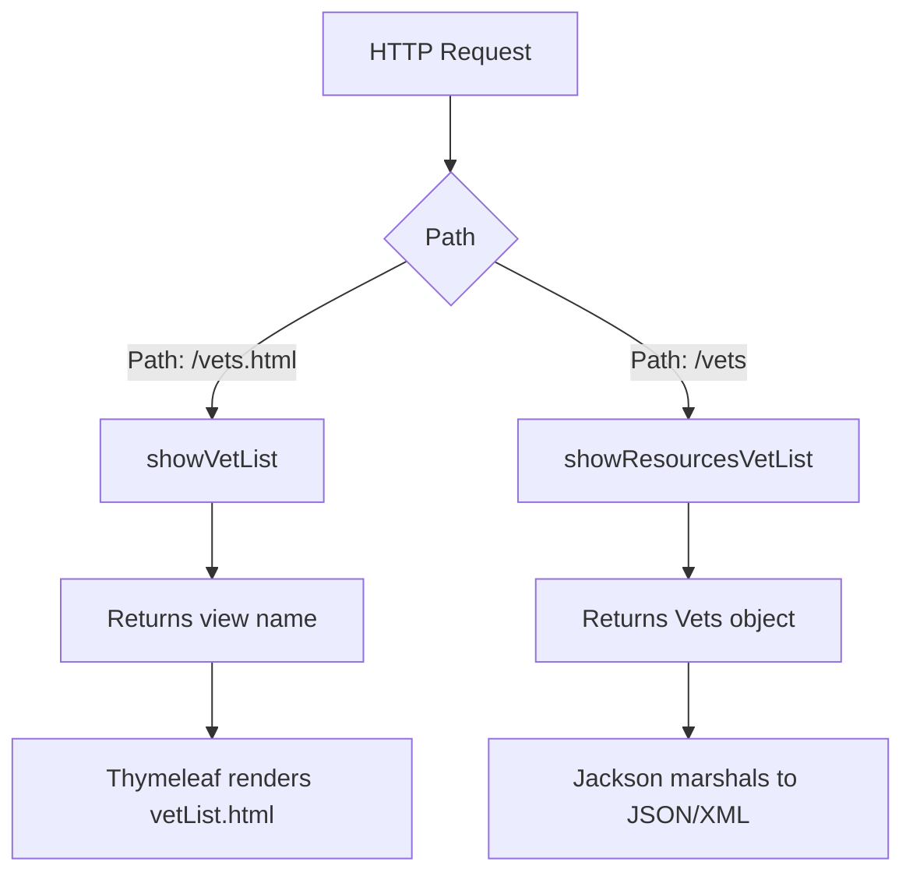
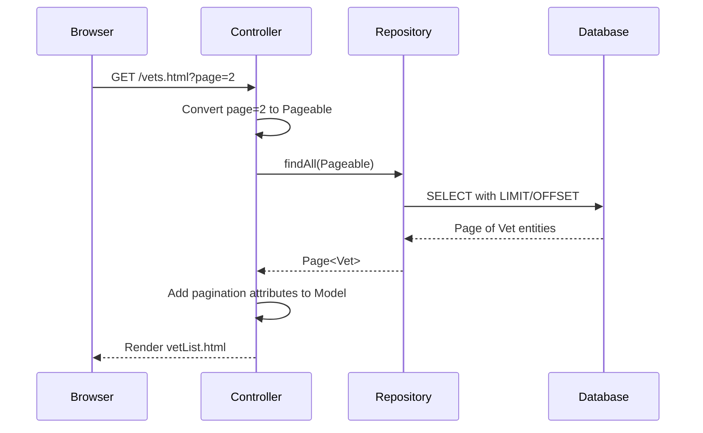
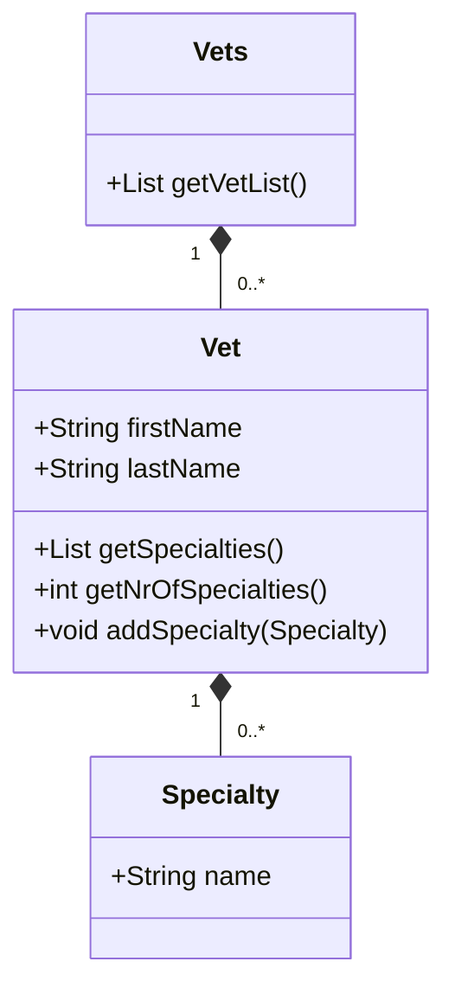
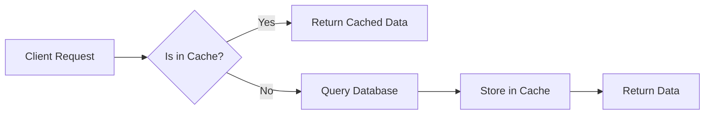

# Veterinarian Display Pages

<cite>
**Referenced Files in This Document**   
- [VetController.java](file://src/main/java/org/springframework/samples/petclinic/vet/VetController.java)
- [VetRepository.java](file://src/main/java/org/springframework/samples/petclinic/vet/VetRepository.java)
- [Vet.java](file://src/main/java/org/springframework/samples/petclinic/vet/Vet.java)
- [Vets.java](file://src/main/java/org/springframework/samples/petclinic/vet/Vets.java)
- [vetList.html](file://src/main/resources/templates/vets/vetList.html)
- [CacheConfiguration.java](file://src/main/java/org/springframework/samples/petclinic/system/CacheConfiguration.java)
</cite>

## Table of Contents
1. [Introduction](#introduction)
2. [Controller Endpoints and Response Handling](#controller-endpoints-and-response-handling)
3. [Pagination Implementation](#pagination-implementation)
4. [Data Transformation for Serialization](#data-transformation-for-serialization)
5. [Specialty Display Logic](#specialty-display-logic)
6. [Caching Mechanism and Performance](#caching-mechanism-and-performance)
7. [Dual Representation Design Rationale](#dual-representation-design-rationale)
8. [Template Rendering Process](#template-rendering-process)

## Introduction
The veterinarian display functionality in the PetClinic application provides both web interface and API access to veterinarian data. This system demonstrates a clean separation of concerns by serving the same underlying data through different endpoints with tailored representations for different consumers. The implementation leverages Spring Framework features including Spring Data JPA, caching, and RESTful design patterns to deliver efficient and flexible access to veterinarian information.

**Section sources**
- [VetController.java](file://src/main/java/org/springframework/samples/petclinic/vet/VetController.java#L1-L15)
- [vetList.html](file://src/main/resources/templates/vets/vetList.html#L1-L10)

## Controller Endpoints and Response Handling
The VetController class implements two distinct endpoints that serve the same logical resource (veterinarians) but with different representations based on the consumer type. The `/vets.html` endpoint handles web requests and returns a view name for template rendering, while the `/vets` endpoint serves API consumers with JSON/XML responses annotated with `@ResponseBody`.

The controller uses constructor injection to receive a VetRepository dependency, following Spring best practices for dependency management. The dual endpoint strategy allows the application to serve both human users through a paginated HTML interface and machine consumers through a complete data API without duplicating business logic.

**Diagram sources**
- [VetController.java](file://src/main/java/org/springframework/samples/petclinic/vet/VetController.java#L43-L75)

**Section sources**
- [VetController.java](file://src/main/java/org/springframework/samples/petclinic/vet/VetController.java#L43-L75)

## Pagination Implementation
The web interface implements server-side pagination using Spring Data's Pageable interface to improve performance and user experience when displaying large datasets. The `showVetList` method accepts a page parameter (defaulting to 1) and converts it to a Pageable object with zero-based indexing, which is then passed to the repository layer.

Each page displays 5 veterinarians, as defined by the pageSize constant in the `findPaginated` method. The pagination model adds four attributes to the Model object: currentPage, totalPages, totalItems, and listVets. These attributes enable the Thymeleaf template to render pagination controls and display the current page context.

**Diagram sources**
- [VetController.java](file://src/main/java/org/springframework/samples/petclinic/vet/VetController.java#L53-L66)
- [VetRepository.java](file://src/main/java/org/springframework/samples/petclinic/vet/VetRepository.java#L53-L55)

**Section sources**
- [VetController.java](file://src/main/java/org/springframework/samples/petclinic/vet/VetController.java#L53-L66)
- [VetRepository.java](file://src/main/java/org/springframework/samples/petclinic/vet/VetRepository.java#L53-L55)

## Data Transformation for Serialization
The application uses the Vets wrapper class to facilitate XML and JSON serialization of veterinarian collections. This design pattern addresses the limitation that JAXB (used for XML serialization) requires a wrapper object for collections. The Vets class contains a list of Vet objects and is annotated with `@XmlRootElement` to enable direct marshaling to XML format.

Both controller endpoints instantiate the Vets wrapper, but they serve different purposes: the HTML endpoint uses it as an intermediate object before extracting data for the model, while the API endpoint returns it directly to be serialized by Spring's message converters. This approach ensures consistent data representation across different media types while maintaining separation between presentation and domain models.

**Diagram sources**
- [Vets.java](file://src/main/java/org/springframework/samples/petclinic/vet/Vets.java#L34-L40)
- [Vet.java](file://src/main/java/org/springframework/samples/petclinic/vet/Vet.java#L58-L63)

**Section sources**
- [Vets.java](file://src/main/java/org/springframework/samples/petclinic/vet/Vets.java#L34-L40)
- [Vet.java](file://src/main/java/org/springframework/samples/petclinic/vet/Vet.java#L58-L63)

## Specialty Display Logic
Veterinarian specialties are displayed alongside veterinarian information using a many-to-many relationship mapped through the vet_specialties join table. The Vet entity maintains a Set of Specialty objects with eager fetching, ensuring that specialty data is loaded in a single query when veterinarians are retrieved.

In the vetList.html template, specialties are displayed as a space-separated list of names. When a veterinarian has no specialties, the text "none" is displayed. The getSpecialties() method in the Vet class returns a sorted list of specialties by name, ensuring consistent presentation order. The template also exposes the number of specialties through the nrOfSpecialties property, which can be used for conditional rendering.

**Section sources**
- [Vet.java](file://src/main/java/org/springframework/samples/petclinic/vet/Vet.java#L46-L71)
- [vetList.html](file://src/main/resources/templates/vets/vetList.html#L20-L23)

## Caching Mechanism and Performance
The application implements caching at the repository layer using Spring's `@Cacheable` annotation on both findAll methods in VetRepository. The cache is named "vets" and is configured in CacheConfiguration, which enables JCache with statistics enabled for monitoring via JMX.

This caching strategy significantly improves performance by preventing redundant database queries when the same data is requested multiple times. Integration tests confirm the cache behavior by calling findAll() twice and verifying that the second call is served from cache. The cache is applied to both paginated and non-paginated queries, though they represent different logical queries and may be cached separately depending on the cache provider's implementation.

**Diagram sources**
- [VetRepository.java](file://src/main/java/org/springframework/samples/petclinic/vet/VetRepository.java#L43-L45)
- [CacheConfiguration.java](file://src/main/java/org/springframework/samples/petclinic/system/CacheConfiguration.java#L25-L35)

**Section sources**
- [VetRepository.java](file://src/main/java/org/springframework/samples/petclinic/vet/VetRepository.java#L43-L45)
- [CacheConfiguration.java](file://src/main/java/org/springframework/samples/petclinic/system/CacheConfiguration.java#L25-L35)

## Dual Representation Design Rationale
The dual representation pattern in VetController serves different consumer needs with optimized responses. The HTML endpoint (`/vets.html`) provides a user-friendly, paginated interface suitable for web browsers, while the API endpoint (`/vets`) delivers complete data in machine-readable format for programmatic consumption.

This design follows REST principles by allowing the same resource to be accessed through different representations based on the client's needs. Web clients benefit from pagination that improves load times and user experience, while API clients receive all data at once for processing and integration purposes. The separation also allows independent evolution of the web interface and API contract without affecting the underlying data access logic.

**Section sources**
- [VetController.java](file://src/main/java/org/springframework/samples/petclinic/vet/VetController.java#L43-L75)

## Template Rendering Process
The vetList.html template uses Thymeleaf to render the list of veterinarians with pagination controls. The template receives model attributes from the controller, including listVets (the current page of veterinarians), currentPage, totalPages, and totalItems. These attributes enable dynamic rendering of the table and pagination controls.

The template iterates over the listVets collection to display each veterinarian's name and specialties. Pagination controls are conditionally rendered based on the totalPages value and include links to navigate between pages, with the current page displayed as plain text to prevent redundant requests. Font Awesome classes are used for navigation icons, providing visual cues for page navigation.

**Section sources**
- [vetList.html](file://src/main/resources/templates/vets/vetList.html#L15-L57)
- [VetController.java](file://src/main/java/org/springframework/samples/petclinic/vet/VetController.java#L53-L60)