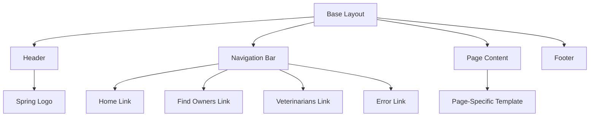
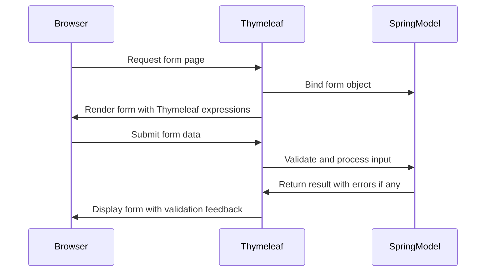
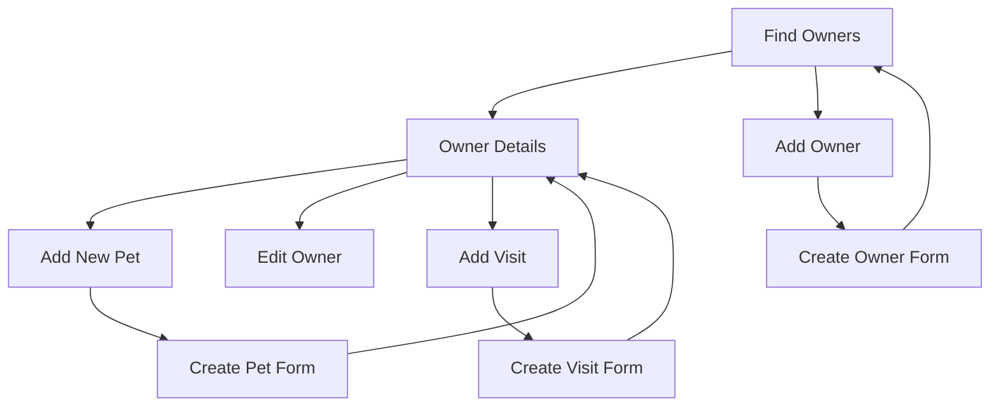
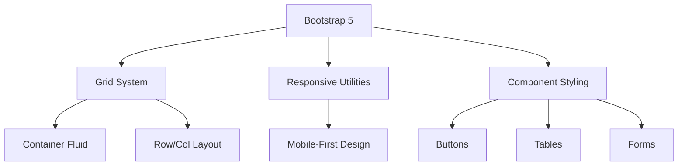
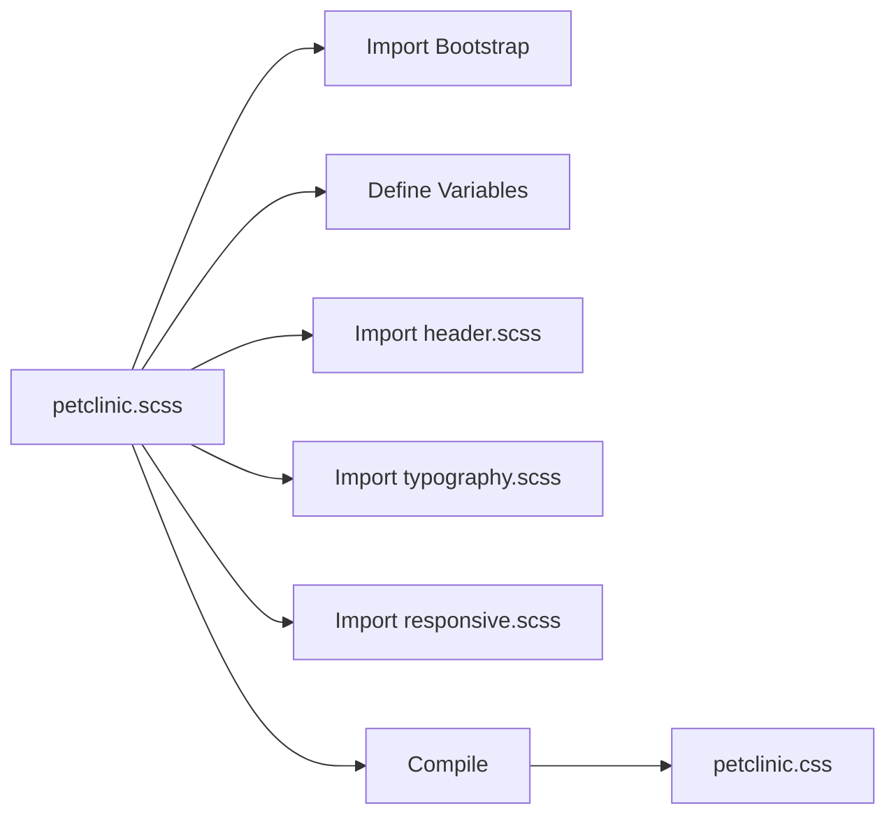

# Web Interface

<cite>
**Referenced Files in This Document**   
- [layout.html](file://src/main/resources/templates/fragments/layout.html)
- [inputField.html](file://src/main/resources/templates/fragments/inputField.html)
- [selectField.html](file://src/main/resources/templates/fragments/selectField.html)
- [findOwners.html](file://src/main/resources/templates/owners/findOwners.html)
- [ownerDetails.html](file://src/main/resources/templates/owners/ownerDetails.html)
- [createOrUpdateOwnerForm.html](file://src/main/resources/templates/owners/createOrUpdateOwnerForm.html)
- [createOrUpdatePetForm.html](file://src/main/resources/templates/pets/createOrUpdatePetForm.html)
- [createOrUpdateVisitForm.html](file://src/main/resources/templates/pets/createOrUpdateVisitForm.html)
- [petclinic.css](file://src/main/resources/static/resources/css/petclinic.css)
- [petclinic.scss](file://src/main/scss/petclinic.scss)
- [header.scss](file://src/main/scss/header.scss)
- [responsive.scss](file://src/main/scss/responsive.scss)
- [typography.scss](file://src/main/scss/typography.scss)
</cite>

## Table of Contents
1. [Introduction](#introduction)
2. [Thymeleaf Template Structure](#thymeleaf-template-structure)
3. [Layout and Fragments](#layout-and-fragments)
4. [Form Handling and Input Components](#form-handling-and-input-components)
5. [Navigation and Page Flow](#navigation-and-page-flow)
6. [Responsive Design and Bootstrap 5 Integration](#responsive-design-and-bootstrap-5-integration)
7. [CSS and SCSS Compilation Process](#css-and-scss-compilation-process)
8. [Accessibility and Browser Compatibility](#accessibility-and-browser-compatibility)
9. [Theming and Customization](#theming-and-customization)
10. [Front-End Performance Optimization](#front-end-performance-optimization)

## Introduction
The PetClinic web interface is built using Thymeleaf as the server-side template engine integrated with Spring MVC, providing a dynamic and maintainable front-end architecture. The interface leverages Bootstrap 5 for responsive design and consistent styling, ensuring compatibility across devices and screen sizes. This documentation details the structure of the web interface components, including template organization, form handling, navigation patterns, and styling mechanisms.

## Thymeleaf Template Structure
The application's templates are organized under `src/main/resources/templates/`, with a modular structure that separates concerns and promotes reuse. Templates are categorized by feature (e.g., owners, pets, vets) and utilize Thymeleaf fragments for shared components. Each template extends the base `layout.html` fragment, ensuring consistent page structure across the application. Thymeleaf expressions are used extensively to bind form fields to Spring model attributes, validate input, and conditionally render content based on application state.

**Section sources**
- [layout.html](file://src/main/resources/templates/fragments/layout.html)
- [findOwners.html](file://src/main/resources/templates/owners/findOwners.html)
- [ownerDetails.html](file://src/main/resources/templates/owners/ownerDetails.html)

## Layout and Fragments
The application uses a centralized layout system defined in `layout.html`, which provides a consistent structure for all pages, including the header, navigation bar, and footer. The layout fragment accepts a template parameter that represents the page-specific content to be inserted. Navigation is implemented using Thymeleaf fragments for menu items, with dynamic active state highlighting based on the current page.

**Diagram sources**
- [layout.html](file://src/main/resources/templates/fragments/layout.html)

**Section sources**
- [layout.html](file://src/main/resources/templates/fragments/layout.html)

## Form Handling and Input Components
Form handling in PetClinic relies on Thymeleaf's integration with Spring's form validation and model binding. Custom input fragments such as `inputField.html` and `selectField.html` provide reusable form components that automatically display validation errors and apply appropriate styling. These fragments accept parameters for label, field name, and input type, enabling consistent rendering across different forms.

**Diagram sources**
- [inputField.html](file://src/main/resources/templates/fragments/inputField.html)
- [selectField.html](file://src/main/resources/templates/fragments/selectField.html)
- [createOrUpdatePetForm.html](file://src/main/resources/templates/pets/createOrUpdatePetForm.html)

**Section sources**
- [inputField.html](file://src/main/resources/templates/fragments/inputField.html)
- [selectField.html](file://src/main/resources/templates/fragments/selectField.html)
- [createOrUpdatePetForm.html](file://src/main/resources/templates/pets/createOrUpdatePetForm.html)
- [createOrUpdateVisitForm.html](file://src/main/resources/templates/pets/createOrUpdateVisitForm.html)

## Navigation and Page Flow
The application implements a clear navigation flow between key pages, starting from the owner search page (`findOwners.html`), proceeding to owner details (`ownerDetails.html`), and allowing creation of pets and visits through dedicated forms. Each page includes contextual navigation buttons that maintain user context, such as "Add New Pet" on the owner details page, which preserves the owner ID in the URL. The navigation bar provides global access to major sections of the application.

**Diagram sources**
- [findOwners.html](file://src/main/resources/templates/owners/findOwners.html)
- [ownerDetails.html](file://src/main/resources/templates/owners/ownerDetails.html)
- [createOrUpdateOwnerForm.html](file://src/main/resources/templates/owners/createOrUpdateOwnerForm.html)

**Section sources**
- [findOwners.html](file://src/main/resources/templates/owners/findOwners.html)
- [ownerDetails.html](file://src/main/resources/templates/owners/ownerDetails.html)
- [createOrUpdateOwnerForm.html](file://src/main/resources/templates/owners/createOrUpdateOwnerForm.html)

## Responsive Design and Bootstrap 5 Integration
The interface uses Bootstrap 5 for responsive design, ensuring optimal display across desktop, tablet, and mobile devices. The CSS file `petclinic.css` includes Bootstrap 5 and custom styles that override default Bootstrap variables to match the application's branding. Responsive behavior is achieved through Bootstrap's grid system and responsive utility classes, with additional custom SCSS in `responsive.scss` that targets specific breakpoints.

**Diagram sources**
- [petclinic.css](file://src/main/resources/static/resources/css/petclinic.css)
- [responsive.scss](file://src/main/scss/responsive.scss)

**Section sources**
- [petclinic.css](file://src/main/resources/static/resources/css/petclinic.css)
- [responsive.scss](file://src/main/scss/responsive.scss)

## CSS and SCSS Compilation Process
The application's styling is managed through SCSS files located in `src/main/scss/`, which are compiled into CSS for production use. The main `petclinic.scss` file imports Bootstrap and defines custom variables for colors, typography, and component styles. It also imports additional SCSS partials for header, typography, and responsive design. The compiled output is `petclinic.css`, which is referenced in the layout template.

**Diagram sources**
- [petclinic.scss](file://src/main/scss/petclinic.scss)
- [header.scss](file://src/main/scss/header.scss)
- [typography.scss](file://src/main/scss/typography.scss)
- [responsive.scss](file://src/main/scss/responsive.scss)
- [petclinic.css](file://src/main/resources/static/resources/css/petclinic.css)

**Section sources**
- [petclinic.scss](file://src/main/scss/petclinic.scss)
- [petclinic.css](file://src/main/resources/static/resources/css/petclinic.css)

## Accessibility and Browser Compatibility
The web interface includes accessibility features such as proper semantic HTML, ARIA attributes, and keyboard navigation support. Form inputs include appropriate labels and error messages that are announced by screen readers. The application supports modern browsers and includes polyfills for older versions of Internet Explorer through conditional comments in the layout template. All interactive elements have visible focus states to aid keyboard navigation.

**Section sources**
- [layout.html](file://src/main/resources/templates/fragments/layout.html)
- [inputField.html](file://src/main/resources/templates/fragments/inputField.html)

## Theming and Customization
The application's visual theme is defined through SCSS variables in `petclinic.scss`, allowing for easy customization of colors, fonts, and component styles. Key branding colors include spring green (`#6db33f`) and spring brown (`#34302D`), which are used consistently across buttons, navigation, and tables. The theme can be modified by changing these variables and recompiling the SCSS, enabling rebranding without altering the underlying HTML structure.

**Section sources**
- [petclinic.scss](file://src/main/scss/petclinic.scss)

## Front-End Performance Optimization
Performance is optimized through several techniques: CSS is minified and served as a single compiled file, JavaScript dependencies are loaded from WebJars, and static assets are referenced with cache-friendly URLs. The layout template includes conditional comments for older browsers to load necessary polyfills only when required. Images are optimized, and the logo is served in SVG format for crisp rendering at any size.

**Section sources**
- [layout.html](file://src/main/resources/templates/fragments/layout.html)
- [petclinic.css](file://src/main/resources/static/resources/css/petclinic.css)